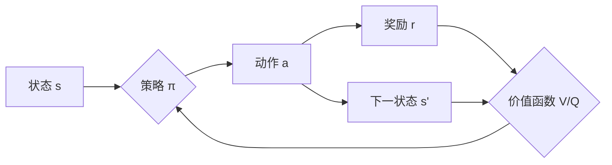

# 深度强化学习 原理与代码实例讲解

## 1. 背景介绍
   
### 1.1 强化学习概述
   
强化学习(Reinforcement Learning, RL)是机器学习的一个重要分支,它研究如何让智能体(Agent)在与环境(Environment)的交互过程中学习最优策略,以获得最大的累积奖励。与监督学习和非监督学习不同,强化学习不需要预先准备好训练数据,而是通过探索和试错的方式,不断与环境交互,根据环境的反馈来优化自身的决策。

### 1.2 深度强化学习的兴起

近年来,随着深度学习的蓬勃发展,将深度神经网络与强化学习相结合,形成了深度强化学习(Deep Reinforcement Learning, DRL)。DRL利用深度神经网络强大的表示学习能力,克服了传统强化学习在高维状态空间下的困难,使得强化学习在更加复杂的任务上取得了突破性进展。

### 1.3 深度强化学习的应用

深度强化学习在许多领域展现出了巨大的潜力,如:

- 游戏: DRL在Atari游戏、围棋、星际争霸等领域达到了超人水平。
- 机器人控制: DRL可以让机器人学习复杂的运动技能,如行走、抓取等。  
- 自动驾驶: DRL为无人驾驶提供了一种端到端学习的解决方案。
- 推荐系统: DRL可以学习用户的偏好,提供个性化推荐。

## 2. 核心概念与联系

### 2.1 马尔可夫决策过程(MDP)

强化学习问题通常被建模为马尔可夫决策过程(Markov Decision Process),由以下元素组成:

- 状态空间 $\mathcal{S}$: 描述智能体所处的环境状态集合。
- 动作空间 $\mathcal{A}$: 描述智能体可执行的动作集合。 
- 转移概率 $\mathcal{P}$: 描述在状态 $s$ 下执行动作 $a$ 后转移到状态 $s'$ 的概率。
- 奖励函数 $\mathcal{R}$: 描述智能体执行动作后获得的即时奖励。
- 折扣因子 $\gamma$: 平衡即时奖励和未来奖励的权重。

MDP的目标是寻找一个最优策略 $\pi^*$,使得智能体在与环境交互时获得最大的期望累积奖励:

$$\pi^* = \arg\max_{\pi} \mathbb{E}\left[\sum_{t=0}^{\infty} \gamma^t r_t | \pi \right]$$

### 2.2 价值函数与策略

- 状态价值函数 $V^{\pi}(s)$: 表示从状态 $s$ 开始,遵循策略 $\pi$ 的期望回报。  

$$V^{\pi}(s) = \mathbb{E}\left[\sum_{t=0}^{\infty} \gamma^t r_t | s_0=s, \pi \right]$$

- 动作价值函数 $Q^{\pi}(s,a)$: 表示在状态 $s$ 下采取动作 $a$,然后遵循策略 $\pi$ 的期望回报。

$$Q^{\pi}(s,a) = \mathbb{E}\left[\sum_{t=0}^{\infty} \gamma^t r_t | s_0=s, a_0=a, \pi \right]$$

- 策略 $\pi(a|s)$: 表示在状态 $s$ 下选择动作 $a$ 的概率。最优策略 $\pi^*$ 对应最优价值函数:

$$V^*(s) = \max_{\pi} V^{\pi}(s), \quad Q^*(s,a) = \max_{\pi} Q^{\pi}(s,a)$$



### 2.3 深度强化学习中的神经网络

在深度强化学习中,价值函数和策略通常由深度神经网络来近似表示:

- DQN(Deep Q-Network): 用深度神经网络近似动作价值函数 $Q(s,a;\theta)$。
- Actor-Critic: Actor网络近似策略 $\pi(a|s;\theta)$,Critic网络近似状态价值函数 $V(s;\theta)$。

## 3. 核心算法原理具体操作步骤

### 3.1 DQN算法

DQN算法使用深度神经网络来近似动作价值函数 $Q(s,a;\theta)$,其主要步骤如下:

1. 初始化经验回放缓冲区 $\mathcal{D}$,随机初始化 Q 网络参数 $\theta$。
2. 对每个episode:
   - 初始化初始状态 $s_0$。
   - 对每个时间步 $t$:
     - 根据 $\epsilon$-greedy 策略选择动作 $a_t$。
     - 执行动作 $a_t$,观察奖励 $r_t$ 和下一状态 $s_{t+1}$。
     - 将转移 $(s_t, a_t, r_t, s_{t+1})$ 存储到 $\mathcal{D}$ 中。
     - 从 $\mathcal{D}$ 中采样一个 batch 的转移。
     - 计算目标值: $y_i = r_i + \gamma \max_{a'} Q(s_{i+1},a';\theta^-)$。
     - 最小化损失: $L(\theta) = \frac{1}{N} \sum_i (y_i - Q(s_i,a_i;\theta))^2$。
     - 每隔 C 步更新目标网络参数: $\theta^- \leftarrow \theta$。

### 3.2 Actor-Critic算法

Actor-Critic算法包含两个网络:Actor网络近似策略 $\pi(a|s;\theta)$,Critic网络近似状态价值函数 $V(s;\theta)$。其主要步骤如下:

1. 随机初始化Actor网络参数 $\theta^{\pi}$ 和Critic网络参数 $\theta^{V}$。
2. 对每个episode:
   - 初始化初始状态 $s_0$。
   - 对每个时间步 $t$:
     - 根据Actor网络 $\pi(a|s;\theta^{\pi})$ 选择动作 $a_t$。
     - 执行动作 $a_t$,观察奖励 $r_t$ 和下一状态 $s_{t+1}$。
     - 计算TD误差: $\delta_t = r_t + \gamma V(s_{t+1};\theta^V) - V(s_t;\theta^V)$。
     - 更新Critic网络: $\theta^V \leftarrow \theta^V + \alpha^V \delta_t \nabla_{\theta^V} V(s_t;\theta^V)$。
     - 更新Actor网络: $\theta^{\pi} \leftarrow \theta^{\pi} + \alpha^{\pi} \delta_t \nabla_{\theta^{\pi}} \log \pi(a_t|s_t;\theta^{\pi})$。

## 4. 数学模型和公式详细讲解举例说明

### 4.1 Q-learning 

Q-learning是一种经典的值迭代算法,通过不断更新动作价值函数来逼近最优策略。其更新公式为:

$$Q(s_t,a_t) \leftarrow Q(s_t,a_t) + \alpha \left[r_t + \gamma \max_{a} Q(s_{t+1},a) - Q(s_t,a_t)\right]$$

其中,$\alpha$ 是学习率,$\gamma$ 是折扣因子。这个公式表示根据TD误差来更新当前状态-动作对的价值估计。

举例: 考虑一个简单的格子世界环境,状态为智能体所在的格子位置,动作为上下左右移动。假设智能体当前位于(2,2),执行向右移动,获得奖励-1,到达新状态(2,3)。假设 $\alpha=0.1, \gamma=0.9$,更新过程如下:

$$Q(s_{(2,2)},a_{\rightarrow}) \leftarrow Q(s_{(2,2)},a_{\rightarrow}) + 0.1 \left[-1 + 0.9 \max_{a} Q(s_{(2,3)},a) - Q(s_{(2,2)},a_{\rightarrow})\right]$$

### 4.2 策略梯度定理

策略梯度定理给出了期望回报 $J(\theta)$ 关于策略参数 $\theta$ 的梯度:

$$\nabla_{\theta} J(\theta) = \mathbb{E}_{\tau \sim p_{\theta}(\tau)} \left[ \sum_{t=0}^{T} \nabla_{\theta} \log \pi_{\theta}(a_t|s_t) Q^{\pi}(s_t,a_t) \right]$$

其中,$\tau$ 表示一条轨迹 $(s_0,a_0,r_0,s_1,a_1,r_1,...)$,$p_{\theta}(\tau)$ 表示轨迹的概率分布。这个公式告诉我们可以通过增大有利动作($Q^{\pi}(s_t,a_t)>0$)的概率,减小不利动作($Q^{\pi}(s_t,a_t)<0$)的概率,来提升策略的期望回报。

举例: 考虑一个连续控制任务,状态为智能体的位置和速度,动作为施加的力。假设在某个状态 $s_t$,智能体选择动作 $a_t$,获得奖励 $r_t=1$,价值函数估计 $Q^{\pi}(s_t,a_t)=2$。根据策略梯度定理,参数更新为:

$$\theta \leftarrow \theta + \alpha \nabla_{\theta} \log \pi_{\theta}(a_t|s_t) Q^{\pi}(s_t,a_t)$$

即朝着增大动作 $a_t$ 概率的方向更新参数,幅度与 $Q^{\pi}(s_t,a_t)$ 成正比。

## 5. 项目实践:代码实例和详细解释说明

下面我们通过一个简单的 CartPole 平衡杆环境来演示 DQN 算法的实现。

```python
import gym
import numpy as np
import torch
import torch.nn as nn
import torch.optim as optim

# 定义 Q 网络
class QNetwork(nn.Module):
    def __init__(self, state_dim, action_dim):
        super(QNetwork, self).__init__()
        self.fc1 = nn.Linear(state_dim, 64)
        self.fc2 = nn.Linear(64, 64)
        self.fc3 = nn.Linear(64, action_dim)
        
    def forward(self, x):
        x = torch.relu(self.fc1(x))
        x = torch.relu(self.fc2(x))
        x = self.fc3(x)
        return x

# 定义 DQN 智能体
class DQNAgent:
    def __init__(self, state_dim, action_dim, lr, gamma, epsilon):
        self.action_dim = action_dim
        self.q_net = QNetwork(state_dim, action_dim)
        self.target_net = QNetwork(state_dim, action_dim)
        self.optimizer = optim.Adam(self.q_net.parameters(), lr=lr)
        self.gamma = gamma
        self.epsilon = epsilon
        
    def act(self, state):
        if np.random.rand() < self.epsilon:
            return np.random.randint(self.action_dim)
        else:
            state = torch.tensor(state, dtype=torch.float32).unsqueeze(0)
            q_values = self.q_net(state)
            return torch.argmax(q_values, dim=1).item()
        
    def train(self, state, action, reward, next_state, done):
        state = torch.tensor(state, dtype=torch.float32).unsqueeze(0)
        next_state = torch.tensor(next_state, dtype=torch.float32).unsqueeze(0)
        action = torch.tensor([action], dtype=torch.long)
        reward = torch.tensor([reward], dtype=torch.float32)
        done = torch.tensor([done], dtype=torch.float32)
        
        q_values = self.q_net(state).gather(1, action)
        next_q_values = self.target_net(next_state).max(1)[0].detach()
        expected_q_values = reward + self.gamma * next_q_values * (1 - done)
        
        loss = nn.MSELoss()(q_values, expected_q_values.unsqueeze(1))
        
        self.optimizer.zero_grad()
        loss.backward()
        self.optimizer.step()
        
    def update_target(self):
        self.target_net.load_state_dict(self.q_net.state_dict())

# 训练 DQN 智能体
def train_dqn(env, agent, episodes, update_freq):
    for episode in range(episodes):
        state = env.reset()
        done = False
        total_reward = 0
        
        while not done:
            action = agent.act(state)
            next_state, reward, done, _ = env.step(action)
            agent.train(state, action, reward, next_state, done)
            state = next_state
            total_