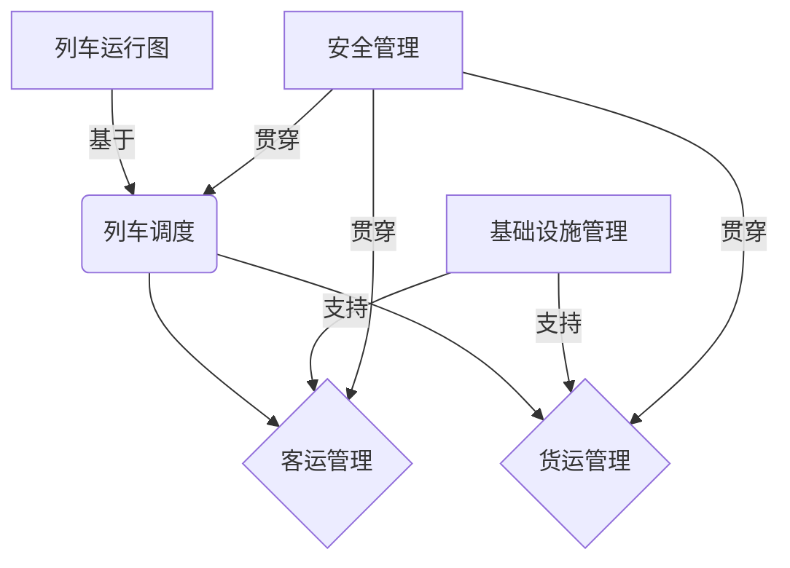

# 火车站管理系统详细设计与具体代码实现

## 1.背景介绍

### 1.1 火车站管理系统概述

火车站是铁路运输系统的重要组成部分,是连接铁路线路和旅客、货物的纽带。随着铁路运输量的不断增长,对火车站的管理要求也越来越高。火车站管理系统是一种综合性的信息管理系统,旨在提高火车站的运营效率、安全性和服务质量。

### 1.2 系统需求分析

火车站管理系统需要满足以下主要需求:

1. 车站基础设施管理:包括线路、站台、信号系统等基础设施的管理和维护。
2. 列车运行管理:实现列车运行图的制定、调度以及实时监控。
3. 客运管理:处理旅客的购票、检票、安检等流程。
4. 货运管理:管理货物的装卸、中转和运输。
5. 安全管理:确保火车站的安全运营,包括防范事故和应急响应。
6. 信息发布:向旅客和相关人员发布列车运行、延误等信息。

### 1.3 系统架构概览

火车站管理系统通常采用分布式架构,由多个子系统组成。主要包括:

1. 数据中心:存储和管理火车站的各种数据,如基础设施信息、列车运行图、客运数据等。
2. 应用服务器:承载各种应用程序,如列车调度系统、客运售票系统等。
3. 现场设备:如站台显示屏、检票系统、安检设备等。
4. 通信网络:确保各子系统之间的数据传输。

## 2.核心概念与联系

### 2.1 核心概念

1. **列车运行图**:预先制定的列车运行计划,包括列车的出发时间、到达时间、停靠站点等信息。
2. **列车调度**:根据实际情况对列车运行图进行动态调整,确保列车运行的安全和效率。
3. **客运管理**:管理旅客的购票、检票、安检等流程,确保旅客出行顺利。
4. **货运管理**:管理货物的装卸、中转和运输,确保货物运输的安全和效率。
5. **基础设施管理**:管理和维护火车站的线路、站台、信号系统等基础设施。
6. **安全管理**:确保火车站的安全运营,包括防范事故和应急响应。

### 2.2 核心概念之间的联系

上述核心概念之间存在紧密的联系,共同构成了火车站管理系统的核心功能:

1. 列车运行图是列车调度的基础,列车调度需要根据实际情况动态调整列车运行图。
2. 客运管理和货运管理都依赖于列车运行图,需要根据列车的实际运行情况进行相应的管理。
3. 基础设施管理为列车运行、客运管理和货运管理提供必要的硬件支持。
4. 安全管理贯穿于整个系统,确保各项操作的安全性。



## 3.核心算法原理具体操作步骤

### 3.1 列车运行图制定算法

列车运行图的制定是一个复杂的优化问题,需要考虑多种约束条件,如线路容量、车站能力、列车优先级等。常用的算法包括:

1. **图着色算法**:将列车运行视为在图上着色的问题,每条边表示一个列车,颜色表示不同的线路,求解最小着色数即可获得最优运行图。
2. **整数规划算法**:将问题建模为整数规划问题,目标函数为最小化列车延误时间,约束条件包括线路容量、站台数量等,求解整数规划即可获得最优运行图。

#### 3.1.1 图着色算法步骤

1. 构建冲突图$G=(V,E)$,其中$V$表示所有列车,边$E$表示两列车在同一线路段存在冲突。
2. 为图$G$着色,使用启发式算法(如种群算法、模拟退火等)求解最小着色数$k$。
3. 将$k$种颜色分配给$k$条线路,每种颜色的节点(列车)按序排列,即可获得最优运行图。

#### 3.1.2 整数规划算法步骤

1. 定义决策变量$x_{ij}$,表示列车$i$是否在时间段$j$通过。
2. 目标函数:$\min \sum_{i,j} c_{ij}x_{ij}$,其中$c_{ij}$表示列车$i$在时间段$j$的延误代价。
3. 约束条件:
   - 线路容量约束:每个时间段的列车数不超过线路容量。
   - 站台约束:每个站台每个时间段最多停靠一列车。
   - 连续性约束:列车在不同时间段的运行须连续。
4. 求解整数规划问题,获得最优解$x_{ij}^*$。
5. 根据$x_{ij}^*$重构列车运行图。

### 3.2 列车调度算法

列车调度算法需要根据列车实际运行情况(如延误、故障等)动态调整运行图,以尽量减小延误影响。常用算法有:

1. **优先级调度算法**:根据列车的优先级对延误列车进行调度,优先处理高优先级列车。
2. **冲突避免算法**:识别可能发生冲突的列车,提前做出调度决策避免冲突。

#### 3.2.1 优先级调度算法步骤

1. 设置列车优先级,可根据列车类型(客运/货运)、载客量、延误时间等因素确定。
2. 实时监控列车运行状态,识别出延误列车。
3. 对延误列车按优先级排序。
4. 从高到低,为每一延误列车:
   - 计算可行的到达时间范围,使之不影响其他高优先级列车。
   - 在可行范围内,选择一个最优到达时间,调整列车运行图。
5. 将调整后的运行图下发执行。

#### 3.2.2 冲突避免算法步骤

1. 实时监控所有列车的运行状态。
2. 对任意两列车,若它们在同一线路段的运行时间存在重叠,则判定为冲突。
3. 对存在冲突的列车对,根据优先级、延误时间等,选择一列车进行调度。
4. 计算被调度列车的最优到达时间,确保不与其他列车冲突。
5. 调整列车运行图,将调整结果下发执行。

## 4.数学模型和公式详细讲解举例说明

### 4.1 列车运行图制定模型

我们可以将列车运行图制定问题建模为一个整数规划问题。

#### 4.1.1 决策变量

定义决策变量$x_{ijk}$,其中:

- $i$表示列车编号
- $j$表示线路段编号
- $k$表示时间段编号
- $x_{ijk}=1$表示列车$i$在时间段$k$通过线路段$j$,否则为0

#### 4.1.2 目标函数

我们的目标是最小化列车的总延误时间,可以定义目标函数为:

$$\min \sum_{i,j,k} c_{ijk}x_{ijk}$$

其中$c_{ijk}$表示列车$i$在时间段$k$通过线路段$j$的延误代价。

#### 4.1.3 约束条件

1. **线路容量约束**:每个时间段的列车数不能超过线路的容量$C_j$:

$$\sum_i x_{ijk} \leq C_j,\quad \forall j,k$$

2. **站台约束**:每个站台在每个时间段最多停靠一列车:

$$\sum_i \sum_j x_{ijk}y_{ij} \leq 1,\quad \forall k$$

其中$y_{ij}$是常数,当列车$i$需要在线路段$j$所在站台停靠时为1,否则为0。

3. **连续性约束**:列车在不同时间段的运行须连续:

$$\sum_j x_{ij,k+1} - \sum_j x_{ijk} = 0,\quad \forall i,k$$

4. **时间约束**:列车的出发时间和到达时间须在规定的时间窗口内:

$$t_i^s \leq \sum_{j,k} t_k x_{ijk} \leq t_i^e$$

其中$t_i^s$和$t_i^e$分别表示列车$i$的最早出发时间和最晚到达时间。

以上约束条件连同目标函数,构成了列车运行图制定的整数规划模型。我们可以使用求解器(如CPLEX、Gurobi等)对该模型进行求解,得到最优的列车运行图。

### 4.2 列车调度模型

在列车调度过程中,我们需要根据列车的实际运行情况动态调整运行图。我们可以建立一个列车调度模型,以最小化总延误时间为目标。

#### 4.2.1 决策变量

定义决策变量$y_{ij}$,其中:

- $i$表示列车编号
- $j$表示时间段编号
- $y_{ij}=1$表示列车$i$的到达时间调整为时间段$j$,否则为0

#### 4.2.2 目标函数

我们的目标是最小化所有列车的总延误时间,可以定义目标函数为:

$$\min \sum_i \sum_j c_{ij}y_{ij}$$

其中$c_{ij}$表示列车$i$在时间段$j$到达的延误代价。

#### 4.2.3 约束条件

1. **唯一到达时间约束**:每列车只能选择一个到达时间段:

$$\sum_j y_{ij} = 1,\quad \forall i$$

2. **时间窗口约束**:列车的到达时间须在规定的时间窗口内:

$$t_i^s \leq \sum_j t_j y_{ij} \leq t_i^e$$

其中$t_i^s$和$t_i^e$分别表示列车$i$的最早和最晚到达时间。

3. **线路容量约束**:每个时间段的列车数不能超过线路的容量$C_j$:

$$\sum_i y_{ij} \leq C_j,\quad \forall j$$

4. **站台约束**:每个站台在每个时间段最多停靠一列车:

$$\sum_i y_{ij}z_{ij} \leq 1,\quad \forall j$$

其中$z_{ij}$是常数,当列车$i$需要在时间段$j$所在站台停靠时为1,否则为0。

以上约束条件连同目标函数,构成了列车调度的整数规划模型。我们可以使用求解器对该模型进行求解,得到最优的列车调度方案。

## 5.项目实践:代码实例和详细解释说明

在本节中,我们将通过一个简单的Python示例,展示如何实现列车运行图的制定和调度算法。

### 5.1 列车运行图制定

我们将使用图着色算法来制定列车运行图。首先,我们需要构建冲突图:

```python
import networkx as nx

# 创建冲突图
G = nx.Graph()

# 添加节点(列车)
G.add_nodes_from(range(10))  # 假设有10列车

# 添加边(冲突关系)
# 这里我们假设列车0和1、2和3、4和5...之间存在冲突
G.add_edges_from([(0, 1), (2, 3), (4, 5), (6, 7), (8, 9)])
```

接下来,我们使用NetworkX库提供的着色算法来求解最小着色数:

```python
# 求解最小着色数
colors = nx.greedy_color(G)

# 输出结果
print("最小着色数:", max(colors.values()) + 1)
for node, color in colors.items():
    print(f"列车{node}分配到线路{color}")
```

上述代码将输出最小着色数,以及每列车分配到的线路编号。我们可以根据这些信息来制定列车运行图。

### 5.2 列车调度

我们将使用优先级调度算法来动态调整列车运行图。假设有5列车,其中列车0和2