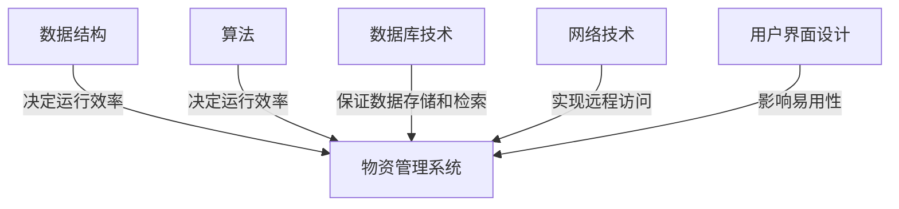

## 1.背景介绍

在当今的信息化社会中，物资管理是企业运营中至关重要的一环。随着企业规模的扩大和业务的复杂化，传统的物资管理方式已经无法满足现代企业的需求。因此，设计并实现一个高效、精准且易于使用的物资管理系统成为了迫在眉睫的需求。

## 2.核心概念与联系

物资管理系统的设计与实现涉及到的核心概念包括：数据结构、算法、数据库技术、网络技术、用户界面设计等。这些技术在物资管理系统中的联系主要表现在：数据结构和算法决定了系统的运行效率，数据库技术保证了数据的存储和检索，网络技术实现了系统的远程访问，用户界面设计影响了系统的易用性。



## 3.核心算法原理具体操作步骤

物资管理系统的核心算法主要包括：物资的入库、出库、盘点、查询等操作。下面将详细介绍这些操作的具体步骤。

### 3.1 物资入库

物资入库是物资管理的基础操作之一，其主要步骤包括：

1. 接收物资信息：包括物资名称、数量、单位、价格等。
2. 验证物资信息：检查物资信息的完整性和准确性。
3. 更新库存：将新入库的物资数量添加到库存中。
4. 记录入库信息：包括入库时间、操作员等。
5. 返回操作结果：如果操作成功，则返回成功信息；如果操作失败，则返回错误信息。

### 3.2 物资出库

物资出库是物资管理的基础操作之一，其主要步骤包括：

1. 接收出库请求：包括物资名称、数量等。
2. 检查库存：检查库存是否足够。
3. 更新库存：如果库存足够，则将出库的物资数量从库存中减去。
4. 记录出库信息：包括出库时间、操作员等。
5. 返回操作结果：如果操作成功，则返回成功信息；如果操作失败，则返回错误信息。

### 3.3 物资盘点

物资盘点是物资管理的重要操作之一，其主要步骤包括：

1. 获取库存信息：包括所有物资的名称和数量。
2. 接收盘点结果：包括所有物资的实际数量。
3. 对比库存和盘点结果：找出数量不一致的物资。
4. 更新库存：将盘点结果更新到库存中。
5. 返回操作结果：如果操作成功，则返回成功信息；如果操作失败，则返回错误信息。

### 3.4 物资查询

物资查询是物资管理的常用操作之一，其主要步骤包括：

1. 接收查询请求：包括查询的物资名称或其他条件。
2. 搜索库存：根据查询条件在库存中搜索物资。
3. 返回查询结果：返回符合查询条件的物资信息。

## 4.数学模型和公式详细讲解举例说明

在物资管理系统中，我们可以使用数学模型来描述和解决一些问题。例如，我们可以使用线性规划模型来优化物资的采购和分配。

假设我们有 $n$ 种物资，每种物资的需求量为 $d_i$，采购价格为 $p_i$，则物资的总采购成本为：

$$ C = \sum_{i=1}^{n} p_i d_i $$

我们的目标是在满足所有物资的需求的前提下，使得总采购成本最小。这就是一个典型的线性规划问题，可以使用线性规划算法进行求解。

## 5.项目实践：代码实例和详细解释说明

在项目实践中，我们以 Python 语言和 SQLite 数据库为例，实现一个简单的物资管理系统。

以下是一个简单的物资入库函数的实现：

```python
def add_item(name, quantity, unit, price):
    # 连接数据库
    conn = sqlite3.connect('inventory.db')
    cursor = conn.cursor()

    # 插入新的物资
    cursor.execute('''
        INSERT INTO items (name, quantity, unit, price)
        VALUES (?, ?, ?, ?)
    ''', (name, quantity, unit, price))

    # 提交事务
    conn.commit()

    # 关闭数据库连接
    conn.close()
```

这个函数首先连接到 SQLite 数据库，然后执行 SQL 插入语句，将新的物资添加到 `items` 表中。最后，提交事务并关闭数据库连接。

## 6.实际应用场景

物资管理系统可以广泛应用于各种场景，例如：

- 企业：用于管理企业的物资，包括原材料、半成品、成品等。
- 学校：用于管理学校的设备、教材等。
- 医院：用于管理医院的药品、器械等。
- 政府：用于管理政府的公共资源。

## 7.工具和资源推荐

在设计和实现物资管理系统时，以下是一些有用的工具和资源：

- 数据库：SQLite、MySQL、PostgreSQL 等。
- 编程语言：Python、Java、C# 等。
- 开发工具：Visual Studio Code、PyCharm、Eclipse 等。
- 学习资源：W3Schools、Stack Overflow、GitHub 等。

## 8.总结：未来发展趋势与挑战

随着技术的发展，未来的物资管理系统将会有以下趋势：

- 智能化：利用人工智能技术，如机器学习和深度学习，进行智能预测和决策。
- 自动化：利用自动化技术，如机器人和无人车，进行自动化操作。
- 云化：利用云计算技术，实现系统的云化，提高系统的可用性和可扩展性。

同时，我们也面临一些挑战：

- 数据安全：如何保证物资数据的安全，防止数据泄露和篡改。
- 系统稳定：如何保证系统的稳定，防止系统崩溃和数据丢失。
- 用户体验：如何提高用户体验，使系统更易用和高效。

## 9.附录：常见问题与解答

1. 问：如何提高物资管理系统的效率？
答：可以从以下几个方面来提高系统的效率：优化数据结构和算法，提高数据处理的效率；使用高效的数据库系统，提高数据存储和检索的效率；使用缓存技术，减少数据库访问的次数；使用并行和分布式技术，提高系统的并发处理能力。

2. 问：如何保证物资管理系统的安全？
答：可以从以下几个方面来保证系统的安全：使用安全的编程语言和框架，防止代码漏洞；使用安全的数据库系统，防止数据泄露和篡改；使用安全的网络技术，防止网络攻击；进行定期的安全审计和测试，发现和修复安全问题。

3. 问：如何提高物资管理系统的易用性？
答：可以从以下几个方面来提高系统的易用性：使用友好的用户界面设计，提高用户的操作效率；提供详细的用户文档和在线帮助，帮助用户理解和使用系统；提供良好的用户支持，解决用户的问题和需求。

作者：禅与计算机程序设计艺术 / Zen and the Art of Computer Programming