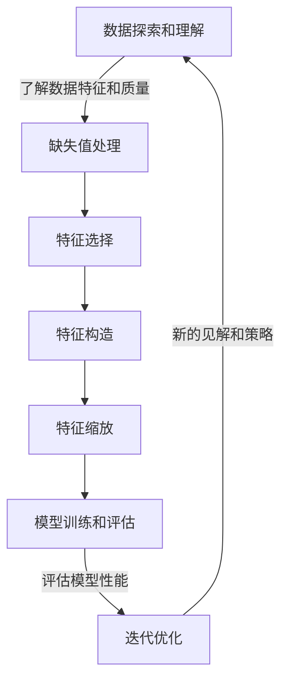

# 特征选择与特征工程原理与代码实战案例讲解

## 1.背景介绍

### 1.1 什么是特征工程?

特征工程是数据科学和机器学习中一个关键步骤,旨在从原始数据中提取出对构建高质量模型至关重要的特征。它涉及选择、创建和优化模型输入特征的过程,以增强机器学习算法的性能和准确性。

### 1.2 为什么特征工程如此重要?

机器学习模型的性能在很大程度上取决于输入数据的质量和相关性。原始数据通常包含大量冗余、噪声和无关信息,这可能会影响模型的训练效果。通过特征工程,我们可以从原始数据中提取出最有价值的信息,从而提高模型的预测能力和泛化性能。

### 1.3 特征工程的挑战

尽管特征工程对于构建高质量的机器学习模型至关重要,但它也面临着一些挑战:

- 特征工程是一个耗时且需要专业知识的过程,需要对数据和问题领域有深入的理解。
- 不同的数据集和问题领域可能需要不同的特征工程技术。
- 特征工程过程通常是手动和迭代的,需要大量的试验和调整。

## 2.核心概念与联系

### 2.1 特征选择

特征选择是特征工程的一个重要组成部分,它的目标是从原始特征集中选择出对模型预测最有贡献的一个特征子集。特征选择可以帮助减少模型的复杂性、提高计算效率,并防止过度拟合。常见的特征选择方法包括过滤式(Filter)、包裹式(Wrapper)和嵌入式(Embedded)方法。

#### 2.1.1 过滤式特征选择

过滤式方法根据特征与目标变量之间的相关性或其他统计指标对特征进行评分和排序,然后选择得分最高的特征。常用的过滤式方法包括卡方检验、互信息和相关系数等。

```python
from sklearn.feature_selection import chi2, mutual_info_classif

# 卡方检验
chi2_scores = chi2(X, y)

# 互信息
mi_scores = mutual_info_classif(X, y)
```

#### 2.1.2 包裹式特征选择

包裹式方法将特征选择过程与机器学习模型训练过程结合在一起,通过反复训练和评估不同的特征子集来选择最优特征集。常用的包裹式方法包括递归特征消除(RFE)和序列前向选择(SFS)等。

```python
from sklearn.feature_selection import RFE
from sklearn.linear_model import LogisticRegression

# 递归特征消除
rfe = RFE(estimator=LogisticRegression(), n_features_to_select=10)
rfe.fit(X, y)
selected_features = X.columns[rfe.support_]
```

#### 2.1.3 嵌入式特征选择

嵌入式方法在机器学习模型训练过程中自动进行特征选择,利用模型本身的特征重要性评估来选择特征。常用的嵌入式方法包括Lasso回归、决策树和随机森林等。

```python
from sklearn.linear_model import LogisticRegression

# Lasso回归
logistic = LogisticRegression(penalty='l1', solver='liblinear')
logistic.fit(X, y)
selected_features = X.columns[logistic.coef_[0] != 0]
```

### 2.2 特征构造

特征构造是指从原始特征中创建新的特征,以捕获原始数据中隐含的信息和模式。常用的特征构造技术包括数学变换、组合特征和特征交互等。

#### 2.2.1 数学变换

数学变换可以通过对原始特征进行加减乘除、指数、对数等运算来创建新特征,以捕获数据中的非线性关系。

```python
import numpy as np

# 对数变换
X['log_feature'] = np.log(X['original_feature'] + 1)

# 指数变换
X['exp_feature'] = np.exp(X['original_feature'])
```

#### 2.2.2 组合特征

组合特征是通过将两个或多个原始特征进行组合来创建新特征,可以捕获特征之间的相互作用和关系。

```python
# 特征组合
X['combined_feature'] = X['feature1'] * X['feature2']
```

#### 2.2.3 特征交互

特征交互是指在模型中引入特征之间的乘积项,以捕获特征之间的非线性关系和交互效应。

```python
from sklearn.preprocessing import PolynomialFeatures

# 特征交互
poly = PolynomialFeatures(degree=2, interaction_only=True)
X_poly = poly.fit_transform(X)
```

### 2.3 特征缩放

特征缩放是将特征值转换到相似的数值范围的过程,可以提高某些机器学习算法的性能。常用的特征缩放方法包括标准化(StandardScaler)和归一化(MinMaxScaler)。

```python
from sklearn.preprocessing import StandardScaler, MinMaxScaler

# 标准化
scaler = StandardScaler()
X_scaled = scaler.fit_transform(X)

# 归一化
scaler = MinMaxScaler()
X_scaled = scaler.fit_transform(X)
```

### 2.4 特征工程流程

典型的特征工程流程包括以下步骤:

1. 数据探索和理解
2. 缺失值处理
3. 特征选择
4. 特征构造
5. 特征缩放
6. 模型训练和评估
7. 迭代优化

该流程是一个循环和迭代的过程,需要根据模型性能和新的见解不断调整和优化特征工程策略。



## 3.核心算法原理具体操作步骤

### 3.1 过滤式特征选择算法

过滤式特征选择算法通过计算特征与目标变量之间的相关性得分,然后根据这些得分选择最相关的特征。常用的过滤式算法包括卡方检验、互信息和相关系数等。

#### 3.1.1 卡方检验

卡方检验是一种用于评估特征与目标变量之间独立性的统计方法。它计算观测值与期望值之间的差异,并将其转换为卡方统计量。较大的卡方统计量意味着特征与目标变量之间存在较强的相关性。

卡方检验的具体步骤如下:

1. 构建特征与目标变量的contingency表(列联表)。
2. 计算每个单元格的期望值。
3. 计算每个单元格的卡方统计量:$\chi^2 = \sum\frac{(O-E)^2}{E}$,其中O是观测值,E是期望值。
4. 将所有单元格的卡方统计量相加,得到总的卡方统计量。
5. 根据自由度和显著性水平查找临界值,将总的卡方统计量与临界值进行比较,判断是否拒绝原假设(特征与目标变量独立)。

在scikit-learn中,可以使用`chi2`函数来计算卡方统计量:

```python
from sklearn.feature_selection import chi2

# 计算卡方统计量
chi2_scores, p_values = chi2(X, y)
```

#### 3.1.2 互信息

互信息是一种衡量两个随机变量之间相互依赖程度的度量,它可以用于评估特征与目标变量之间的相关性。互信息越大,表示特征与目标变量之间的相关性越强。

互信息的计算过程如下:

1. 计算特征X和目标变量Y的边缘概率分布:$P(X)$和$P(Y)$。
2. 计算特征X和目标变量Y的联合概率分布:$P(X,Y)$。
3. 计算互信息:$I(X;Y) = \sum_{x\in X}\sum_{y\in Y}P(x,y)\log\frac{P(x,y)}{P(x)P(y)}$。

在scikit-learn中,可以使用`mutual_info_classif`函数来计算互信息:

```python
from sklearn.feature_selection import mutual_info_classif

# 计算互信息
mi_scores = mutual_info_classif(X, y)
```

#### 3.1.3 相关系数

相关系数是一种衡量两个变量之间线性相关程度的统计量,常用的相关系数包括Pearson相关系数和Spearman相关系数。相关系数的取值范围在[-1,1]之间,绝对值越大表示两个变量之间的相关性越强。

Pearson相关系数衡量的是两个变量之间的线性相关程度,计算公式如下:

$$r = \frac{\sum_{i=1}^{n}(x_i - \bar{x})(y_i - \bar{y})}{\sqrt{\sum_{i=1}^{n}(x_i - \bar{x})^2}\sqrt{\sum_{i=1}^{n}(y_i - \bar{y})^2}}$$

其中$x_i$和$y_i$分别表示第i个样本的特征值和目标值,$\bar{x}$和$\bar{y}$分别表示特征值和目标值的均值。

Spearman相关系数则衡量的是两个变量之间的单调关系,它首先对变量进行排序,然后计算排序后的变量之间的Pearson相关系数。

在Python中,可以使用`pandas`库来计算相关系数:

```python
import pandas as pd

# 计算Pearson相关系数
corr = X.corr(method='pearson')

# 计算Spearman相关系数
corr = X.corr(method='spearman')
```

### 3.2 包裹式特征选择算法

包裹式特征选择算法将特征选择过程与机器学习模型训练过程结合在一起,通过反复训练和评估不同的特征子集来选择最优特征集。常用的包裹式算法包括递归特征消除(RFE)和序列前向选择(SFS)等。

#### 3.2.1 递归特征消除(RFE)

递归特征消除算法的工作原理如下:

1. 初始化一个包含所有特征的特征集。
2. 训练机器学习模型,并计算每个特征的重要性得分。
3. 根据重要性得分,删除最不重要的特征。
4. 重复步骤2和3,直到达到预设的特征数量或性能指标。

以下是使用scikit-learn中的RFE类进行递归特征消除的示例代码:

```python
from sklearn.feature_selection import RFE
from sklearn.linear_model import LogisticRegression

# 创建RFE对象
rfe = RFE(estimator=LogisticRegression(), n_features_to_select=10)

# 拟合RFE
rfe.fit(X, y)

# 获取选择的特征
selected_features = X.columns[rfe.support_]
```

在上面的示例中,我们使用逻辑回归作为基础估计器,并设置选择10个最重要的特征。`rfe.support_`是一个布尔数组,表示每个特征是否被选中。

#### 3.2.2 序列前向选择(SFS)

序列前向选择算法的工作原理如下:

1. 初始化一个空的特征集。
2. 对于每个未选择的特征,将其临时添加到当前特征集中,训练机器学习模型,并评估性能。
3. 选择能够最大程度提高模型性能的特征,将其永久添加到特征集中。
4. 重复步骤2和3,直到达到预设的特征数量或性能指标。

以下是使用Python实现序列前向选择的示例代码:

```python
from sklearn.linear_model import LogisticRegression
from sklearn.model_selection import cross_val_score

def sfs(X, y, estimator, n_features):
    # 初始化
    selected_features = []
    remaining_features = X.columns.tolist()
    
    # 迭代选择特征
    for _ in range(n_features):
        max_score = 0
        best_feature = None
        
        for feature in remaining_features:
            # 临时添加特征
            temp_features = selected_features + [feature]
            score = cross_val_score(estimator, X[temp_features], y, cv=5).mean()
            
            # 更新最佳特征
            if score > max_score:
                max_score = score
                best_feature = feature
        
        # 永久添加最佳特征
        selected_features.append(best_feature)
        remaining_features.remove(best_feature)
    
    return selected_features

# 使用示例
selected_features = sfs(X, y, LogisticRegression(), n_features=10)