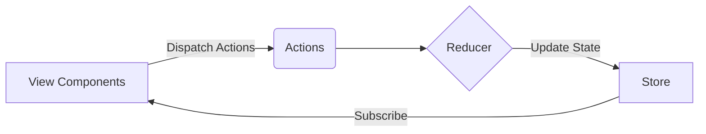

# 状态管理 原理与代码实例讲解

## 1. 背景介绍

### 1.1 什么是状态管理

在现代前端开发中,状态管理是一个至关重要的概念。状态(State)是指应用程序中的数据或信息,它可以随时间而变化。状态管理是一种管理应用程序状态的方法,它提供了一种结构化和可预测的方式来管理应用程序的数据流。

### 1.2 为什么需要状态管理

随着应用程序变得越来越复杂,状态管理变得越来越重要。在传统的前端开发中,数据通常是通过组件层级进行传递的。然而,这种方式在大型应用程序中变得难以维护和扩展。状态管理解决了以下问题:

- **数据共享**: 在不同组件之间共享数据变得更加容易。
- **可预测性**: 应用程序状态的变化变得更加可预测和可控。
- **集中化管理**: 状态被集中管理,而不是分散在各个组件中。
- **调试和测试**: 由于状态的变化是可预测的,因此调试和测试变得更加容易。

### 1.3 常见的状态管理库

目前,前端开发中有几种流行的状态管理库,例如:

- **Redux**: 一个基于 Flux 架构的状态管理库,广泛应用于 React 应用程序。
- **MobX**: 一个基于观察者模式的状态管理库,适用于 React、Angular 和 Vue 等框架。
- **Vuex**: Vue.js 官方提供的状态管理库,专门为 Vue.js 应用程序设计。
- **NgRx**: Angular 官方推荐的状态管理库,基于 Redux 模式。

在本文中,我们将重点介绍 Redux,因为它是最广为人知和使用最广泛的状态管理库之一。

## 2. 核心概念与联系

### 2.1 Redux 核心概念

Redux 是一个可预测的状态容器,它基于三个核心原则:

1. **单一数据源**: 整个应用程序的状态存储在一个单一的 store 对象中。
2. **状态是只读的**: 唯一改变状态的方式是通过发出一个 action,这是一个描述发生什么的对象。
3. **使用纯函数进行修改**: 为了指定如何更新状态树,需要编写纯函数 reducer。

下图展示了 Redux 的核心工作流程:



1. **View Components** 发出 **Actions** 来描述要执行的操作。
2. **Actions** 被传递给 **Reducer**,它是一个纯函数,用于计算新的状态。
3. **Reducer** 根据当前状态和收到的 Action 计算出新的状态,并将其存储在 **Store** 中。
4. **Store** 通知 **View Components** 状态已经更新,组件可以访问新的状态并进行重新渲染。

### 2.2 Redux 核心概念之间的联系

Redux 的核心概念之间紧密相连,共同构建了一个可预测和高效的状态管理系统:

- **Store** 是整个应用程序状态的单一真实来源,它保存了应用程序的整个状态树。
- **Actions** 描述了应用程序中发生的事件,它们是状态更新的唯一来源。
- **Reducers** 是纯函数,它们根据当前状态和发出的 Action 计算出新的状态。
- **View Components** 通过订阅 Store 的状态更新,并在状态发生变化时重新渲染。

这种单向数据流使得应用程序的状态变化变得可预测和透明,从而提高了代码的可维护性和可测试性。

## 3. 核心算法原理具体操作步骤

### 3.1 Redux 工作流程

Redux 的工作流程可以概括为以下几个步骤:

1. **初始化 Store**

   首先,我们需要使用 `createStore` 函数创建一个 Store 对象,并传入 reducer 函数。

   ```javascript
   import { createStore } from 'redux';
   import rootReducer from './reducers';

   const store = createStore(rootReducer);
   ```

2. **订阅状态更新**

   组件可以通过 `subscribe` 方法订阅 Store 的状态更新。当状态发生变化时,订阅的回调函数将被调用。

   ```javascript
   store.subscribe(() => {
     // 执行重新渲染或其他操作
   });
   ```

3. **发出 Action**

   当用户与应用程序交互时,组件会发出一个 Action 来描述发生的事件。Action 是一个普通的 JavaScript 对象,它必须包含一个 `type` 属性,用于描述要执行的操作类型。

   ```javascript
   const action = {
     type: 'ADD_TODO',
     payload: 'Learn Redux'
   };
   ```

4. **Reducer 处理 Action**

   当 Action 被发出时,它会被传递给 Reducer 函数。Reducer 是一个纯函数,它根据当前状态和收到的 Action 计算出新的状态。

   ```javascript
   function todoReducer(state = [], action) {
     switch (action.type) {
       case 'ADD_TODO':
         return [...state, action.payload];
       default:
         return state;
     }
   }
   ```

5. **Store 更新状态**

   Reducer 返回的新状态将被存储在 Store 中,Store 会通知所有订阅的组件状态已经更新。

6. **组件重新渲染**

   订阅了 Store 的组件将收到状态更新的通知,并根据新的状态进行重新渲染。

这个过程是单向的,确保了状态的变化是可预测和透明的。

### 3.2 Redux 中间件

Redux 中间件提供了一种扩展 Redux 功能的方式,它可以在 Action 被发出和到达 Reducer 之间执行自定义逻辑。中间件可以用于各种目的,例如日志记录、异步操作、错误报告等。

要使用中间件,我们需要使用 `applyMiddleware` 函数来增强 `createStore` 函数:

```javascript
import { createStore, applyMiddleware } from 'redux';
import thunkMiddleware from 'redux-thunk';
import rootReducer from './reducers';

const store = createStore(
  rootReducer,
  applyMiddleware(thunkMiddleware)
);
```

在上面的示例中,我们使用了 `redux-thunk` 中间件,它允许我们在 Action Creator 中返回一个函数,而不是一个普通的 Action 对象。这个函数可以执行异步操作,并在操作完成后发出一个或多个 Action。

## 4. 数学模型和公式详细讲解举例说明

在 Redux 中,虽然没有直接涉及复杂的数学模型和公式,但是它的核心概念和工作流程可以用一些简单的数学表达式来描述。

### 4.1 状态转换函数

Redux 中的 Reducer 可以被视为一个状态转换函数,它接受当前状态和一个 Action,并返回新的状态。我们可以用以下公式来表示:

$$
newState = reducer(currentState, action)
$$

其中:

- `newState` 表示经过 Reducer 处理后的新状态。
- `currentState` 表示当前的状态。
- `reducer` 是一个纯函数,它根据当前状态和收到的 Action 计算出新的状态。
- `action` 是一个描述要执行操作的对象。

### 4.2 组合 Reducer

在复杂的应用程序中,我们通常会将状态树划分为多个子状态,每个子状态由一个独立的 Reducer 管理。Redux 提供了 `combineReducers` 函数,用于将多个 Reducer 组合成一个根 Reducer。

假设我们有两个 Reducer,分别管理 `todos` 和 `visibilityFilter` 子状态,我们可以使用以下代码将它们组合起来:

```javascript
import { combineReducers } from 'redux';
import todos from './todos';
import visibilityFilter from './visibilityFilter';

const rootReducer = combineReducers({
  todos,
  visibilityFilter
});
```

这个过程可以用以下公式表示:

$$
rootReducer = combineReducers(reducers)
$$

其中:

- `rootReducer` 是组合后的根 Reducer。
- `combineReducers` 是 Redux 提供的一个函数,用于组合多个 Reducer。
- `reducers` 是一个对象,其中的键值对表示子状态和对应的 Reducer。

通过组合 Reducer,我们可以将应用程序的状态树划分为多个独立的子状态,每个子状态由一个专门的 Reducer 管理。这样可以提高代码的可维护性和可扩展性。

## 5. 项目实践: 代码实例和详细解释说明

为了更好地理解 Redux 的工作原理,我们将通过一个简单的待办事项应用程序来演示如何使用 Redux 进行状态管理。

### 5.1 项目设置

首先,我们需要安装 Redux 及相关依赖项:

```bash
npm install redux react-redux
```

接下来,在项目根目录下创建一个 `store` 目录,用于存放 Redux 相关的文件。

### 5.2 定义 Action 类型和 Action Creator

在 `store/actions.js` 文件中,我们定义了 Action 类型和 Action Creator 函数:

```javascript
// store/actions.js

// 定义 Action 类型
export const ADD_TODO = 'ADD_TODO';
export const TOGGLE_TODO = 'TOGGLE_TODO';

// Action Creator 函数
export const addTodo = text => ({
  type: ADD_TODO,
  payload: text
});

export const toggleTodo = id => ({
  type: TOGGLE_TODO,
  payload: id
});
```

Action Creator 是一个函数,它返回一个 Action 对象。在上面的示例中,我们定义了两个 Action Creator: `addTodo` 和 `toggleTodo`。

### 5.3 定义 Reducer

在 `store/reducers.js` 文件中,我们定义了 Reducer 函数:

```javascript
// store/reducers.js
import { ADD_TODO, TOGGLE_TODO } from './actions';

const initialState = {
  todos: []
};

const rootReducer = (state = initialState, action) => {
  switch (action.type) {
    case ADD_TODO:
      return {
        ...state,
        todos: [
          ...state.todos,
          {
            id: state.todos.length,
            text: action.payload,
            completed: false
          }
        ]
      };
    case TOGGLE_TODO:
      return {
        ...state,
        todos: state.todos.map(todo =>
          todo.id === action.payload
            ? { ...todo, completed: !todo.completed }
            : todo
        )
      };
    default:
      return state;
  }
};

export default rootReducer;
```

在这个示例中,我们定义了一个 `rootReducer` 函数,它根据不同的 Action 类型执行相应的状态更新操作。当 `ADD_TODO` Action 被发出时,我们会在 `todos` 数组中添加一个新的待办事项。当 `TOGGLE_TODO` Action 被发出时,我们会切换指定 ID 的待办事项的完成状态。

### 5.4 创建 Store

在 `store/index.js` 文件中,我们创建了 Redux Store:

```javascript
// store/index.js
import { createStore } from 'redux';
import rootReducer from './reducers';

const store = createStore(rootReducer);

export default store;
```

我们使用 `createStore` 函数创建了一个 Store 实例,并传入了 `rootReducer` 函数。

### 5.5 在组件中使用 Redux

现在,我们可以在组件中使用 Redux 来管理状态了。以下是一个简单的 `TodoList` 组件示例:

```jsx
// components/TodoList.js
import React from 'react';
import { useSelector, useDispatch } from 'react-redux';
import { addTodo, toggleTodo } from '../store/actions';

const TodoList = () => {
  const todos = useSelector(state => state.todos);
  const dispatch = useDispatch();

  const handleAddTodo = text => {
    dispatch(addTodo(text));
  };

  const handleToggleTodo = id => {
    dispatch(toggleTodo(id));
  };

  return (
    <div>
      <input
        type="text"
        placeholder="Add a todo"
        onKeyPress={e => {
          if (e.key === 'Enter') {
            handleAddTodo(e.target.value);
            e.target.value = '';
          }
        }}
      />
      <ul>
        {todos.map(todo => (
          <li
            key={todo.id}
            style={{ textDecoration: todo.completed ? 'line-through' : 'none' }}
            onClick={() => handleToggleTodo(todo.id)}
          >
            {todo.text}
          </li>
        ))}
      </ul>
    </div>
  );
};

export default TodoList;
```

在这个示例中,我们使用了 `useSelector` 钩子从 Redux Store 中获取 `todos` 状态,并使用 `useDispatch` 