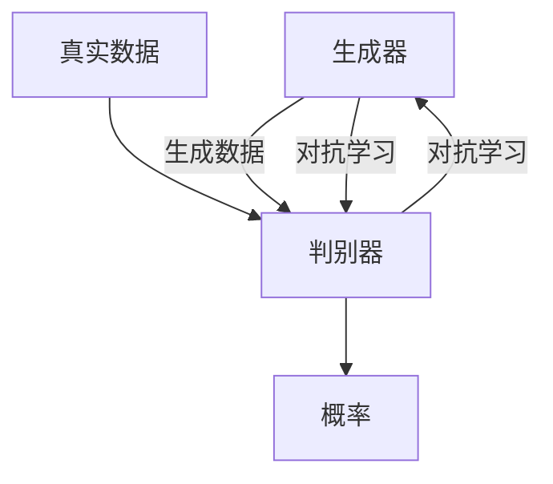

## 1.背景介绍

生成对抗网络（GAN）是深度学习领域的一种新颖算法，自从2014年由Ian Goodfellow等人提出以来，已经在各个领域取得了显著的成果，包括图像生成、风格迁移、超分辨率等。GAN的核心思想是通过两个神经网络——生成器和判别器的对抗学习，使得生成器能够生成与真实数据分布尽可能接近的数据。

## 2.核心概念与联系

GAN的核心概念包括生成器、判别器、对抗学习和生成模型等。

- 生成器：生成器的任务是学习真实数据的分布，并尽可能地生成与真实数据相似的数据。生成器接收一个随机噪声z，通过神经网络变换输出生成数据。

- 判别器：判别器的任务是判断输入的数据是真实数据还是生成器生成的数据。判别器接收一个输入，通过神经网络输出一个概率值，表示该输入数据来自真实数据的概率。

- 对抗学习：生成器和判别器进行对抗学习，生成器试图生成越来越逼真的数据以欺骗判别器，而判别器试图越来越准确地区分出真实数据和生成数据。

- 生成模型：GAN是一种生成模型，其目标是学习真实数据的分布，以便能够生成新的数据。

这些核心概念之间的联系可以通过以下Mermaid流程图进行展示：



## 3.核心算法原理具体操作步骤

GAN的核心算法原理可以分为以下几个步骤：

1. 初始化生成器和判别器。

2. 对于每一次迭代，首先固定生成器，优化判别器。具体来说，首先从真实数据和生成数据中各抽取一部分数据，然后通过判别器得到它们的概率值，再通过交叉熵损失函数计算判别器的损失，然后通过反向传播算法更新判别器的参数。

3. 然后固定判别器，优化生成器。具体来说，首先生成一部分数据，然后通过判别器得到它们的概率值，再通过交叉熵损失函数计算生成器的损失，然后通过反向传播算法更新生成器的参数。

4. 重复上述步骤，直到生成器和判别器的参数收敛。

## 4.数学模型和公式详细讲解举例说明

GAN的数学模型可以用最小最大二人零和博弈来描述。具体来说，对于生成器$G$和判别器$D$，我们希望解决以下优化问题：

$$
\min_{G}\max_{D}V(D,G)=E_{x\sim p_{data}(x)}[\log D(x)]+E_{z\sim p_{z}(z)}[\log(1-D(G(z)))]
$$

其中，$x$是真实数据，$z$是生成器的输入噪声，$p_{data}$是真实数据的分布，$p_{z}$是噪声的分布，$D(x)$是判别器对真实数据的判断，$D(G(z))$是判别器对生成数据的判断。

上述公式的含义是，对于判别器，它希望尽可能地正确判断出真实数据和生成数据，即最大化$V(D,G)$；对于生成器，它希望生成的数据能够尽可能地欺骗判别器，即最小化$V(D,G)$。

## 5.项目实践：代码实例和详细解释说明

以下是一个简单的GAN的PyTorch实现：

```python
import torch
import torch.nn as nn

# 定义生成器
class Generator(nn.Module):
    def __init__(self):
        super(Generator, self).__init__()
        self.main = nn.Sequential(
            nn.Linear(100, 256),
            nn.ReLU(True),
            nn.Linear(256, 512),
            nn.ReLU(True),
            nn.Linear(512, 1024),
            nn.ReLU(True),
            nn.Linear(1024, 784),
            nn.Tanh()
        )

    def forward(self, input):
        return self.main(input)

# 定义判别器
class Discriminator(nn.Module):
    def __init__(self):
        super(Discriminator, self).__init__()
        self.main = nn.Sequential(
            nn.Linear(784, 1024),
            nn.ReLU(True),
            nn.Linear(1024, 512),
            nn.ReLU(True),
            nn.Linear(512, 256),
            nn.ReLU(True),
            nn.Linear(256, 1),
            nn.Sigmoid()
        )

    def forward(self, input):
        return self.main(input)
```

在这个代码中，我们首先定义了生成器和判别器的网络结构，然后在训练过程中，我们会交替地优化生成器和判别器的参数。

## 6.实际应用场景

GAN在许多领域都有广泛的应用，包括但不限于：

- 图像生成：GAN可以用于生成高质量的图像，例如人脸、动物、风景等。

- 风格迁移：GAN可以用于将一种风格的图像转换为另一种风格的图像，例如将白天的照片转换为夜晚的照片。

- 超分辨率：GAN可以用于将低分辨率的图像转换为高分辨率的图像。

## 7.工具和资源推荐

如果你对GAN感兴趣，以下是一些推荐的学习资源：

- 书籍：《深度学习》（作者：Ian Goodfellow、Yoshua Bengio、Aaron Courville）

- 在线课程：Coursera的“Deep Learning Specialization”

- 论文：Ian Goodfellow等人的“Generative Adversarial Networks”

- 开源代码：Github上的各种GAN实现，例如DCGAN、WGAN等。

## 8.总结：未来发展趋势与挑战

GAN是一种强大的生成模型，但是也存在一些挑战，例如训练不稳定、模式崩溃等。未来的研究将会继续探索如何解决这些问题，并将GAN应用到更多的领域。

## 9.附录：常见问题与解答

Q: GAN的训练为什么会不稳定？

A: GAN的训练涉及到一个最小最大二人零和博弈，这个博弈的平衡点可能很难找到，或者可能根本就不存在，这就导致了GAN的训练可能会不稳定。

Q: 什么是模式崩溃？

A: 模式崩溃是指生成器始终生成同样的数据，而没有生成其他种类的数据，这是因为生成器找到了一个可以欺骗判别器的数据，然后就一直生成这个数据。

作者：禅与计算机程序设计艺术 / Zen and the Art of Computer Programming