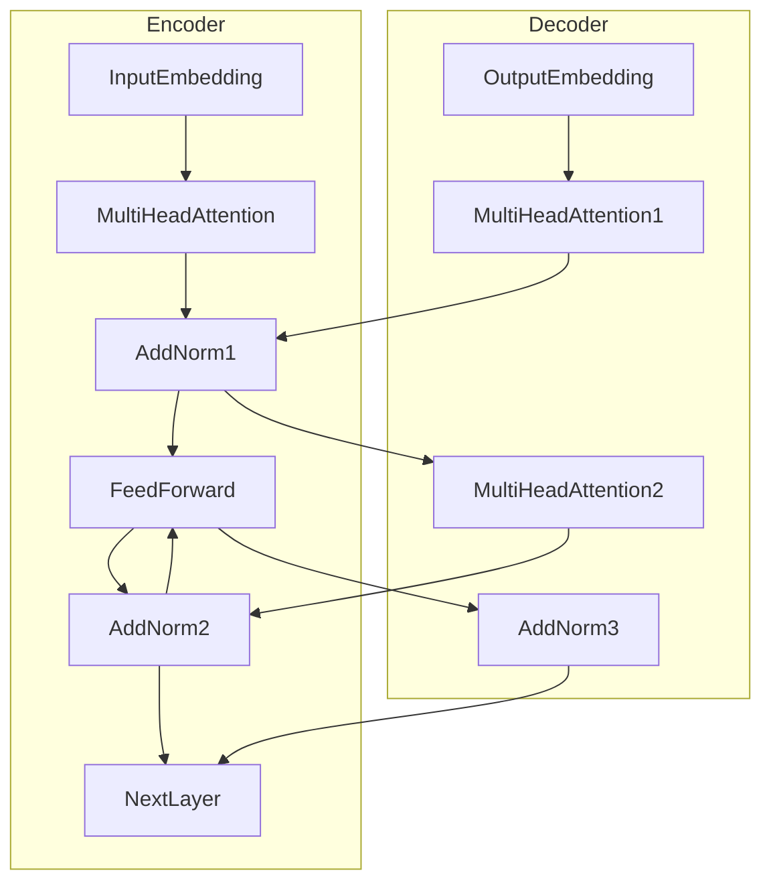

# 用Transformer实现智能对话系统

## 1.背景介绍

### 1.1 对话系统的重要性

在当今信息时代,人机交互已经成为不可或缺的一部分。随着人工智能技术的不断发展,智能对话系统逐渐成为各大科技公司的研究热点。智能对话系统旨在模拟人类的交互方式,为用户提供自然、流畅的对话体验,广泛应用于客服系统、智能助手、教育辅导等多个领域。

### 1.2 对话系统的挑战

然而,构建一个高质量的对话系统并非易事。它需要处理自然语言的复杂性、上下文理解、知识库集成等多方面的挑战。传统的基于规则或检索的方法已经难以满足当前对话系统的需求,因此需要更加智能、灵活的解决方案。

### 1.3 Transformer模型的崛起

2017年,Transformer模型在机器翻译任务中取得了突破性的成果,它完全基于注意力机制,摒弃了传统的序列模型结构。Transformer模型擅长捕捉长距离依赖关系,并且具有并行计算的优势,因此在自然语言处理领域产生了广泛的影响。

## 2.核心概念与联系

### 2.1 Transformer模型架构

Transformer模型主要由编码器(Encoder)和解码器(Decoder)两个部分组成。编码器负责处理输入序列,解码器则根据编码器的输出生成目标序列。两者都采用了多头自注意力机制和前馈神经网络等关键组件。



### 2.2 自注意力机制

自注意力机制是Transformer模型的核心,它允许模型在计算目标词时关注整个输入序列的不同位置。这种机制有助于捕捉长距离依赖关系,并且可以并行计算,提高了模型的效率。

$$\mathrm{Attention}(Q, K, V) = \mathrm{softmax}(\frac{QK^T}{\sqrt{d_k}})V$$

其中, $Q$、$K$、$V$分别表示查询(Query)、键(Key)和值(Value)。

### 2.3 多头注意力机制

为了捕捉不同的关系,Transformer采用了多头注意力机制,将注意力分成多个子空间,每个子空间学习不同的关注模式,最终将它们的结果concatenate在一起。

$$\mathrm{MultiHead}(Q, K, V) = \mathrm{Concat}(head_1, ..., head_h)W^O$$
$$\text{where } head_i = \mathrm{Attention}(QW_i^Q, KW_i^K, VW_i^V)$$

### 2.4 位置编码

由于Transformer没有递归或卷积结构,因此引入了位置编码来赋予序列元素位置信息。位置编码与词嵌入相加,被编码器和解码器共享。

## 3.核心算法原理具体操作步骤  

### 3.1 Transformer编码器

1. **输入嵌入**:将输入序列转换为词嵌入表示,并加上位置编码。
2. **多头自注意力**:计算自注意力,捕捉输入序列中词与词之间的关系。
3. **归一化与残差连接**:对注意力输出进行层归一化,并与输入相加(残差连接)。
4. **前馈神经网络**:将归一化后的向量输入前馈神经网络进行变换。
5. **归一化与残差连接**:对前馈网络输出进行层归一化,并与上一步输出相加。
6. **重复步骤2-5**:重复以上步骤若干次(通常6个编码器层)。

### 3.2 Transformer解码器  

1. **输出嵌入**:将输出序列转换为词嵌入表示,并加上位置编码。  
2. **掩码多头自注意力**:计算自注意力,但被掩码以防止关注后续位置的词。
3. **归一化与残差连接**:对注意力输出进行层归一化,并与输入相加。
4. **编码器-解码器注意力**:计算注意力,关注编码器输出的所有位置。
5. **归一化与残差连接**:对注意力输出进行层归一化,并与上一步输出相加。  
6. **前馈神经网络**:将归一化后的向量输入前馈神经网络进行变换。
7. **归一化与残差连接**:对前馈网络输出进行层归一化,并与上一步输出相加。
8. **重复步骤2-7**:重复以上步骤若干次(通常6个解码器层)。
9. **生成输出**:根据最终的解码器输出,生成目标序列。

## 4.数学模型和公式详细讲解举例说明

在Transformer模型中,自注意力机制扮演着关键角色。我们来详细解释一下它的数学原理。

### 4.1 标量点积注意力

给定一个查询$q$、一组键$K$和一组值$V$,标量点积注意力的计算过程如下:

1. 计算查询与所有键的点积:$e_i = q \cdot k_i$
2. 对点积分数应用softmax函数,得到注意力权重:$\alpha_i = \mathrm{softmax}(e_i) = \frac{\exp(e_i)}{\sum_j \exp(e_j)}$  
3. 使用注意力权重对值进行加权求和,得到注意力输出:$\mathrm{attn}(q, K, V) = \sum_i \alpha_i v_i$

我们可以用矩阵形式更紧凿地表示:

$$\begin{aligned}
e &= qK^T \\
\alpha &= \mathrm{softmax}(e) \\
\mathrm{attn}(q, K, V) &= \alpha V
\end{aligned}$$

### 4.2 多头注意力

单一的注意力机制可能难以捕捉到所有的依赖关系,因此Transformer引入了多头注意力机制。它将查询、键和值先通过不同的线性投影,然后并行地计算多个注意力头,最后将它们的结果拼接在一起:

$$\begin{aligned}
\mathrm{head}_i &= \mathrm{attn}(qW_i^Q, KW_i^K, VW_i^V) \\
\mathrm{MultiHead}(q, K, V) &= \mathrm{Concat}(head_1, \ldots, head_h)W^O
\end{aligned}$$

其中, $W_i^Q$、$W_i^K$、$W_i^V$和$W^O$是可学习的线性变换参数。

### 4.3 位置编码

由于Transformer没有卷积或循环结构,因此需要一些方法为序列赋予位置信息。位置编码就是这样一种方法,它将元素的位置信息编码为一个向量,并与词嵌入相加:

$$\mathrm{PE}_{(pos, 2i)} = \sin(pos / 10000^{2i/d_\text{model}})$$
$$\mathrm{PE}_{(pos, 2i+1)} = \cos(pos / 10000^{2i/d_\text{model}})$$

其中$pos$是位置索引, $i$是维度索引。这种特殊的位置编码函数能够很好地编码位置信息。

让我们用一个简单的例子来说明自注意力机制是如何工作的。假设我们有一个长度为4的输入序列"思考 编程 对话 系统",我们希望模型关注到"编程"一词预测"对话"。

1. 将输入序列转换为词嵌入,并加上位置编码。
2. 计算"编程"与所有词的点积,得到未缩放的注意力分数$[0.2, 0.7, -0.1, 0.4]$。  
3. 对注意力分数应用softmax,得到归一化的注意力权重$[0.25, 0.45, 0.15, 0.30]$。
4. 使用注意力权重对值(词嵌入)进行加权求和,得到注意力输出$0.25*v_1 + 0.45*v_2 + 0.15*v_3 + 0.30*v_4$。

可以看到,模型给予了"编程"一词最大的注意力权重,有助于预测下一个词"对话"。

## 5.项目实践:代码实例和详细解释说明

为了更好地理解Transformer模型,我们将使用PyTorch实现一个简化版本的Transformer进行机器翻译任务。完整代码可在[这里](https://github.com/codertimo/Transformer-Translation)找到。

### 5.1 数据预处理

首先,我们需要对输入数据进行预处理,将文本序列转换为词汇索引序列。我们使用Torchtext库构建词汇表,并对序列进行填充和分批。

```python
from torchtext.data import Field, BucketIterator

# 定义Field对象
src = Field(tokenize=str.split, pad_token=PAD_TOKEN)
tgt = Field(tokenize=str.split, pad_token=PAD_TOKEN, init_token=SOS_TOKEN, eos_token=EOS_TOKEN)

# 构建词汇表
src.build_vocab(train_data, max_size=MAX_VOCAB_SIZE)
tgt.build_vocab(train_data, max_size=MAX_VOCAB_SIZE)

# 构建数据迭代器
train_iter = BucketIterator(train_data, batch_size=BATCH_SIZE, device=DEVICE)
```

### 5.2 Transformer模型实现

我们定义了`TransformerEncoder`和`TransformerDecoder`两个模块,分别实现了编码器和解码器的功能。

```python
import torch.nn as nn

class TransformerEncoder(nn.Module):
    def __init__(self, emb_dim, num_heads, ff_dim, num_layers, dropout):
        super().__init__()
        self.layers = nn.ModuleList([
            EncoderLayer(emb_dim, num_heads, ff_dim, dropout)
            for _ in range(num_layers)
        ])
        
    def forward(self, x, src_mask):
        for layer in self.layers:
            x = layer(x, src_mask)
        return x

class TransformerDecoder(nn.Module):
    def __init__(self, emb_dim, num_heads, ff_dim, num_layers, dropout):
        super().__init__()
        self.layers = nn.ModuleList([
            DecoderLayer(emb_dim, num_heads, ff_dim, dropout)
            for _ in range(num_layers)
        ])
        
    def forward(self, x, enc_output, src_mask, tgt_mask):
        for layer in self.layers:
            x = layer(x, enc_output, src_mask, tgt_mask)
        return x
```

`EncoderLayer`和`DecoderLayer`分别实现了编码器层和解码器层的功能,包括多头自注意力、编码器-解码器注意力和前馈神经网络等组件。

```python
class EncoderLayer(nn.Module):
    def __init__(self, emb_dim, num_heads, ff_dim, dropout):
        super().__init__()
        self.attn = MultiHeadAttention(emb_dim, num_heads)
        self.ff = PositionwiseFeedforward(emb_dim, ff_dim, dropout)
        self.norm1 = nn.LayerNorm(emb_dim)
        self.norm2 = nn.LayerNorm(emb_dim)
        self.dropout = nn.Dropout(dropout)
        
    def forward(self, x, src_mask):
        x2 = self.norm1(x + self.dropout(self.attn(x, x, x, src_mask)))
        x = self.norm2(x2 + self.dropout(self.ff(x2)))
        return x

class DecoderLayer(nn.Module):
    def __init__(self, emb_dim, num_heads, ff_dim, dropout):
        super().__init__()
        self.attn1 = MultiHeadAttention(emb_dim, num_heads)
        self.attn2 = MultiHeadAttention(emb_dim, num_heads)
        self.ff = PositionwiseFeedforward(emb_dim, ff_dim, dropout)
        self.norm1 = nn.LayerNorm(emb_dim)
        self.norm2 = nn.LayerNorm(emb_dim)
        self.norm3 = nn.LayerNorm(emb_dim)
        self.dropout = nn.Dropout(dropout)
        
    def forward(self, x, enc_output, src_mask, tgt_mask):
        x2 = self.norm1(x + self.dropout(self.attn1(x, x, x, tgt_mask)))
        x3 = self.norm2(x2 + self.dropout(self.attn2(x2, enc_output, enc_output