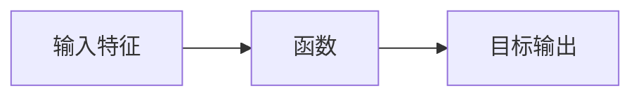
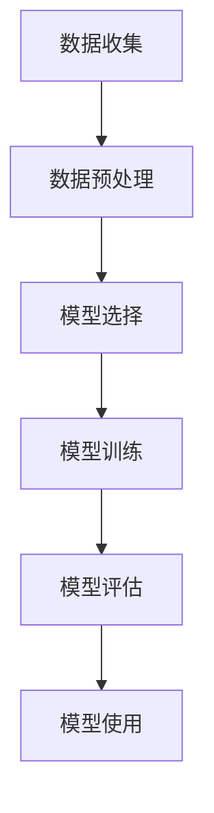

## 1.背景介绍

在人工智能的世界中，监督学习是一种强大的学习算法，它已经在各种场景中产生了深远的影响。从图像识别到自然语言处理，从医疗诊断到金融预测，监督学习都发挥了关键的作用。本文将深入探讨监督学习的核心概念、原理和实践应用。

## 2.核心概念与联系

监督学习是机器学习中的一个重要分支，它的任务是通过学习输入和输出之间的映射关系，来预测新的未知数据。在监督学习中，我们有一个由输入特征和对应的目标输出组成的训练数据集。我们的目标是找到一个函数，使得这个函数能够很好地映射输入特征到目标输出。



## 3.核心算法原理具体操作步骤

监督学习的过程通常包括以下步骤：

1. **数据收集**：收集包含输入特征和对应目标输出的数据集。

2. **数据预处理**：清洗数据，处理缺失值和异常值，对数据进行归一化处理。

3. **模型选择**：根据问题的特性选择合适的模型，如线性回归、决策树、神经网络等。

4. **模型训练**：使用优化算法（如梯度下降法）来调整模型的参数，使得模型在训练数据上的预测误差最小。

5. **模型评估**：使用验证集来评估模型的性能，调整模型的复杂度以防止过拟合或欠拟合。

6. **模型使用**：将训练好的模型应用到新的数据上，进行预测。



## 4.数学模型和公式详细讲解举例说明

以线性回归为例，我们的目标是找到一条直线，使得所有数据点到这条直线的距离之和最小。这可以通过最小化均方误差（MSE）来实现：

$$
MSE = \frac{1}{n} \sum_{i=1}^{n} (y_i - (ax_i + b))^2
$$

其中，$y_i$ 是第 $i$ 个数据点的目标输出，$x_i$ 是第 $i$ 个数据点的输入特征，$a$ 和 $b$ 是我们要求解的模型参数。我们可以通过梯度下降法来求解这个优化问题。

## 5.项目实践：代码实例和详细解释说明

以下是一个使用Python和scikit-learn库进行线性回归的简单示例：

```python
from sklearn.model_selection import train_test_split
from sklearn.linear_model import LinearRegression
from sklearn import datasets

# 加载数据集
boston = datasets.load_boston()
X = boston.data
y = boston.target

# 划分训练集和测试集
X_train, X_test, y_train, y_test = train_test_split(X, y, test_size=0.2, random_state=42)

# 创建线性回归模型
model = LinearRegression()

# 训练模型
model.fit(X_train, y_train)

# 使用模型进行预测
predictions = model.predict(X_test)
```
在这个例子中，我们首先加载了波士顿房价数据集，然后划分了训练集和测试集。接着，我们创建了一个线性回归模型，并使用训练集对模型进行训练。最后，我们使用训练好的模型对测试集进行预测。

## 6.实际应用场景

监督学习在许多实际应用场景中都有广泛的应用，例如：

- **图像识别**：使用监督学习训练模型来识别图像中的物体，如人脸识别、车牌识别等。

- **自然语言处理**：在机器翻译、情感分析等任务中使用监督学习。

- **医疗诊断**：使用监督学习来预测疾病的发生和发展。

- **金融预测**：使用监督学习来预测股票价格的走势。

## 7.工具和资源推荐

对于想要深入学习和实践监督学习的读者，我推荐以下工具和资源：

- **Python**：一种广泛用于数据分析和机器学习的编程语言。

- **scikit-learn**：一个提供大量机器学习算法的Python库。

- **TensorFlow**：一个强大的用于深度学习的开源库。

- **Kaggle**：一个提供大量数据集和机器学习竞赛的平台。

## 8.总结：未来发展趋势与挑战

监督学习已经在许多领域取得了显著的成果，但还有许多挑战需要我们去面对。例如，如何处理高维度的数据、如何处理不平衡的数据、如何提高模型的解释性等。随着技术的发展，我相信我们会在这些问题上取得更多的进展。

## 9.附录：常见问题与解答

1. **监督学习和无监督学习有什么区别？**

   监督学习是指我们有一个标签的数据集，模型通过学习输入和输出之间的映射关系来进行预测。而无监督学习是指我们只有输入数据，没有对应的标签，模型需要从数据中自动找出一些结构或者模式。

2. **如何选择合适的模型？**

   选择模型需要考虑问题的特性，例如数据的维度、数据的分布等。同时，也需要考虑模型的复杂度，以防止过拟合或欠拟合。

3. **如何评估模型的性能？**

   常用的评估指标包括准确率、精确率、召回率、F1分数等。选择哪种指标取决于我们关心的问题。例如，在医疗诊断中，我们可能更关心召回率，而在垃圾邮件检测中，我们可能更关心精确率。

作者：禅与计算机程序设计艺术 / Zen and the Art of Computer Programming