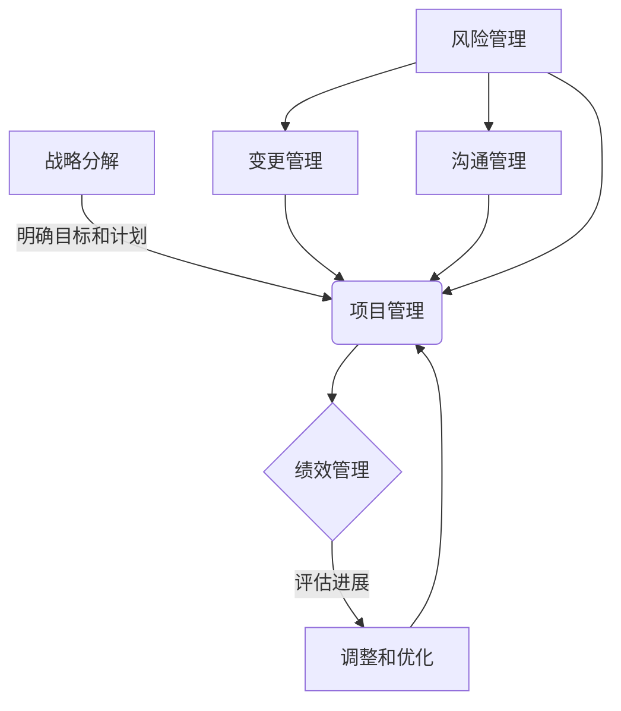
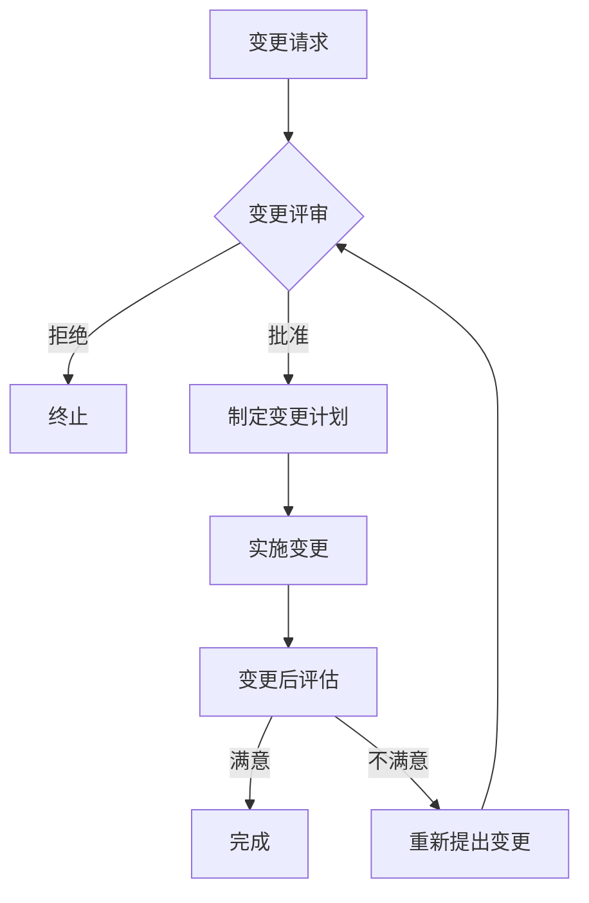

# 督促、跟踪和指导公司科技战略的执行，确保按照战略规划的方向前进，各项计划得到有效的落实

## 1. 背景介绍

### 1.1 科技战略的重要性

在当今快节奏的数字时代，科技已经成为推动企业发展和保持竞争优势的关键动力。有效的科技战略不仅可以帮助企业把握市场趋势并制定创新计划,还能确保公司的资源和投资得到最佳利用。因此,制定科技战略并确保其有效执行对于任何企业的长期发展都至关重要。

### 1.2 执行科技战略的挑战

尽管制定科技战略很重要,但要真正将其付诸实施并非易事。企业常常面临诸多挑战,例如:

- 资源分配不当
- 缺乏明确的责任制和问责制
- 沟通不畅
- 员工参与度低
- 对变革的抗拒

### 1.3 督促、跟踪和指导的必要性

为了克服上述挑战并确保科技战略的顺利实施,企业需要有一个专门的机制来督促、跟踪和指导整个执行过程。这种机制不仅可以确保各项计划按时间表有序推进,还能及时发现并解决执行过程中出现的任何偏差或障碍。

## 2. 核心概念与联系

### 2.1 科技战略执行的核心概念

以下是科技战略执行过程中的几个核心概念:

1. **战略分解 (Strategy Decomposition)**: 将总体战略分解为可执行的行动计划和项目,明确目标、里程碑和责任人。

2. **项目管理 (Project Management)**: 对各个战略项目进行有效的规划、组织、执行、监控和控制,确保按时按质按预算完成。

3. **变更管理 (Change Management)**: 管理由战略执行所引起的组织变革,减少变革阻力,提高员工参与度和适应能力。

4. **绩效管理 (Performance Management)**: 制定关键绩效指标 (KPI),持续跟踪和评估战略执行的进展和成效。

5. **风险管理 (Risk Management)**: 识别、评估和应对战略执行过程中可能遇到的风险,制定应对措施。

6. **沟通管理 (Communication Management)**: 建立高效的沟通渠道,确保战略目标、计划和进展状况能够及时准确地传达给所有相关人员。

### 2.2 核心概念之间的关系

上述核心概念相互关联,共同构成了科技战略执行的完整框架。战略分解为整个过程奠定了基础,明确了需要实现的目标和行动计划。项目管理则负责具体执行这些计划,并通过绩效管理来跟踪进展情况。与此同时,变更管理和沟通管理分别处理执行过程中的组织变革和信息流动问题。而风险管理贯穿始终,应对可能出现的各种意外情况。



## 3. 核心算法原理具体操作步骤

虽然科技战略执行看似是一个复杂的系统工程,但我们可以将其分解为几个关键步骤,并为每个步骤制定相应的算法和操作原则。

### 3.1 战略分解算法

战略分解算法的目标是将总体科技战略转化为一系列可执行的行动计划和项目,并明确相应的责任人、里程碑和资源分配。算法步骤如下:

1. 输入: 总体科技战略文件
2. 识别并提取战略中的关键目标和优先级
3. 对每个目标,分解为多个可测量的子目标
4. 对每个子目标,制定实现该目标的行动计划或项目
5. 为每个行动计划或项目指定负责人、时间表和所需资源
6. 整合所有行动计划和项目,形成总体执行计划
7. 输出: 总体执行计划文件

### 3.2 项目管理原则

一旦总体执行计划制定完成,接下来就需要遵循项目管理的核心原则来推进各个项目的执行:

1. **制定项目章程**: 明确项目目标、范围、里程碑、角色和职责。
2. **项目计划**: 制定工作分解结构 (WBS)、进度计划、资源计划、风险计划等。
3. **项目执行**: 按计划执行各项工作,定期召开协调会议。
4. **项目监控**: 跟踪项目进展,收集项目绩效数据。
5. **绩效评估**: 定期评估项目绩效,并与基准线进行对比。
6. **整体控制**: 根据绩效评估结果,对进度、成本、质量、范围等进行调整。

### 3.3 变更管理流程

由于科技战略的执行往往需要较长时间,期间可能会出现各种需要调整的变更。因此,需要建立一个规范的变更管理流程:



1. 任何相关人员都可以提出变更请求
2. 变更控制委员会对请求进行评审,决定是否批准
3. 如果批准,制定详细的变更计划
4. 实施变更计划
5. 评估变更效果,如果不满意可以重新提出变更

### 3.4 绩效评估算法

为了持续跟踪战略执行的进展情况,我们需要一个绩效评估算法,定期评估关键绩效指标 (KPI) 并与基准线进行对比。算法步骤如下:

1. 输入: 基准KPI值、当前KPI值、权重系数
2. 对每个KPI,计算其当前值与基准值的差异
3. 将差异值乘以相应的权重系数,得到加权差异值
4. 将所有加权差异值相加,得到总体偏差值
5. 如果总体偏差值超过预设阈值,则触发预警
6. 输出: 总体偏差评估结果和预警(如有)

该算法可以帮助企业及时发现执行过程中的偏差,并根据评估结果采取适当的调整措施。

## 4. 数学模型和公式详细讲解举例说明

在科技战略执行的过程中,我们还可以借助一些数学模型和公式来量化和优化决策。

### 4.1 项目投资组合优化模型

企业通常需要在有限的资源下,对多个潜在项目进行评估和选择,从而构建最优的投资组合。我们可以使用0-1整数规划模型来解决这个问题:

$$
\begin{aligned}
\max \quad & \sum_{i=1}^{n} r_i x_i \\
\text{s.t.} \quad & \sum_{i=1}^{n} c_i x_i \leq B \\
             & \sum_{i \in P_j} x_i \leq 1, \quad \forall j \\
             & x_i \in \{0, 1\}, \quad \forall i
\end{aligned}
$$

其中:
- $n$是潜在项目的总数
- $r_i$是项目$i$的预期回报
- $c_i$是项目$i$的成本
- $B$是可用的总预算
- $P_j$是一组相互排斥的项目集合

目标函数是最大化投资组合的总回报。约束条件包括:
1. 总成本不超过预算
2. 对于任何一组相互排斥的项目,最多只能选择一个
3. 决策变量$x_i$是0-1变量,表示是否选择项目$i$

通过求解这个0-1整数规划问题,我们可以得到最优的投资组合方案。

### 4.2 项目进度控制模型

在项目执行过程中,我们需要控制项目的进度,确保按时完成。我们可以使用以下模型来量化和优化项目进度:

$$
\begin{aligned}
\min \quad & \sum_{i=1}^{n} \sum_{j=1}^{m} c_{ij} x_{ij} \\
\text{s.t.} \quad & \sum_{j=1}^{m} x_{ij} = 1, \quad \forall i \\
             & \sum_{i=1}^{n} d_{ij} x_{ij} \leq D_j, \quad \forall j \\
             & x_{ij} \in \{0, 1\}, \quad \forall i, j
\end{aligned}
$$

其中:
- $n$是活动的总数
- $m$是可选模式的总数
- $c_{ij}$是活动$i$在模式$j$下的成本
- $d_{ij}$是活动$i$在模式$j$下的持续时间
- $D_j$是模式$j$的最晚完成时间

目标函数是最小化总成本。约束条件包括:
1. 每个活动必须选择一种模式
2. 在每种模式下,所有活动的总持续时间不超过该模式的最晚完成时间
3. 决策变量$x_{ij}$是0-1变量,表示是否选择活动$i$的模式$j$

通过求解这个0-1整数规划问题,我们可以得到最优的进度控制方案,在满足项目期限的前提下,最小化总成本。

上述模型只是数学模型在科技战略执行中的两个应用示例。根据具体情况,我们还可以构建其他模型,例如资源分配模型、风险管理模型等,从而为决策提供更多量化依据。

## 5. 项目实践: 代码实例和详细解释说明

为了更好地理解上述算法和模型的实现,我们将提供一些代码实例,并对其进行详细的解释说明。

### 5.1 战略分解算法实现

下面是战略分解算法的Python实现示例:

```python
import re

def strategy_decomposition(strategy_file):
    with open(strategy_file, 'r') as f:
        strategy_text = f.read()

    # 提取关键目标和优先级
    goals = re.findall(r'Goal\s*:\s*(.+?)\s*Priority\s*:\s*(\d+)', strategy_text)

    # 对每个目标进行分解
    execution_plan = []
    for goal, priority in sorted(goals, key=lambda x: int(x[1]), reverse=True):
        sub_goals = re.findall(r'- (.+?)\n', goal)
        for sub_goal in sub_goals:
            action_plan = {
                'goal': goal,
                'sub_goal': sub_goal,
                'priority': int(priority),
                'actions': [],
                'owner': None,
                'timeline': None,
                'resources': None
            }
            execution_plan.append(action_plan)

    # 为每个行动计划指定负责人、时间表和资源
    # ...

    return execution_plan
```

这个函数接受一个包含战略文件的文件路径作为输入。它首先读取文件内容,然后使用正则表达式提取关键目标及其优先级。接下来,对于每个目标,它再次使用正则表达式提取子目标,并为每个子目标创建一个行动计划字典。最后,所有行动计划被汇总到一个列表中返回。

需要注意的是,这只是一个简单的示例,在实际应用中可能需要进行更多处理,例如处理格式不一致的输入、添加更多元数据等。此外,我们还需要补充为每个行动计划指定负责人、时间表和资源的逻辑。

### 5.2 项目管理原则实现

以下是一个基于Python的简单项目管理工具的实现示例:

```python
from datetime import datetime

class Project:
    def __init__(self, name, charter):
        self.name = name
        self.charter = charter
        self.tasks = []
        self.milestones = []
        self.resources = []
        self.risks = []

    def add_task(self, task):
        self.tasks.append(task)

    def add_milestone(self, milestone):
        self.milestones.append(milestone)

    def add_resource(self, resource):
        self.resources.append(resource)

    def add_risk(self, risk):
        self.risks.append(risk)

    def track_progress(self):
        for task in self.tasks:
            if task.status == 'In Progress':
                task.update_progress()