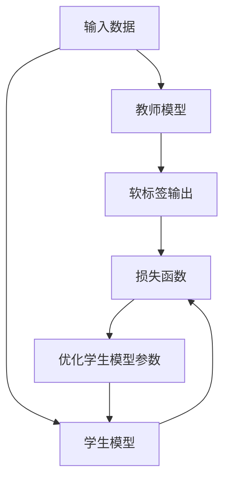

# 知识蒸馏与模型压缩原理与代码实战案例讲解

## 1. 背景介绍

### 1.1. 人工智能模型的挑战

随着深度学习技术的不断发展,人工智能模型在各个领域取得了令人瞩目的成就。然而,这些高性能模型通常需要大量的计算资源和存储空间,这使得它们在资源受限的环境中(如移动设备、嵌入式系统等)的应用受到了限制。因此,如何在保持模型性能的同时减小其尺寸和计算复杂度,成为了一个亟待解决的问题。

### 1.2. 模型压缩的重要性

模型压缩技术旨在缩小深度神经网络的尺寸,降低其计算和存储开销,同时尽可能保持其性能水平。这对于将人工智能模型部署到资源受限环境中至关重要。通过模型压缩,我们可以使用更小、更高效的模型,从而减少能耗、降低延迟,并扩大人工智能技术的应用范围。

### 1.3. 知识蒸馏的概念

知识蒸馏是模型压缩的一种重要技术,其核心思想是利用一个大型的"教师模型"(teacher model)来指导一个小型的"学生模型"(student model)学习,从而使学生模型在保持较小尺寸的同时,能够获得接近教师模型的性能水平。这种思路源于人类学习的方式,即先从权威人士那里学习知识,然后内化并形成自己的理解。

## 2. 核心概念与联系

### 2.1. 教师-学生模型框架

知识蒸馏过程涉及两个关键模型:教师模型和学生模型。教师模型通常是一个大型的、高性能的神经网络模型,它已经在大量数据上进行了训练,具有很强的泛化能力。学生模型则是一个相对较小的神经网络,其结构和参数需要通过知识蒸馏过程来学习。

在知识蒸馏过程中,教师模型的输出被用作"软标签"(soft labels),而不是通常的一热编码标签(one-hot labels)。这些软标签包含了教师模型对每个类别的置信度分数,反映了它对输入数据的判断。学生模型则被训练以匹配教师模型的软标签输出,从而学习教师模型的知识。

### 2.2. 损失函数

为了实现知识蒸馏,我们需要设计一个合适的损失函数,将教师模型的知识传递给学生模型。常用的损失函数包括:

1. **软标签损失函数**:最基本的损失函数,它衡量学生模型的输出与教师模型的软标签输出之间的差异。
2. **注意力传递损失函数**:除了输出层,还可以将教师模型的中间层特征作为额外的监督信号,引导学生模型学习教师模型的注意力机制。
3. **关系损失函数**:通过最小化样本之间的关系差异(如相似度矩阵),使学生模型学习教师模型对样本关系的建模能力。

根据具体任务和需求,我们可以选择合适的损失函数或组合多种损失函数,以获得更好的知识蒸馏效果。

### 2.3. Mermaid 流程图

知识蒸馏过程可以用以下 Mermaid 流程图来概括:



该流程图描述了以下步骤:

1. 输入数据被同时输入教师模型和学生模型。
2. 教师模型产生软标签输出。
3. 学生模型的输出与教师模型的软标签输出一起输入损失函数。
4. 损失函数的输出用于优化学生模型的参数。
5. 优化后的学生模型将用于下一轮迭代。

通过这种方式,学生模型可以逐步学习教师模型的知识,最终达到接近教师模型的性能水平。

## 3. 核心算法原理具体操作步骤

知识蒸馏算法的核心步骤如下:

### 3.1. 训练教师模型

首先,我们需要训练一个高性能的教师模型。这个模型可以是任何深度神经网络架构,如ResNet、Transformer等。教师模型通常在大规模数据集上进行训练,以获得良好的泛化能力。

### 3.2. 生成软标签

对于每个输入样本,我们将其输入到训练好的教师模型中,获取教师模型的输出。这个输出通常是一个向量,其中每个元素代表该样本属于相应类别的概率。这些概率向量就是我们所说的软标签。

### 3.3. 定义损失函数

接下来,我们需要定义一个合适的损失函数,用于衡量学生模型的输出与教师模型的软标签输出之间的差异。常用的损失函数包括交叉熵损失、均方误差损失等。

### 3.4. 训练学生模型

使用定义好的损失函数,我们可以训练学生模型,使其输出尽可能接近教师模型的软标签输出。这个过程通常采用标准的梯度下降优化算法,如随机梯度下降(SGD)或Adam优化器。

在训练过程中,我们可以同时使用硬标签(one-hot labels)和软标签作为监督信号,这种方法被称为知识蒸馏损失。具体来说,总损失函数可以表示为:

$$\mathcal{L}_{total} = (1 - \alpha) \mathcal{L}_{hard} + \alpha \mathcal{L}_{soft}$$

其中,$ \mathcal{L}_{hard} $是硬标签损失(如交叉熵损失),$ \mathcal{L}_{soft} $是软标签损失(如KL散度损失),$ \alpha $是一个权重系数,用于平衡两个损失项的重要性。

### 3.5. 模型评估和微调

在训练结束后,我们可以在验证集或测试集上评估学生模型的性能。如果性能不理想,可以尝试调整超参数(如学习率、正则化强度等)或修改网络架构,然后重新训练模型。

此外,我们还可以进行模型微调(fine-tuning),即在知识蒸馏后,使用硬标签数据对学生模型进行进一步训练,以提高其在特定任务上的性能。

## 4. 数学模型和公式详细讲解举例说明

在知识蒸馏过程中,我们需要定义一个合适的损失函数,以衡量学生模型的输出与教师模型的软标签输出之间的差异。常用的损失函数包括:

### 4.1. 软标签损失函数

软标签损失函数是最基本的损失函数,它直接比较学生模型的输出与教师模型的软标签输出。常用的软标签损失函数包括:

1. **KL 散度损失**:

$$\mathcal{L}_{KL} = \sum_{i=1}^{N} q_i \log \frac{q_i}{p_i}$$

其中,$ N $是类别数,$ q_i $是教师模型对第$ i $类的预测概率,$ p_i $是学生模型对第$ i $类的预测概率。KL 散度损失衡量了两个概率分布之间的差异。

2. **均方误差损失**:

$$\mathcal{L}_{MSE} = \frac{1}{N} \sum_{i=1}^{N} (q_i - p_i)^2$$

均方误差损失直接计算预测概率之间的平方差。

### 4.2. 注意力传递损失函数

除了输出层,我们还可以利用教师模型的中间层特征,作为额外的监督信号,引导学生模型学习教师模型的注意力机制。常用的注意力传递损失函数包括:

1. **注意力映射损失**:

$$\mathcal{L}_{AT} = \frac{1}{HW} \sum_{i=1}^{HW} \|f(A_s^i) - A_t^i\|_2^2$$

其中,$ A_s^i $和$ A_t^i $分别是学生模型和教师模型在第$ i $个位置的注意力映射,$ f $是一个转换函数,用于将学生模型的注意力映射转换到教师模型的空间中。$ H $和$ W $分别是注意力映射的高度和宽度。

2. **注意力转移损失**:

$$\mathcal{L}_{AT} = \frac{1}{HW} \sum_{i=1}^{HW} \|A_s^i - g(A_t^i)\|_2^2$$

与注意力映射损失相反,注意力转移损失将教师模型的注意力映射转换到学生模型的空间中,其中$ g $是一个转换函数。

### 4.3. 关系损失函数

关系损失函数旨在使学生模型学习教师模型对样本关系的建模能力。常用的关系损失函数包括:

1. **相似度保持损失**:

$$\mathcal{L}_{SP} = \|S_s - S_t\|_F^2$$

其中,$ S_s $和$ S_t $分别是学生模型和教师模型的样本相似度矩阵,$ \|\cdot\|_F $是矩阵的Frobenius范数。

2. **相似度高斯损失**:

$$\mathcal{L}_{SG} = \sum_{i,j} \exp(-\|x_i - x_j\|_2^2 / \sigma^2) \|S_s(i,j) - S_t(i,j)\|_2^2$$

相似度高斯损失在相似度保持损失的基础上,引入了一个高斯核函数,用于加权不同样本对的重要性。

通过组合上述损失函数,我们可以从不同角度引导学生模型学习教师模型的知识,从而获得更好的知识蒸馏效果。

## 5. 项目实践:代码实例和详细解释说明

在本节中,我们将提供一个基于PyTorch的知识蒸馏实现示例,并对关键代码进行详细解释。

### 5.1. 导入所需库

```python
import torch
import torch.nn as nn
import torch.optim as optim
from torchvision import datasets, transforms
```

我们首先导入所需的PyTorch库,包括`torch`、`torch.nn`和`torch.optim`。此外,我们还从`torchvision`中导入`datasets`和`transforms`,用于加载和预处理数据。

### 5.2. 定义教师模型和学生模型

```python
# 定义教师模型
teacher_model = ...

# 定义学生模型
student_model = ...
```

在这个示例中,我们假设教师模型和学生模型已经被定义好了。您可以使用任何深度神经网络架构作为教师模型和学生模型,如ResNet、VGG等。

### 5.3. 定义损失函数

```python
# 定义损失函数
alpha = 0.7
def loss_fn(outputs, labels, teacher_outputs):
    hard_loss = nn.CrossEntropyLoss()(outputs, labels)
    soft_loss = nn.KLDivLoss(reduction='batchmean')(nn.LogSoftmax(dim=1)(outputs),
                                                    nn.Softmax(dim=1)(teacher_outputs))
    total_loss = (1 - alpha) * hard_loss + alpha * soft_loss
    return total_loss
```

在这个示例中,我们定义了一个组合损失函数,包括硬标签损失(交叉熵损失)和软标签损失(KL散度损失)。`alpha`是一个权重系数,用于平衡两个损失项的重要性。

### 5.4. 训练循环

```python
# 设置优化器
optimizer = optim.SGD(student_model.parameters(), lr=0.01, momentum=0.9)

# 训练循环
for epoch in range(num_epochs):
    for inputs, labels in data_loader:
        # 前向传播
        student_outputs = student_model(inputs)
        with torch.no_grad():
            teacher_outputs = teacher_model(inputs)

        # 计算损失
        loss = loss_fn(student_outputs, labels, teacher_outputs)

        # 反向传播和优化
        optimizer.zero_grad()
        loss.backward()
        optimizer.step()

    # 评估模型
    evaluate(student_model, test_loader)
```

在训练循环中,我们首先设置优化器,在这个示例中使用了随机梯度下降(SGD)优化器。

对于每个批次的数据,我们首先通过学生模型和教师模型进行前向传播,获取它们的输出。然后,我们使用前面定义的损失函数计算总损失。