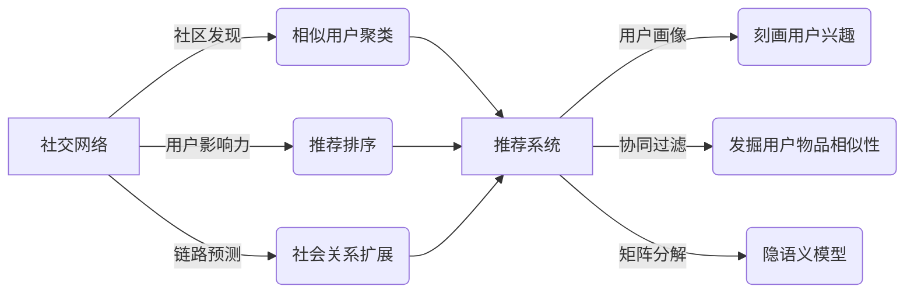
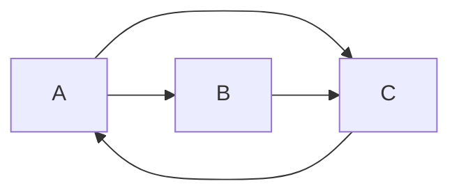

# 社交网络分析和推荐系统的研究

## 1.背景介绍
### 1.1 社交网络的兴起与发展
#### 1.1.1 社交网络的定义与特点
社交网络是由社会个体（节点）及其之间的关系（边）组成的网络。社交网络具有小世界、无标度、同配性等特点，能够反映现实世界中人与人之间错综复杂的社会关系。

#### 1.1.2 社交网络的发展历程
社交网络的研究最早可以追溯到20世纪30年代的社会计量学。随着互联网尤其是Web2.0时代的到来，在线社交网络如Facebook、Twitter等的兴起，社交网络得到了空前的发展，成为了人们日常交流和信息获取的重要渠道。

#### 1.1.3 社交网络分析的意义
社交网络蕴含了丰富的结构和行为信息，对其进行分析可以帮助我们深入理解复杂系统的结构与功能，在社会学、经济学、传播学等领域有广泛应用。同时，社交网络分析也是进行个性化推荐的重要基础。

### 1.2 推荐系统概述
#### 1.2.1 推荐系统的定义与发展
推荐系统是一种信息过滤系统，它可以学习用户的兴趣偏好，从海量信息中发掘用户可能感兴趣的内容，是解决信息过载问题的重要途径。推荐系统经历了从人工推荐、基于内容推荐、协同过滤推荐,到融合多种策略的混合推荐等发展阶段。

#### 1.2.2 推荐系统的应用现状
如今，推荐系统已经被广泛应用于电子商务、社交媒体、视频网站、新闻资讯等领域。亚马逊、Netflix、YouTube等互联网巨头都将推荐系统视为提升用户体验、增强用户粘性的利器。

### 1.3 社交网络分析与推荐系统的结合
社交网络中蕴含了丰富的用户行为数据和社会关系信息，将其引入推荐系统，可以极大提升推荐的精准度和覆盖度。社交网络分析技术如社区发现、链路预测等，能够挖掘用户的隐性偏好，扩展用户的交互行为。因此，社交网络分析与推荐系统的结合，已经成为了学术界和工业界的研究热点。

## 2.核心概念与联系
### 2.1 社交网络分析的核心概念
#### 2.1.1 节点中心性
中心性刻画了节点在网络中的重要程度，常用的中心性指标有度中心性、介数中心性、接近中心性等。

#### 2.1.2 社区发现
社区是指网络中节点之间联系紧密而与外部联系相对稀疏的节点集合。社区发现可以发现网络的层次结构和功能模块。

#### 2.1.3 链路预测
链路预测是指根据网络当前的结构，预测网络中未来可能出现的边。常用的方法有基于相似性的方法和基于最大似然的方法。

### 2.2 推荐系统的核心概念
#### 2.2.1 用户画像
用户画像是指从用户的历史行为数据中，挖掘用户的兴趣标签、人口统计学特征等，构建结构化的用户属性表示。

#### 2.2.2 协同过滤
协同过滤是一种基于用户行为的推荐算法，通过发掘用户或物品之间的相似性，给用户推荐和他喜好相似的其他用户喜欢的物品。

#### 2.2.3 矩阵分解
矩阵分解通过将高维稀疏的用户-物品评分矩阵分解为低维稠密的用户和物品隐向量，来预测用户对物品的评分。

### 2.3 社交网络分析与推荐系统的联系
社交网络分析可以从以下几个方面增强推荐系统的性能：

1. 利用社区发现将相似用户聚类，缓解协同过滤的数据稀疏问题；
2. 利用用户的社会影响力指标如中心性来调整推荐结果的排序；
3. 利用链路预测扩充用户的潜在社会关系，增加协同过滤的邻域覆盖度；
4. 融合社交网络结构信息与协同过滤，设计社会化推荐模型。

下图展示了社交网络分析与推荐系统的核心概念与联系：

## 3.核心算法原理具体操作步骤
本节将详细介绍几种社交网络分析和推荐系统的核心算法，包括节点重要性排序、社区发现、基于随机游走的链路预测和社会化矩阵分解推荐。

### 3.1 节点重要性排序算法
节点重要性排序可以根据节点在网络中的结构特征，评估其影响力。以下是几种常用算法：

#### 3.1.1 PageRank算法
PageRank最初用于评估网页的重要性，其核心思想是认为重要网页会被更多其他重要网页所指向。
1. 初始化每个节点的PageRank值为1/N，N为节点总数；
2. 迭代计算每个节点的PageRank值，直到收敛。每个节点将其当前的PageRank值平均分配给它指向的节点；
3. 最终得到收敛的PageRank值，作为节点重要性的度量。

#### 3.1.2 HITS算法
HITS算法认为网络中存在Hub节点和Authority节点，Hub节点指向多个Authority节点，Authority节点被多个Hub节点指向。
1. 初始化每个节点的Hub值和Authority值为1；  
2. 迭代计算每个节点的Hub值和Authority值，直到收敛。节点的Authority值等于指向它的节点Hub值之和，节点的Hub值等于它指向的节点Authority值之和；
3. 对Hub值和Authority值进行归一化，得到最终的节点重要性度量。

#### 3.1.3 LeaderRank算法
LeaderRank算法在PageRank的基础上，引入了网络的引力中心。
1. 在原始网络中加入一个引力中心节点，并与所有节点之间建立双向连边；
2. 类似PageRank，初始化每个节点的LeaderRank值并迭代计算直至收敛；
3. 引力中心确保了LeaderRank值的唯一性，提高了排序的鲁棒性。

### 3.2 社区发现算法
社区发现可以帮助我们探索网络的层次结构和功能模块。以下是两种代表性算法：

#### 3.2.1 GN算法
GN算法通过不断移除介数最大的边来分割社区。
1. 计算网络中每条边的介数中心性；
2. 移除介数最大的边，并重新计算剩余边的介数；
3. 重复步骤2，直至网络中所有边被移除。网络在移除过程中自然形成层次化的社区结构。

#### 3.2.2 Louvain算法
Louvain算法以模块度最大化为目标，不断地将网络节点进行聚合，发现层次化的社区结构。
1. 初始时每个节点是一个独立社区；
2. 对每个节点，尝试将其加入到邻居所在社区，选择模块度提升最大的社区进行合并；
3. 重复步骤2，直至模块度不再提升。得到一个社区划分；
4. 将每个社区视为一个新的节点，两个社区之间的边权重等于社区间原始边权重之和，进入下一轮迭代，直至结构稳定。

### 3.3 基于随机游走的链路预测
链路预测可以发掘网络中潜在的边。以下是基于随机游走的链路预测算法：

#### 3.3.1 Katz算法
Katz算法通过计算节点对之间的路径数量来预测边的存在概率。
1. 计算网络的邻接矩阵A和单位矩阵I；
2. 定义衰减因子β和路径长度上限L；
3. 计算节点相似度矩阵S：
$$
S = \sum_{l=1}^L \beta^l A^l
$$
4. 矩阵S中元素值越大，表示对应节点对之间存在链接的可能性越大。

#### 3.3.2 随机游走与重启算法
随机游走与重启算法模拟了从起始节点出发，以一定概率随机游走或返回起始节点的过程。
1. 定义重启概率α，随机游走概率矩阵P等于邻接矩阵按行归一化；
2. 定义起始节点的分布向量q，一般将起始节点对应元素设为1，其余为0；
3. 迭代计算节点重要性向量r，直至收敛：
$$
r = \alpha q + (1-\alpha) P^T r
$$
4. 得到的r向量表示节点与起始节点的相关性，r值越大，节点对之间的链接可能性越大。

### 3.4 社会化矩阵分解推荐
社会化推荐将社交网络信息融入推荐过程。以下是一种基于矩阵分解的社会化推荐算法SocialMF：

1. 定义用户-物品评分矩阵R，用户社交关系矩阵T；
2. 定义用户和物品的隐向量矩阵U和V，用户社交关系隐向量矩阵Z；
3. 定义代价函数，最小化评分预测误差和正则化项：
$$
\min_{U,V,Z} \sum_{i,j} I_{ij}(R_{ij} - U_i^T V_j)^2 + \alpha \sum_{i,f} T_{if} ||U_i - Z_f||^2_F + \lambda (||U||^2_F + ||V||^2_F + ||Z||^2_F) 
$$
其中，I为指示矩阵，I_ij=1表示用户i对物品j有评分；
4. 采用随机梯度下降优化代价函数，更新U、V、Z矩阵；
5. 利用优化后的隐向量矩阵，计算用户对未评分物品的评分预测值：
$$
\hat{R}_{ij} = U_i^T V_j
$$

## 4.数学模型和公式详细讲解举例说明
本节将对一些关键的数学模型和公式进行更详细的讲解和举例说明。

### 4.1 PageRank的迭代计算
PageRank值的迭代计算公式为：
$$
R(i) = \frac{1-d}{N} + d \sum_{j \in B(i)} \frac{R(j)}{L(j)}
$$
其中，d为阻尼因子，一般取0.85；N为节点总数；B(i)为指向节点i的节点集合；L(j)为节点j的出度。

举例说明，对于下图所示的有向网络：

初始时A、B、C的PageRank值都为1/3。第一轮迭代后：
$$
R(A) = \frac{1-0.85}{3} + 0.85 \times \frac{1/3}{1} = 0.3833 \\
R(B) = \frac{1-0.85}{3} + 0.85 \times \frac{1/3}{2} = 0.1917 \\
R(C) = \frac{1-0.85}{3} + 0.85 \times (\frac{1/3}{1} + \frac{1/3}{1})=0.4250
$$

重复迭代直至收敛，最终得到A、B、C的PageRank值分别为0.3577, 0.1934, 0.4489。可以看出C的重要性最高，其次是A和B。

### 4.2 Katz算法的矩阵形式
Katz算法的相似度矩阵可以写成矩阵形式：
$$
S = \sum_{l=1}^L \beta^l A^l = (I - \beta A)^{-1} - I
$$
其中，I为单位矩阵，A为邻接矩阵，β为衰减因子且满足谱半径ρ(βA)<1。

举例说明，对于下图所示的无向