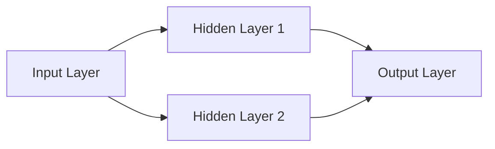

# 神经网络 原理与代码实例讲解

作者：禅与计算机程序设计艺术

## 1. 背景介绍

### 1.1 人工智能与神经网络
人工智能(Artificial Intelligence, AI)是计算机科学的一个重要分支,其目标是研究如何让计算机模拟甚至超越人类的智能。而神经网络(Neural Network)作为实现人工智能的重要技术之一,近年来受到了学术界和工业界的广泛关注。

### 1.2 神经网络的起源与发展
神经网络的概念最早由生物学家Warren McCulloch和数学家Walter Pitts于1943年提出。他们受到生物神经元工作原理的启发,提出了一个简单的神经元数学模型。此后,随着计算机技术的发展,神经网络逐渐成为人工智能领域的研究热点。

20世纪80年代,反向传播(Backpropagation)算法的提出极大地推动了神经网络的发展。进入21世纪,随着大数据和高性能计算的兴起,深度学习(Deep Learning)成为了神经网络研究的新方向。

### 1.3 神经网络的应用领域
神经网络凭借其强大的非线性拟合能力和自适应学习能力,在模式识别、自然语言处理、语音识别、图像处理等领域取得了巨大成功。目前,神经网络已经成为人工智能的核心技术之一,在工业界和学术界得到了广泛应用。

## 2. 核心概念与联系

### 2.1 人工神经元
人工神经元(Artificial Neuron)是构成神经网络的基本单元。它模拟了生物神经元的结构和功能,由输入、权重、激活函数和输出组成。下图展示了一个简单的人工神经元模型:

```mermaid
graph LR
    Input1[x1] -- w1 --> N[Neuron]
    Input2[x2] -- w2 --> N
    Input3[...] -. ... .-> N
    InputN[xn] -- wn --> N
    N -- f(x) --> Output[y]
```

其中,$x_1,x_2,...,x_n$表示输入信号,$w_1,w_2,...,w_n$表示对应的权重,f(x)表示激活函数,y表示神经元的输出。神经元接收到输入信号后,通过加权求和并经过激活函数转换,最终得到输出结果。

### 2.2 激活函数
激活函数(Activation Function)在神经网络中起着非常重要的作用。它将神经元的加权输入转换为输出信号,引入了非线性因素,使得神经网络能够拟合复杂的非线性函数。常见的激活函数包括:

- Sigmoid函数:$f(x)=\frac{1}{1+e^{-x}}$
- Tanh函数:$f(x)=\frac{e^x-e^{-x}}{e^x+e^{-x}}$  
- ReLU函数:$f(x)=max(0,x)$

### 2.3 神经网络结构
神经网络由大量的人工神经元按照一定的拓扑结构连接而成。最常见的神经网络结构是前馈神经网络(Feedforward Neural Network),也称为多层感知机(Multilayer Perceptron, MLP)。如下图所示:



前馈神经网络由输入层(Input Layer)、隐藏层(Hidden Layer)和输出层(Output Layer)组成。信息从输入层经过一个或多个隐藏层传递到输出层,每一层的神经元与相邻层的神经元全连接,而同一层的神经元之间没有连接。

除了前馈神经网络,还有其他类型的神经网络结构,如循环神经网络(Recurrent Neural Network, RNN)、卷积神经网络(Convolutional Neural Network, CNN)等,它们在处理序列数据和图像数据方面有着独特的优势。

### 2.4 损失函数与优化算法
为了让神经网络学习到数据的内在规律,我们需要定义一个损失函数(Loss Function)来衡量网络的预测结果与真实值之间的差距。常用的损失函数包括均方误差(Mean Squared Error, MSE)和交叉熵(Cross Entropy)等。

在训练过程中,我们通过优化算法不断调整神经网络的权重和偏置,使得损失函数最小化。最常用的优化算法是梯度下降法(Gradient Descent),包括批量梯度下降(Batch Gradient Descent)、随机梯度下降(Stochastic Gradient Descent, SGD)和小批量梯度下降(Mini-batch Gradient Descent)等变体。

## 3. 核心算法原理具体操作步骤

### 3.1 前向传播
前向传播(Forward Propagation)是神经网络进行预测的过程。给定输入数据,信息从输入层开始,逐层传递到输出层,最终得到预测结果。具体步骤如下:

1. 输入数据经过输入层,传递到第一个隐藏层。
2. 对于每个隐藏层的神经元,计算加权输入:$z_j=\sum_{i=1}^{n}w_{ij}x_i+b_j$,其中$w_{ij}$表示第i个输入与第j个神经元之间的权重,$x_i$表示第i个输入,$b_j$表示第j个神经元的偏置。
3. 将加权输入通过激活函数进行转换,得到神经元的输出:$a_j=f(z_j)$。
4. 重复步骤2和3,直到信息传递到输出层,得到最终的预测结果。

### 3.2 反向传播
反向传播(Backpropagation)是训练神经网络的核心算法。它通过计算损失函数对网络权重的梯度,并使用梯度下降法更新权重,使得网络的预测结果不断逼近真实值。具体步骤如下:

1. 在前向传播的基础上,计算损失函数对输出层每个神经元的偏导数:$\frac{\partial C}{\partial a_j}$,其中C表示损失函数。
2. 根据链式法则,计算损失函数对输出层每个神经元加权输入的偏导数:$\frac{\partial C}{\partial z_j}=\frac{\partial C}{\partial a_j}f'(z_j)$。
3. 逐层向前传播误差,计算损失函数对隐藏层每个神经元输出的偏导数:$\frac{\partial C}{\partial a_i}=\sum_{j=1}^{m}\frac{\partial C}{\partial z_j}w_{ij}$,其中m表示下一层神经元的数量。
4. 计算损失函数对隐藏层每个神经元加权输入的偏导数:$\frac{\partial C}{\partial z_i}=\frac{\partial C}{\partial a_i}f'(z_i)$。
5. 重复步骤3和4,直到误差传递到输入层。
6. 根据损失函数对权重的偏导数更新权重:$w_{ij}:=w_{ij}-\eta\frac{\partial C}{\partial w_{ij}}$,其中$\eta$表示学习率。
7. 重复步骤1到6,直到网络收敛或达到预设的迭代次数。

### 3.3 梯度下降优化
梯度下降(Gradient Descent)是一种常用的优化算法,用于最小化损失函数。其基本思想是沿着损失函数梯度的反方向更新权重,使得损失函数不断减小。常见的梯度下降变体包括:

- 批量梯度下降:在每个迭代中,使用整个训练集计算梯度并更新权重。
- 随机梯度下降:在每个迭代中,随机选择一个样本计算梯度并更新权重。
- 小批量梯度下降:在每个迭代中,随机选择一个小批量(mini-batch)样本计算梯度并更新权重。

此外,还有一些高级优化算法,如Momentum、RMSprop、Adam等,通过引入动量项、自适应学习率等机制,加速了训练过程并提高了优化效果。

## 4. 数学模型和公式详细讲解举例说明

### 4.1 感知机模型
感知机(Perceptron)是最早的神经网络模型之一,由Frank Rosenblatt于1957年提出。它由两层神经元组成,可以用于二分类任务。感知机的数学模型如下:

$$
\begin{aligned}
z &= \sum_{i=1}^{n}w_ix_i+b \\
y &= \begin{cases}
1, & \text{if } z \geq 0 \\
0, & \text{otherwise}
\end{cases}
\end{aligned}
$$

其中,$x_i$表示第i个输入,$w_i$表示第i个权重,b表示偏置,y表示输出。感知机通过调整权重和偏置,使得正样本的输出大于等于0,负样本的输出小于0,从而实现分类。

例如,考虑一个简单的二维数据集,其中正样本为蓝色点,负样本为红色点:

```python
import numpy as np
import matplotlib.pyplot as plt

# 生成数据集
np.random.seed(0)
X = np.random.randn(100, 2)
y = np.where(X[:,0] + X[:,1] > 0, 1, 0)

# 绘制数据点
plt.figure(figsize=(6, 6))
plt.scatter(X[:,0], X[:,1], c=y, cmap='coolwarm', edgecolors='white')
plt.xlabel('x1')
plt.ylabel('x2')
plt.title('Perceptron Example')
plt.show()
```

我们可以使用感知机模型对这个数据集进行分类:

```python
class Perceptron:
    def __init__(self, learning_rate=0.01, num_epochs=100):
        self.learning_rate = learning_rate
        self.num_epochs = num_epochs
        self.weights = None
        self.bias = None
        
    def fit(self, X, y):
        # 初始化权重和偏置
        self.weights = np.zeros(X.shape[1])
        self.bias = 0
        
        for _ in range(self.num_epochs):
            for xi, yi in zip(X, y):
                # 计算输出
                z = np.dot(xi, self.weights) + self.bias
                y_pred = 1 if z >= 0 else 0
                
                # 更新权重和偏置
                update = self.learning_rate * (yi - y_pred)
                self.weights += update * xi
                self.bias += update
    
    def predict(self, X):
        z = np.dot(X, self.weights) + self.bias
        return np.where(z >= 0, 1, 0)

# 训练感知机模型
perceptron = Perceptron()
perceptron.fit(X, y)

# 绘制决策边界
x1_min, x1_max = X[:,0].min() - 1, X[:,0].max() + 1
x2_min, x2_max = X[:,1].min() - 1, X[:,1].max() + 1
xx1, xx2 = np.meshgrid(np.arange(x1_min, x1_max, 0.02),
                       np.arange(x2_min, x2_max, 0.02))
Z = perceptron.predict(np.c_[xx1.ravel(), xx2.ravel()])
Z = Z.reshape(xx1.shape)
plt.contourf(xx1, xx2, Z, alpha=0.3, cmap='coolwarm')

# 绘制数据点
plt.scatter(X[:,0], X[:,1], c=y, cmap='coolwarm', edgecolors='white')
plt.xlabel('x1')
plt.ylabel('x2')
plt.title('Perceptron Decision Boundary')
plt.show()
```

上述代码实现了一个简单的感知机模型,并绘制了其决策边界。可以看到,感知机成功地将正负样本分开,得到了一个线性的决策边界。

### 4.2 多层感知机模型
多层感知机(Multilayer Perceptron, MLP)是由多个感知机组成的前馈神经网络。它通过引入一个或多个隐藏层,增强了网络的表达能力,可以拟合非线性函数。MLP的数学模型如下:

对于第l层的第j个神经元,其加权输入为:

$$z_j^{(l)}=\sum_{i=1}^{n_{l-1}}w_{ij}^{(l)}a_i^{(l-1)}+b_j^{(l)}$$

其中,$a_i^{(l-1)}$表示上一层第i个神经元的输出,$w_{ij}^{(l)}$表示上一层第i个神经元与当前层第j个神经元之间的权重,$b_j^{(l)}$表示当前层第j个神经元的偏置。

将加权输入通过激活函数进行转换,得到当前层第j个神经元的输出:

$$a_j^{(l)}=f(z_j^{(l)