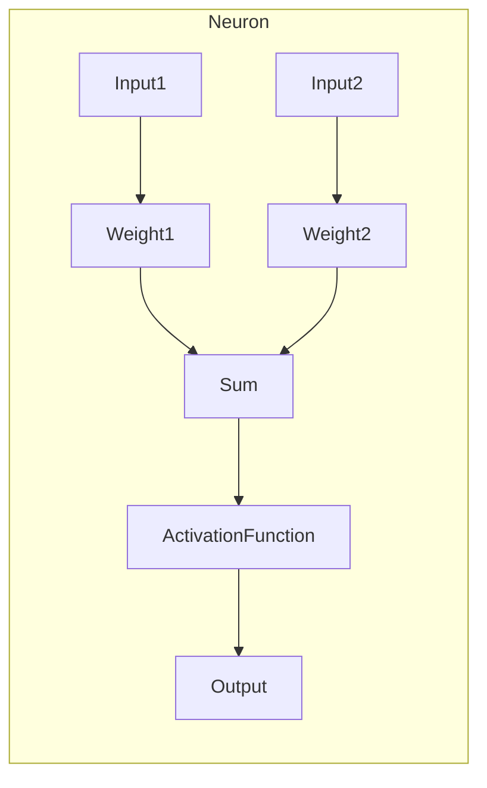
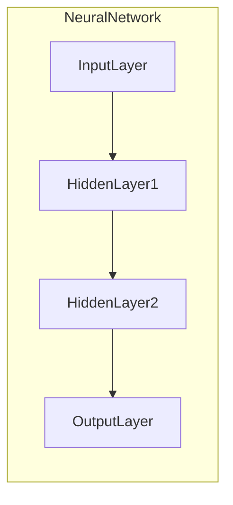
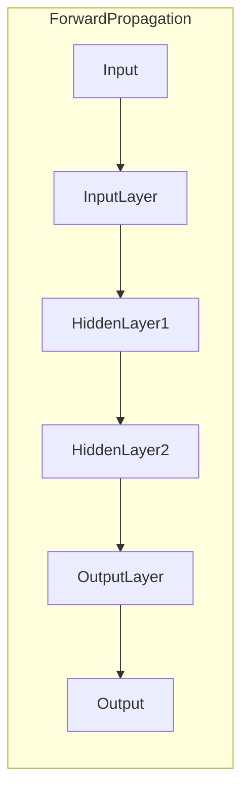
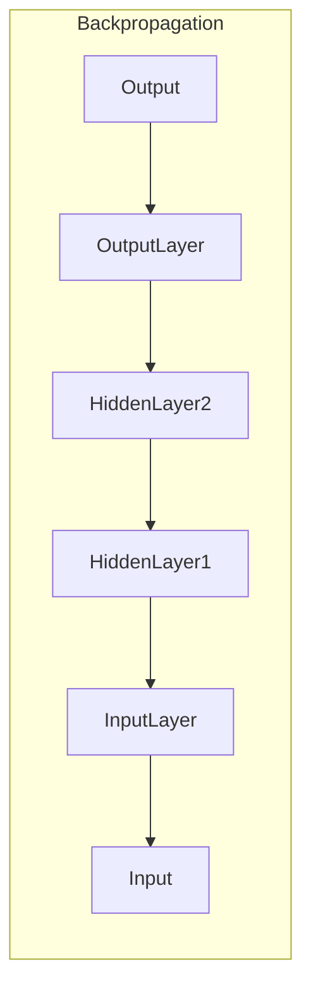

# 神经网络原理与代码实例讲解

## 1.背景介绍

### 1.1 神经网络的起源

神经网络的概念源于对生物神经系统的模拟和研究。人类大脑由数十亿个神经元组成,这些神经元通过复杂的网络相互连接,形成了强大的信息处理系统。受此启发,研究人员试图构建类似的人工神经网络,以模拟人脑的工作原理,解决一些复杂的问题。

### 1.2 神经网络的发展历程

神经网络的理论可以追溯到20世纪40年代,当时的神经网络模型主要是基于生物学上的神经元模型。随后在1960年代,简单的感知器(Perceptron)模型被提出,但由于其局限性,神经网络的研究一度陷入停滞。直到20世纪80年代,反向传播(Backpropagation)算法的提出,结合更强大的计算能力,使得神经网络研究重新兴起。

### 1.3 神经网络的应用领域

如今,神经网络已经广泛应用于多个领域,包括:

- 计算机视觉:图像识别、目标检测、图像分割等
- 自然语言处理:机器翻译、语音识别、文本分类等
- 推荐系统:个性化推荐、广告投放等
- 金融:信用评分、欺诈检测、风险管理等
- 医疗:疾病诊断、药物发现、医学图像分析等

## 2.核心概念与联系

### 2.1 神经元(Neuron)

神经元是神经网络的基本计算单元,它接收一个或多个输入,对输入进行加权求和,然后通过激活函数产生输出。每个神经元都有自己的权重和偏置值,这些参数在训练过程中会不断调整,以最小化损失函数。



### 2.2 层(Layer)

神经网络由多个层组成,每一层包含多个神经元。通常,神经网络包括输入层、隐藏层和输出层。输入层接收原始数据,隐藏层对数据进行特征提取和转换,输出层产生最终的预测或决策结果。



### 2.3 前向传播(Forward Propagation)

在神经网络中,数据通过层与层之间的连接从输入层流向输出层,这个过程称为前向传播。每个神经元根据其权重和偏置值计算输出,并将输出传递给下一层的神经元。



### 2.4 反向传播(Backpropagation)

反向传播是神经网络训练的核心算法,它通过计算损失函数对网络权重的梯度,并使用优化算法(如梯度下降)来调整权重和偏置值,从而最小化损失函数。这个过程从输出层开始,沿着网络反向传播误差,更新每一层的权重和偏置值。



## 3.核心算法原理具体操作步骤

### 3.1 前向传播算法

前向传播算法描述了数据在神经网络中从输入层流向输出层的过程。具体步骤如下:

1. 初始化网络权重和偏置值(通常使用小的随机值)。
2. 对于每个输入样本:
    a. 将输入数据传递给输入层。
    b. 对于每一隐藏层:
        i. 计算每个神经元的加权输入(输入与权重的点积)。
        ii. 将加权输入传递给激活函数,得到神经元的输出。
        iii. 将输出传递给下一层的神经元。
    c. 在输出层,计算每个神经元的输出,得到网络的预测结果。
3. 比较预测结果与真实标签,计算损失函数(如均方误差或交叉熵)。

### 3.2 反向传播算法

反向传播算法用于根据损失函数的梯度,更新网络中的权重和偏置值。具体步骤如下:

1. 计算输出层神经元的误差(预测值与真实值之差)。
2. 对于每一隐藏层(从输出层开始,逐层向后传播):
    a. 计算每个神经元的误差,作为下一层神经元误差的加权和。
    b. 计算每个权重的梯度(权重对误差的偏导数)。
    c. 更新权重和偏置值,使用优化算法(如梯度下降)。
3. 重复步骤1和2,直到网络收敛或达到最大迭代次数。

在实践中,通常会使用一些技巧来加速训练过程,如小批量梯度下降、动量优化和自适应学习率等。

## 4.数学模型和公式详细讲解举例说明

### 4.1 神经元数学模型

对于单个神经元,其数学模型可以表示为:

$$
y = \phi\left(\sum_{i=1}^{n}w_ix_i + b\right)
$$

其中:
- $x_i$是第$i$个输入
- $w_i$是第$i$个输入对应的权重
- $b$是偏置值
- $\phi$是激活函数,如sigmoid、ReLU等

激活函数的作用是引入非线性,使神经网络能够拟合复杂的函数。常用的激活函数包括:

- Sigmoid函数: $\phi(x) = \frac{1}{1 + e^{-x}}$
- Tanh函数: $\phi(x) = \frac{e^x - e^{-x}}{e^x + e^{-x}}$
- ReLU函数: $\phi(x) = \max(0, x)$

### 4.2 损失函数

损失函数用于衡量神经网络预测值与真实值之间的差异。常用的损失函数包括:

- 均方误差(Mean Squared Error, MSE):
$$
\text{MSE} = \frac{1}{n}\sum_{i=1}^{n}(y_i - \hat{y}_i)^2
$$

- 交叉熵损失(Cross-Entropy Loss):
$$
\text{CE} = -\frac{1}{n}\sum_{i=1}^{n}\left[y_i\log(\hat{y}_i) + (1 - y_i)\log(1 - \hat{y}_i)\right]
$$

其中$y_i$是真实值,$\hat{y}_i$是预测值。

### 4.3 梯度下降

梯度下降是神经网络中常用的优化算法,用于更新权重和偏置值。其基本思想是沿着损失函数梯度的反方向移动,以最小化损失函数。

对于单个权重$w$,其更新规则为:

$$
w \leftarrow w - \eta\frac{\partial L}{\partial w}
$$

其中:
- $\eta$是学习率,控制更新步长的大小
- $\frac{\partial L}{\partial w}$是损失函数$L$对权重$w$的偏导数(梯度)

通过反向传播算法,我们可以计算出每个权重对应的梯度,并进行更新。

### 4.4 代码示例: 实现简单的前向传播

下面是一个简单的Python代码示例,实现了一个单层神经网络的前向传播过程:

```python
import numpy as np

# 输入数据
X = np.array([[0, 0], [0, 1], [1, 0], [1, 1]])

# 真实标签
y = np.array([[0], [1], [1], [0]])

# 初始化权重和偏置
W = np.random.randn(2, 1)
b = np.random.randn(1)

# 激活函数(Sigmoid)
def sigmoid(x):
    return 1 / (1 + np.exp(-x))

# 前向传播
z = np.dot(X, W) + b
a = sigmoid(z)

# 输出预测结果
print("Predictions:")
print(a)
```

在这个例子中,我们定义了一个简单的二元逻辑运算(XOR)的数据集,并使用单层神经网络进行预测。通过调整权重和偏置值,神经网络可以学习到正确的XOR函数映射。

## 5.项目实践:代码实例和详细解释说明

在这一部分,我们将实现一个完整的多层神经网络,并在MNIST手写数字识别任务上进行训练和测试。

### 5.1 导入所需库

```python
import numpy as np
from keras.datasets import mnist
from keras.utils import np_utils
```

我们将使用NumPy进行数值计算,并从Keras库中导入MNIST数据集。

### 5.2 加载和预处理数据

```python
# 加载MNIST数据集
(X_train, y_train), (X_test, y_test) = mnist.load_data()

# 将数据reshape为合适的格式
X_train = X_train.reshape(X_train.shape[0], 28 * 28).astype('float32')
X_test = X_test.reshape(X_test.shape[0], 28 * 28).astype('float32')

# 归一化数据
X_train /= 255
X_test /= 255

# 将标签转换为one-hot编码
y_train = np_utils.to_categorical(y_train, 10)
y_test = np_utils.to_categorical(y_test, 10)
```

我们将MNIST图像数据展平为一维向量,并进行归一化处理。同时,将标签转换为one-hot编码格式。

### 5.3 定义神经网络模型

```python
# 设置随机种子
np.random.seed(42)

# 模型参数
n_inputs = 28 * 28  # 输入维度
n_hidden1 = 300     # 第一隐藏层神经元数
n_hidden2 = 100     # 第二隐藏层神经元数
n_outputs = 10      # 输出维度(0-9数字)

# 初始化权重和偏置
W1 = np.random.randn(n_inputs, n_hidden1)
b1 = np.zeros(n_hidden1)
W2 = np.random.randn(n_hidden1, n_hidden2)
b2 = np.zeros(n_hidden2)
W3 = np.random.randn(n_hidden2, n_outputs)
b3 = np.zeros(n_outputs)

# 激活函数
def sigmoid(x):
    return 1 / (1 + np.exp(-x))

def softmax(x):
    exp_x = np.exp(x - np.max(x, axis=1, keepdims=True))
    return exp_x / np.sum(exp_x, axis=1, keepdims=True)
```

我们定义了一个包含两个隐藏层的神经网络模型,并初始化了权重和偏置值。同时,我们实现了sigmoid和softmax激活函数。

### 5.4 前向传播函数

```python
def forward_pass(X):
    # 第一隐藏层
    z1 = np.dot(X, W1) + b1
    a1 = sigmoid(z1)

    # 第二隐藏层
    z2 = np.dot(a1, W2) + b2
    a2 = sigmoid(z2)

    # 输出层
    z3 = np.dot(a2, W3) + b3
    a3 = softmax(z3)

    return a3
```

前向传播函数计算神经网络在给定输入下的预测输出。它遵循前面介绍的前向传播算法,依次计算每一层的激活值。

### 5.5 训练模型

```python
# 超参数
epochs = 20
batch_size = 128
learning_rate = 0.1

# 训练循环
for epoch in range(epochs):
    # 按批次遍历训练数据
    for i in range(0, X_train.shape[0], batch_size):
        X_batch = X_train[i:i+batch_size]
        y_batch = y_train[i:i+batch_size]

        # 前向传播
        y_pred = forward_pass(X_batch)

        # 计算损失函数(交叉熵)
        loss = -np.mean(y_batch * np.log(y_pred))
        print(f"Epoch {epoch}, Batch {i//batch_size}, Loss: {loss:.4f}")

        # 反向传播和权重更新(暂未实现)
        # ...

# 评估模型
y_pred = forward_pass(X_test)
accuracy = np.mean(np.argmax(y_pred, axis=1) == np.argmax(y_test, axis=1))
print(f"Test accuracy: {accuracy:.4