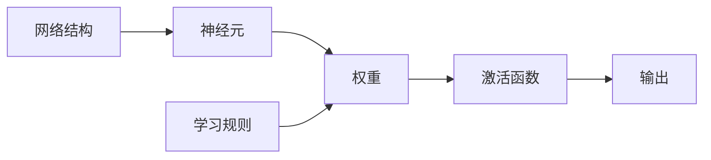

## 1.背景介绍

神经网络，这个听起来有些神秘的名字，实际上是一种模拟人脑工作机制的计算模型。它的基本组成单位是神经元，通过神经元之间的连接和信息传递，实现了一种非线性、并行且自适应的信息处理方式。神经网络在模式分类、数据挖掘、预测分析等多个领域都有广泛的应用。

## 2.核心概念与联系

神经网络的核心概念主要包括神经元、权重、激活函数、学习规则和网络结构等。神经元是神经网络的基本组成单位，每个神经元通过权重与其他神经元相连。神经元接收到的输入经过加权求和后，通过激活函数转化为输出。学习规则定义了神经网络如何通过调整权重来学习和适应环境。网络结构则决定了神经元之间的连接方式。



## 3.核心算法原理具体操作步骤

神经网络的工作过程可以分为前向传播和反向传播两个步骤。前向传播是指输入信号从输入层经过隐藏层最后到达输出层的过程，反向传播则是根据输出误差调整权重的过程。

1. **前向传播**

首先，将输入信号赋值给输入层神经元，然后通过权重将信号传递到下一层。每个神经元的输出是其所有输入的加权和经过激活函数转化后的结果。

2. **反向传播**

首先，计算输出层的误差，然后根据误差和学习规则调整输出层到隐藏层的权重。接着，计算隐藏层的误差，并调整隐藏层到输入层的权重。这个过程反复进行，直到误差满足预设的条件或达到预设的学习次数。

## 4.数学模型和公式详细讲解举例说明

神经网络的数学模型主要包括神经元模型和学习规则。

1. **神经元模型**

神经元的输出为其所有输入的加权和经过激活函数转化后的结果，可以用下面的公式表示：

$$ y = f(\sum_{i=1}^n w_i x_i) $$

其中，$x_i$ 表示第 $i$ 个输入信号，$w_i$ 表示第 $i$ 个权重，$f$ 表示激活函数。

2. **学习规则**

最常用的学习规则是梯度下降法，它的基本思想是通过沿梯度负方向调整权重来最小化误差。权重的更新公式为：

$$ w_i = w_i - \eta \frac{\partial E}{\partial w_i} $$

其中，$E$ 表示误差，$\eta$ 表示学习率。

## 5.项目实践：代码实例和详细解释说明

下面是一个使用Python的神经网络库Keras实现的神经网络分类器的简单例子：

```python
from keras.models import Sequential
from keras.layers import Dense
from keras.optimizers import SGD

# 创建模型
model = Sequential()
model.add(Dense(10, input_dim=8, activation='relu'))
model.add(Dense(1, activation='sigmoid'))

# 编译模型
model.compile(loss='binary_crossentropy', optimizer=SGD(), metrics=['accuracy'])

# 训练模型
model.fit(X_train, y_train, epochs=20, batch_size=32)

# 评估模型
loss, accuracy = model.evaluate(X_test, y_test)
print('Accuracy: %.2f' % (accuracy*100))
```

这段代码首先创建了一个神经网络模型，然后添加了一个包含10个神经元的隐藏层和一个神经元的输出层。接着，使用梯度下降法和二元交叉熵损失函数编译模型。最后，通过20个周期的训练，模型学习到了从输入到输出的映射关系。

## 6.实际应用场景

神经网络在许多领域都有广泛的应用，例如：

1. **图像识别**：神经网络可以用于识别图像中的物体、人脸、手写字符等。
2. **语音识别**：神经网络可以用于识别语音信号，实现语音到文本的转换。
3. **自然语言处理**：神经网络可以用于文本分类、情感分析、机器翻译等任务。
4. **预测分析**：神经网络可以用于股票价格预测、销售预测、天气预测等。

## 7.工具和资源推荐

神经网络的学习和实践需要一些工具和资源，下面是我个人推荐的一些：

1. **Python**：Python是一种广泛用于数据分析和机器学习的编程语言，有许多强大的库，如NumPy、Pandas、Matplotlib等。
2. **Keras**：Keras是一个基于Python的神经网络库，它提供了一种简单而快速的方式来创建神经网络模型。
3. **TensorFlow**：TensorFlow是一个强大的深度学习框架，可以用于构建和训练复杂的神经网络模型。
4. **Coursera课程**：Coursera提供了许多优质的在线课程，如吴恩达的《深度学习专项课程》等。

## 8.总结：未来发展趋势与挑战

神经网络作为人工智能的一种重要技术，其发展趋势十分明显。一方面，随着计算能力的提升和数据量的增加，神经网络的规模和复杂度将进一步提高。另一方面，神经网络的应用领域也将进一步拓展，从目前的图像识别、语音识别扩展到更多的领域。

然而，神经网络也面临一些挑战，如模型的解释性、过拟合、计算资源需求等。为了解决这些问题，我们需要不断研究和探索，推动神经网络的发展。

## 9.附录：常见问题与解答

1. **Q: 为什么神经网络可以用于分类任务？**

A: 神经网络可以学习到输入到输出的映射关系，如果输出是类别标签，那么神经网络就可以用于分类任务。

2. **Q: 神经网络的学习规则是什么？**

A: 神经网络的学习规则定义了如何通过调整权重来最小化误差。最常用的学习规则是梯度下降法。

作者：禅与计算机程序设计艺术 / Zen and the Art of Computer Programming