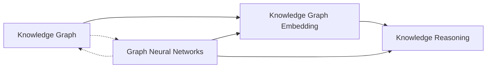

# 第三十篇：图神经网络与知识图谱：知识表示与推理

## 1. 背景介绍

### 1.1 知识图谱的兴起

近年来,随着大数据和人工智能技术的飞速发展,知识图谱(Knowledge Graph)作为一种结构化的知识表示和存储方式,受到了学术界和工业界的广泛关注。知识图谱通过对实体、属性、关系等知识进行建模,能够更好地组织、管理和利用海量、异构的知识和信息,为智能问答、推荐系统、决策支持等应用提供了重要的知识基础。

### 1.2 图神经网络的发展

与此同时,深度学习领域的图神经网络(Graph Neural Networks, GNNs)也取得了长足的进步。传统的深度学习模型如卷积神经网络(CNN)和循环神经网络(RNN)主要针对规则的网格结构数据,如图像、文本等。而现实世界中很多数据本质上是图结构的,如社交网络、分子结构、知识图谱等。图神经网络通过将深度学习与图论相结合,能够有效地学习和表示图结构数据,在节点分类、链接预测、图分类等任务上取得了优异的表现。

### 1.3 图神经网络与知识图谱的结合

图神经网络与知识图谱看似是两个不同的领域,但它们在知识表示和推理方面有着内在的联系。知识图谱作为一种结构化的知识表示,天然适合用图的方式建模。而图神经网络恰好提供了一种端到端学习图表示的有效方法。将二者结合,利用图神经网络从知识图谱中学习知识表示,并进行知识推理和补全,能够进一步提升知识图谱的质量和应用价值。本文将重点探讨图神经网络在知识图谱构建和应用中的研究进展。

## 2. 核心概念与联系

### 2.1 知识图谱

知识图谱本质上是一种语义网络,由实体(Entity)、关系(Relation)、属性(Attribute)三个基本元素组成。实体对应现实世界中的事物,关系刻画实体之间的联系,属性描述实体的特征。形式化地,知识图谱可以表示为一个三元组 $(h,r,t)$ 的集合,其中 $h,t$ 表示头实体和尾实体,$r$ 表示两个实体之间的关系。知识图谱的目标是尽可能全面、准确地描述现实世界的知识,并支持知识的检索、推理和应用。

### 2.2 图神经网络 

图神经网络是一类专门处理图结构数据的深度学习模型。与传统的神经网络不同,图神经网络通过引入图卷积(Graph Convolution)、图注意力(Graph Attention)等机制,能够有效地聚合节点的邻居信息,学习节点的embedding表示。形式化地,给定一个图 $G=(V,E)$,其中 $V$ 是节点集合,$E$ 是边集合。图神经网络的目标是学习一个映射函数 $f:V \rightarrow \mathbb{R}^d$,将每个节点映射到一个 $d$ 维的embedding向量。这个embedding向量能够很好地表示节点的特征和结构信息,可用于下游的节点分类、链接预测等任务。

### 2.3 知识表示学习

知识表示学习(Knowledge Representation Learning)是将知识图谱中的实体和关系映射到连续的低维向量空间,使得在向量空间中的语义相似度与原知识图谱中的结构相似度一致。经典的知识表示学习方法有TransE、TransR、ComplEx等,它们通过最小化三元组的得分函数,来学习实体和关系的embedding向量。这些方法一般基于简单的距离假设,如TransE假设对于一个合法的三元组 $(h,r,t)$,应有 $\mathbf{h}+\mathbf{r} \approx \mathbf{t}$。知识表示学习让后续的知识存储、推理和应用更加高效。

### 2.4 知识图谱嵌入

知识图谱嵌入(Knowledge Graph Embedding)是利用机器学习,特别是深度学习方法,从知识图谱中学习实体和关系的低维向量表示,可以看作是知识表示学习的一个分支。早期的知识图谱嵌入方法主要基于翻译模型(Translational Models),如上述的TransE系列模型。近年来,随着图神经网络的兴起,一些工作尝试利用GNN直接在知识图谱上学习实体和关系的embedding,如RGCN、CompGCN等。GNN通过聚合实体的邻居信息,能够考虑更多的结构信息,一般能取得更好的表示学习效果。

### 2.5 知识推理

知识推理(Knowledge Reasoning)是根据已知的事实和规则,推导出新的、隐含的知识的过程。在知识图谱中,知识推理主要包括链接预测(Link Prediction)和三元组分类(Triple Classification)两个任务。链接预测即根据已知的实体关系,预测缺失的实体或关系;三元组分类即判断一个三元组是否合法。传统的知识推理方法主要基于符号推理,如马尔可夫逻辑网络(MLN)。基于嵌入的方法则将推理问题转化为向量空间中的运算,如TransE通过 $\mathbf{h}+\mathbf{r} \approx \mathbf{t}$ 来打分判断三元组的合法性。近年来,一些工作尝试利用GNN进行多跳关系推理(Multi-hop Reasoning),通过在知识图谱上传播实体的embedding信息,建模复杂的推理链路。

### 2.6 知识图谱与图神经网络的关系

总的来说,知识图谱与图神经网络有以下几点密切联系:

1. 知识图谱天然是图结构数据,适合用图神经网络建模学习。

2. 图神经网络能够端到端地学习知识图谱中实体和关系的embedding表示,可以用于知识图谱嵌入。

3. 图神经网络通过聚合邻居信息,能够考虑知识图谱的多跳关系,可以用于复杂的知识推理任务。

4. 知识图谱为图神经网络提供了大规模的图结构数据,是图神经网络研究的重要应用场景之一。

下图总结了知识图谱与图神经网络的关系:

## 3. 核心算法原理与具体操作步骤

本节我们以经典的知识图谱嵌入算法TransE和知识图谱推理算法RGCN为例,介绍图神经网络在知识图谱中的核心算法原理和具体操作步骤。

### 3.1 TransE

TransE (Translating Embedding)是一种简单而有效的知识图谱嵌入算法,其核心思想是将关系看作是实体embedding空间中的平移向量。具体地,对于一个三元组 $(h,r,t)$,TransE假设 $\mathbf{h}+\mathbf{r} \approx \mathbf{t}$,即头实体embedding向量加上关系embedding向量应该尽量接近尾实体embedding向量。

TransE的目标函数定义为:

$$\mathcal{L} = \sum_{(h,r,t) \in \mathcal{T}} \sum_{(h',r,t') \in \mathcal{T}'} [\gamma + d(\mathbf{h}+\mathbf{r},\mathbf{t}) - d(\mathbf{h'}+\mathbf{r},\mathbf{t'})]_+$$

其中,$\mathcal{T}$ 是训练集中所有正例三元组的集合,$\mathcal{T}'$ 是通过随机替换头实体或尾实体得到的负例三元组集合,$\gamma$ 是超参数,表示正负样本之间的间隔,$d$ 是embedding空间中的距离函数,一般取L1或L2距离。$[\cdot]_+$ 表示取正部。直观地,该目标函数希望正例三元组的距离尽量小,负例三元组的距离尽量大。

TransE的具体训练过程如下:

1. 随机初始化所有实体和关系的embedding向量。

2. 对于每个正例三元组 $(h,r,t)$,通过随机替换头实体或尾实体构造对应的负例三元组 $(h',r,t')$。

3. 计算正例和负例的距离 $d(\mathbf{h}+\mathbf{r},\mathbf{t})$ 和 $d(\mathbf{h'}+\mathbf{r},\mathbf{t'})$。

4. 计算损失函数 $\mathcal{L}$,并通过梯度下降法更新实体和关系的embedding向量。

5. 重复步骤2-4,直到模型收敛或达到预设的迭代次数。

训练完成后,我们就得到了所有实体和关系的embedding向量。对于链接预测任务,我们可以用 $\mathbf{h}+\mathbf{r}$ 来预测缺失的尾实体,选择距离最近的实体作为答案。对于三元组分类任务,我们可以计算 $d(\mathbf{h}+\mathbf{r},\mathbf{t})$,当距离小于某个阈值时判断三元组合法,否则判断不合法。

### 3.2 RGCN

RGCN (Relational Graph Convolutional Networks)是一种基于图卷积的知识图谱推理算法,能够在知识图谱上直接学习实体和关系的embedding表示,并支持多跳关系推理。

具体地,给定一个知识图谱 $\mathcal{G}=\{(e_i,r_k,e_j)\}$,其中 $e_i, e_j \in \mathcal{E}$ 表示实体,$r_k \in \mathcal{R}$ 表示关系。RGCN的核心思想是通过聚合实体的邻居信息来更新实体的表示。设第 $l$ 层实体 $e_i$ 的表示为 $\mathbf{h}_i^{(l)}$,则第 $l+1$ 层的表示通过如下方式更新:

$$\mathbf{h}_i^{(l+1)} = \sigma(\sum_{r \in \mathcal{R}} \sum_{j \in \mathcal{N}_i^r} \frac{1}{c_{i,r}} \mathbf{W}_r^{(l)} \mathbf{h}_j^{(l)} + \mathbf{W}_0^{(l)} \mathbf{h}_i^{(l)})$$

其中,$\mathcal{N}_i^r$ 表示与实体 $e_i$ 通过关系 $r$ 相连的邻居实体集合,$c_{i,r}$ 是对应的归一化常数,$\mathbf{W}_r^{(l)}$ 是关系 $r$ 的转换矩阵,$\mathbf{W}_0^{(l)}$ 是自连接的转换矩阵,$\sigma$ 是激活函数,如ReLU。直观地,该更新公式将实体 $e_i$ 通过不同关系 $r$ 相连的邻居信息进行聚合,得到新一层的表示。

RGCN的具体训练过程如下:

1. 随机初始化所有实体的embedding向量 $\mathbf{h}_i^{(0)}$,以及各层的关系转换矩阵 $\mathbf{W}_r^{(l)}$。

2. 对于每一层 $l=0,1,\dots,L-1$:
   
   a. 对于每个实体 $e_i$,根据上述更新公式计算 $\mathbf{h}_i^{(l+1)}$。
   
   b. 将所有实体的embedding向量 $\mathbf{h}_i^{(l+1)}$ 作为下一层的输入。

3. 在最后一层的实体embedding $\mathbf{h}_i^{(L)}$ 上添加分类器,如sigmoid函数,预测三元组 $(e_i,r_k,e_j)$ 的合法性。

4. 计算二元交叉熵损失函数,并通过梯度下降法更新模型参数。

5. 重复步骤2-4,直到模型收敛或达到预设的迭代次数。

训练完成后,我们就得到了所有实体的embedding向量 $\mathbf{h}_i^{(L)}$,以及各层的关系转换矩阵 $\mathbf{W}_r^{(l)}$。对于链接预测任务,我们可以用实体的embedding向量作为输入,通过多层RGCN传播,预测另一个实体。对于三元组分类任