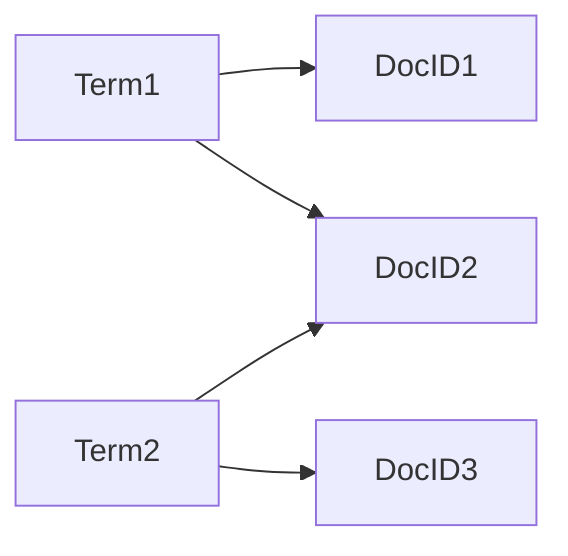

# 第十五篇：构建自己的全文搜索引擎：从零开始打造搜索利器

## 1.背景介绍

在当今信息爆炸的时代,搜索引擎已经成为人们获取信息的重要工具。无论是在互联网上还是在企业内部,高效、准确的搜索能力都是至关重要的。本文将带领读者从零开始,一步步构建属于自己的全文搜索引擎,掌握搜索引擎的核心原理和实现技术。

### 1.1 全文搜索引擎概述
#### 1.1.1 什么是全文搜索  
全文搜索是指在一个数据集合中搜索某个关键词,并找出所有包含该关键词的文本。与常规的数据库查询不同,全文搜索会根据关键词的相关性和重要性对结果进行排序。

#### 1.1.2 全文搜索引擎的应用场景
全文搜索引擎广泛应用于各个领域,例如:
- 互联网搜索:如Google、百度等搜索引擎
- 企业内部搜索:文档管理系统、知识库等  
- 电商搜索:商品搜索、推荐系统等
- 社交媒体搜索:微博、Twitter等平台的内容搜索

### 1.2 构建全文搜索引擎的挑战
构建一个高效、准确的全文搜索引擎面临许多挑战:
- 海量数据的存储和索引
- 搜索结果的相关性排序  
- 实时更新索引
- 分布式架构设计
- 多语言支持

本文将逐一解决这些挑战,带你掌握构建现代搜索引擎的关键技术。

## 2.核心概念与联系

要构建一个全文搜索引擎,首先需要了解几个核心概念:

### 2.1 倒排索引
倒排索引(Inverted Index)是搜索引擎的核心数据结构。它将文档中的词语映射到包含它们的文档,使得可以根据关键词快速找到相关文档。

#### 2.1.1 术语(Term)
术语是构成倒排索引的基本单位,通常是一个词语。

#### 2.1.2 文档(Document)  
文档指要被搜索的对象,可以是网页、文本文件等。每个文档都有唯一的编号(DocID)。

#### 2.1.3 倒排表(Posting List)
倒排表记录了每个术语出现在哪些文档中。它由一系列文档编号(DocID)组成。

倒排索引的结构如下:



### 2.2 文本分析
将文本转化为倒排索引需要经过一系列文本分析步骤:

#### 2.2.1 分词(Tokenization)
将文本按照一定规则切分成词语。英文可以按照空格和标点符号分词,中文需要用分词算法。

#### 2.2.2 词干提取(Stemming)和词形还原(Lemmatization) 
将词语规范化为基本形式。如将"reading"转为"read",将"mice"转为"mouse"。

#### 2.2.3 停用词过滤(Stop Words Filtering)
过滤掉常见的无意义词语,如"the"、"a"等。

### 2.3 相关性评分 
搜索结果需要按照与查询的相关性排序。常见的相关性评分模型有:

#### 2.3.1 TF-IDF
TF(Term Frequency)衡量词语在文档中的频率,IDF(Inverse Document Frequency)衡量词语的稀有程度。TF-IDF score = TF * IDF

#### 2.3.2 BM25 
基于概率的相关性评分模型,考虑了文档长度对相关性的影响。

## 3.核心算法原理具体操作步骤

构建全文搜索引擎主要分为两个阶段:索引阶段和搜索阶段。

### 3.1 索引阶段
#### 3.1.1 文档解析
将原始文档解析为纯文本,提取出标题、正文等字段。

#### 3.1.2 文本分析  
对提取的文本进行分词、词干化、去除停用词等处理。

#### 3.1.3 倒排索引构建
遍历所有词语,构建<term, posting list>的倒排索引结构。

### 3.2 搜索阶段  
#### 3.2.1 查询解析
对用户输入的查询进行文本分析,提取搜索关键词。

#### 3.2.2 检索
在倒排索引中查找关键词,获得包含该词的文档列表。

#### 3.2.3 相关性评分和排序
对候选文档进行相关性评分,如TF-IDF或BM25,然后按评分排序。

#### 3.2.4 结果展示
将排序后的搜索结果呈现给用户,通常包含文档标题、摘要等信息。

## 4.数学模型和公式详细讲解举例说明

### 4.1 TF-IDF模型
TF-IDF是一种常用的相关性评分模型。它的数学定义如下:

对于词语t和文档d,TF-IDF得分为:
$score(t,d) = tf(t,d) * idf(t)$

其中,
- $tf(t,d)$表示词频(Term Frequency),即t在d中出现的次数。
- $idf(t)$表示逆文档频率(Inverse Document Frequency),用于衡量词语t的稀有程度:

$$idf(t) = log(\frac{N}{df(t)} + 1)$$

其中,$N$为文档总数,$df(t)$为包含t的文档数。

举例说明:
假设有3个文档:
- d1: "This is a sample"  
- d2: "This is another example"
- d3: "One more sample"

对于词语"sample",有:
- $tf("sample", d1) = 1$
- $tf("sample", d2) = 0$  
- $tf("sample", d3) = 1$
- $df("sample") = 2$
- $N = 3$

因此,
$idf("sample") = log(\frac{3}{2} + 1) = 0.405$

最终"sample"对每个文档的TF-IDF评分为:
- d1: $1 * 0.405 = 0.405$
- d2: $0 * 0.405 = 0$
- d3: $1 * 0.405 = 0.405$

可见TF-IDF能有效地衡量词语对文档的重要性。

## 5.项目实践：代码实例和详细解释说明

下面我们用Python实现一个简单的全文搜索引擎。

### 5.1 索引阶段

```python
import jieba
from collections import defaultdict

class SearchEngine:
    def __init__(self):
        self.inverted_index = defaultdict(list)
        self.documents = {}
        self.doc_id = 0

    def add_document(self, doc):
        self.documents[self.doc_id] = doc
        terms = jieba.lcut_for_search(doc)
        for term in terms:
            self.inverted_index[term].append(self.doc_id)
        self.doc_id += 1
```

- 使用`jieba`库进行中文分词
- `inverted_index`用字典实现,key为词语,value为包含该词的文档ID列表
- `documents`记录文档ID到原文档的映射

### 5.2 搜索阶段

```python
def search(self, query):
    terms = jieba.lcut_for_search(query)
    result = None
    for term in terms:
        if result is None:
            result = set(self.inverted_index[term])
        else:
            result = result & set(self.inverted_index[term])
    return [self.documents[doc_id] for doc_id in result]
```

- 对查询进行分词  
- 求所有关键词对应