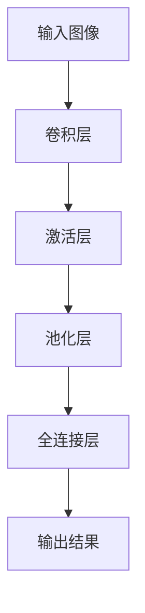

# 第十章：未来展望：CNN发展趋势与挑战

## 1.背景介绍
### 1.1 CNN的发展历程回顾
### 1.2 CNN在各领域取得的突破性进展
### 1.3 CNN未来发展的重要意义

## 2.核心概念与联系
### 2.1 CNN与传统机器学习方法的区别
### 2.2 CNN与其他深度学习模型的联系与区别
### 2.3 CNN在计算机视觉、自然语言处理等领域的核心作用

## 3.核心算法原理具体操作步骤
### 3.1 卷积层的计算过程与参数优化
### 3.2 池化层的作用与常用池化方式
### 3.3 全连接层的功能与训练技巧
### 3.4 CNN模型的前向传播与反向传播算法

## 4.数学模型和公式详细讲解举例说明
### 4.1 卷积操作的数学表示与计算方法
### 4.2 池化操作的数学原理与实现细节
### 4.3 损失函数与优化器的数学推导
### 4.4 CNN模型的数学矩阵表示与计算图

## 5.项目实践：代码实例和详细解释说明
### 5.1 使用Python和TensorFlow实现简单CNN模型
### 5.2 图像分类任务的CNN模型设计与训练
### 5.3 目标检测任务的CNN模型结构与优化
### 5.4 CNN在自然语言处理中的应用实例

## 6.实际应用场景
### 6.1 CNN在医学影像分析中的应用
### 6.2 CNN在智能安防与视频监控中的应用
### 6.3 CNN在无人驾驶与智能交通中的应用
### 6.4 CNN在工业缺陷检测与质量控制中的应用

## 7.工具和资源推荐 
### 7.1 主流深度学习框架对CNN的支持与优化
### 7.2 CNN模型设计与训练的开源工具与库
### 7.3 CNN相关的数据集与竞赛平台
### 7.4 CNN领域的经典论文与学习资源

## 8.总结：未来发展趋势与挑战
### 8.1 CNN模型的轻量化与模型压缩技术
### 8.2 CNN与注意力机制、生成对抗网络等新兴技术的结合
### 8.3 CNN在更多领域的拓展应用与创新
### 8.4 CNN面临的数据质量、可解释性等挑战

## 9.附录：常见问题与解答
### 9.1 如何选择CNN模型的超参数？
### 9.2 如何解决CNN模型的过拟合问题？
### 9.3 如何提高CNN模型的泛化能力？
### 9.4 如何平衡CNN模型的精度与速度？

卷积神经网络（CNN）自上世纪90年代提出以来，经历了从理论研究到实际应用的漫长历程。近年来，随着深度学习的蓬勃发展，CNN在计算机视觉、自然语言处理等领域取得了一系列突破性进展，成为当前人工智能领域最为瞩目的技术之一。展望未来，CNN技术仍有广阔的发展空间和应用前景，同时也面临着诸多挑战。

CNN区别于传统机器学习方法的核心在于其独特的网络结构设计。通过卷积层实现局部连接和权重共享，大大减少了参数量；通过池化层实现特征降维和旋转不变性；通过全连接层实现特征组合和分类决策。这种层次化的网络结构使得CNN能够自动学习和提取图像、文本等数据中的高层语义特征，克服了人工特征工程的局限性。

从算法原理上看，CNN的核心是卷积和池化操作。卷积操作可以看作是一种特殊的线性变换，将输入数据与卷积核进行逐元素相乘再求和，得到输出特征图。常见的卷积类型包括2D卷积、3D卷积、转置卷积、空洞卷积等。池化操作则是一种降采样方法，通过取区域内的最大值或平均值，实现特征图尺寸的缩小。常用的池化方式包括最大池化和平均池化。在数学上，卷积和池化可以用矩阵乘法和张量运算来表示和实现。

设计和训练一个CNN模型需要考虑诸多因素，如网络层数和宽度、卷积核大小和步长、池化方式和尺度、激活函数选择、正则化和dropout技巧等。此外，还需要选择合适的损失函数和优化算法，如交叉熵损失、均方误差损失、SGD、Adam等。CNN的训练过程通常包括前向传播和反向传播两个阶段，前者计算损失函数，后者计算梯度并更新参数。借助TensorFlow、PyTorch等深度学习框架，可以方便地搭建和训练CNN模型。

CNN在图像分类、目标检测、语义分割、人脸识别等计算机视觉任务中得到了广泛应用。一些经典的CNN模型如LeNet、AlexNet、VGGNet、GoogLeNet、ResNet等，在ImageNet等大型数据集上取得了出色的性能，并催生了一大批衍生模型。CNN还被用于文本分类、情感分析、机器翻译等自然语言处理任务，以及语音识别、推荐系统等其他领域。在工业界，CNN已经成为自动驾驶、安防监控、医疗诊断、缺陷检测等应用场景的核心技术之一。

未来，CNN技术的发展趋势主要体现在以下几个方面：一是模型轻量化，通过剪枝、量化、知识蒸馏等方法压缩模型体积，提高推理速度；二是与其他技术的结合，如注意力机制可以引导CNN关注到图像的关键区域，生成对抗网络可以扩充训练数据、提高模型鲁棒性；三是拓展应用场景，如将CNN用于3D点云分类、视频理解、医学影像分析等新领域。

当然，CNN的发展也面临着一些挑战：海量训练数据的获取和标注成本高昂，模型可解释性差、泛化能力不足，算法的公平性和隐私性有待加强，等等。这需要研究者们在算法创新、理论分析、应用实践等方面持续努力。

总之，CNN作为深度学习的代表性技术，已经在学术界和工业界掀起了一股研究热潮。展望未来，CNN技术必将在更广阔的领域大放异彩，为人工智能的发展注入新的活力。让我们拭目以待！

作者：禅与计算机程序设计艺术 / Zen and the Art of Computer Programming