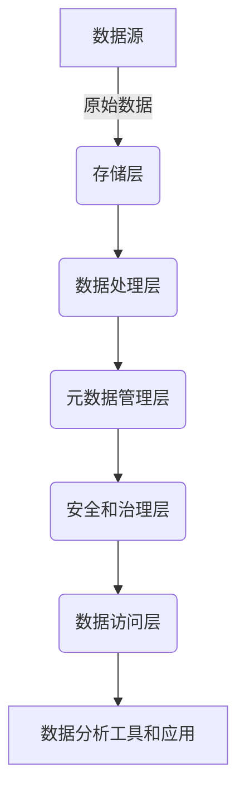

# 第四十三章：数据湖技术发展趋势

## 1.背景介绍

### 1.1 数据湖的兴起

随着大数据时代的到来,传统的数据仓库架构面临着诸多挑战。数据种类和数据量的快速增长,以及对于实时数据处理和分析的需求,推动了数据湖概念的出现。数据湖提供了一种更加灵活、可扩展的数据存储和管理方式,旨在解决数据仓库在处理海量多样化数据时遇到的瓶颈。

### 1.2 数据湖的定义

数据湖是一种用于存储各种类型数据(结构化、半结构化和非结构化)的集中式存储库,这些数据以原始格式进行存储,无需事先进行结构化。数据湖允许组织以低成本方式存储大量数据,并在需要时再对数据进行处理和分析。

## 2.核心概念与联系

### 2.1 数据湖与数据仓库的区别

数据仓库是一种基于主题的、集成的、相对静态的数据集合,用于支持管理决策。数据仓库中的数据通常经过了清理、转换和加载(ETL)过程,符合预定义的模式。相比之下,数据湖存储原始数据,无需事先进行模式定义,提供了更大的灵活性。

### 2.2 数据湖架构

数据湖架构通常包括以下几个核心组件:

- **存储层**: 用于存储原始数据,通常使用分布式文件系统(如HDFS)或对象存储(如AWS S3)。
- **数据处理层**: 用于处理和转换数据,常用的技术包括Apache Spark、Apache Hive和Apache Impala。
- **元数据管理层**: 用于管理和组织数据湖中的元数据,方便数据发现和访问。
- **安全和治理层**: 用于确保数据安全性和合规性,包括访问控制、数据加密和审计等功能。
- **数据访问层**: 提供数据访问接口,支持各种数据分析工具和应用程序。



### 2.3 数据湖的优势

相比传统数据仓库,数据湖具有以下优势:

- **存储成本低**: 原始数据可以直接存储,无需昂贵的ETL过程。
- **灵活性强**: 可以存储任何类型的数据,无需预先定义模式。
- **支持多种工作负载**: 数据湖可用于批处理、实时流处理和交互式分析等多种工作负载。
- **支持数据探索**: 原始数据的保留有利于数据发现和新业务需求的支持。

## 3.核心算法原理具体操作步骤

### 3.1 数据摄取

数据摄取是将数据从各种源系统引入数据湖的过程。常见的数据摄取方式包括:

1. **批量摄取**: 使用ETL工具(如Apache NiFi)或自定义脚本,定期从源系统提取数据,并加载到数据湖中。
2. **实时摄取**: 使用流处理框架(如Apache Kafka)或消息队列,实时从源系统接收数据,并持续加载到数据湖中。

### 3.2 数据存储

数据湖通常使用分布式文件系统(如HDFS)或对象存储(如AWS S3)来存储原始数据。常见的数据格式包括:

- **文本格式**: CSV、JSON、XML等。
- **列式存储格式**: Apache Parquet、Apache ORC等。
- **行式存储格式**: Apache Avro等。

### 3.3 数据处理

数据处理是将原始数据转换为可用于分析的结构化格式。常见的数据处理框架包括:

- **Apache Spark**: 用于批处理、流处理和机器学习。
- **Apache Hive**: 用于基于SQL的批处理查询。
- **Apache Impala**: 用于交互式SQL查询。

数据处理通常涉及以下步骤:

1. **数据提取**: 从数据湖中读取原始数据。
2. **数据转换**: 执行清理、过滤、聚合等转换操作。
3. **数据加载**: 将转换后的数据加载到结构化数据存储(如Apache Hive表)中,供分析使用。

### 3.4 数据分析

数据分析是从处理后的数据中提取洞见和价值。常见的数据分析工具包括:

- **商业智能(BI)工具**: 如Tableau、Power BI等,用于构建报表和仪表板。
- **数据科学工具**: 如Jupyter Notebook、Apache Zeppelin等,用于机器学习和高级分析。

## 4.数学模型和公式详细讲解举例说明

在数据湖中,常见的数学模型和公式包括:

### 4.1 数据压缩算法

为了优化存储空间和I/O性能,数据湖中的数据通常会进行压缩。常见的压缩算法包括:

1. **熵编码**: 例如Huffman编码和算术编码,基于数据中字符或符号的出现频率进行编码。

$$
L(D) = -\sum_{i=1}^{n} P(x_i) \log_2 P(x_i)
$$

其中,$$L(D)$$表示数据$$D$$的熵,$$P(x_i)$$表示符号$$x_i$$出现的概率。

2. **字典编码**: 例如LZW算法,通过构建字典表来编码重复出现的数据模式。

3. **列式存储**: 例如Apache Parquet和Apache ORC,通过对列数据进行编码和压缩来优化存储和查询性能。

### 4.2 数据分区策略

为了提高查询效率,数据湖中的数据通常会根据特定策略进行分区。常见的分区策略包括:

1. **范围分区**: 根据数据值的范围进行分区,例如按日期或数值范围分区。
2. **哈希分区**: 根据数据值的哈希值进行分区,可以实现更均匀的数据分布。
3. **列分区**: 根据特定列的值进行分区,适用于需要频繁过滤特定列的场景。

### 4.3 数据采样算法

在进行数据探索和模型训练时,常常需要从大规模数据集中抽取一个代表性的子集。常见的数据采样算法包括:

1. **简单随机采样**: 每个样本被选中的概率相等。

$$
P(x_i) = \frac{1}{N}
$$

其中,$$N$$表示总体样本数。

2. **分层采样**: 根据某些特征将总体划分为不同层,然后在每层内进行简单随机采样。
3. **系统采样**: 从总体中按固定步长选取样本,例如每隔$$k$$个样本选取一个。

### 4.4 数据去重算法

在数据湖中,可能会存在重复数据,需要进行去重处理。常见的去重算法包括:

1. **基于哈希的去重**: 计算每条记录的哈希值,将相同哈希值的记录视为重复记录。
2. **基于排序的去重**: 先对记录进行排序,然后扫描一次即可识别出相邻的重复记录。
3. **基于窗口的去重**: 使用滑动窗口,将落入同一窗口的记录视为重复记录。

## 5.项目实践:代码实例和详细解释说明

以下是一个使用Apache Spark进行数据湖处理的示例:

### 5.1 数据摄取

```python
# 从CSV文件中读取数据
data = spark.read.csv("hdfs://namenode:8020/data/sales.csv", header=True, inferSchema=True)
```

### 5.2 数据转换

```python
# 选择需要的列
selected_data = data.select("product_id", "sale_date", "sale_amount")

# 过滤出特定日期范围的记录
filtered_data = selected_data.filter("sale_date >= '2022-01-01' AND sale_date <= '2022-03-31'")

# 按产品ID和日期进行分组,计算每天每个产品的销售总额
aggregated_data = filtered_data.groupBy("product_id", "sale_date").sum("sale_amount")
```

### 5.3 数据存储

```python
# 将聚合后的数据存储为Parquet格式
aggregated_data.write.mode("overwrite").parquet("hdfs://namenode:8020/data/sales_aggregated")
```

### 5.4 数据分析

```python
# 使用Spark SQL进行交互式查询
spark.sql("""
    SELECT product_id, sale_date, sum(sale_amount) as total_sales
    FROM sales_aggregated
    GROUP BY product_id, sale_date
    ORDER BY total_sales DESC
    LIMIT 10
""").show()
```

上述示例展示了如何使用Apache Spark从CSV文件中读取数据,进行转换(选择列、过滤和聚合),并将结果存储为Parquet格式。最后,我们使用Spark SQL进行交互式查询,查找销售额最高的前10个产品和日期组合。

## 6.实际应用场景

数据湖技术在各个行业都有广泛的应用场景,包括但不限于:

### 6.1 金融服务

- 风险管理和合规性分析
- 客户行为分析和个性化营销
- 欺诈检测和反洗钱

### 6.2 制造业

- 预测性维护和设备监控
- 供应链优化和库存管理
- 产品质量控制和缺陷分析

### 6.3 医疗健康

- 临床数据分析和疾病预测
- 基因组学和生物信息学研究
- 药物发现和临床试验管理

### 6.4 零售和电子商务

- 客户行为分析和个性化推荐
- 定价优化和促销策略
- 供应链和物流优化

### 6.5 物联网和智能城市

- 传感器数据处理和实时监控
- 交通管理和路径优化
- 能源使用优化和环境监测

## 7.工具和资源推荐

### 7.1 开源工具

- **Apache Hadoop**: 分布式存储和计算框架,包括HDFS和MapReduce等组件。
- **Apache Spark**: 用于大数据处理的统一分析引擎,支持批处理、流处理和机器学习。
- **Apache Hive**: 基于SQL的数据仓库工具,用于在Hadoop上进行数据摘要、查询和分析。
- **Apache Kafka**: 分布式流处理平台,用于实时数据管道和流处理应用。
- **Apache NiFi**: 数据流管理和集成工具,用于自动化数据流程。

### 7.2 商业工具

- **Amazon Web Services (AWS)**: 提供多种数据湖相关服务,如S3、Athena、EMR和Glue。
- **Microsoft Azure**: 提供Azure Data Lake Storage和Azure Databricks等服务。
- **Google Cloud Platform (GCP)**: 提供Cloud Storage、Dataproc和Dataflow等服务。
- **Cloudera**: 提供基于Apache Hadoop的企业级大数据平台。
- **Databricks**: 提供基于Apache Spark的统一数据分析平台。

### 7.3 在线资源

- **数据湖指南**: https://data-lakes.com/
- **数据湖学院**: https://datalakeacademy.com/
- **Apache Hadoop官网**: https://hadoop.apache.org/
- **Apache Spark官网**: https://spark.apache.org/
- **Apache Kafka官网**: https://kafka.apache.org/

## 8.总结:未来发展趋势与挑战

### 8.1 发展趋势

1. **云原生数据湖**: 利用云服务提供商的托管服务,构建更加灵活和可扩展的数据湖解决方案。
2. **数据湖和数据仓库融合**: 数据湖和数据仓库将逐渐融合,形成统一的数据平台。
3. **实时数据处理和分析**: 对实时数据的需求将继续增长,推动流处理和实时分析技术的发展。
4. **机器学习和人工智能**: 数据湖将成为机器学习和人工智能应用的重要数据源。
5. **元数据管理和数据治理**: 随着数据量和复杂度的增加,元数据管理和数据治理将变得越来越重要。

### 8.2 挑战

1. **数据安全和隐私**: 确保数据湖中的数据安全性和隐私保护是一个持续的挑战。
2. **数据质量和可信度**: 原始数据的质量和可信度可能存在问题,需要进行有效的数据质量管理。
3. **技能短缺**: 缺乏