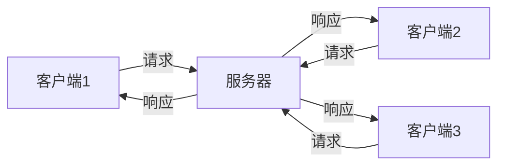
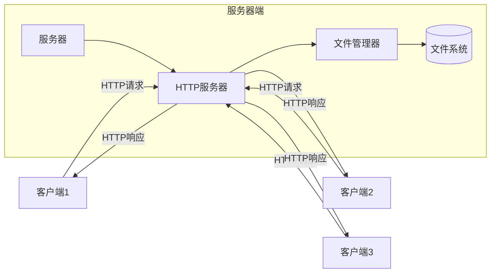

# 简易网络存储系统详细设计与具体代码实现

## 1.背景介绍

### 1.1 网络存储系统概述

在当今信息时代,数据量呈现出爆炸式增长,对存储系统的需求也与日俱增。网络存储系统作为一种高效、可扩展的存储解决方案,广泛应用于各个领域。它将存储资源集中在网络中,为多个客户端提供数据存储和访问服务,实现了数据共享和集中管理。

### 1.2 网络存储系统的优势

相较于传统的本地存储方式,网络存储系统具有以下优势:

1. **数据共享**: 多个客户端可以共享同一个存储空间,方便数据交换和协作。

2. **集中管理**: 存储资源集中在服务器端,便于统一管理和维护。

3. **高可用性**: 通过冗余和负载均衡技术,提高系统的可靠性和可用性。

4. **可扩展性**: 存储容量可根据需求动态扩展,满足不断增长的存储需求。

5. **数据安全性**: 采用访问控制和数据加密等机制,保护数据的安全和隐私。

### 1.3 简易网络存储系统的需求

本文将设计并实现一个简易的网络存储系统,它具有以下基本功能:

1. 客户端可以向服务器上传文件。
2. 客户端可以从服务器下载文件。
3. 客户端可以查看服务器上的文件列表。
4. 支持多客户端并发访问。
5. 具有基本的文件权限管理功能。

该系统虽然简单,但涵盖了网络存储系统的核心概念和技术,可作为进一步学习和扩展的基础。

## 2.核心概念与联系

### 2.1 客户端-服务器架构

网络存储系统通常采用客户端-服务器(Client-Server)架构,如下图所示:



客户端发送请求(如上传、下载、查看文件列表等)到服务器,服务器处理请求并返回响应。这种架构将存储资源集中在服务器端,实现了数据共享和集中管理。

### 2.2 文件传输协议

为了实现文件的上传和下载,需要采用合适的文件传输协议。常见的协议包括:

1. **FTP(File Transfer Protocol)**: 早期广泛使用的文件传输协议,基于TCP/IP协议栈。

2. **HTTP(Hypertext Transfer Protocol)**: 万维网的数据通信基础,常用于文件下载。

3. **SMB(Server Message Block)**: 微软开发的网络文件共享协议,用于Windows文件共享。

4. **NFS(Network File System)**: 一种分布式文件系统协议,允许不同系统之间共享文件。

在本文中,我们将采用HTTP协议来实现文件的上传和下载,因为它简单、高效且被广泛支持。

### 2.3 文件权限管理

为了保护数据的安全性和隐私性,网络存储系统需要实现文件权限管理功能。常见的权限管理模型包括:

1. **用户-文件权限模型**: 为每个用户和文件分配不同的权限,如读、写、执行等。

2. **角色-文件权限模型**: 将用户分配到不同的角色,每个角色对应一组文件权限。

3. **访问控制列表(ACL)**: 为每个文件维护一个访问控制列表,列出具有不同权限的用户或组。

在本文中,我们将采用简单的用户-文件权限模型,为每个用户分配对文件的读写权限。

## 3.核心算法原理具体操作步骤

### 3.1 文件上传算法

文件上传的核心算法步骤如下:

1. 客户端向服务器发送文件上传请求,包括文件名、文件大小等元数据。
2. 服务器检查用户权限,如果有写权限,则分配一个临时文件路径,并返回给客户端。
3. 客户端将文件数据分块发送到服务器的临时文件路径。
4. 服务器接收数据块,并写入临时文件。
5. 客户端发送文件上传完成信号。
6. 服务器将临时文件重命名为正式文件名,上传过程完成。

该算法采用分块传输的方式,可以有效支持大文件的上传,并提高传输效率。

### 3.2 文件下载算法

文件下载的核心算法步骤如下:

1. 客户端向服务器发送文件下载请求,包括文件名。
2. 服务器检查用户权限,如果有读权限,则打开文件进行读取。
3. 服务器将文件数据分块发送给客户端。
4. 客户端接收数据块,并写入本地文件。
5. 服务器发送文件下载完成信号。
6. 客户端关闭本地文件,下载过程完成。

与上传算法类似,下载算法也采用分块传输的方式,可以支持大文件的下载,并提高传输效率。

### 3.3 文件列表查看算法

文件列表查看的核心算法步骤如下:

1. 客户端向服务器发送查看文件列表请求。
2. 服务器检查用户权限,如果有读权限,则遍历服务器文件系统。
3. 服务器将文件列表信息(文件名、大小、修改时间等)发送给客户端。
4. 客户端接收并显示文件列表信息。

该算法需要服务器端遍历文件系统,获取文件元数据信息,然后发送给客户端进行展示。

### 3.4 并发控制算法

为了支持多客户端并发访问,需要采用合适的并发控制算法,防止数据竞争和不一致问题。常见的并发控制算法包括:

1. **互斥锁(Mutex)**: 确保同一时间只有一个线程可以访问共享资源。
2. **读写锁(Read-Write Lock)**: 允许多个读线程同时访问,但写线程必须独占资源。
3. **信号量(Semaphore)**: 控制同时访问共享资源的线程数量。
4. **条件变量(Condition Variable)**: 用于线程间的通信和同步。

在本文中,我们将采用读写锁算法来控制对文件的并发访问。读锁可以被多个读线程共享,而写锁必须独占,以保证文件数据的一致性。

## 4.数学模型和公式详细讲解举例说明

### 4.1 文件传输效率模型

在文件传输过程中,传输效率是一个重要的指标。我们可以使用以下公式来计算文件传输效率:

$$
E = \frac{F}{T}
$$

其中:
- $E$ 表示文件传输效率,单位为字节/秒(B/s)
- $F$ 表示文件大小,单位为字节(B)
- $T$ 表示传输时间,单位为秒(s)

例如,如果一个100MB的文件在10秒内传输完成,则传输效率为:

$$
E = \frac{100 \times 10^6}{10} = 10^7 \text{B/s} = 10 \text{MB/s}
$$

传输效率越高,文件传输速度就越快。

### 4.2 并发访问模型

在多客户端并发访问场景下,我们需要控制对共享资源(如文件)的访问,以避免数据竞争和不一致问题。假设有 $N$ 个客户端同时访问一个文件,其中 $R$ 个客户端为读操作, $W$ 个客户端为写操作,且 $R + W = N$。

根据读写锁算法,我们可以建立以下数学模型:

$$
\begin{cases}
R > 0 \Rightarrow W = 0 \\
W > 0 \Rightarrow R = 0
\end{cases}
$$

即当有读线程访问时,写线程必须等待;当有写线程访问时,读线程也必须等待。这样可以保证文件数据的一致性和完整性。

## 5.项目实践:代码实例和详细解释说明

### 5.1 系统架构

我们将使用Python语言实现一个简易的网络存储系统,其架构如下图所示:



服务器端包括以下主要组件:

1. **HTTP服务器**: 基于Python的`http.server`模块,用于处理客户端的HTTP请求和响应。
2. **文件管理器**: 实现文件上传、下载、列表查看等功能,并进行权限管理。
3. **文件系统**: 存储实际的文件数据,可以是本地文件系统或网络文件系统。

客户端通过HTTP协议与服务器端进行交互,发送文件操作请求,服务器端处理请求并返回响应。

### 5.2 代码实现

#### 5.2.1 HTTP服务器

我们基于Python的`http.server`模块实现一个简单的HTTP服务器,用于处理客户端请求。

```python
import http.server
import socketserver

class FileTransferHandler(http.server.BaseHTTPRequestHandler):
    def do_GET(self):
        # 处理GET请求(文件下载、列表查看)
        pass

    def do_POST(self):
        # 处理POST请求(文件上传)
        pass

PORT = 8000
httpd = socketserver.TCPServer(('', PORT), FileTransferHandler)
print(f'服务器启动,监听端口 {PORT}')
httpd.serve_forever()
```

`FileTransferHandler`类继承自`BaseHTTPRequestHandler`,用于处理具体的HTTP请求。我们需要实现`do_GET`和`do_POST`方法,分别处理GET请求(文件下载、列表查看)和POST请求(文件上传)。

#### 5.2.2 文件管理器

文件管理器负责实现文件上传、下载、列表查看等功能,以及权限管理。

```python
import os
import threading

class FileManager:
    def __init__(self, root_dir):
        self.root_dir = root_dir
        self.lock = threading.RWLock()

    def upload_file(self, user, filename, filedata):
        # 检查用户权限
        if not self.has_write_permission(user, filename):
            return False

        # 获取写锁
        with self.lock.write_lock():
            filepath = os.path.join(self.root_dir, filename)
            with open(filepath, 'wb') as f:
                f.write(filedata)

        return True

    def download_file(self, user, filename):
        # 检查用户权限
        if not self.has_read_permission(user, filename):
            return None

        # 获取读锁
        with self.lock.read_lock():
            filepath = os.path.join(self.root_dir, filename)
            with open(filepath, 'rb') as f:
                filedata = f.read()

        return filedata

    def list_files(self, user):
        # 获取读锁
        with self.lock.read_lock():
            files = os.listdir(self.root_dir)
            # 过滤无权限的文件
            files = [f for f in files if self.has_read_permission(user, f)]

        return files

    def has_read_permission(self, user, filename):
        # 实现读权限检查逻辑
        return True

    def has_write_permission(self, user, filename):
        # 实现写权限检查逻辑
        return True
```

`FileManager`类包含以下主要方法:

1. `upload_file(user, filename, filedata)`: 上传文件,首先检查用户写权限,然后获取写锁并将文件数据写入文件系统。
2. `download_file(user, filename)`: 下载文件,首先检查用户读权限,然后获取读锁并读取文件数据。
3. `list_files(user)`: 列出文件列表,获取读锁并遍历文件系统,过滤无权限的文件。
4. `has_read_permission(user, filename)`: 检查用户对文件的读权限。
5. `has_write_permission(user, filename)`: 检查用户对文件的写权限。

在实现中,我们使用`