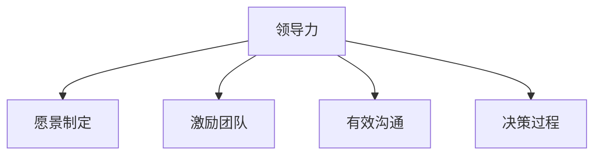
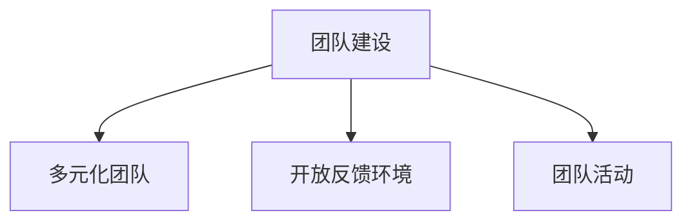
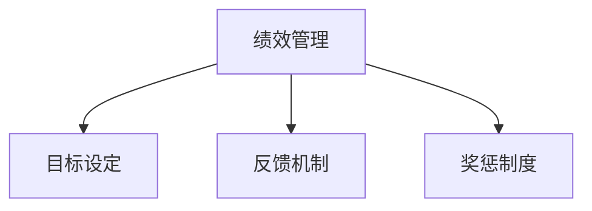
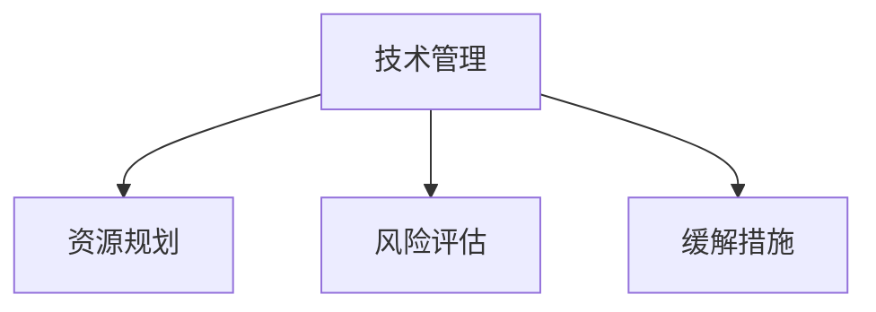
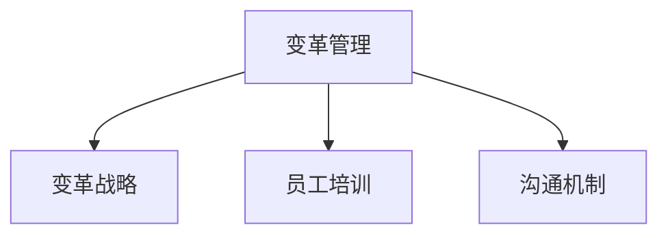
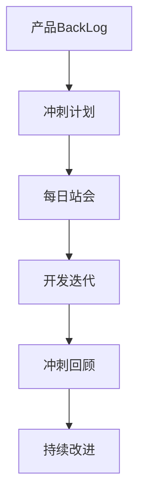
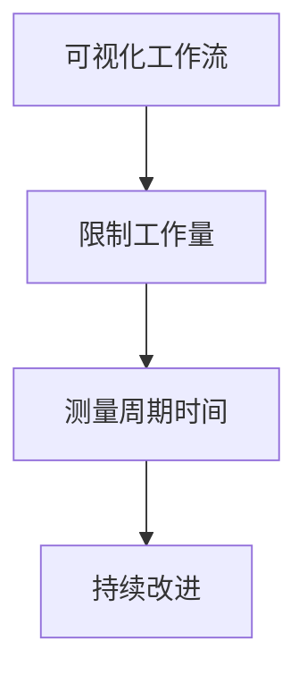
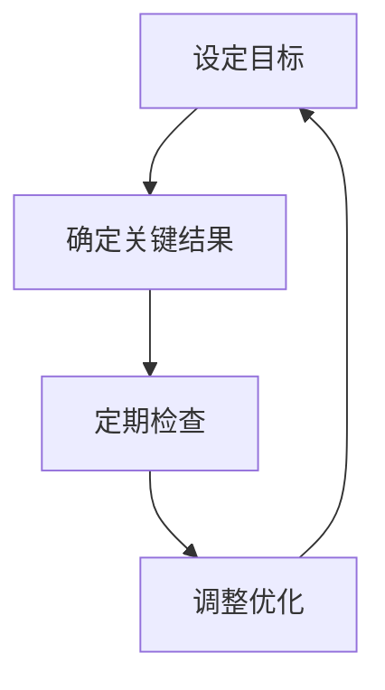
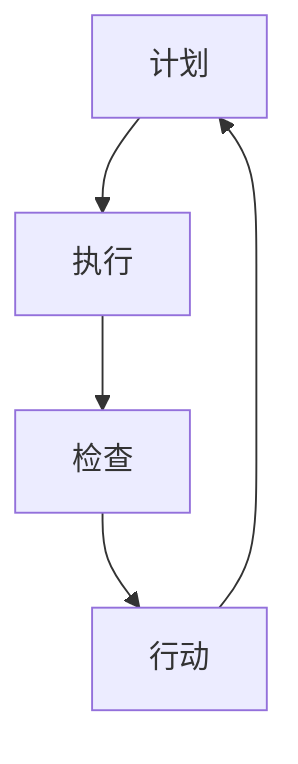

# 管理公司IT团队带领团队完成目标

## 1.背景介绍

### 1.1 IT团队的重要性

在当今快节奏的商业环境中,信息技术(IT)已成为推动企业创新和保持竞争力的关键驱动力。有效的IT团队管理对于确保企业的技术基础设施运行顺畅、支持业务目标的实现以及促进数字化转型至关重要。

### 1.2 IT团队面临的挑战

然而,管理IT团队并非一蹴而就。团队成员拥有不同的技术背景、工作风格和个人动机,这可能会导致沟通障碍、冲突和低效率。此外,快速变化的技术趋势、紧迫的项目期限和有限的资源也给团队管理带来了额外的压力。

### 1.3 有效团队管理的益处

通过有效的团队管理,企业可以充分发挥IT人才的潜力,提高生产力和效率,加快产品上市时间,并提供卓越的客户体验。一支高效协作的IT团队不仅能够解决技术挑战,还能为企业带来竞争优势。

## 2.核心概念与联系

### 2.1 领导力

领导力是管理IT团队的核心概念之一。优秀的领导能够树立清晰的愿景,激励团队成员朝着共同目标努力,并通过有效的沟通和决策过程来协调团队活动。

### 2.2 团队建设

有效的团队建设有助于培养团队凝聚力、互信和协作精神。通过组建多元化的团队、促进开放的反馈环境以及组织团队建设活动,管理者可以增强团队的归属感和工作热情。

### 2.3 绩效管理

绩效管理是确保团队成员高效工作的关键。通过制定明确的目标、提供及时的反馈以及奖惩机制,管理者可以激励团队成员持续提升技能,并对出色表现给予认可。

### 2.4 技术管理

作为IT团队的管理者,必须具备一定的技术知识和理解能力,以便有效地规划和分配技术资源、评估技术风险并制定相应的缓解措施。

### 2.5 变革管理

在不断变化的技术环境中,变革管理对于确保IT团队能够适应新的需求和挑战至关重要。通过制定变革战略、培训员工以及有效的沟通,管理者可以帮助团队顺利过渡到新的工作模式。

## 3.核心算法原理具体操作步骤

在管理IT团队的过程中,可以采用一些核心算法和原理来优化团队的绩效和协作效率。以下是一些常见的算法和原理,以及它们的具体操作步骤:

### 3.1 Scrum敏捷开发方法

Scrum是一种广泛应用于软件开发项目的敏捷方法,它强调迭代式开发、团队协作和持续改进。以下是Scrum的核心步骤:

1. 产品BackLog:创建一个包含所有需求和功能的产品BackLog列表,并根据优先级进行排序。
2. 冲刺计划:团队选择一个时间框架(通常为2-4周),并从产品BackLog中选择要在本次冲刺中完成的项目。
3. 每日站会:团队每天进行15分钟的站会,讨论进展、障碍和计划。
4. 冲刺回顾:在每个冲刺结束时,团队回顾已完成的工作,并收集反馈以改进下一个冲刺。
5. 冲刺回顾:在每个冲刺结束时,团队回顾已完成的工作,并收集反馈以改进下一个冲刺。

### 3.2 Kanban看板管理

Kanban是一种基于可视化原理的工作流管理系统,它通过限制工作在进程中的数量来提高效率和减少浪费。以下是Kanban的核心步骤:

1. 可视化工作流:创建一个看板,将工作流程分为多个阶段,如"待办"、"进行中"和"已完成"。
2. 限制工作在进程中的数量:为每个阶段设置工作项目的限额,以避免过度承担。
3. 测量周期时间:跟踪每个工作项目从开始到完成所需的时间,以识别瓶颈和改进机会。
4. 持续改进:根据收集的数据和反馈,不断优化工作流程和限额设置。

### 3.3 OKR目标与关键结果

OKR(Objectives and Key Results)是一种目标设定和跟踪方法,它将组织目标分解为可衡量的关键结果。以下是OKR的核心步骤:

1. 设定目标:确定团队或个人在一定时间内希望实现的重要目标。
2. 确定关键结果:为每个目标设置3-5个可衡量的关键结果,作为实现目标的衡量标准。
3. 定期检查:在指定的时间间隔内(如每周或每月),检查关键结果的进展情况。
4. 调整和优化:根据进展情况,调整目标或关键结果,以确保它们保持相关性和可实现性。

### 3.4 PDCA循环

PDCA循环(Plan-Do-Check-Act)是一种广泛应用于持续改进和质量管理的方法。以下是PDCA循环的核心步骤:

1. 计划(Plan):制定改进计划,明确目标、方法和所需资源。
2. 执行(Do):按计划执行改进措施,并收集相关数据。
3. 检查(Check):分析收集的数据,评估改进措施的有效性。
4. 行动(Act):根据评估结果,采取相应的行动,如标准化改进措施或进一步优化。

通过应用这些核心算法和原理,IT团队管理者可以提高团队的协作效率、交付质量和响应能力,从而更好地支持企业的业务目标。

## 4.数学模型和公式详细讲解举例说明

在管理IT团队的过程中,我们可以借助一些数学模型和公式来量化和优化团队的绩效。以下是一些常见的数学模型和公式,以及它们的详细讲解和应用示例:

### 4.1 队列理论

队列理论是一种用于分析和优化服务系统的数学模型。在IT团队管理中,我们可以将工作项目视为队列中的"顾客",而团队成员则扮演"服务员"的角色。通过分析队列长度、等待时间和服务率等指标,我们可以优化资源分配和工作流程。

队列模型的基本公式如下:

$$
\begin{aligned}
\rho &= \frac{\lambda}{\mu} \\
L &= \frac{\rho}{1-\rho} \\
W &= \frac{L}{\lambda}
\end{aligned}
$$

其中:
- $\rho$ 表示系统利用率,即平均到达率与平均服务率的比值
- $\lambda$ 表示平均到达率(每单位时间内到达的顾客数)
- $\mu$ 表示平均服务率(每单位时间内可服务的顾客数)
- $L$ 表示平均队列长度(包括正在服务和等待的顾客数)
- $W$ 表示平均等待时间

例如,假设一个IT团队每周平均接收20个新工作项目($\lambda = 20$),而团队成员每周可以完成25个工作项目($\mu = 25$)。根据队列模型,我们可以计算出:

- 系统利用率 $\rho = 20/25 = 0.8$
- 平均队列长度 $L = 0.8/(1-0.8) = 4$
- 平均等待时间 $W = 4/20 = 0.2$ 周

通过分析这些指标,管理者可以评估团队的工作负载是否合理,并根据需要调整资源或优化流程。

### 4.2 小世界网络模型

小世界网络模型是一种用于描述复杂系统中节点之间关系的数学模型。在IT团队管理中,我们可以将团队成员视为网络中的节点,而他们之间的协作关系则是连接这些节点的边。通过分析网络的特征,如平均路径长度和聚类系数,我们可以优化团队的沟通和协作效率。

小世界网络模型的核心公式如下:

$$
\begin{aligned}
C &= \frac{3 \times \text{Number of triangles}}{\text{Number of connected triples}} \\
L &= \frac{\sum_{i,j} d(i,j)}{n(n-1)}
\end{aligned}
$$

其中:
- $C$ 表示网络的聚类系数,衡量网络中节点之间的紧密程度
- $L$ 表示网络的平均路径长度,衡量任意两个节点之间的平均距离
- $d(i,j)$ 表示节点 $i$ 和节点 $j$ 之间的最短路径长度
- $n$ 表示网络中节点的总数

例如,假设一个IT团队由10名成员组成,他们之间的协作关系可以用一个小世界网络模型来描述。通过计算该网络的聚类系数和平均路径长度,我们可以评估团队成员之间的协作紧密程度和信息传播效率。

如果发现聚类系数过低,可能意味着团队成员之间的协作不够紧密,需要加强团队建设和沟通渠道。如果平均路径长度过长,则可能导致信息传播效率低下,需要优化团队结构或引入新的协作工具。

通过应用小世界网络模型,管理者可以从全局角度了解团队的协作状况,并采取相应的措施来提高团队的整体效率。

### 4.3 马尔可夫决策过程

马尔可夫决策过程(Markov Decision Process, MDP)是一种用于决策优化的数学模型。在IT团队管理中,我们可以将团队面临的各种情况视为MDP中的状态,而管理者需要根据当前状态选择最优的行动,以最大化长期回报。

MDP的核心公式如下:

$$
V^*(s) = \max_a \left\{ R(s,a) + \gamma \sum_{s'} P(s'|s,a) V^*(s') \right\}
$$

其中:
- $V^*(s)$ 表示在状态 $s$ 下采取最优策略时的价值函数
- $a$ 表示在状态 $s$ 下可以采取的行动
- $R(s,a)$ 表示在状态 $s$ 下采取行动 $a$ 所获得的即时回报
- $\gamma$ 表示折现因子,用于权衡即时回报和未来回报的重要性
- $P(s'|s,a)$ 表示在状态 $s$ 下采取行动 $a$ 后转移到状态 $s'$ 的概率
- $\sum_{s'} P(s'|s,a) V^*(s')$ 表示未来状态的期望价值函数

例如,假设一个IT团队正在进行一个关键项目,管理者需要决定是继续投入更多资源以加快进度,还是暂