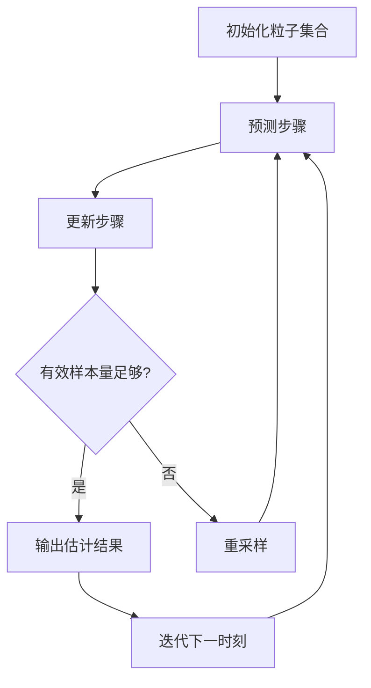

# 粒子滤波：处理非线性系统，跟踪复杂目标

## 1. 背景介绍

### 1.1 非线性系统的挑战

在现实世界中，许多系统都存在非线性特性,这使得它们的行为难以用简单的线性模型来描述和预测。非线性系统的状态演化往往受到复杂的噪声和不确定性的影响,导致系统的输出与输入之间的关系变得非常复杂。这种非线性特性给状态估计和目标跟踪带来了巨大的挑战。

### 1.2 目标跟踪的重要性

目标跟踪是计算机视觉、自动驾驶、监控系统等领域的一个核心任务。它旨在从一系列传感器数据(如视频、雷达等)中持续估计和预测感兴趣目标的状态(如位置、速度等)。准确的目标跟踪对于许多实际应用至关重要,例如:

- 自动驾驶汽车需要持续跟踪周围车辆和行人的运动状态,以确保安全行驶。
- 监控系统需要跟踪可疑目标的移动轨迹,以便进行进一步分析和处理。
- 增强现实(AR)应用需要准确跟踪用户的位置和姿态,以正确渲染虚拟物体。

### 1.3 粒子滤波的产生

由于非线性系统和复杂目标跟踪问题的存在,传统的卡尔曼滤波等线性滤波方法往往无法获得令人满意的性能。为了应对这一挑战,粒子滤波(Particle Filter)作为一种基于蒙特卡罗采样的顺序重要性采样(Sequential Importance Sampling, SIS)方法应运而生。

粒子滤波通过使用一组加权的随机样本(即粒子)来近似表示系统状态的后验概率密度函数(Posterior Probability Density Function, PDF),从而能够有效地处理非线性、非高斯系统。它已被广泛应用于目标跟踪、机器人定位、计算机视觉等领域。

## 2. 核心概念与联系

### 2.1 概率论基础

粒子滤波建立在概率论和贝叶斯推理的基础之上。理解以下几个核心概念对于掌握粒子滤波至关重要:

1. **概率密度函数(PDF)**: 描述随机变量取值的概率分布。
2. **先验概率(Prior)**: 在观测到任何证据之前,对某个事件发生的主观判断。
3. **似然函数(Likelihood)**: 给定观测数据,描述参数取某个值的概率。
4. **后验概率(Posterior)**: 在观测到证据之后,对某个事件发生的修正后的概率判断。
5. **贝叶斯定理**: 将先验概率与似然函数相结合,计算后验概率的公式。

### 2.2 状态空间模型

粒子滤波通常采用状态空间模型来描述系统的动态演化过程,包括两个基本方程:

$$
\begin{aligned}
x_t &= f(x_{t-1}, u_t) + v_t \\
z_t &= h(x_t) + w_t
\end{aligned}
$$

其中:

- $x_t$ 表示系统在时刻 $t$ 的状态向量
- $u_t$ 表示控制输入向量
- $z_t$ 表示观测向量
- $f(\cdot)$ 是状态转移方程,描述系统状态的演化
- $h(\cdot)$ 是观测方程,描述状态与观测之间的关系
- $v_t$ 和 $w_t$ 分别表示过程噪声和观测噪声

该模型能够描述非线性、非高斯系统,是粒子滤波的基础。

### 2.3 递归贝叶斯估计

粒子滤波旨在递归地估计系统状态 $x_t$ 的后验概率密度函数 $p(x_t | z_{1:t})$,其中 $z_{1:t}$ 表示从时刻 1 到时刻 $t$ 的所有观测数据。这个过程可以通过贝叶斯定理和马尔可夫假设来实现:

$$
p(x_t | z_{1:t}) = \frac{p(z_t | x_t) p(x_t | z_{1:t-1})}{p(z_t | z_{1:t-1})}
$$

其中:

- $p(z_t | x_t)$ 是似然函数,描述在给定状态 $x_t$ 时观测 $z_t$ 的概率
- $p(x_t | z_{1:t-1})$ 是状态的先验概率密度,可以通过上一时刻的后验概率和状态转移方程得到
- $p(z_t | z_{1:t-1})$ 是归一化常数,确保后验概率密度的积分为 1

由于大多数情况下无法获得后验概率密度的解析解,因此需要采用近似方法,这就是粒子滤波的用武之地。

## 3. 核心算法原理具体操作步骤

粒子滤波的核心思想是使用一组加权的随机样本(粒子)来近似表示后验概率密度函数。算法的具体步骤如下:

1. **初始化**: 从先验概率密度 $p(x_0)$ 中采样生成 $N$ 个粒子 $\{x_0^{(i)}\}_{i=1}^N$,并赋予它们相等的权重 $w_0^{(i)} = 1/N$。

2. **预测步骤**:
   a. 对于每个粒子 $x_{t-1}^{(i)}$,从状态转移概率密度 $p(x_t | x_{t-1}^{(i)})$ 中采样得到新的粒子 $\bar{x}_t^{(i)}$。
   b. 计算每个新粒子的权重 $\bar{w}_t^{(i)} = w_{t-1}^{(i)}$。

3. **更新步骤**:
   a. 计算每个新粒子的重要性权重 $\tilde{w}_t^{(i)} = \bar{w}_t^{(i)} p(z_t | \bar{x}_t^{(i)})$。
   b. 对重要性权重进行归一化,得到新的粒子权重 $w_t^{(i)} = \tilde{w}_t^{(i)} / \sum_{j=1}^N \tilde{w}_t^{(j)}$。

4. **重采样**:
   a. 计算有效样本量 $N_{\text{eff}} = 1 / \sum_{i=1}^N (w_t^{(i)})^2$。
   b. 如果 $N_{\text{eff}}$ 小于阈值,则从 $\{x_t^{(i)}\}$ 中按权重 $\{w_t^{(i)}\}$ 重复重采样得到新的粒子集合 $\{\bar{x}_t^{(i)}\}$,并将它们的权重重置为 $1/N$。

5. **输出和迭代**: 将当前时刻的粒子集合 $\{x_t^{(i)}, w_t^{(i)}\}$ 作为近似的后验概率密度输出,并将其作为下一时刻的先验概率密度,回到步骤 2 继续迭代。

该算法的关键在于通过重复采样和重新加权来逐步修正粒子集合,使其能够逐渐收敛到真实的后验概率密度。重采样步骤可以避免大量低权重粒子的存在,从而提高估计的效率和精度。

粒子滤波算法的伪代码如下:

```python
def particle_filter(x_init, N, f, h, z):
    # 初始化
    particles = sample_from_prior(x_init, N)
    weights = np.ones(N) / N

    for z_t in z:
        # 预测步骤
        particles = [f(particle) for particle in particles]

        # 更新步骤
        weights = update_weights(weights, particles, z_t, h)

        # 重采样
        if neff(weights) < N_thresh:
            particles, weights = resample(particles, weights)

        # 输出当前时刻的估计
        yield particles, weights
```

该算法的流程图如下所示:



## 4. 数学模型和公式详细讲解举例说明

### 4.1 状态转移模型

在粒子滤波中,我们需要定义系统状态的转移模型 $p(x_t | x_{t-1})$,描述系统状态从 $x_{t-1}$ 转移到 $x_t$ 的概率密度。对于线性高斯系统,这个模型可以用如下形式表示:

$$
x_t = F x_{t-1} + B u_t + v_t
$$

其中 $F$ 是状态转移矩阵, $B$ 是控制输入矩阵, $u_t$ 是控制输入向量, $v_t$ 是过程噪声,服从高斯分布 $\mathcal{N}(0, Q)$。

对于非线性系统,我们可以使用更一般的形式:

$$
x_t = f(x_{t-1}, u_t) + v_t
$$

其中 $f(\cdot)$ 是任意的非线性函数。在这种情况下,我们无法获得状态转移概率密度的解析解,因此需要采用采样的方式来近似它。

例如,对于一个二维运动目标跟踪问题,状态向量可以表示为 $x_t = [x_t, y_t, \dot{x}_t, \dot{y}_t]^T$,其中 $(x_t, y_t)$ 是目标的位置, $(\dot{x}_t, \dot{y}_t)$ 是目标的速度。假设目标运动遵循恒定加速度模型,则状态转移方程可以写为:

$$
\begin{aligned}
x_t &= x_{t-1} + \dot{x}_{t-1} \Delta t + \frac{1}{2} a_x \Delta t^2 + v_x \\
y_t &= y_{t-1} + \dot{y}_{t-1} \Delta t + \frac{1}{2} a_y \Delta t^2 + v_y \\
\dot{x}_t &= \dot{x}_{t-1} + a_x \Delta t + v_{\dot{x}} \\
\dot{y}_t &= \dot{y}_{t-1} + a_y \Delta t + v_{\dot{y}}
\end{aligned}
$$

其中 $a_x$, $a_y$ 分别是目标在 $x$, $y$ 方向上的加速度, $\Delta t$ 是时间步长, $v_x$, $v_y$, $v_{\dot{x}}$, $v_{\dot{y}}$ 是过程噪声。

### 4.2 观测模型

除了状态转移模型,我们还需要定义观测模型 $p(z_t | x_t)$,描述在给定状态 $x_t$ 时观测 $z_t$ 的概率密度。对于线性高斯系统,观测模型可以表示为:

$$
z_t = H x_t + w_t
$$

其中 $H$ 是观测矩阵, $w_t$ 是观测噪声,服从高斯分布 $\mathcal{N}(0, R)$。

对于非线性系统,观测模型可以写为:

$$
z_t = h(x_t) + w_t
$$

其中 $h(\cdot)$ 是任意的非线性函数。

例如,在雷达目标跟踪中,观测量通常是目标在极坐标系下的距离 $r_t$ 和角度 $\theta_t$,而状态量是目标在笛卡尔坐标系下的位置 $(x_t, y_t)$。因此,观测模型可以写为:

$$
\begin{aligned}
r_t &= \sqrt{x_t^2 + y_t^2} + w_r \\
\theta_t &= \arctan\left(\frac{y_t}{x_t}\right) + w_\theta
\end{aligned}
$$

其中 $w_r$ 和 $w_\theta$ 分别是距离和角度的观测噪声。

### 4.3 重要性权重计算

在粒子滤波的更新步骤中,我们需要计算每个粒子的重要性权重,以反映该粒子与观测数据的一致性。重要性权重的计算公式为:

$$
\tilde{w}_t^{(i)} = w_{t-1}^{(i)} p(z_t | \bar{x}_t^{(i)})
$$

其中 $w_{t-1}^{(i)}$ 是上一时刻该粒子的权重, $p(z_t | \bar{x}_t