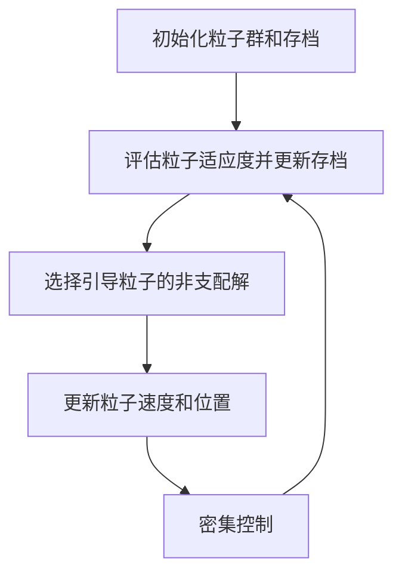
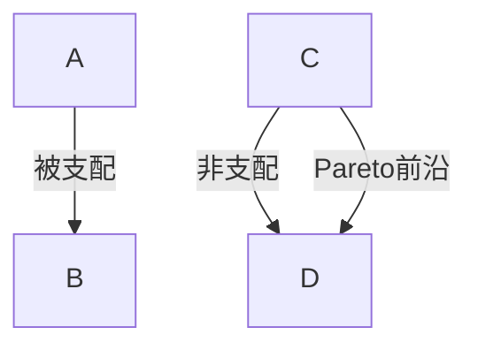

# "粒子群优化算法在多目标优化中的应用"

## 1.背景介绍

### 1.1 多目标优化问题概述

在现实世界中,我们经常会遇到需要同时优化多个互相矛盾的目标函数的情况。这种问题被称为多目标优化问题(Multi-Objective Optimization Problem,MOP)。多目标优化旨在在给定的约束条件下,找到能够平衡多个目标函数的最优解或近似最优解集合。

与单目标优化问题不同,多目标优化问题通常没有单一的最优解,而是存在一个由相互矛盾的解组成的最优解集,这些解被称为"Pareto最优解"。Pareto最优解是指在不恶化任何一个目标函数的情况下,无法再同时改善其他目标函数的解。

多目标优化广泛应用于工程设计、资源分配、投资组合优化、机器学习等诸多领域。由于其复杂性和实际应用价值,多目标优化一直是计算智能和运筹学研究的热点问题。

### 1.2 粒子群优化算法简介

粒子群优化算法(Particle Swarm Optimization,PSO)是一种基于群体智能的随机搜索优化算法,由肯尼迪和埃伯哈特于1995年提出。该算法的灵感来源于鸟群或鱼群的社会行为,模拟了它们在搜寻食物时相互协作的过程。

在PSO算法中,每个候选解被看作一个"粒子",粒子在搜索空间中运动并不断更新自身的位置和速度,以逐步逼近最优解。每个粒子的运动受到自身历史最优解和群体历史最优解的引导。通过粒子之间的相互学习和协作,算法可以有效地在解空间中进行全局和局部搜索,从而找到较优解。

PSO算法具有简单、易于实现、计算效率高、收敛速度快等优点,在解决单目标优化问题方面取得了良好的效果。然而,传统的PSO算法无法直接应用于多目标优化问题,因此需要对其进行改进和扩展。

## 2.核心概念与联系

### 2.1 Pareto优化与Pareto前沿

在多目标优化问题中,我们通常无法找到能够同时最优化所有目标函数的单一解。相反,我们需要寻找一个由相互矛盾的解组成的最优解集,这些解被称为"Pareto最优解"。

Pareto最优解的概念源自于经济学家维尔弗雷多·帕累托(Vilfredo Pareto)提出的"帕累托最优"原则。一个解被称为Pareto最优解,是指在不恶化任何一个目标函数的情况下,无法再同时改善其他目标函数。形式化地定义如下:

对于一个具有M个目标函数的多目标优化问题,设解$\vec{x}$和$\vec{y}$是决策变量空间中的两个可行解,如果不存在$\vec{y}$使得对所有$i=1,2,...,M$都有$f_i(\vec{y}) \leq f_i(\vec{x})$,并且对至少一个$j$有$f_j(\vec{y}) < f_j(\vec{x})$,则称$\vec{x}$是一个Pareto最优解。

所有Pareto最优解组成的集合被称为Pareto前沿(Pareto Front)。在多目标优化中,我们的目标就是找到尽可能接近真实Pareto前沿的解集。

### 2.2 多目标粒子群优化算法

为了将粒子群优化算法应用于多目标优化问题,研究人员提出了多种改进方法,其中最著名和常用的是由科罗纳等人在1998年提出的MOPSO(Multi-Objective Particle Swarm Optimization)算法。

MOPSO算法的核心思想是:

1. **存档机制**: 维护一个外部存档来保存发现的非支配解(即Pareto最优解),并在每次迭代时使用存档中的解来引导粒子的运动。

2. **适应度函数**: 设计合适的适应度函数来评估粒子的优劣,通常采用基于Pareto支配关系的适应度函数。

3. **引导机制**: 在更新粒子速度时,除了考虑粒子自身的历史最优解,还需要考虑存档中的非支配解对粒子的引导作用。

4. **密集控制**: 为了维持Pareto前沿的均匀分布,需要采取一定的密集控制策略,避免非支配解过于集中。

MOPSO算法在保留了PSO算法简单高效的优点的同时,能够有效地解决多目标优化问题,在工程设计、机器学习等领域得到了广泛应用。

### 2.3 Mermaid流程图

下面使用Mermaid流程图展示MOPSO算法的核心流程:



## 3.核心算法原理具体操作步骤

MOPSO算法的具体步骤如下:

1. **初始化粒子群和存档**

    - 随机初始化一组粒子的位置和速度
    - 初始化一个空的外部存档用于保存非支配解

2. **评估粒子适应度并更新存档**

    - 计算每个粒子的所有目标函数值
    - 根据适应度函数评估粒子的适应度
    - 将非支配粒子添加到外部存档中
    - 从存档中移除被新发现的非支配解支配的解

3. **选择引导粒子的非支配解**

    - 对于每个粒子,从存档中选择一个非支配解作为引导
    - 常用的选择方式包括:随机选择、最近邻选择、sigma领域选择等

4. **更新粒子速度和位置**

    - 根据粒子自身的历史最优解、选定的引导非支配解以及一定的惯性权重和学习因子,更新粒子的速度
    - 根据更新后的速度,更新粒子的位置

5. **密集控制**

    - 为了维持Pareto前沿的均匀分布,需要采取一定的密集控制策略
    - 常用的策略包括:聚类技术、网格技术、密度估计技术等

6. **终止条件检查**

    - 如果达到最大迭代次数或其他终止条件,则输出存档中的非支配解集作为最终结果
    - 否则,返回步骤2,进行下一次迭代

需要注意的是,上述步骤只是MOPSO算法的基本框架,在具体实现时还需要考虑诸多细节,例如适应度函数的设计、引导粒子选择方式、密集控制策略等,这些都会对算法的性能产生重要影响。

## 4.数学模型和公式详细讲解举例说明

### 4.1 Pareto支配关系

在多目标优化中,我们使用Pareto支配关系来比较不同解的优劣。对于一个具有M个目标函数的多目标优化问题,设解$\vec{x}$和$\vec{y}$是决策变量空间中的两个可行解,如果满足以下两个条件之一,则称$\vec{x}$被$\vec{y}$支配:

1. 对所有的$i=1,2,...,M$,有$f_i(\vec{y}) \leq f_i(\vec{x})$,并且至少存在一个$j$使得$f_j(\vec{y}) < f_j(\vec{x})$
2. 对所有的$i=1,2,...,M$,有$f_i(\vec{y}) > f_i(\vec{x})$

如果$\vec{x}$被$\vec{y}$支配,则称$\vec{y}$是非支配解。所有非支配解组成的集合就是Pareto前沿。

以一个具有两个目标函数的最小化问题为例,如下图所示,点A被点B支配,因为点B在两个目标函数上的值都比点A小;点C和点D是非支配解,它们组成了Pareto前沿。



### 4.2 MOPSO算法中的速度更新公式

在MOPSO算法中,粒子的速度更新公式是算法的核心部分。设第$i$个粒子在第$t$次迭代时的位置为$\vec{x}_i^t$,速度为$\vec{v}_i^t$,个体历史最优解为$\vec{p}_i^t$,从存档中选定的引导非支配解为$\vec{g}_i^t$,则粒子的速度更新公式为:

$$\vec{v}_i^{t+1} = w \vec{v}_i^t + c_1 r_1 (\vec{p}_i^t - \vec{x}_i^t) + c_2 r_2 (\vec{g}_i^t - \vec{x}_i^t)$$

其中:

- $w$是惯性权重,控制粒子运动的惯性
- $c_1$和$c_2$是学习因子,控制粒子向个体最优解和群体最优解的学习程度
- $r_1$和$r_2$是两个服从均匀分布$U(0,1)$的随机数,用于增加算法的随机性

粒子的位置更新公式为:

$$\vec{x}_i^{t+1} = \vec{x}_i^t + \vec{v}_i^{t+1}$$

通过不断更新粒子的速度和位置,算法可以在解空间中进行全局和局部搜索,逐步逼近Pareto前沿。

### 4.3 MOPSO算法中的适应度函数

在MOPSO算法中,我们需要设计合适的适应度函数来评估粒子的优劣,以确定哪些粒子应该被保留在外部存档中。常用的适应度函数包括:

1. **基于Pareto支配关系的适应度函数**

    对于每个粒子,我们计算它被其他粒子支配的次数$n_p$和它支配其他粒子的次数$n_d$,然后根据以下公式计算适应度:

    $$\text{fitness}(\vec{x}) = n_d + \frac{1}{n_p+1}$$

    适应度值越大,表示该粒子越优秀。

2. **基于密度估计的适应度函数**

    为了维持Pareto前沿的均匀分布,我们可以根据粒子周围的密度来调整其适应度值。常用的密度估计方法包括核密度估计、最近邻密度估计等。

    以最近邻密度估计为例,对于第$i$个粒子,我们计算它到第$k$个最近邻粒子的欧几里得距离$d_i^k$,然后根据以下公式计算适应度:

    $$\text{fitness}(\vec{x}_i) = \sum_{j=1}^M f_j(\vec{x}_i) + \frac{1}{d_i^k+2}$$

    适应度值越大,表示该粒子越优秀,且周围粒子分布越稀疏。

在实际应用中,我们还可以根据具体问题的特点,设计出更加合适的适应度函数。

## 5.项目实践:代码实例和详细解释说明

为了更好地理解MOPSO算法的实现细节,我们以Python语言为例,给出一个简单的MOPSO算法实现。

### 5.1 问题定义

我们将使用ZDT1测试函数来验证算法的有效性。ZDT1是一个具有两个目标函数的多目标优化测试问题,其数学表达式如下:

$$\begin{aligned}
\min F_1(\vec{x}) &= x_1 \\
\min F_2(\vec{x}) &= g(x_2,...,x_n) \left[1 - \sqrt{\frac{x_1}{g(x_2,...,x_n)}}\right] \\
g(x_2,...,x_n) &= 1 + 9 \sum_{i=2}^n \frac{x_i}{n-1}
\end{aligned}$$

其中$n$是决策变量的个数,$\vec{x} = (x_1, x_2, ..., x_n)$是决策变量向量,决策变量的取值范围为$[0, 1]$。

ZDT1测试函数的Pareto前沿是已知的,我们可以将算法得到的结果与真实Pareto前沿进行对比,评估算法的性能。

### 5.2 代码实现

```python
import numpy as np
from copy import deepcopy

#