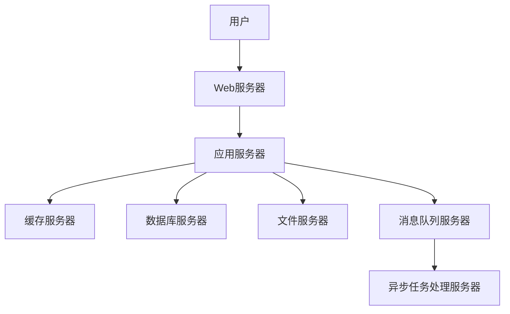

# 精品课程网站详细设计与具体代码实现

## 1. 背景介绍

### 1.1 在线教育的崛起

随着互联网技术的快速发展和普及,在线教育正在经历一场前所未有的革命。传统的教育模式已无法满足现代社会对知识获取的需求。在线教育凭借其便利性、灵活性和可访问性,正在成为越来越多人获取知识和提升技能的首选途径。

### 1.2 精品课程网站的重要性

精品课程网站作为在线教育的重要载体,为学习者提供了高质量的课程资源和优质的学习体验。这些网站通常由专业的教育机构或知名导师打造,内容涵盖各个学科领域,形式多样,包括视频课程、互动练习、在线考试等。精品课程网站不仅能满足学习者的需求,还能推动教育资源的共享和知识的传播。

## 2. 核心概念与联系

### 2.1 课程管理系统

课程管理系统是精品课程网站的核心组成部分,负责管理和组织课程内容、教师资源、学生信息等。它通常包括以下几个主要模块:

- 课程模块: 用于创建、编辑和发布课程内容,包括视频、文档、测验等。
- 教师模块: 管理教师账号,分配课程权限,监控教学进度。
- 学生模块: 管理学生账号,记录学习进度,提供个性化学习体验。
- 评测模块: 设计和管理各种形式的测验、考试,并自动评分。

### 2.2 用户体验设计

用户体验设计是精品课程网站成功的关键因素之一。良好的用户体验能够吸引和留住学习者,提高他们的学习效率和满意度。用户体验设计应该考虑以下几个方面:

- 界面设计: 清晰、直观、美观的界面布局和风格。
- 导航设计: 合理的信息架构和导航系统,方便用户快速找到所需内容。
- 交互设计: 流畅、人性化的交互方式,提高用户操作效率。
- 可访问性: 确保网站对残障人士也友好,符合无障碍标准。

### 2.3 系统架构设计

为了支持大规模并发访问和数据处理,精品课程网站需要一个高效、可扩展的系统架构。常见的架构模式包括:

- 微服务架构: 将系统拆分为多个独立的微服务,每个微服务负责特定的业务逻辑,通过轻量级通信机制进行集成。
- 分布式架构: 将系统部署在多台服务器上,实现负载均衡和故障转移,提高系统的可用性和扩展性。
- 缓存机制: 使用缓存技术(如Redis)缓存热点数据,减轻数据库压力,提高响应速度。



## 3. 核心算法原理具体操作步骤

### 3.1 推荐算法

推荐算法是精品课程网站的核心功能之一,它可以根据用户的兴趣爱好、学习历史和其他用户的行为数据,为用户推荐合适的课程。常见的推荐算法包括:

1. **协同过滤算法**

协同过滤算法基于用户之间的相似性或者项目之间的相似性进行推荐。具体步骤如下:

a. 计算用户之间的相似度,通常使用皮尔逊相关系数或余弦相似度。
b. 找到与目标用户最相似的 K 个用户,称为邻居用户。
c. 根据邻居用户对项目的评分,预测目标用户对其他项目的可能评分。
d. 将预测评分最高的项目推荐给目标用户。

2. **基于内容的推荐算法**

基于内容的推荐算法利用项目的内容特征(如课程标题、描述、标签等)来计算项目之间的相似度,并推荐与用户历史喜好相似的项目。具体步骤如下:

a. 提取项目的文本特征,通常使用 TF-IDF 或者词向量等技术。
b. 计算项目之间的相似度,常用的方法有余弦相似度、欧几里得距离等。
c. 根据用户历史喜好的项目,找到与之最相似的项目集合。
d. 将相似度最高的项目推荐给用户。

### 3.2 个性化学习路径

个性化学习路径算法能够根据用户的知识水平、学习进度和目标,为每个用户量身定制合适的学习路径。常见的算法包括:

1. **知识图谱**

知识图谱是一种用于表示知识结构的图形模型。在课程领域,知识图谱可以描述不同知识点之间的先后依赖关系。算法步骤如下:

a. 构建课程知识图谱,将知识点作为节点,依赖关系作为边。
b. 评估用户的知识状态,确定已掌握和未掌握的知识点。
c. 基于知识图谱,找到从已掌握知识点到目标知识点的最短路径。
d. 将路径上的知识点按顺序组成个性化学习路径。

2. **决策树算法**

决策树算法可以根据用户的特征(如年龄、学习目的等)和历史数据,生成一棵决策树,并据此推荐个性化学习路径。算法步骤如下:

a. 收集用户特征数据和历史学习路径数据,作为训练集。
b. 使用决策树算法(如ID3、C4.5等)在训练集上构建决策树模型。
c. 对新用户的特征数据输入决策树模型,得到推荐的学习路径。

### 3.3 自动评分算法

自动评分算法可以对学生的作业、测验等进行智能评分,减轻了教师的工作量。常见的算法包括:

1. **文本相似度算法**

文本相似度算法通过计算学生答案与标准答案之间的相似度,给出评分。常用的算法有:

- 编辑距离: 计算将一个字符串转换为另一个字符串所需的最小编辑操作数。
- N-gram: 将文本拆分为n个字符的子序列,计算子序列的重叠程度。
- 词向量: 将文本映射为词向量,计算词向量之间的余弦相似度。

2. **序列对比算法**

序列对比算法常用于评分程序代码等结构化数据。著名的算法有:

- 最长公共子序列(LCS): 找出两个序列的最长公共子序列的长度。
- 最长公共子串(LCStr): 找出两个序列的最长公共子串的长度。
- 编辑距离: 计算将一个序列转换为另一个序列所需的最小编辑操作数。

## 4. 数学模型和公式详细讲解举例说明

### 4.1 协同过滤算法

协同过滤算法的核心是计算用户之间或项目之间的相似度。常用的相似度计算方法有:

1. **皮尔逊相关系数**

皮尔逊相关系数用于计算两个变量之间的线性相关程度,取值范围为 [-1, 1]。公式如下:

$$r_{xy} = \frac{\sum_{i=1}^{n}(x_i - \bar{x})(y_i - \bar{y})}{\sqrt{\sum_{i=1}^{n}(x_i - \bar{x})^2}\sqrt{\sum_{i=1}^{n}(y_i - \bar{y})^2}}$$

其中 $x_i$ 和 $y_i$ 分别表示第 i 个数据点的 x 值和 y 值, $\bar{x}$ 和 $\bar{y}$ 分别表示 x 和 y 的均值。

2. **余弦相似度**

余弦相似度用于计算两个向量之间的夹角余弦值,取值范围为 [0, 1]。公式如下:

$$\text{sim}(A, B) = \cos(\theta) = \frac{A \cdot B}{\|A\|\|B\|} = \frac{\sum_{i=1}^{n}A_iB_i}{\sqrt{\sum_{i=1}^{n}A_i^2}\sqrt{\sum_{i=1}^{n}B_i^2}}$$

其中 $A$ 和 $B$ 表示两个向量, $A_i$ 和 $B_i$ 分别表示第 i 个维度上的值。

### 4.2 文本相似度算法

1. **编辑距离**

编辑距离算法计算将一个字符串转换为另一个字符串所需的最小编辑操作数,常用于拼写检查和字符串匹配。编辑操作包括插入、删除和替换。

设字符串 A 和 B 的长度分别为 m 和 n,编辑距离 $d(A, B)$ 可以递归计算:

$$
d(A, B) = \begin{cases}
0 & \text{if } m = n = 0 \\
m & \text{if } n = 0 \\
n & \text{if } m = 0 \\
d(A[0..m-2], B[0..n-1]) + 1 & \text{if } A[m-1] \neq B[n-1] \\
\min \begin{cases}
d(A[0..m-1], B[0..n-1]) + 1 \\
d(A[0..m-2], B[0..n-1]) + 1 \\
d(A[0..m-2], B[0..n-2]) + 1
\end{cases} & \text{if } A[m-1] = B[n-1]
\end{cases}
$$

2. **N-gram**

N-gram 算法将文本拆分为长度为 n 的子序列,然后计算两个文本之间的 N-gram 重叠程度作为相似度。例如,当 $n=2$ 时,字符串 "hello" 的 2-gram 集合为 {"he", "el", "ll", "lo"}。

设 $A$ 和 $B$ 分别表示两个文本的 N-gram 集合,相似度可以计算为:

$$\text{sim}(A, B) = \frac{|A \cap B|}{|A \cup B|}$$

其中 $|A \cap B|$ 表示 $A$ 和 $B$ 的交集大小, $|A \cup B|$ 表示 $A$ 和 $B$ 的并集大小。

### 4.3 序列对比算法

1. **最长公共子序列 (LCS)**

最长公共子序列算法用于找出两个序列的最长公共子序列的长度,常用于基因序列比对和版本控制系统。

设序列 $A$ 和 $B$ 的长度分别为 $m$ 和 $n$,最长公共子序列长度 $c(i, j)$ 可以递归计算:

$$
c(i, j) = \begin{cases}
0 & \text{if } i = 0 \text{ or } j = 0 \\
c(i-1, j-1) + 1 & \text{if } A[i] = B[j] \\
\max(c(i-1, j), c(i, j-1)) & \text{if } A[i] \neq B[j]
\end{cases}
$$

2. **编辑距离**

编辑距离算法也可以用于序列对比,计算将一个序列转换为另一个序列所需的最小编辑操作数。编辑操作包括插入、删除和替换。

设序列 $A$ 和 $B$ 的长度分别为 $m$ 和 $n$,编辑距离 $d(i, j)$ 可以递归计算:

$$
d(i, j) = \begin{cases}
i & \text{if } j = 0 \\
j & \text{if } i = 0 \\
d(i-1, j-1) & \text{if } A[i] = B[j] \\
\min \begin{cases}
d(i-1, j) + 1 \\
d(i, j-1) + 1 \\
d(i-1, j-1) + 1
\end{cases} & \text{if } A[i] \neq B[j]
\end{cases}
$$

## 5. 项目实践: 代码实例和详细解释说明

在本节中,我们将通过一个简单的 Django 项目,演示如何实现一个基本的精品课程网站。该项目包括课程管理、用户注册登录、课程推荐等核心功能。

### 5.1 项目结构

```
online_course/
├── courses/
│