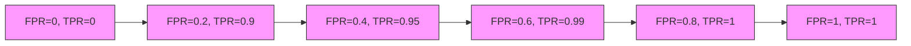

# 精确率的未来：趋势与展望

## 1. 背景介绍

### 1.1 精确率的重要性

在当今数据驱动的世界中,精确率(precision)已经成为评估机器学习模型性能的关键指标之一。精确率衡量了模型在预测为正类(positive class)的样本中,真正的正类样本所占的比例。高精确率意味着模型能够很好地减少误报(false positives),从而提高预测的可靠性。

精确率在诸多领域发挥着至关重要的作用,例如:

- 医疗诊断:精确率高的模型能够更准确地检测疾病,减少漏诊和误诊,从而提高治疗效果。
- 欺诈检测:在金融和网络安全领域,高精确率的模型能够更好地识别欺诈行为,保护用户利益。
- 内容审核:社交媒体和在线平台需要高精确率的模型来过滤不当内容,维护健康的在线环境。

### 1.2 精确率与其他评估指标

除了精确率,评估机器学习模型性能的其他常用指标包括:

- 召回率(Recall):衡量模型能够正确识别所有正类样本的能力。
- F1分数:精确率和召回率的调和均值,综合考虑了两者的权衡。
- 准确率(Accuracy):正确预测的样本数占总样本数的比例。
- ROC曲线和AUC:描述模型在不同阈值下的真阳性率和假阳性率之间的权衡。

在实际应用中,通常需要根据具体问题的特点来权衡选择合适的评估指标。例如,在医疗诊断中,我们更关注高召回率以避免漏诊;而在欺诈检测中,则更重视高精确率以减少误报。

## 2. 核心概念与联系

### 2.1 精确率的形式定义

精确率(Precision)的形式定义如下:

$$
\text{Precision} = \frac{\text{True Positives}}{\text{True Positives} + \text{False Positives}}
$$

其中:

- True Positives(TP)表示被正确预测为正类的样本数。
- False Positives(FP)表示被错误预测为正类的样本数。

精确率的取值范围为[0, 1],值越高表示模型的预测结果越精确。

### 2.2 精确率与召回率的权衡

精确率和召回率(Recall)是相互制约的指标,它们之间存在着内在的权衡关系。召回率的定义如下:

$$
\text{Recall} = \frac{\text{True Positives}}{\text{True Positives} + \text{False Negatives}}
$$

其中,False Negatives(FN)表示被错误预测为负类的正类样本数。

通常情况下,当我们提高模型的精确率时,召回率会下降,反之亦然。这是因为,如果我们将阈值设置得更加严格,那么会减少误报(FP)的数量,提高精确率,但同时也会增加漏报(FN)的数量,降低召回率。反之,如果我们将阈值设置得更加宽松,那么会提高召回率,但也会增加误报的数量,降低精确率。

因此,在实际应用中,我们需要根据具体问题的需求来权衡精确率和召回率,找到一个合适的平衡点。例如,在医疗诊断中,我们可能更关注高召回率以避免漏诊;而在欺诈检测中,我们可能更关注高精确率以减少误报。

### 2.3 精确率与其他指标的关系

精确率与其他评估指标也存在一定的关系,例如:

- 精确率与准确率(Accuracy):当正类样本和负类样本的数量差距较大时,准确率可能会失去参考意义,而精确率则更加可靠。
- 精确率与F1分数:F1分数是精确率和召回率的调和均值,综合考虑了两者的权衡。
- 精确率与ROC曲线:ROC曲线描述了不同阈值下的真阳性率和假阳性率之间的权衡关系。精确率与ROC曲线的关系取决于具体的阈值设置。

因此,在评估模型性能时,我们需要综合考虑多个指标,并根据具体问题的特点来选择合适的评估方式。

## 3. 核心算法原理具体操作步骤

提高精确率的核心算法原理主要包括以下几个方面:

### 3.1 特征工程

特征工程是机器学习中一个非常重要的步骤,它直接影响模型的性能。通过选择合适的特征,我们可以提高模型的泛化能力,从而提高精确率。常用的特征工程技术包括:

1. 特征选择:从原始特征中选择与目标变量相关性较高的特征子集。
2. 特征提取:从原始特征中构造新的特征,以捕捉更多有用的信息。
3. 特征编码:对于类别型特征,需要进行适当的编码,如one-hot编码或目标编码。
4. 特征缩放:对于数值型特征,需要进行适当的缩放,以避免某些特征对模型的影响过大。

### 3.2 模型选择和调参

选择合适的机器学习模型和参数也是提高精确率的关键。不同的模型对于不同的数据集和问题有不同的适用性,因此需要进行模型选择和参数调优。常用的模型包括:

1. 逻辑回归(Logistic Regression)
2. 支持向量机(Support Vector Machine, SVM)
3. 决策树(Decision Tree)
4. 随机森林(Random Forest)
5. 梯度提升树(Gradient Boosting Trees)
6. 神经网络(Neural Networks)

对于每种模型,我们都需要调整其超参数,以获得最佳性能。常用的调参方法包括网格搜索(Grid Search)和随机搜索(Random Search)等。

### 3.3 样本平衡

在许多实际问题中,正类样本和负类样本的数量存在着严重的不平衡。这种数据不平衡会导致模型过度偏向于多数类,从而降低精确率。解决这个问题的方法包括:

1. 过采样(Over-sampling):通过复制少数类样本来增加其数量。
2. 欠采样(Under-sampling):通过删除多数类样本来减少其数量。
3. 合成少数过采样技术(Synthetic Minority Over-sampling Technique, SMOTE):通过插值的方式生成新的少数类样本。

### 3.4 阈值调整

在二分类问题中,我们通常会根据模型输出的概率值来确定样本的类别。默认情况下,阈值通常设置为0.5,但是我们可以根据具体问题的需求来调整阈值,以获得更高的精确率或召回率。

例如,在医疗诊断中,我们可能希望提高召回率以避免漏诊,因此可以降低阈值。而在欺诈检测中,我们可能希望提高精确率以减少误报,因此可以提高阈值。

### 3.5 集成学习

集成学习是通过组合多个基础模型来提高预测性能的一种有效方法。常用的集成学习技术包括:

1. 袋外估计(Bagging),如随机森林。
2. boosting,如AdaBoost和梯度提升树。
3. 堆叠(Stacking):将多个基础模型的预测结果作为新的特征输入到另一个模型中。

集成学习通常能够提高模型的泛化能力,从而提高精确率。

## 4. 数学模型和公式详细讲解举例说明

在评估和优化精确率时,我们需要理解一些重要的数学模型和公式。

### 4.1 混淆矩阵

混淆矩阵(Confusion Matrix)是一种用于可视化分类模型性能的工具。它显示了模型对于每个类别的预测结果,包括真正例(True Positives, TP)、假正例(False Positives, FP)、真反例(True Negatives, TN)和假反例(False Negatives, FN)。

$$
\begin{array}{c|c|c}
& \text{Actual Positive} & \text{Actual Negative} \\ \hline
\text{Predicted Positive} & \text{TP} & \text{FP} \\ \hline
\text{Predicted Negative} & \text{FN} & \text{TN}
\end{array}
$$

基于混淆矩阵,我们可以计算出精确率、召回率、F1分数等指标。

例如,对于一个二分类问题,假设模型的预测结果如下:

- TP = 80
- FP = 20
- FN = 15
- TN = 85

那么,精确率和召回率分别为:

$$
\text{Precision} = \frac{80}{80 + 20} = 0.8
$$

$$
\text{Recall} = \frac{80}{80 + 15} = 0.84
$$

### 4.2 ROC曲线和AUC

ROC曲线(Receiver Operating Characteristic Curve)是一种可视化工具,用于描述二分类模型在不同阈值下的真阳性率(True Positive Rate, TPR)和假阳性率(False Positive Rate, FPR)之间的权衡关系。

$$
\text{TPR} = \frac{\text{TP}}{\text{TP} + \text{FN}}
$$

$$
\text{FPR} = \frac{\text{FP}}{\text{FP} + \text{TN}}
$$

ROC曲线下的面积(Area Under the ROC Curve, AUC)是一种常用的评估指标,用于衡量模型的性能。AUC的取值范围为[0, 1],值越高表示模型的性能越好。

例如,下图展示了一个ROC曲线和AUC的示例:

在这个例子中,AUC约为0.93,表明该模型的性能较好。

### 4.3 P-R曲线

P-R曲线(Precision-Recall Curve)是另一种可视化工具,用于描述精确率和召回率之间的权衡关系。与ROC曲线不同,P-R曲线更加关注正类样本的预测结果。

在P-R曲线中,横轴表示召回率,纵轴表示精确率。理想情况下,我们希望模型能够同时获得高精确率和高召回率,即P-R曲线靠近坐标系的右上角。

P-R曲线常用于评估不平衡数据集上的模型性能,因为在这种情况下,准确率和ROC曲线可能会失去参考意义。

### 4.4 F1分数

F1分数是精确率和召回率的调和均值,用于综合考虑两者的权衡。F1分数的定义如下:

$$
\text{F1} = 2 \times \frac{\text{Precision} \times \text{Recall}}{\text{Precision} + \text{Recall}}
$$

F1分数的取值范围为[0, 1],值越高表示模型的性能越好。

在某些应用场景中,我们可能会赋予精确率和召回率不同的权重,从而得到一般化的F-beta分数:

$$
\text{F}_\beta = (1 + \beta^2) \times \frac{\text{Precision} \times \text{Recall}}{\beta^2 \times \text{Precision} + \text{Recall}}
$$

其中,β > 0,当β > 1时,更加关注召回率;当β < 1时,更加关注精确率。

## 5. 项目实践:代码实例和详细解释说明

为了更好地理解如何提高精确率,我们将通过一个实际项目来进行实践。在这个项目中,我们将使用Python和scikit-learn库来构建一个二分类模型,并尝试提高其精确率。

### 5.1 数据集介绍

我们将使用著名的"信用卡欺诈检测"数据集(Credit Card Fraud Detection Dataset)。这个数据集包含了大约28.4万条交易记录,其中只有492条是欺诈交易。由于正类样本(欺诈交易