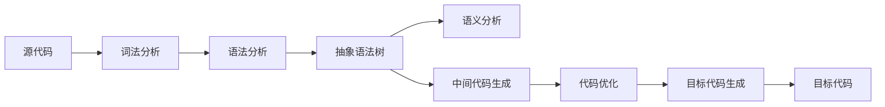

# 编译原理在线答疑系统设计与实现

## 1. 背景介绍
### 1.1 编译原理的重要性
编译原理是计算机科学中一门重要的基础课程,它研究如何将高级程序设计语言翻译成计算机可以执行的低级语言(如汇编语言或机器语言)的理论和方法。编译原理涉及词法分析、语法分析、语义分析、中间代码生成、代码优化、目标代码生成等一系列重要环节。掌握编译原理知识对于深入理解程序语言的工作原理、开发高质量的编译器、设计新的程序语言等都有重要意义。

### 1.2 在线答疑系统的必要性
由于编译原理知识点繁多,涉及的概念和算法比较抽象,学生在学习过程中经常会遇到各种疑惑和问题。传统的答疑方式,如当面询问老师、查阅参考书等,存在时间和空间上的限制,不能及时有效地解决学生的问题。因此,开发一个功能完善、易于使用的在线答疑系统,可以帮助学生更好地掌握编译原理知识,提高学习效率。

### 1.3 系统设计目标
本文旨在设计并实现一个编译原理在线答疑系统,满足以下目标:
1. 提供丰富的编译原理知识库,涵盖各个重要知识点;  
2. 支持学生以问答的形式提出疑问,并给出准确、详细的解答;
3. 引入人工智能技术,实现自动问答和智能推荐功能;
4. 提供友好的用户界面,便于学生使用和互动;
5. 具备良好的扩展性,可以持续更新和完善知识库。

## 2. 核心概念与联系
### 2.1 编译过程的主要阶段
编译过程通常分为以下几个主要阶段:
- 词法分析(Lexical Analysis):将源程序的字符流转换成词法单元(Token)序列
- 语法分析(Syntax Analysis):根据语法规则分析Token序列,构建语法树 
- 语义分析(Semantic Analysis):检查语法树的静态语义,如类型检查等
- 中间代码生成(Intermediate Code Generation):将语法树转换为中间表示形式
- 代码优化(Code Optimization):对中间代码进行转换和优化,提高运行效率
- 目标代码生成(Target Code Generation):将优化后的中间代码转换成目标机器代码

### 2.2 编译器前端与后端
编译器通常被划分为前端(Frontend)和后端(Backend)两大部分:
- 编译器前端:包括词法分析、语法分析、语义分析,与源语言相关
- 编译器后端:包括中间代码生成、代码优化、目标代码生成,与目标机器相关

### 2.3 抽象语法树的作用
抽象语法树(Abstract Syntax Tree, AST)是编译器的一种重要的中间表示形式,通过去除了源代码中的分隔符、注释等对语法分析无用的成分,只保留了语法结构信息,是对源代码结构的一种抽象。AST在编译器中有以下作用:
- 作为语义分析的输入,用于检查语义错误
- 作为中间代码生成的基础,用于生成三地址码等中间表示
- 作为代码优化的对象,便于实现各种优化算法

### 2.4 编译器与解释器的区别
编译器和解释器都是高级语言的执行工具,但二者在工作原理上有所不同:
- 编译器:将源代码全部转换成目标代码,再由机器执行目标代码
- 解释器:对源代码逐条进行解释执行,不生成目标代码

一般来说,编译执行的程序运行效率较高,但编译过程较慢;而解释执行的程序启动速度快,但运行效率较低。

### 2.5 概念之间的联系
下图展示了编译原理中各个核心概念之间的联系:



从图中可以看出,编译过程是由词法分析、语法分析、语义分析、中间代码生成、代码优化、目标代码生成等阶段组成的一个流水线,前一阶段的输出是后一阶段的输入。理解这些概念之间的联系,有助于从全局上把握编译原理知识体系。

## 3. 核心算法原理与操作步骤
### 3.1 词法分析算法
词法分析的任务是将源代码转换成Token序列。常见的词法分析算法有:
- 简单分词法:根据分隔符(如空格)将源代码切分成若干单词,再判断单词的类型
- 有限自动机法:用确定有限自动机(DFA)描述Token的模式,通过状态转移识别Token

以有限自动机法为例,其基本步骤如下:
1. 定义Token的种类和模式(正则表达式)
2. 为每种Token构建DFA
3. 将源代码读入缓冲区
4. 从DFA的初态开始,依次读入字符,进行状态转移
5. 当到达接收态时,输出对应的Token,回到初态继续识别
6. 重复4-5步,直到处理完所有字符

### 3.2 语法分析算法
语法分析的任务是根据语法规则分析Token序列,构建语法树。常见的语法分析算法有:
- 自顶向下分析法:从语法树的根节点开始,自顶向下构建语法树
- 自底向上分析法:从Token序列开始,自底向上规约出语法树

以LL(1)分析法(一种自顶向下分析法)为例,其基本步骤如下:
1. 将语法规则转换成LL(1)文法
2. 构建LL(1)分析表
3. 创建分析栈,初始时栈中只有文法开始符号
4. 从Token序列中读入一个Token
5. 将栈顶符号与当前Token查询分析表,进行相应的动作(推导或匹配)
6. 重复4-5步,直到分析栈为空且Token序列处理完毕

### 3.3 中间代码生成算法
中间代码生成的任务是将抽象语法树转换成中间表示形式,常见的中间表示有:
- 三地址码:每条指令最多有三个操作数,如 x := y + z
- P-代码:一种与机器无关的假想指令系统
- 四元式:用(op, arg1, arg2, result)的形式表示指令

以三地址码生成为例,其基本步骤如下:
1. 为语法树的每个节点生成一个临时变量
2. 采用后序遍历语法树的方式
3. 根据节点的语义规则,生成相应的三地址码指令
4. 重复2-3步,直到遍历完整棵语法树

### 3.4 目标代码生成算法 
目标代码生成的任务是将中间代码转换成目标机器的汇编代码或机器码,需要考虑目标机器的指令系统、寄存器分配等因素。基本步骤如下:
1. 将中间代码划分成若干基本块
2. 对每个基本块进行寄存器分配,尽量使用寄存器存放变量
3. 根据中间指令和寄存器分配结果,生成目标机器指令
4. 添加必要的栈帧管理和控制流指令
5. 重复2-4步,直到转换完所有基本块

## 4. 数学模型与公式讲解
### 4.1 词法分析中的正则表达式
在词法分析中,我们通常用正则表达式来描述Token的模式。正则表达式是一种用于匹配字符串的形式语言,它由普通字符和元字符(如*, +, ?等)组成。例如:
- a*b表示 "a的任意次重复,后接一个b" 
- (a|b)c表示 "a或b,后接一个c"

正则表达式可以用形式化的方法定义,设Σ为字母表,则:
1. ∅(空集)和ϵ(空串)是正则表达式
2. 任意a∈Σ是正则表达式
3. 若r和s是正则表达式,则r|s, rs, r*, r+, r?也是正则表达式
4. 仅由有限次规则1-3构造出的表达式才是正则表达式

### 4.2 语法分析中的上下文无关文法
在语法分析中,我们通常用上下文无关文法(Context-free Grammar, CFG)来定义程序语言的语法结构。CFG是一种用于描述语言的形式化工具,它由一组产生式规则组成,每条规则形如:
$$A \to \alpha$$
其中,A是非终结符,$\alpha$是由终结符和非终结符组成的符号串。例如:
- S -> A | B
- A -> aA | ϵ
- B -> bB | ϵ

上下文无关文法可以用四元组G=(V, T, P, S)形式化定义:
- V是非终结符集合
- T是终结符集合
- P是产生式规则集合
- S∈V是开始符号

CFG与语言之间存在着一一对应的关系,任何一个CFG都唯一确定了一个语言,语言中的句子可以通过对开始符号进行若干次推导得到。

### 4.3 自动机与形式语言
在编译原理中,我们经常用有限自动机(Finite Automaton, FA)来刻画词法结构,用下推自动机(Pushdown Automaton, PDA)来刻画语法结构。它们都属于形式语言理论中的重要模型。

有限自动机由五元组M=(Q, Σ, δ, q0, F)定义:
- Q是有限状态集
- Σ是有限字母表
- δ: Q×Σ -> Q是转移函数
- q0∈Q是初始状态
- F⊆Q是接收状态集

有限自动机接受的语言是正则语言,与正则表达式所描述的语言等价。

下推自动机由七元组M=(Q, Σ, Γ, δ, q0, Z0, F)定义:
- Q是有限状态集
- Σ是输入字母表
- Γ是栈字母表
- δ: Q×(Σ∪{ϵ})×Γ -> Q×Γ*是转移函数
- q0∈Q是初始状态
- Z0∈Γ是初始栈符号
- F⊆Q是接收状态集

下推自动机接受的语言是上下文无关语言,与上下文无关文法生成的语言等价。

### 4.4 属性文法与语义规则
在编译原理中,我们通常用属性文法(Attribute Grammar, AG)来描述语言的静态语义,用语义规则来计算语法树节点的属性值。属性文法是上下文无关文法的扩展,每个文法符号除了有语法类型外,还带有一组属性,每条产生式除了描述语法结构外,还给出了属性值的计算规则。例如:

对于产生式 E -> E1 + T,可以定义如下的语义规则:
- E.val = E1.val + T.val
- E.type = if (E1.type == T.type == int) then int else error

属性有综合属性和继承属性两种,分别对应自底向上和自顶向下的属性计算方式。

形式化地,属性文法是一个五元组AG=(G, A, R, S, D),其中:
- G是一个上下文无关文法
- A=∪Ax是属性集合,Ax表示符号X的属性
- R是属性值的计算规则集合
- S⊆V是综合属性集合
- D⊆V是继承属性集合

属性文法为语法制导的翻译提供了理论基础,通过在语法分析过程中计算节点属性,可以将语法分析与语义分析结合起来,生成抽象语法树。

## 5. 项目实践:代码实例与讲解
下面我们通过一个简单的词法分析器实例,来演示编译原理知识在实际项目中的应用。该词法分析器采用有限自动机算法,可以识别标识符、整数、关键字等Token。

```python
import re

# 定义Token类型
TOKEN_TYPE = [
    ('KEYWORD', r'if|else|for|while|break|continue|return|int|float|void'),
    ('IDENTIFIER', r'[a-zA-Z_][a-zA-Z0-9_]*'),
    ('NUMBER', r'\d+