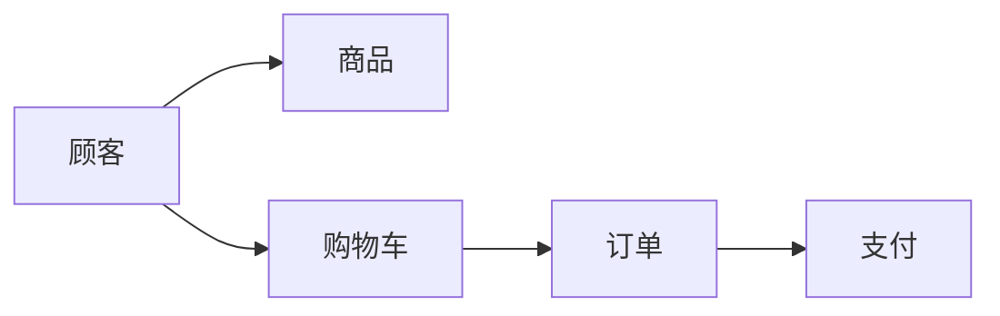

# 网上书店售书系统详细设计与具体代码实现

## 1.背景介绍

在当今互联网时代,电子商务已经深入到人们生活的方方面面。网上购物凭借其便捷、高效、价格实惠等优势,受到越来越多消费者的青睐。作为电商的重要组成部分,网上书店为广大读者提供了丰富多样的图书资源,极大地满足了人们的阅读需求。

本文将以网上书店售书系统为例,详细阐述该系统的设计思路和具体实现过程。通过对系统架构、数据库设计、核心算法、关键代码的深入剖析,帮助读者全面理解网上书店售书系统的技术原理和开发流程,为相关领域的开发者提供有益的参考和启发。

### 1.1 网上书店的发展现状
#### 1.1.1 市场规模不断扩大
#### 1.1.2 竞争日益激烈 
#### 1.1.3 个性化服务成为趋势

### 1.2 网上书店售书系统的意义
#### 1.2.1 提升用户体验
#### 1.2.2 提高运营效率
#### 1.2.3 增强企业竞争力

### 1.3 系统开发目标
#### 1.3.1 功能完善
#### 1.3.2 性能优异
#### 1.3.3 安全可靠

## 2.核心概念与联系

在网上书店售书系统中,涉及到一些核心概念,理解它们之间的联系对于系统设计至关重要。

### 2.1 顾客
顾客是网上书店的服务对象,他们通过注册账号,浏览商品,下单购买等一系列行为与系统产生交互。系统需要为顾客提供良好的用户体验。

### 2.2 商品
商品是网上书店的销售对象,包括各种类别的图书。每件商品都有对应的属性信息,如书名、作者、出版社、价格等。系统要支持商品的管理功能。

### 2.3 订单
顾客通过下单的方式购买心仪的商品,生成订单。订单包含商品信息、收货地址、支付状态等重要数据。系统需要能够有效管理和跟踪订单。

### 2.4 购物车
购物车是顾客在购物过程中临时存放商品的容器。顾客可以向购物车中添加、修改、删除商品,最终确认购买。购物车是连接顾客和订单的重要媒介。

### 2.5 支付
顾客通过各种支付手段完成订单费用的支付,如信用卡、网上银行、第三方支付平台等。系统要无缝对接主流支付渠道,确保交易安全。

以下是核心概念之间联系的 Mermaid 流程图:



从图中可以看出,顾客浏览选购商品,通过购物车收集商品形成订单,最后完成支付,整个流程环环相扣,构成了网上书店售书系统的基本业务逻辑。

## 3.核心算法原理具体操作步骤

网上书店售书系统的核心算法主要体现在以下几个方面:

### 3.1 协同过滤推荐算法
协同过滤是一种常用的推荐算法,通过分析用户的历史行为,发现用户的潜在偏好,从而给出个性化推荐。
#### 3.1.1 收集用户行为数据
记录用户的浏览、购买、评分等行为,形成用户-物品矩阵。
#### 3.1.2 计算用户或物品之间的相似度
采用余弦相似度等方法,计算用户或物品的相似程度。
#### 3.1.3 生成推荐结果
根据用户的历史行为和相似度,为其推荐可能感兴趣的商品。

### 3.2 关键词搜索算法
关键词搜索是帮助用户快速定位所需商品的重要手段。
#### 3.2.1 建立倒排索引
对商品的标题、描述等文本信息进行分词,建立关键词到商品的映射关系。
#### 3.2.2 查询关键词
用户输入搜索关键词,系统在倒排索引中查找包含该关键词的商品。
#### 3.2.3 返回搜索结果
根据相关性评分,将匹配的商品按照一定的排序规则返回给用户。

### 3.3 订单状态流转算法
订单状态流转控制着从下单到收货的整个过程,直接影响到用户体验。
#### 3.3.1 定义订单状态
设定各个订单状态,如待付款、已付款、备货中、配送中、已完成等。
#### 3.3.2 状态变更条件
明确各状态之间的变更条件,例如付款成功后由待付款变为已付款状态。
#### 3.3.3 状态变更操作
执行状态变更涉及的一系列操作,如减库存、触发配送等,保证状态流转的正确性。

## 4.数学模型和公式详细讲解举例说明

在网上书店售书系统中,一些关键功能的实现离不开数学模型和公式的支持。下面以协同过滤推荐算法为例,详细讲解其中用到的数学知识。

### 4.1 用户-物品矩阵
协同过滤的基础是用户-物品矩阵,它描述了用户对物品的偏好程度。假设有m个用户和n个物品,则该矩阵可表示为:

$$
R=\begin{bmatrix}
r_{11} & r_{12} & \cdots & r_{1n}\\
r_{21} & r_{22} & \cdots & r_{2n}\\
\vdots & \vdots & \ddots & \vdots\\
r_{m1} & r_{m2} & \cdots & r_{mn}\\
\end{bmatrix}
$$

其中, $r_{ij}$ 表示用户 $i$ 对物品 $j$ 的偏好值,通常由显式的评分或隐式的行为体现。

### 4.2 相似度计算
协同过滤需要计算用户或物品之间的相似度,常用的方法有余弦相似度、皮尔逊相关系数等。以余弦相似度为例,对于两个用户 $u$ 和 $v$ ,它们的相似度定义为:

$$
\text{sim}(u,v)=\frac{\sum_{i\in I_{uv}}r_{ui}r_{vi}}{\sqrt{\sum_{i\in I_{u}}r_{ui}^2}\sqrt{\sum_{i\in I_{v}}r_{vi}^2}}
$$

其中, $I_{uv}$ 表示用户 $u$ 和 $v$ 共同评分过的物品集合, $I_u$ 和 $I_v$ 分别表示用户 $u$ 和 $v$ 评分过的物品集合。

### 4.3 推荐结果生成
根据用户之间的相似度,可以预测用户对未评分物品的偏好,从而给出推荐。对于用户 $u$ 和物品 $i$ ,预测评分 $\hat{r}_{ui}$ 的计算公式为:

$$
\hat{r}_{ui}=\bar{r}_u+\frac{\sum_{v\in S^k(u)}\text{sim}(u,v)(r_{vi}-\bar{r}_v)}{\sum_{v\in S^k(u)}|\text{sim}(u,v)|}
$$

其中, $\bar{r}_u$ 和 $\bar{r}_v$ 分别表示用户 $u$ 和 $v$ 的平均评分, $S^k(u)$ 表示与用户 $u$ 最相似的 $k$ 个用户集合。

通过上述公式,可以计算出用户对各个未评分物品的预测评分,选取评分最高的物品作为推荐结果。

举例来说,假设用户A对物品X的偏好未知,通过协同过滤,发现用户B和C与A最为相似,且B和C都对X有较高评分,则可以推断出A也可能喜欢物品X,从而将X推荐给A。

## 5.项目实践:代码实例和详细解释说明

下面以购物车模块为例,给出部分关键代码实现,并进行详细解释说明。

### 5.1 购物车实体类

```java
public class Cart {
    private Long id; //购物车ID
    private Long userId; //用户ID
    private List<CartItem> items; //购物车商品项列表
    
    //getter和setter方法省略
}

public class CartItem {
    private Long id; //商品项ID  
    private Long productId; //商品ID
    private String productName; //商品名称
    private BigDecimal price; //商品价格
    private Integer quantity; //商品数量
    
    //getter和setter方法省略
}
```

购物车实体类 `Cart` 包含购物车ID、用户ID和商品项列表三个属性。商品项实体类 `CartItem` 包含商品项ID、商品ID、商品名称、商品价格和商品数量五个属性。这样设计能够清晰地表示购物车的数据结构。

### 5.2 添加商品到购物车

```java
@Service
public class CartService {
    @Autowired
    private CartRepository cartRepository;
    
    public void addToCart(Long userId, Long productId, Integer quantity) {
        Cart cart = cartRepository.findByUserId(userId);
        if (cart == null) {
            cart = new Cart();
            cart.setUserId(userId);
            cart.setItems(new ArrayList<>());
        }
        
        CartItem item = findItem(cart, productId);
        if (item == null) {
            item = new CartItem();
            item.setProductId(productId);
            item.setQuantity(quantity);
            cart.getItems().add(item);
        } else {
            item.setQuantity(item.getQuantity() + quantity);
        }
        
        cartRepository.save(cart);
    }
    
    private CartItem findItem(Cart cart, Long productId) {
        return cart.getItems().stream()
            .filter(item -> item.getProductId().equals(productId))
            .findFirst()
            .orElse(null);
    }
}
```

`addToCart` 方法实现了将商品添加到购物车的逻辑。首先根据用户ID查找购物车,如果不存在则创建一个新的购物车。然后判断要添加的商品是否已经在购物车中,如果存在则增加数量,否则新建一个商品项添加到购物车。最后将更新后的购物车持久化到数据库中。

其中 `findItem` 方法使用了Java 8的Stream API,通过Lambda表达式找到购物车中商品ID匹配的商品项。这种函数式编程的写法使得代码更加简洁易读。

### 5.3 查询购物车商品列表

```java
@Service
public class CartService {
    @Autowired
    private CartRepository cartRepository;
    
    public List<CartItem> listCartItems(Long userId) {
        Cart cart = cartRepository.findByUserId(userId);
        if (cart != null) {
            return cart.getItems();
        }
        return Collections.emptyList();
    }
}
```

`listCartItems` 方法根据用户ID查询购物车中的商品项列表。如果购物车不存在则返回一个空列表,避免出现null值。

### 5.4 修改购物车商品数量

```java
@Service
public class CartService {
    @Autowired
    private CartRepository cartRepository;
    
    public void updateQuantity(Long userId, Long productId, Integer quantity) {
        Cart cart = cartRepository.findByUserId(userId);
        if (cart != null) {
            CartItem item = findItem(cart, productId);
            if (item != null) {
                item.setQuantity(quantity);
                cartRepository.save(cart);
            }
        }
    }
    
    private CartItem findItem(Cart cart, Long productId) {
        return cart.getItems().stream()
            .filter(item -> item.getProductId().equals(productId))
            .findFirst()
            .orElse(null);
    }
}
```

`updateQuantity` 方法用于修改购物车中指定商品的数量。通过用户ID和商品ID定位到购物车和商品项,然后更新商品数量并保存购物车。同样使用了 `findItem` 方法查找商品项。

### 5.5 删除购物车商品

```java
@Service
public class CartService {
    @Autowired
    private CartRepository cartRepository;
    
    public void removeItem(Long userId, Long productId) {
        Cart cart = cartRepository.findByUserId(userId);
        if (cart != null) {
            CartItem item = findItem(cart, productId);
            if (item != null) {
                cart.getItems().remove(item);
                cartRepository.save(cart);
            }
        }
    }
    
    private CartItem findItem(Cart cart, Long productId) {
        return cart.getItems().stream()
            .filter(item -> item.getProductId().equals(productId))
            .findFirst()
            .orElse(null);
    }
}
```

`removeItem` 方法实现了从购物车中删除指定商品的功能。先查找购物车和商品项,如果