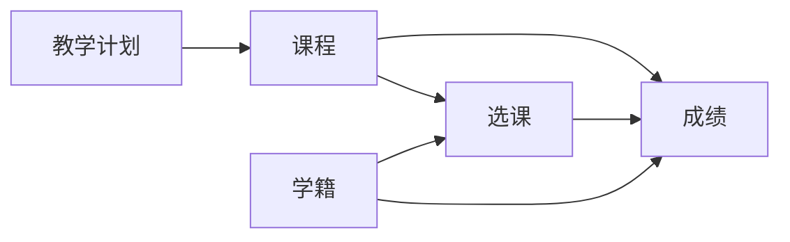

# 网上教务系统详细设计与具体代码实现

## 1.背景介绍

在当今信息化时代,高校教学管理工作面临着新的挑战和机遇。传统的教务管理模式已经难以适应日益增长的教学管理需求,亟需引入先进的信息技术手段来提高教学管理的效率和质量。网上教务系统应运而生,它利用互联网技术,为学校师生提供一个全面、便捷、高效的教学管理平台。

本文将从需求分析、架构设计、数据库设计、核心算法、关键代码实现等方面,对网上教务系统进行详细阐述,力求为读者提供一个全面、深入、实用的技术参考。

### 1.1 网上教务系统的必要性

#### 1.1.1 提高教学管理效率

网上教务系统可以实现教学业务流程的自动化和信息化,大大提高教务管理人员的工作效率,减轻工作强度。

#### 1.1.2 方便师生教学互动

通过网上教务系统,教师可以发布教学信息、布置作业、在线答疑等,学生可以在线选课、查询成绩、参与教学互动,极大地方便了师生之间的教学活动。

#### 1.1.3 加强教学质量监控

网上教务系统可以及时、准确、全面地采集教学过程数据,为教学质量监控和评估提供数据支撑,有利于学校及时发现和解决教学中存在的问题。

### 1.2 网上教务系统的发展现状

目前,国内外许多高校都已经建立了各具特色的网上教务系统。这些系统在促进教学管理信息化、提高管理效率等方面发挥了重要作用。但是,现有的网上教务系统在功能全面性、用户体验、移动访问等方面还有待进一步提升。

## 2.核心概念与关联

在网上教务系统中,有几个核心概念需要重点关注:

### 2.1 教学计划

教学计划是指学校根据人才培养目标和学科专业特点,对教学活动进行总体设计和安排。它包括培养目标、学制、课程设置、学时学分分配、教学进程等内容。教学计划是组织教学活动的基本依据。

### 2.2 课程

课程是教学计划的基本单元,是传授知识、培养能力的主要载体。每门课程都有明确的教学目标、教学内容、教学要求等。学生通过修读课程,获得相应的学分。

### 2.3 选课

选课是指学生根据教学计划和个人兴趣,自主选择所要修读的课程。网上教务系统要提供灵活、便捷的选课功能,满足不同学生的个性化需求。

### 2.4 成绩

成绩是学生修读课程后的学习效果评价。成绩记录是学籍管理的重要内容。网上教务系统要实现成绩的录入、查询、统计分析等功能。

### 2.5 学籍

学籍是学生在校学习期间的身份记录,包括学号、姓名、年级、专业、班级等基本信息,以及入学、休学、复学、退学、毕业等状态变化。

下图展示了网上教务系统的核心概念及其关联关系:



从图中可以看出,教学计划是核心,它决定了课程的设置;学生通过选课修读课程,并取得相应成绩;学籍贯穿于选课、成绩等各环节。网上教务系统要围绕这些核心概念,构建完善的功能模块。

## 3.核心算法原理具体操作步骤

网上教务系统涉及许多复杂的业务逻辑和数据处理,需要使用一些核心算法来实现。下面以选课算法为例,讲解其原理和实现步骤。

### 3.1 选课算法原理

选课是网上教务系统的一个核心功能,其算法目标是在满足各种约束条件(如课程容量、时间冲突等)的前提下,尽可能满足学生的选课需求。这可以抽象为一个约束优化问题。

常见的选课算法有贪心算法、回溯算法、优先队列算法等。这里我们采用贪心算法,其基本思路是:每次选择当前最优的课程进行分配,直到所有学生的选课需求都得到满足或无法继续分配为止。

### 3.2 选课算法步骤

#### 3.2.1 数据准备

1. 学生选课申请列表 studentCourseList,包含学生id、申请的课程id、优先级等信息。
2. 课程信息列表 courseList,包含课程id、课程名称、课程容量(剩余可选人数)、时间等。

#### 3.2.2 算法实现

1. 对每个学生的选课申请按优先级从高到低排序。
2. 遍历每个学生的选课申请:
   - 对每门申请的课程,检查是否符合选课条件(如是否已选、容量是否足够、时间是否冲突等),如果满足则进行分配并更新相关数据。
   - 如果所有课程都不满足条件,则该学生的选课失败。
3. 输出选课结果。

#### 3.2.3 算法优化

1. 可以先对课程按热门程度排序,优先分配热门课程,提高总体满足度。
2. 对于一些关键课程(如必修课),可以预留一定名额,避免过早被选满。
3. 引入候补机制,在课程满员后记录候补名单,如有空缺则依次通知候补学生。

## 4.数学模型和公式详细讲解举例说明

在网上教务系统中,有些功能需要用到数学建模和计算。下面以学生成绩加权平均分计算为例,给出详细的公式讲解和举例说明。

### 4.1 加权平均分模型

假设一个学生修读了n门课程,每门课程的学分为$credit_i$,成绩为$score_i$(i=1,2,...,n),则该学生的加权平均分$GPA$可以用下面的公式计算:

$$GPA=\frac{\sum_{i=1}^{n} credit_i \times score_i}{\sum_{i=1}^{n} credit_i}$$

其中,$\sum$表示求和符号。

### 4.2 举例说明

假设一个学生修读了3门课程,各课程学分和成绩如下:

| 课程编号 | 学分 | 成绩 |
|:------:|:---:|:----:|
| 1      | 3   | 90   |
| 2      | 2   | 85   |
| 3      | 4   | 80   |

根据加权平均分公式,可以计算出该学生的加权平均分为:

$$GPA=\frac{3 \times 90 + 2 \times 85 + 4 \times 80}{3+2+4}=83.89$$

可见,加权平均分比简单的算术平均分(85)要低,这是因为加权平均分考虑了每门课程的学分权重。在实际成绩计算中,我们通常使用加权平均分,以更加准确、公平地评价学生的学习效果。

## 5.项目实践:代码实例和详细解释说明

下面以Java语言为例,给出网上教务系统中几个核心功能的代码实现。

### 5.1 学生选课功能

```java
public class CourseService {
    // 学生选课
    public boolean selectCourse(String studentId, String courseId) {
        // 1.检查学生是否已选该课程
        if (isSelected(studentId, courseId)) {
            return false;
        }
        
        // 2.检查课程是否已满
        Course course = courseDao.getById(courseId);
        if (course.getCapacity() <= course.getSelectedCount()) {
            return false;
        }
        
        // 3.检查是否有时间冲突
        if (hasTimeConflict(studentId, courseId)) {
            return false;
        }
        
        // 4.进行选课操作
        StudentCourse sc = new StudentCourse();
        sc.setStudentId(studentId);
        sc.setCourseId(courseId);
        studentCourseDao.add(sc);
        
        // 5.更新课程已选人数
        course.setSelectedCount(course.getSelectedCount() + 1);
        courseDao.update(course);
        
        return true;
    }
}
```

上面的代码实现了学生选课的基本逻辑:

1. 首先检查学生是否已经选过该课程,避免重复选课。
2. 然后检查课程是否已经选满,如果已满则不能再选。
3. 再检查该课程与学生已选课程是否有时间冲突。
4. 如果以上条件都满足,则将选课记录插入数据库,并更新课程的已选人数。

其中,`isSelected`、`hasTimeConflict`等方法的具体实现这里就不赘述了。

### 5.2 成绩录入功能

```java
public class ScoreService {
    // 录入成绩
    public void addScore(String studentId, String courseId, double score) {
        // 1.检查是否已录入过成绩
        if (isScoreExist(studentId, courseId)) {
            throw new IllegalArgumentException("成绩已存在,不能重复录入!");
        }
        
        // 2.检查成绩是否合法
        if (score < 0 || score > 100) {
            throw new IllegalArgumentException("成绩必须在0-100之间!");
        }
        
        // 3.保存成绩
        StudentCourse sc = studentCourseDao.getByStudentIdAndCourseId(studentId, courseId);
        sc.setScore(score);
        studentCourseDao.update(sc);
    }
}
```

成绩录入的逻辑相对简单:

1. 首先检查是否已经录入过成绩,避免重复录入。
2. 然后检查成绩是否在合法范围内。
3. 最后更新数据库中的成绩记录。

需要注意的是,这里假设在录入成绩时,选课记录已经存在。在实际项目中,可能需要先判断选课记录是否存在。

### 5.3 成绩查询功能

```java
public class ScoreService {
    // 查询成绩
    public List<StudentCourseVo> getScoreList(String studentId) {
        // 1.根据学生id查询选课记录
        List<StudentCourse> scList = studentCourseDao.getByStudentId(studentId);
        
        // 2.获取每门课程的信息并封装为VO对象
        List<StudentCourseVo> scoreList = new ArrayList<>();
        for (StudentCourse sc : scList) {
            Course course = courseDao.getById(sc.getCourseId());
            StudentCourseVo scVo = new StudentCourseVo();
            scVo.setCourseId(course.getId());
            scVo.setCourseName(course.getName());
            scVo.setCredit(course.getCredit());
            scVo.setScore(sc.getScore());
            scoreList.add(scVo);
        }
        
        return scoreList;
    }
}
```

成绩查询的实现步骤如下:

1. 首先根据学生id查询该学生的所有选课记录。
2. 然后遍历每条选课记录,获取对应的课程信息,并将成绩、学分等数据封装为VO对象。
3. 最后将所有VO对象放入List中返回。

这里使用了VO(View Object)对象,这是一种常见的数据传输对象,用于封装业务层与表现层之间的数据传输,避免了直接将数据库实体对象暴露给表现层。

以上就是网上教务系统几个核心功能的代码实现示例,这只是一个简单的演示,在实际项目中还需要考虑更多的业务逻辑和异常处理。

## 6.实际应用场景

网上教务系统在高校教学管理中有广泛的应用,下面列举几个典型场景。

### 6.1 学生选课

每学期开始,学生都需要根据教学计划和个人情况选择课程。网上教务系统提供了在线选课功能,学生可以浏览课程信息,了解课程的时间、地点、授课教师等,然后根据自己的需求和时间安排,提交选课申请。系统会自动进行课程冲突检测、人数限制判断等,并及时给出选课结果反馈。这大大方便了学生选课,也减轻了教务管理人员的工作量。

### 6.2 教师成绩录入

期末考试后,教师需要登录系统录入学生的考试成绩。网上教务系统提供了成绩录入模块,教师可以方便地输入每个学生的成绩,系统会自动进行成绩合法性