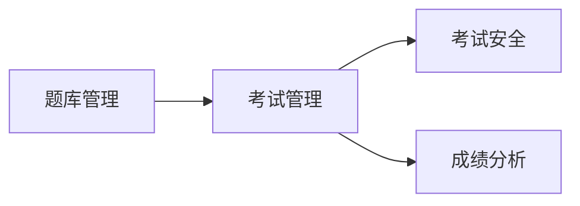

## 1.背景介绍

随着互联网技术的快速发展，人们的生活方式和工作方式都发生了深刻的变化。教育领域也不例外，越来越多的教育机构开始尝试使用在线考试系统来进行教学评估。在这种背景下，如何设计和实现一个高效、安全、易用的在线考试系统就成为了一个重要的问题。

## 2.核心概念与联系

在线考试系统涉及到的核心概念主要有考试管理、题库管理、考试安全、成绩分析等。这些核心概念之间的联系主要体现在数据流动和功能交互上。例如，题库管理是考试管理的基础，考试安全是保证考试公正性的重要手段，成绩分析是提高教学质量的重要工具。



## 3.核心算法原理具体操作步骤

在线考试系统的核心算法主要涉及到题库管理和成绩分析两个部分。题库管理的核心算法主要是题目的分类和检索，成绩分析的核心算法主要是统计分析和可视化。

题库管理的具体操作步骤如下：

1. 根据题目的类型、难度、知识点等属性对题目进行分类。
2. 使用倒排索引等搜索技术进行题目检索。

成绩分析的具体操作步骤如下：

1. 对考试成绩进行统计分析，包括平均分、最高分、最低分、及格率等。
2. 使用图表等可视化工具对分析结果进行展示。

## 4.数学模型和公式详细讲解举例说明

在成绩分析中，我们通常会使用一些数学模型和公式来帮助我们进行统计分析。例如，我们可以使用均值和标准差来描述成绩的分布情况。

均值的计算公式为：

$$
\bar{X} = \frac{1}{n}\sum_{i=1}^{n}X_i
$$

其中，$X_i$ 表示第 $i$ 个学生的成绩，$n$ 表示学生的总数。

标准差的计算公式为：

$$
S = \sqrt{\frac{1}{n-1}\sum_{i=1}^{n}(X_i - \bar{X})^2}
$$

其中，$X_i$ 和 $\bar{X}$ 的含义同上。

通过这两个公式，我们就可以得到成绩的平均水平和波动情况，从而对教学效果进行评估。

## 5.项目实践：代码实例和详细解释说明

下面我们来看一下如何使用 Python 来实现题库管理和成绩分析的功能。

首先，我们需要创建一个题库类来管理所有的题目。这个类包含了添加题目、删除题目、搜索题目等方法。

```python
class QuestionBank:
    def __init__(self):
        self.questions = []

    def add_question(self, question):
        self.questions.append(question)

    def remove_question(self, question):
        self.questions.remove(question)

    def search_question(self, keyword):
        return [q for q in self.questions if keyword in q.content]
```

然后，我们需要创建一个成绩类来进行成绩分析。这个类包含了计算平均分、标准差等方法。

```python
import numpy as np

class ScoreAnalysis:
    def __init__(self, scores):
        self.scores = np.array(scores)

    def mean(self):
        return np.mean(self.scores)

    def std_dev(self):
        return np.std(self.scores)
```

通过这两个类，我们就可以实现题库管理和成绩分析的基本功能。

## 6.实际应用场景

在线考试系统可以广泛应用于各种在线教育和远程教育场景，例如在线课程、企业培训、认证考试等。通过在线考试系统，教育机构可以更方便地管理考试，学生也可以更方便地参与考试。

## 7.工具和资源推荐

在设计和实现在线考试系统时，我们可以使用一些现有的工具和资源来提高开发效率，例如：

- Django：一个强大的 Python Web 开发框架，可以帮助我们快速搭建 Web 应用。
- MySQL：一个广泛使用的关系型数据库，可以用来存储题目和成绩数据。
- Matplotlib：一个 Python 的绘图库，可以用来进行成绩分析的可视化。

## 8.总结：未来发展趋势与挑战

随着互联网技术的发展，在线考试系统的功能和性能将会进一步提升，例如支持更多的题型、提供更丰富的分析工具等。同时，考试安全和数据保护也将成为未来发展的重要挑战。

## 9.附录：常见问题与解答

1. 如何保证在线考试的公正性？

   可以通过考试监控、防作弊算法等技术手段来保证在线考试的公正性。

2. 如何处理大量的考试数据？

   可以使用数据库和数据分析工具来存储和处理大量的考试数据。

3. 如何提高在线考试的用户体验？

   可以通过优化界面设计、提供个性化服务等方式来提高在线考试的用户体验。

作者：禅与计算机程序设计艺术 / Zen and the Art of Computer Programming