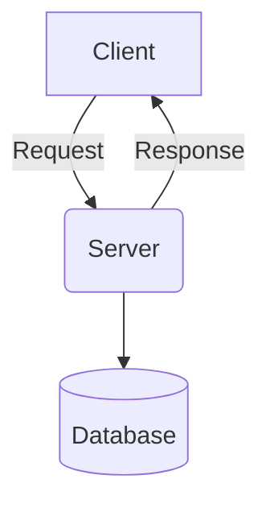

# 网上选排课系统详细设计与具体代码实现

## 1. 背景介绍

### 1.1 选课系统的重要性

在现代教育体系中,选课系统扮演着至关重要的角色。它是学生们选择课程、规划学习计划的关键工具,也是学校管理课程资源、安排师资的重要平台。一个高效、便捷、公平的选课系统,不仅能够优化学习体验,还能够促进教育资源的合理分配,提高教学质量。

### 1.2 传统选课系统的局限性

然而,传统的选课系统存在诸多不足。例如需要手动处理大量选课数据、无法实时响应选课请求、缺乏公平的随机分配算法等。这些问题不仅增加了管理成本,也容易导致选课过程的混乱和不公平。

### 1.3 网上选课系统的优势

随着信息技术的快速发展,网上选课系统应运而生。相较于传统系统,网上选课系统具有如下优势:

- 自动化数据处理,减轻人工负担
- 实时响应选课请求,提高效率
- 采用公平的随机分配算法
- 提供多种选课策略,满足不同需求
- 方便的用户界面,提升用户体验

## 2. 核心概念与联系

### 2.1 系统架构

网上选课系统通常采用 C/S (Client/Server) 或 B/S (Browser/Server) 架构。其中,客户端负责提供用户界面,服务器端负责处理业务逻辑和数据存储。两者通过网络进行通信和数据交互。



### 2.2 核心概念

- 用户 (User): 包括学生和管理员两种角色
- 课程 (Course): 具有课程名称、教师、时间、学分等属性
- 选课策略 (Policy): 如先到先得、随机分配、按优先级分配等
- 选课结果 (Result): 每个学生选课的最终结果

### 2.3 关系联系

用户通过客户端发起选课请求,服务器端根据选课策略处理请求,并将选课结果存储到数据库中。用户可查看个人的选课结果,管理员可管理课程信息和选课策略。

## 3. 核心算法原理具体操作步骤  

### 3.1 随机分配算法

随机分配算法是网上选课系统中最常用的公平算法之一。它的基本思想是:对于每一门课程,先确定可选人数,然后从所有选课学生中随机挑选出可选人数的学生,其余学生将无法选择该课程。

具体操作步骤如下:

1. 获取课程可选人数 `capacity`
2. 获取所有选课学生列表 `studentList`
3. 如果 `studentList` 的长度小于等于 `capacity`,那么所有学生都可以选这门课
4. 否则,从 `studentList` 中随机挑选出 `capacity` 个学生,作为可选学生列表 `admittedList`
5. 其余学生将无法选择该课程

该算法的优点是公平性强,每个学生被选中的概率相等。缺点是可能出现"捡肥拾遗"的情况,即个别学生可能全选或全不选。

### 3.2 优先级分配算法

另一种常见的选课算法是优先级分配算法。它的基本思想是:为每个学生指定一个优先级,在选课时,按照优先级从高到低的顺序,依次为学生分配课程。

具体操作步骤如下:

1. 获取课程可选人数 `capacity` 
2. 获取所有选课学生列表 `studentList`,并为每个学生指定一个优先级 `priority`
3. 按照 `priority` 从高到低对 `studentList` 进行排序
4. 从排序后的列表中,依次取出前 `capacity` 个学生,作为可选学生列表 `admittedList`
5. 其余学生将无法选择该课程

该算法的优点是可以根据特定规则(如绩点排名)来分配课程,避免"捡肥拾遗"的情况。缺点是公平性较差,低优先级的学生可能难以选到心仪课程。

### 3.3 先到先得算法

先到先得算法是最简单、也是最不公平的一种选课算法。它的基本思想是:按照学生选课的时间顺序,先选的学生优先获得课程资格。

具体操作步骤如下:

1. 获取课程可选人数 `capacity`
2. 获取所有选课学生列表 `studentList`,并记录每个学生的选课时间 `timestamp`
3. 按照 `timestamp` 从小到大对 `studentList` 进行排序
4. 从排序后的列表中,依次取出前 `capacity` 个学生,作为可选学生列表 `admittedList`  
5. 其余学生将无法选择该课程

该算法的优点是实现简单,缺点是公平性极差,存在"抢课"的风险。在现代选课系统中,很少直接使用该算法。

### 3.4 算法优化

上述三种算法各有优缺点,在实际应用中,我们通常需要根据具体需求对算法进行优化和改进,以获得更好的选课体验。

例如,我们可以引入多重标准,综合考虑学生的绩点、年级、专业等因素,设计出更加合理的优先级规则。或者将多种算法结合使用,先按照优先级分配一部分名额,再对剩余名额使用随机分配算法等。

此外,我们还需要考虑算法的时间和空间复杂度,以确保在较大的数据量下,算法仍能保持高效运行。

## 4. 数学模型和公式详细讲解举例说明

在设计和优化选课算法时,我们需要借助一些数学模型和公式,以更好地量化和分析算法的性能。

### 4.1 公平性指标

公平性是衡量选课算法的重要指标之一。我们可以使用基尼系数(Gini Coefficient)来测量一个算法的公平性。

基尼系数的计算公式如下:

$$
G = \frac{\sum_{i=1}^{n}\sum_{j=1}^{n}|x_i - x_j|}{2n^2\bar{x}}
$$

其中:
- $n$ 是学生总数
- $x_i$ 是第 $i$ 个学生选到的课程数量
- $\bar{x}$ 是每个学生的平均选课数量

基尼系数的取值范围是 $[0, 1]$,值越小,说明算法的公平性越好。例如,完全公平的情况下,每个学生选到的课程数量相同,基尼系数为 0。

### 4.2 满意度建模

另一个重要指标是学生的满意度。我们可以建立数学模型,根据学生的选课偏好,量化和优化选课满意度。

假设对于一个学生 $i$,他的课程偏好可以用一个向量 $\vec{p_i} = (p_{i1}, p_{i2}, \cdots, p_{im})$ 表示,其中 $p_{ij}$ 表示该生对第 $j$ 门课程的偏好程度。

那么,该生的满意度可以定义为:

$$
s_i = \sum_{j=1}^{m}p_{ij}y_{ij}
$$

其中 $y_{ij}$ 是一个指示变量,如果学生 $i$ 选到了课程 $j$,那么 $y_{ij} = 1$,否则为 0。

进一步,我们可以将所有学生的满意度求和,作为整个选课系统的满意度指标:

$$
S = \sum_{i=1}^{n}s_i = \sum_{i=1}^{n}\sum_{j=1}^{m}p_{ij}y_{ij}
$$

在设计选课算法时,我们可以尝试最大化这个满意度指标 $S$,以提高学生的整体满意度。

### 4.3 算法复杂度分析

最后,我们需要分析选课算法的时间和空间复杂度,以评估算法的效率和可扩展性。

以随机分配算法为例,假设学生总数为 $n$,课程总数为 $m$,那么该算法的时间复杂度为 $O(n+m)$,空间复杂度为 $O(n+m)$。

这是因为,在最坏情况下,我们需要遍历所有学生和课程,分别进行随机挑选和分配操作。

而对于优先级分配算法,如果使用快速排序对学生列表进行排序,那么时间复杂度将变为 $O(n\log n + m)$,空间复杂度仍为 $O(n+m)$。

通过复杂度分析,我们可以评估算法在大规模数据场景下的性能表现,并针对性地进行优化,以满足实际需求。

## 5. 项目实践:代码实例和详细解释说明

为了更好地理解上述算法的实现细节,我们将给出一些核心代码实例,并进行详细的解释说明。

假设我们使用 Python 作为开发语言,并采用面向对象的编程范式。

### 5.1 基础数据结构

首先,我们定义一些基础的数据结构,如 `Student`、`Course` 和 `Policy` 等。

```python
class Student:
    def __init__(self, id, name, priority=0):
        self.id = id
        self.name = name
        self.priority = priority
        self.courses = []

    def add_course(self, course):
        self.courses.append(course)

class Course:
    def __init__(self, id, name, capacity):
        self.id = id
        self.name = name
        self.capacity = capacity
        self.students = []

    def add_student(self, student):
        if len(self.students) < self.capacity:
            self.students.append(student)
            student.add_course(self)

class Policy:
    def __init__(self, name):
        self.name = name

    def allocate(self, students, courses):
        raise NotImplementedError
```

在上述代码中,我们定义了三个基本类:

- `Student`: 表示一个学生,包含学生 ID、姓名、优先级和已选课程列表等属性。
- `Course`: 表示一门课程,包含课程 ID、名称、可选人数和已选学生列表等属性。
- `Policy`: 表示一种选课策略,包含策略名称,并定义了一个抽象方法 `allocate`,用于实现具体的分配算法。

### 5.2 随机分配算法实现

接下来,我们实现随机分配算法。

```python
import random

class RandomPolicy(Policy):
    def allocate(self, students, courses):
        for course in courses:
            # 随机打乱学生列表
            random.shuffle(students)
            
            # 从打乱后的列表中选取可选人数的学生
            for student in students[:course.capacity]:
                course.add_student(student)

        return students, courses
```

在 `RandomPolicy` 类中,我们重写了 `allocate` 方法,实现了随机分配算法的核心逻辑:

1. 遍历每一门课程
2. 对学生列表进行随机打乱
3. 从打乱后的列表中,选取前 `capacity` 个学生,分配给该课程

需要注意的是,我们使用了 Python 内置的 `random.shuffle` 函数来实现列表的随机打乱。

### 5.3 优先级分配算法实现

下面是优先级分配算法的实现:

```python
class PriorityPolicy(Policy):
    def allocate(self, students, courses):
        # 按照优先级对学生列表进行排序
        students.sort(key=lambda x: x.priority, reverse=True)
        
        for course in courses:
            # 从排序后的列表中选取前 capacity 个学生
            for student in students[:course.capacity]:
                course.add_student(student)
            
            # 移除已选学生
            students = students[course.capacity:]
        
        return students, courses
```

在 `PriorityPolicy` 类中,我们首先使用 `sort` 函数对学生列表进行排序,按照优先级从高到低的顺序进行排列。

接下来,我们遍历每一门课程,从排序后的学生列表中选取前 `capacity` 个学生,分配给该课程。最后,我们移除已选学生,为下一门课程做准备。

### 5.4 系统运行示例

最后,我们给出一个简单的系统运行示例,演示如何使用上述代码进行选课操作。

```python
# 创建学生和课程对象
students = [
    Student(1, 'Alice', 90),
    Student(2, 'Bob', 80),
    Student(3, 'Charlie', 85),
    Student(4, 'David', 75),
    Student(5, 