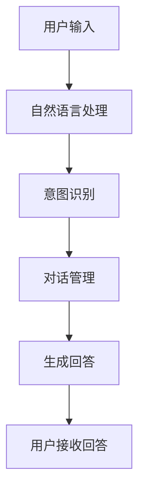

## 1.背景介绍

在我们的日常生活中，聊天机器人已经越来越普遍。无论是在社交媒体平台上，还是在客户服务中心，甚至在我们的手机应用中，聊天机器人都在为我们提供帮助。它们能够回答我们的问题，提供信息，甚至进行复杂的任务，如预订餐厅或购买电影票。但是，你是否曾经好奇过，这些机器人是如何工作的？在本文中，我将为你揭示聊天机器人背后的一些核心技术和工作流程。

## 2.核心概念与联系

在我们开始讨论聊天机器人如何工作之前，让我们先来定义一些核心概念：

- **聊天机器人(Chatbot)**: 聊天机器人是一个基于人工智能（AI）技术的软件，能够通过文本或语音与用户进行交互。

- **自然语言处理(Natural Language Processing, NLP)**: 自然语言处理是一种使计算机理解、解析和生成人类语言的技术。这是使聊天机器人能够理解我们的问题并给出合适回答的关键技术。

- **意图识别(Intent Recognition)**: 意图识别是NLP的一部分，它的任务是理解用户的目的或需求。

- **对话管理(Dialogue Management)**: 对话管理是聊天机器人中的一个关键部分，它负责管理和控制机器人与用户的对话流程。

这些概念之间的关系可以通过以下Mermaid流程图进行描述：



## 3.核心算法原理具体操作步骤

聊天机器人的工作流程可以分为以下几个步骤：

1. **用户输入**: 用户与聊天机器人的交互开始于用户的输入。这可以是一个问题，一个命令，或者只是一段话。

2. **自然语言处理**: 聊天机器人接收到用户的输入后，会利用NLP技术对其进行解析和理解。这一步通常包括词法分析，句法分析，语义分析等。

3. **意图识别**: 通过NLP，聊天机器人能够理解用户的意图。例如，如果用户说：“我想订一张去北京的机票”，机器人需要识别出用户的意图是订机票，而且目的地是北京。

4. **对话管理**: 根据识别出的用户意图，对话管理模块会决定聊天机器人的下一步动作。在上述例子中，对话管理模块可能会让机器人询问用户的出发日期和返回日期。

5. **生成回答**: 根据对话管理模块的指示，聊天机器人会生成一个适当的回答，并发送给用户。

## 4.数学模型和公式详细讲解举例说明

在聊天机器人中，自然语言处理和意图识别是两个非常重要的环节。在这两个环节中，我们通常会使用一些机器学习模型和算法。

例如，我们可以使用词袋模型(Bag of Words, BoW)来表示用户的输入。词袋模型是一种将文本转化为数字向量的方法。在这个模型中，每个不同的词都对应一个特定的位置。如果一个词在文本中出现，则该位置的值为1，否则为0。例如，假设我们有一个包含三个词的词库：{我，想，订票}，那么句子“我想订票”可以表示为向量[1,1,1]。

对于意图识别，我们可以使用一种名为支持向量机(Support Vector Machine, SVM)的算法。SVM是一种二分类模型，它的基本模型是定义在特征空间上的间隔最大的线性分类器，间隔最大使它有别于感知机，SVM的学习策略就是间隔最大化，最终可转化为一个凸二次规划问题的求解。

SVM的数学模型可以表示为：

$$
\min_{w,b,\xi} \ \frac{1}{2}||w||^2 + C \sum_{i=1}^{n}\xi_i
$$

$$
s.t. \ y_i(w \cdot x_i + b) \geq 1 - \xi_i, \ \xi_i \geq 0
$$

其中，$w$是法向量，决定了超平面的方向；$b$是截距，决定了超平面与原点之间的距离；$\xi_i$是松弛变量，用于处理线性不可分的情况；$C$是惩罚参数，用于控制过拟合。

## 5.项目实践：代码实例和详细解释说明

下面，我将展示一个简单的聊天机器人项目实践。在这个项目中，我们将使用Python的nltk库来实现自然语言处理，使用scikit-learn库来实现SVM意图识别。

首先，我们需要导入所需的库：

```python
import nltk
from sklearn.feature_extraction.text import CountVectorizer
from sklearn import svm
```

然后，我们需要准备一些训练数据。在这个例子中，我们只训练两个意图：“订票”和“问候”。

```python
train_data = ["我想订一张去北京的机票", "你好", "我要订票", "早上好"]
train_labels = ["订票", "问候", "订票", "问候"]
```

接下来，我们使用词袋模型将文本转化为数字向量：

```python
vectorizer = CountVectorizer()
train_vectors = vectorizer.fit_transform(train_data)
```

然后，我们使用SVM进行意图识别的训练：

```python
clf = svm.SVC(kernel='linear')
clf.fit(train_vectors, train_labels)
```

最后，我们可以使用训练好的模型来预测用户的意图：

```python
test_data = ["晚上好"]
test_vectors = vectorizer.transform(test_data)
predictions = clf.predict(test_vectors)
print(predictions)
```

在这个例子中，如果你输入“晚上好”，聊天机器人将正确地识别出你的意图是“问候”。

## 6.实际应用场景

聊天机器人在许多实际应用场景中都发挥了重要作用。例如：

- **客户服务**: 许多公司都使用聊天机器人来提供24/7的客户服务。聊天机器人可以回答客户的常见问题，提供信息，甚至处理一些简单的任务，如预订或退款。

- **个人助手**: 聊天机器人也可以作为个人助手，帮助用户管理他们的日常生活。例如，Google Assistant和Apple的Siri就是两个著名的例子。

- **教育**: 聊天机器人也被广泛应用于教育领域。它们可以作为学生的学习伙伴，提供个性化的学习资源和反馈。

- **医疗健康**: 在医疗健康领域，聊天机器人可以提供健康咨询，帮助用户追踪他们的健康状况，甚至提供心理健康支持。

## 7.工具和资源推荐

如果你对聊天机器人感兴趣，以下是一些推荐的工具和资源：

- **Python**: Python是一种广泛用于AI和机器学习的编程语言。它有许多强大的库，如nltk和scikit-learn，可以帮助你实现聊天机器人。

- **Rasa**: Rasa是一个开源的聊天机器人框架。它提供了一整套工具，包括自然语言处理，意图识别，对话管理等，可以帮助你构建复杂的聊天机器人。

- **Dialogflow**: Dialogflow是Google开发的一个聊天机器人平台。它提供了一个易于使用的界面，可以帮助你快速构建聊天机器人。

- **Chatbot: Build your Chatbot for Business with Python & NLP**: 这是一个在线课程，可以教你如何使用Python和NLP构建聊天机器人。

## 8.总结：未来发展趋势与挑战

聊天机器人的发展前景非常广阔，但也面临一些挑战。

首先，虽然现有的聊天机器人已经能够处理一些简单的任务，但它们还无法理解和生成复杂的语言。例如，它们通常无法理解含有讽刺或双关意思的语句。这是因为理解这些语句需要对人类世界的广泛知识和深入理解，而现有的AI技术还达不到这个水平。

其次，聊天机器人的个性化也是一个挑战。每个人都有他们自己的语言习惯和偏好，而现有的聊天机器人通常无法适应这些个性化需求。

最后，随着聊天机器人的广泛应用，如何保护用户的隐私和数据安全也成为一个重要的问题。

尽管有这些挑战，我仍然对聊天机器人的未来充满信心。我相信，随着AI技术的进步，聊天机器人将变得更加智能和有用。

## 9.附录：常见问题与解答

1. **聊天机器人可以理解所有的语言吗？**

   答：虽然理论上聊天机器人可以被训练来理解任何语言，但实际上，大多数聊天机器人只能理解一些主要的语言，如英语，西班牙语，法语等。这是因为训练聊天机器人需要大量的语言数据，而这些数据在一些小语种中可能难以获得。

2. **聊天机器人可以替代人类的工作吗？**

   答：在一些情况下，聊天机器人可以替代人类的工作，如客户服务。然而，聊天机器人无法替代需要深度思考和创造性的工作。此外，许多人仍然更喜欢与真人进行交互，而不是机器人。

3. **聊天机器人会泄露我的隐私吗？**

   答：聊天机器人本身不会泄露你的隐私。然而，如果聊天机器人的提供商没有采取适当的数据保护措施，你的数据可能会被泄露。因此，当你使用聊天机器人时，应该确保提供商是值得信赖的，且有良好的数据保护政策。

作者：禅与计算机程序设计艺术 / Zen and the Art of Computer Programming