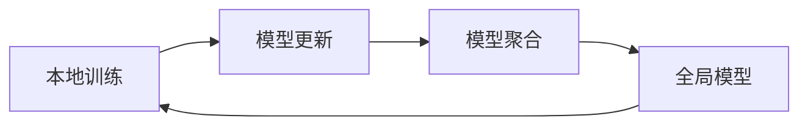

## 1.背景介绍

在当今这个数据驱动的时代，数据的价值已经被越来越多的人所认识。然而，数据的收集和处理却面临着越来越多的挑战，尤其是在隐私保护方面。为了解决这个问题，联邦学习应运而生。

联邦学习是一种分布式机器学习方法，它允许数据所有者在本地训练模型，并只共享模型更新，而不是原始数据。这种方法不仅可以保护用户的隐私，而且还可以利用分布式计算的优势，处理大规模的数据。

## 2.核心概念与联系

联邦学习的核心概念包括本地训练、模型更新、模型聚合和全局模型。

- 本地训练：每个数据所有者在本地使用自己的数据训练模型，而不需要将数据发送到中心服务器。
- 模型更新：数据所有者将训练后的模型参数发送到中心服务器，而不是原始数据。
- 模型聚合：中心服务器收集所有数据所有者的模型更新，然后聚合这些更新以形成一个全局模型。
- 全局模型：这是中心服务器聚合模型更新后得到的模型，它将被发送回每个数据所有者，以便在下一轮训练中使用。

这些概念之间的关系可以通过以下Mermaid流程图进行展示：



## 3.核心算法原理具体操作步骤

联邦学习的核心算法原理可以分为以下几个步骤：

1. 数据所有者从中心服务器获取全局模型。
2. 数据所有者使用本地数据和全局模型进行训练，得到模型更新。
3. 数据所有者将模型更新发送到中心服务器。
4. 中心服务器收集所有数据所有者的模型更新，并聚合这些更新以形成一个新的全局模型。
5. 中心服务器将新的全局模型发送回每个数据所有者，以便在下一轮训练中使用。

以上步骤会反复进行，直到模型收敛或满足其他停止条件。

## 4.数学模型和公式详细讲解举例说明

假设我们有 $n$ 个数据所有者，每个数据所有者 $i$ 的数据集记为 $D_i$，模型参数记为 $\theta_i$，损失函数记为 $L_i(\theta)$。那么，数据所有者 $i$ 的本地训练可以表示为以下优化问题：

$$
\min_{\theta_i} L_i(\theta_i)
$$

数据所有者 $i$ 的模型更新可以表示为 $\Delta \theta_i = \theta_i - \theta_{\text{global}}$，其中 $\theta_{\text{global}}$ 是全局模型的参数。

中心服务器的模型聚合可以表示为以下公式：

$$
\theta_{\text{global}} = \theta_{\text{global}} + \frac{1}{n} \sum_{i=1}^{n} \Delta \theta_i
$$

这就是联邦学习的基本数学模型。通过这个模型，我们可以看到联邦学习是如何在保护数据隐私的同时，利用分布式计算的优势进行大规模的机器学习训练。

## 5.项目实践：代码实例和详细解释说明

在这个部分，我们将通过一个简单的代码实例来展示如何实现联邦学习。

```python
# 导入必要的库
import numpy as np
from sklearn.linear_model import LogisticRegression

# 初始化全局模型
global_model = LogisticRegression()

# 模拟n个数据所有者的本地训练
for i in range(n):
    # 数据所有者i获取全局模型
    local_model = global_model
    # 数据所有者i使用本地数据和全局模型进行训练
    local_model.fit(D_i, y_i)
    # 数据所有者i计算模型更新
    delta_theta_i = local_model.coef_ - global_model.coef_
    # 数据所有者i将模型更新发送到中心服务器
    send_to_server(delta_theta_i)

# 中心服务器收集所有数据所有者的模型更新，并聚合这些更新以形成一个新的全局模型
global_model.coef_ += np.mean(receive_from_clients(), axis=0)
```

以上代码是一个简化的联邦学习实现，它展示了联邦学习的基本流程。在实际应用中，我们还需要考虑更多的细节，例如如何处理网络延迟、如何保证模型更新的安全性等。

## 6.实际应用场景

联邦学习可以应用于许多场景，例如：

- 在医疗领域，各医院可以使用联邦学习来共享模型，而不需要共享病人的私人医疗记录。
- 在金融领域，各银行可以使用联邦学习来共享反欺诈模型，而不需要共享客户的私人交易记录。
- 在互联网领域，各公司可以使用联邦学习来共享用户行为模型，而不需要共享用户的私人浏览记录。

## 7.工具和资源推荐

如果你对联邦学习感兴趣，以下是一些可以帮助你进一步学习的工具和资源：

- TensorFlow Federated：这是一个由Google开发的开源框架，用于实现联邦学习。
- PySyft：这是一个开源的Python库，用于实现安全、私有的机器学习。
- "Communication-Efficient Learning of Deep Networks from Decentralized Data"：这是一篇介绍联邦学习的经典论文。

## 8.总结：未来发展趋势与挑战

联邦学习作为一种新兴的分布式机器学习方法，有着巨大的潜力。它不仅可以保护数据隐私，还可以利用分布式计算的优势处理大规模的数据。然而，联邦学习也面临着许多挑战，例如如何处理网络延迟、如何保证模型更新的安全性等。未来，我们期待看到更多的研究和应用来解决这些挑战，推动联邦学习的发展。

## 9.附录：常见问题与解答

1. **问：联邦学习如何保护数据隐私？**

答：联邦学习通过在本地训练模型，并只共享模型更新，而不是原始数据，来保护数据的隐私。

2. **问：联邦学习的效率如何？**

答：联邦学习的效率取决于许多因素，例如网络延迟、数据所有者的数量、数据的分布等。在理想情况下，联邦学习可以利用分布式计算的优势，处理大规模的数据。

3. **问：如何实现联邦学习？**

答：实现联邦学习需要考虑许多细节，例如如何处理网络延迟、如何保证模型更新的安全性等。你可以使用一些开源框架，如TensorFlow Federated和PySyft，来帮助你实现联邦学习。

作者：禅与计算机程序设计艺术 / Zen and the Art of Computer Programming