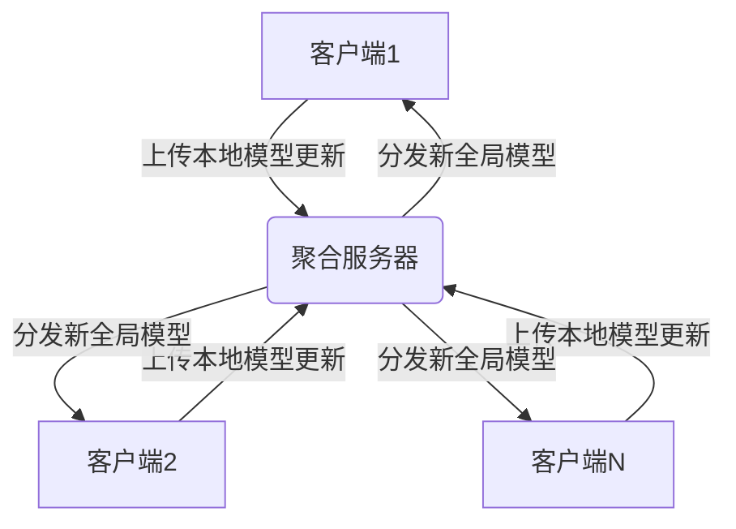
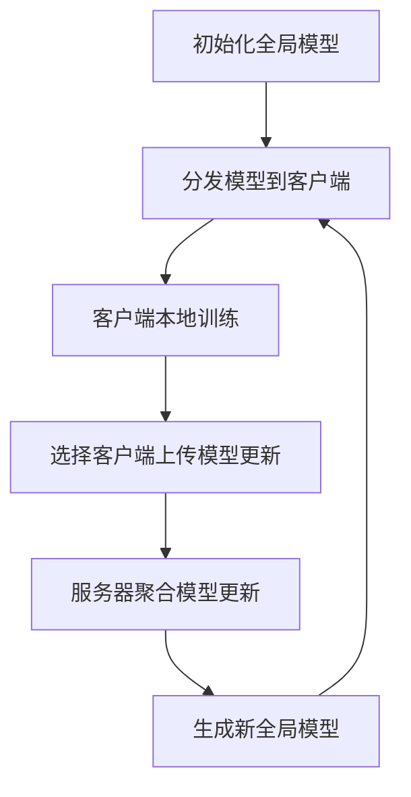

# 联邦学习(Federated Learning)原理与代码实战案例讲解

## 1.背景介绍

### 1.1 数据隐私保护的挑战

在当今数据驱动的世界中,海量数据的收集和利用已成为推动人工智能(AI)和机器学习(ML)算法发展的关键动力。然而,随着对个人隐私保护意识的不断提高,传统的集中式数据收集和处理方式面临着越来越多的挑战和限制。

### 1.2 联邦学习的兴起

为了解决数据隐私和安全问题,同时保持模型性能,联邦学习(Federated Learning)作为一种新兴的分布式机器学习范式应运而生。它允许多个参与者在不共享原始数据的情况下,协同训练一个统一的模型,从而保护了数据隐私,同时利用了众多数据源的优势。

### 1.3 联邦学习的应用前景

联邦学习在医疗保健、金融、物联网等领域具有广阔的应用前景,有望推动人工智能在隐私敏感领域的发展。随着5G、边缘计算等新技术的兴起,联邦学习也将为分布式智能系统的部署提供有力支持。

## 2.核心概念与联系

### 2.1 联邦学习的核心思想

联邦学习的核心思想是在多个客户端(如手机、IoT设备等)上训练本地模型,然后将这些模型的更新(如梯度或模型参数)上传到一个中央服务器。服务器聚合并平均这些更新,生成一个新的全局模型,并将其分发回各个客户端,重复这个过程直到模型收敛。



### 2.2 联邦平均算法(FedAvg)

联邦平均算法(FedAvg)是联邦学习中最广为人知的算法,它通过在每个通信回合中对参与者的模型更新进行简单平均来实现模型聚合。尽管简单,但FedAvg在许多实际场景中表现出色,被广泛应用。

$$
w_{t+1} = \sum_{k=1}^{K} \frac{n_k}{n} w_k^{t+1}
$$

其中$w_{t+1}$是新的全局模型参数,$w_k^{t+1}$是第k个客户端在本地训练后得到的新模型参数,$n_k$是第k个客户端的本地数据样本数,$n$是所有参与者的总数据样本数。

### 2.3 非独立同分布(Non-IID)数据

与传统的集中式机器学习不同,联邦学习面临着非独立同分布(Non-IID)数据的挑战。这意味着不同客户端上的数据分布可能存在偏差,从而影响模型的泛化能力。解决此问题的方法包括客户端选择、数据共享和模型个性化等。

## 3.核心算法原理具体操作步骤

### 3.1 联邦学习算法流程

1. **初始化**:服务器初始化一个全局模型,并将其分发给所有参与的客户端。

2. **本地训练**:每个客户端在自己的本地数据上训练模型,得到一个新的本地模型。

3. **模型上传**:选定的客户端将本地模型的更新(如梯度或模型参数)上传到服务器。

4. **模型聚合**:服务器根据某种聚合策略(如FedAvg)对收到的模型更新进行聚合,得到一个新的全局模型。

5. **模型分发**:服务器将新的全局模型分发给所有客户端。

6. **重复训练**:重复步骤2-5,直到模型收敛或达到预定的通信回合数。



### 3.2 客户端选择策略

由于通信和计算资源的限制,通常无法让所有客户端在每个回合中都参与训练。因此,合理的客户端选择策略对于提高联邦学习的效率和性能至关重要。常见的选择策略包括:

- 随机选择
- 基于数据量选择(更多数据的客户端被选中的概率更高)
- 基于资源选择(计算能力和网络条件更好的客户端被优先选择)
- 基于模型差异选择(与全局模型差异较大的客户端被优先选择)

### 3.3 安全性与隐私保护

为了确保联邦学习中的隐私安全,需要采取以下措施:

- **差分隐私(Differential Privacy)**:在模型更新中引入噪声,使得单个数据点的影响被掩盖。
- **安全多方计算(Secure Multi-Party Computation)**:允许多方在不泄露原始数据的情况下进行联合计算。
- **同态加密(Homomorphic Encryption)**:对数据进行加密,使得在密文上进行运算等同于在明文上进行相同的运算。
- **联邦学习攻击防御**:防御重构攻击、推理攻击等针对联邦学习的攻击手段。

## 4.数学模型和公式详细讲解举例说明

### 4.1 联邦学习目标函数

联邦学习的目标是在保护数据隐私的同时,最小化所有参与者的本地损失函数之和,即:

$$
\min_{w} F(w) = \sum_{k=1}^{K} \frac{n_k}{n} F_k(w)
$$

其中$F(w)$是全局损失函数,$F_k(w)$是第k个客户端的本地损失函数,$n_k$是第k个客户端的数据量,$n$是所有客户端数据的总量。

### 4.2 联邦平均算法(FedAvg)

联邦平均算法(FedAvg)是最常用的联邦学习算法,它在每个通信回合中对参与者的模型更新进行简单平均:

$$
w_{t+1} = \sum_{k=1}^{K} \frac{n_k}{n} w_k^{t+1}
$$

其中$w_{t+1}$是新的全局模型参数,$w_k^{t+1}$是第k个客户端在本地训练后得到的新模型参数。

### 4.3 联邦学习收敛性分析

联邦学习算法的收敛性取决于多个因素,包括:

- 客户端数据分布的非独立同分布(Non-IID)程度
- 客户端选择策略
- 本地训练的迭代次数
- 学习率和正则化参数的设置

通过理论分析和实验验证,可以确定算法在何种条件下收敛,并优化相关参数以提高收敛速度。

### 4.4 联邦学习中的差分隐私

差分隐私(Differential Privacy)是保护联邦学习中数据隐私的重要机制。它通过在模型更新中引入噪声,使得单个数据点的影响被掩盖,从而防止个人数据被推断出来。

$$
M(D) = f(D) + \text{Noise}
$$

其中$M(D)$是添加了噪声的模型输出,$f(D)$是原始模型输出,Noise是根据隐私预算$\epsilon$和敏感度$\Delta f$生成的噪声。

## 5.项目实践:代码实例和详细解释说明

### 5.1 TensorFlow Federated (TFF)

TensorFlow Federated (TFF)是谷歌开源的一个用于构建联邦学习应用的框架。它提供了联邦学习的核心算法实现,并支持模拟和实际部署联邦学习系统。以下是一个使用TFF进行图像分类任务的示例:

```python
import tensorflow as tf
import tensorflow_federated as tff

# 加载数据
train_data, test_data = tff.simulation.datasets.emnist.load_data()

# 定义模型
def model_fn():
    keras_model = tf.keras.models.Sequential([
        tf.keras.layers.InputLayer(input_shape=(28, 28, 1)),
        tf.keras.layers.Conv2D(32, 3, activation='relu'),
        tf.keras.layers.MaxPooling2D(),
        tf.keras.layers.Flatten(),
        tf.keras.layers.Dense(10, activation='softmax')
    ])
    return tff.learning.from_keras_model(
        keras_model,
        input_spec=train_data.element_spec,
        loss=tf.keras.losses.SparseCategoricalCrossentropy(),
        metrics=[tf.keras.metrics.SparseCategoricalAccuracy()])

# 构建联邦学习过程
iterative_process = tff.learning.build_federated_averaging_process(
    model_fn,
    client_optimizer_fn=lambda: tf.keras.optimizers.SGD(learning_rate=0.02),
    server_optimizer_fn=lambda: tf.keras.optimizers.SGD(learning_rate=1.0))

# 运行联邦学习
state = iterative_process.initialize()
for round_num in range(1000):
    state, metrics = iterative_process.next(state, train_data)
    print(f'Round {round_num}: {metrics}')

# 评估模型
evaluation = tff.learning.build_federated_evaluation(model_fn)
eval_metrics = evaluation(state.model, test_data)
print(eval_metrics)
```

在这个示例中,我们首先加载EMNIST数据集,然后定义一个用于图像分类的卷积神经网络模型。接下来,我们使用TFF构建联邦学习过程,包括模型函数、客户端优化器和服务器优化器。最后,我们运行联邦学习算法进行训练,并在测试集上评估模型性能。

### 5.2 PySyft

PySyft是一个用于安全和隐私保护机器学习的Python库,它支持联邦学习、加密计算等功能。以下是一个使用PySyft进行联邦学习的示例:

```python
import syft as sy
import torch
import torch.nn as nn
import torch.nn.functional as F

# 定义模型
class Net(nn.Module):
    def __init__(self):
        super(Net, self).__init__()
        self.fc1 = nn.Linear(784, 200)
        self.fc2 = nn.Linear(200, 10)

    def forward(self, x):
        x = x.view(-1, 784)
        x = F.relu(self.fc1(x))
        x = self.fc2(x)
        return F.log_softmax(x, dim=1)

# 创建虚拟工人
hook = sy.TorchHook(torch)
bob = sy.VirtualWorker(hook, id="bob")
alice = sy.VirtualWorker(hook, id="alice")

# 分发数据和模型
data = ...  # 加载数据
model = Net().send(bob, alice)  # 分发模型到工人

# 联邦学习训练
optimizer = torch.optim.SGD(model.parameters(), lr=0.01)
for epoch in range(10):
    optimizer.zero_grad()
    loss = model(data).sum()
    loss.backward()
    optimizer.step()
    model.get().print_spec()  # 打印模型参数
```

在这个示例中,我们首先定义一个用于手写数字识别的神经网络模型。然后,我们创建两个虚拟工人`bob`和`alice`,并将模型和数据分发到这些工人上。接下来,我们使用联邦学习进行训练,每个工人在本地数据上计算梯度,然后将梯度聚合到全局模型中。最后,我们打印出模型参数,以验证联邦学习的效果。

## 6.实际应用场景

### 6.1 移动设备和物联网

联邦学习最初的应用场景是在移动设备和物联网领域,如手机、可穿戴设备、智能家居等。这些设备通常存储着大量个人数据,传统的集中式数据收集和处理方式会带来隐私风险。通过联邦学习,这些设备可以在本地训练模型,而无需将原始数据上传到云端,从而保护了用户隐私。

### 6.2 医疗健康

医疗健康数据通常包含敏感的个人信息,因此需要特别注意隐私保护。联邦学习为医疗数据的安全共享和协作建模提供了一种解决方案。各个医疗机构可以在本地训练模型,然后将模型更新上传到中央服务器进行聚合,从而获得更准确的诊断和治疗模型,而无需共享原始患者数据。