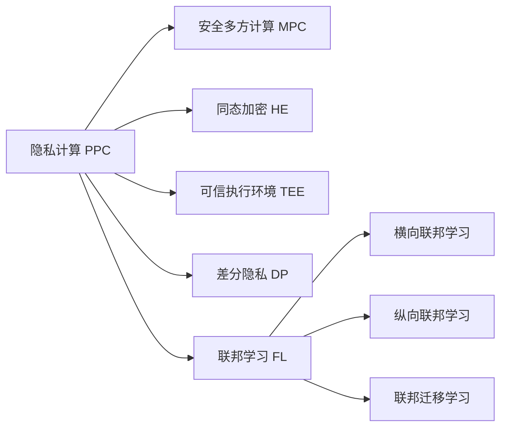

# 联邦学习与隐私计算原理与代码实战案例讲解

## 1. 背景介绍

### 1.1 数据隐私保护的重要性

在大数据时代,海量的用户数据成为了各行各业的宝贵资源。然而,随着数据规模的增长,数据隐私泄露的风险也在不断加剧。个人信息的非法收集、滥用和泄露事件时有发生,严重威胁着用户的数据安全和隐私权益。因此,在数据驱动的应用中,如何在合法合规地使用数据的同时,最大限度地保护用户隐私,成为了一个亟待解决的关键问题。

### 1.2 传统数据利用方式的局限性

传统的数据利用方式通常需要将数据集中到一个中心节点进行处理和分析。这种做法存在以下几个问题:

1. 数据汇集的过程中,存在数据泄露和被攻击的风险。  
2. 不同机构之间的数据难以直接共享和交换,影响数据价值的充分发挥。
3. 用户对数据的控制权较弱,担心数据被滥用。

因此,亟需一种新的数据利用范式,在保护数据隐私的前提下,实现多方数据的安全融合与协作计算。

### 1.3 联邦学习与隐私计算的兴起

联邦学习(Federated Learning)和隐私计算(Privacy-Preserving Computation)应运而生,为解决上述问题提供了新的思路。

联邦学习是一种分布式机器学习范式,旨在在不集中原始数据的前提下,通过多个参与节点的模型聚合来训练全局模型。参与节点仅需上传本地模型参数,而无需共享原始数据,从而很好地保护了数据隐私。

隐私计算则致力于在保护数据隐私的前提下,实现敏感数据的安全计算。主要技术包括安全多方计算、同态加密、可信执行环境等。通过这些技术,各参与方可以在不泄露隐私数据的情况下进行联合建模与分析。

联邦学习与隐私计算的结合,为数据孤岛问题和隐私保护问题提供了有力的解决方案,有望成为未来人工智能发展的重要方向。

## 2. 核心概念与联系

### 2.1 联邦学习的定义与分类

联邦学习(Federated Learning, FL)是谷歌在2016年提出的一种分布式机器学习框架,旨在解决数据孤岛和隐私保护问题。其核心思想是在不集中原始数据的前提下,通过多个参与节点的模型聚合来训练全局模型。

根据数据划分方式的不同,联邦学习可分为横向联邦学习、纵向联邦学习和联邦迁移学习三类:

- 横向联邦学习(Horizontal FL):适用于不同参与节点拥有不同用户的同类数据的场景,如不同医院之间患者数据的建模。
- 纵向联邦学习(Vertical FL):适用于不同参与节点拥有同一用户的不同特征数据的场景,如银行和电商拥有同一用户的不同维度数据。  
- 联邦迁移学习(Federated Transfer Learning):适用于不同参与节点拥有不同用户的不同类型数据的场景。通过迁移学习技术,实现模型的跨域适配。

### 2.2 隐私计算的主要技术

隐私计算(Privacy-Preserving Computation, PPC)是在保护数据隐私前提下实现数据处理和分析的一系列技术的统称。主要技术包括:

- 安全多方计算(Secure Multi-Party Computation, MPC):允许多个参与方在不泄露各自隐私数据的情况下,联合计算一个约定函数。代表算法有Yao's Garbled Circuit等。

- 同态加密(Homomorphic Encryption, HE):对加密数据直接进行计算,得到的结果解密后等价于对原始数据进行同样计算后的结果。代表算法有半同态加密和全同态加密。

- 可信执行环境(Trusted Execution Environment, TEE):提供一个安全隔离的硬件环境,保护其中运行的程序及数据不受恶意软件的攻击。代表技术有Intel SGX等。

- 差分隐私(Differential Privacy, DP):通过引入随机噪声,保证单个样本对查询结果的影响在一定范围内,从而保护个体隐私不被推断出来。

### 2.3 联邦学习与隐私计算的关系

联邦学习与隐私计算密切相关又有所区别:

- 联邦学习更侧重于在分布式场景下的机器学习问题,而隐私计算则关注更广泛的隐私保护数据处理与分析。
- 联邦学习可以看作是隐私计算在机器学习领域的一个具体应用。
- 隐私计算技术如MPC、HE等可以用于保护联邦学习过程中的数据隐私和通信安全。
- 联邦学习与隐私计算的结合,能够实现更强的隐私保护和更灵活的建模分析。

下图展示了联邦学习与隐私计算的关系:

## 3. 核心算法原理具体操作步骤

### 3.1 FederatedAveraging算法

FederatedAveraging(FedAvg)是联邦学习的经典算法,由McMahan等人于2017年提出。其基本思想是各个客户端在本地用自己的数据训练模型,然后将模型参数(而非原始数据)上传到服务器端进行聚合,得到全局模型,再下发到各个客户端进行新一轮的本地训练,如此迭代直至模型收敛。

FedAvg的具体步骤如下:

1. 服务器端初始化全局模型参数 $w_0$,下发到K个客户端。
2. 对于第 $t$ 轮通信:
   1. 服务器端将当前全局模型参数 $w_t$ 下发到各个客户端。 
   2. 各个客户端 $k$ 在本地用自己的数据集 $D_k$ 训练模型,更新参数为 $w_{t+1}^k$。
   3. 各个客户端将更新后的模型参数 $w_{t+1}^k$ 上传到服务器端。
   4. 服务器端将收到的K个客户端的模型参数进行聚合,更新全局模型参数:

$$w_{t+1} = \sum_{k=1}^K \frac{n_k}{n} w_{t+1}^k$$

其中 $n_k$ 为第 $k$ 个客户端的样本数, $n$ 为所有客户端样本数之和。

3. 重复步骤2,直至全局模型收敛或达到预设的通信轮数。

可以看出,FedAvg通过模型参数的传递和聚合,避免了原始数据的直接共享,从而在一定程度上保护了数据隐私。但FedAvg仍然存在一些隐私泄露的风险,如恶意服务器端可能会从上传的模型参数中推断出客户端的隐私数据。因此,还需要借助其他隐私保护技术如MPC、HE等来进一步加强安全性。

### 3.2 安全聚合算法

安全聚合(Secure Aggregation)是一类重要的隐私保护技术,旨在实现多个参与方的数据聚合,同时保证各方的原始数据不会泄露给其他参与方和聚合方。

以加法秘密共享(Additive Secret Sharing)为例,其基本原理如下:

设有 $n$ 个参与方,每个参与方 $i$ 持有数据 $x_i$,希望在不泄露 $x_i$ 的情况下计算 $\sum_{i=1}^n x_i$。

1. 每个参与方 $i$ 生成 $n-1$ 个随机数 $r_{i,1}, \cdots, r_{i,n-1}$,令 $r_{i,n} = x_i - \sum_{j=1}^{n-1} r_{i,j}$。

2. 参与方 $i$ 将 $r_{i,j}$ 发送给参与方 $j$,自己保留 $r_{i,i}$。

3. 每个参与方 $i$ 计算 $s_i = \sum_{j=1}^n r_{j,i}$,并发送给聚合方。

4. 聚合方计算 $\sum_{i=1}^n s_i = \sum_{i=1}^n x_i$。

在联邦学习中,可以将安全聚合技术应用到模型参数的聚合过程中,从而防止服务器端和恶意参与方推断出单个客户端的隐私数据。

### 3.3 差分隐私SGD算法

差分隐私(Differential Privacy)是一种强大的隐私保护技术,其核心思想是在数据发布或计算结果中引入随机噪声,使得单个样本对最终输出的影响受到限制,从而保证个体隐私不会被推断出来。

差分隐私随机梯度下降(DP-SGD)算法可以用于在联邦学习中为本地梯度添加噪声,实现客户端隐私的保护。其主要步骤如下:

1. 客户端 $k$ 在本地计算损失函数 $L_k(w)$ 对模型参数 $w$ 的梯度 $g_k$。

2. 对梯度 $g_k$ 进行修剪(clip),将L2范数限制在常数 $S$ 以内:

$$\hat{g}_k = g_k / \max(1, \frac{\Vert g_k \Vert_2}{S}) $$

3. 对修剪后的梯度添加高斯噪声:

$$\tilde{g}_k = \hat{g}_k + \mathcal{N}(0, \sigma^2 S^2 \textbf{I}) $$

其中 $\sigma$ 为噪声系数, $\textbf{I}$ 为单位矩阵。

4. 将噪声化的梯度 $\tilde{g}_k$ 上传到服务器端进行聚合。

通过DP-SGD算法,每个客户端上传的梯度都满足差分隐私,防止了服务器端从梯度反推出客户端的原始数据。结合安全聚合技术,可以进一步提升联邦学习的隐私保护强度。

## 4. 数学模型和公式详细讲解举例说明

本节我们以一个简单的线性回归模型为例,详细说明联邦学习的数学模型和公式。

假设有 $K$ 个客户端,每个客户端 $k$ 有 $n_k$ 个样本 $(x_i^k, y_i^k), i=1,\cdots,n_k$。我们希望训练一个全局模型 $f(x) = wx + b$ 来拟合这些数据。

传统的集中式训练方式是将所有数据上传到服务器端,最小化总损失函数:

$$\min_{w,b} \frac{1}{n} \sum_{k=1}^K \sum_{i=1}^{n_k} (y_i^k - wx_i^k - b)^2 + \lambda (w^2 + b^2)$$

其中 $n = \sum_{k=1}^K n_k$ 为总样本数, $\lambda$ 为正则化系数。

而在联邦学习中,我们希望每个客户端在本地用自己的数据训练模型,然后将模型参数聚合到服务器端得到全局模型。用公式表示如下:

1. 在第 $t$ 轮通信中,服务器端将当前的全局模型参数 $w_t, b_t$ 下发到各个客户端。

2. 每个客户端 $k$ 在本地用自己的数据 $\{(x_i^k, y_i^k)\}_{i=1}^{n_k}$ 训练模型,最小化本地损失函数:

$$\min_{w^k, b^k} \frac{1}{n_k} \sum_{i=1}^{n_k} (y_i^k - w^k x_i^k - b^k)^2 + \lambda ((w^k)^2 + (b^k)^2)$$

得到本地更新后的模型参数 $w_{t+1}^k, b_{t+1}^k$。

3. 各个客户端将本地更新后的模型参数上传到