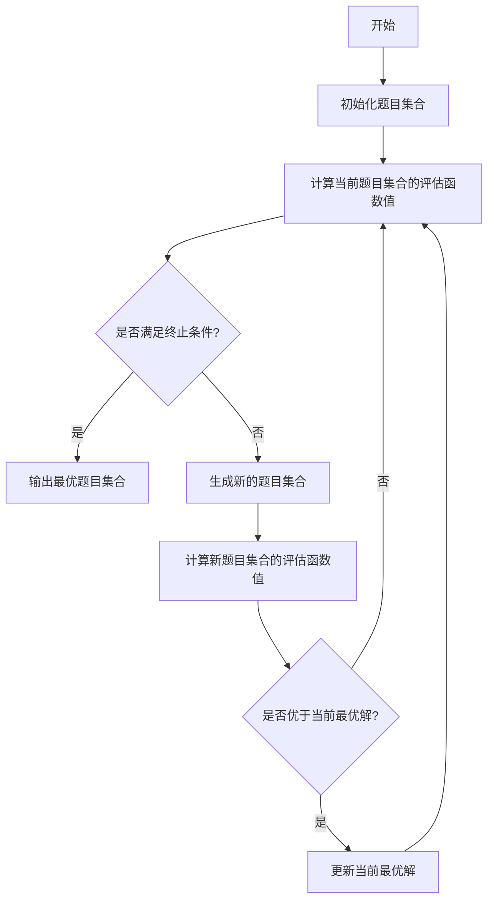

# 自动组卷系统详细设计与具体代码实现

## 1. 背景介绍

### 1.1 教育评估的重要性

教育评估是教学过程中不可或缺的一个环节,它能够有效地检测学生对所学知识的掌握程度,并为教师提供改进教学方式的依据。传统的人工组卷方式不仅耗时耗力,而且难以保证试卷的质量和难度的一致性。因此,自动组卷系统的出现为教育评估带来了全新的解决方案。

### 1.2 自动组卷系统的优势

自动组卷系统可以根据预设的知识点、难度系数等参数,快速生成满足要求的试卷,大大提高了组卷效率。同时,系统还能保证试卷质量的一致性,避免了人工组卷过程中可能存在的主观偏差。此外,自动组卷系统还可以实现题库的动态更新和管理,为教师节省了大量的时间和精力。

## 2. 核心概念与联系

### 2.1 知识点模型

知识点模型是自动组卷系统的核心,它将教学内容按照一定的层次结构进行划分和组织。每个知识点都与一系列题目相关联,题目的难度则由知识点的深度决定。构建合理的知识点模型是保证试卷质量的前提。

### 2.2 题库管理

题库是自动组卷系统的数据源,它包含了大量按照知识点分类的题目。题库的建设和维护直接影响到试卷的质量,因此需要专业人员进行持续的更新和优化。

### 2.3 试卷生成算法

试卷生成算法是自动组卷系统的核心算法,它根据用户设置的参数(如知识点覆盖率、难度系数等)从题库中选取合适的题目,并按照一定的规则组合成试卷。算法的设计直接决定了试卷的质量和组卷效率。

### 2.4 评分与反馈

评分与反馈环节是自动组卷系统的延伸功能,它可以自动批改试卷,并为学生和教师提供详细的分析报告,从而优化教学效果。

## 3. 核心算法原理具体操作步骤

自动组卷系统的核心算法通常采用启发式搜索或者遗传算法等方式,从题库中选取合适的题目组合成试卷。以下是一种常见的启发式搜索算法的具体操作步骤:



1. **初始化题目集合**: 从题库中随机选取一定数量的题目作为初始题目集合。

2. **计算评估函数值**: 设计一个评估函数,用于评估当前题目集合的质量。评估函数通常考虑知识点覆盖率、难度分布、题型分布等多个因素。

3. **终止条件判断**: 判断是否满足终止条件,如达到最大迭代次数或评估函数值满足要求。若满足,则输出当前最优题目集合;否则进入下一步。

4. **生成新题目集合**: 根据一定的策略(如随机扰动、知识点补充等)生成新的题目集合。

5. **计算新题目集合评估函数值**: 计算新题目集合的评估函数值。

6. **更新最优解**: 如果新题目集合的评估函数值优于当前最优解,则更新最优解。

7. **回到步骤3**: 重复步骤3-6,直到满足终止条件。

该算法的关键在于设计合理的评估函数和生成新题目集合的策略。评估函数需要全面考虑试卷质量的各个方面,而生成新题目集合的策略则决定了算法的搜索效率。

## 4. 数学模型和公式详细讲解举例说明

在自动组卷系统中,我们可以将试卷质量建模为一个多目标优化问题,其中每个目标对应试卷质量的一个方面。常见的目标包括:

1. **知识点覆盖率**: 衡量试卷对知识点的覆盖程度。设$K$为知识点集合,$T$为题目集合,则知识点覆盖率可表示为:

$$\text{Coverage}(T) = \frac{|\{k \in K | \exists t \in T, t \text{ 涉及知识点 } k\}|}{|K|}$$

我们希望$\text{Coverage}(T)$尽可能接近1。

2. **难度分布**: 衡量试卷难度的合理分布。设$D$为难度等级集合,$T_d$为难度等级为$d$的题目集合,则难度分布可表示为:

$$\text{Difficulty}(T) = \sum_{d \in D} \left|\frac{|T_d|}{|T|} - p_d\right|$$

其中$p_d$为期望的难度等级$d$的题目比例。我们希望$\text{Difficulty}(T)$尽可能小。

3. **题型分布**: 衡量试卷中不同题型的分布情况,类似于难度分布的建模方式。

4. **信息量**: 衡量试卷所包含的信息量,可用题目的熵来表示:

$$\text{Information}(T) = -\sum_{t \in T} p(t) \log p(t)$$

其中$p(t)$为题目$t$被选中的概率。我们希望$\text{Information}(T)$尽可能大。

将上述目标综合起来,我们可以构造一个加权求和的评估函数:

$$\text{Evaluation}(T) = w_1 \text{Coverage}(T) + w_2 (1 - \text{Difficulty}(T)) + w_3 (1 - \text{TypeDistribution}(T)) + w_4 \text{Information}(T)$$

其中$w_1, w_2, w_3, w_4$为各目标的权重系数,根据具体需求进行调整。自动组卷算法的目标就是最大化该评估函数的值。

## 5. 项目实践: 代码实例和详细解释说明

为了更好地理解自动组卷系统的实现,我们提供了一个基于Python的简单示例代码。该示例采用贪婪算法的思路,按照知识点覆盖率、难度分布和信息量三个目标进行题目选择。

### 5.1 数据结构

首先,我们定义了一些基本的数据结构:

```python
from typing import List, Dict, Tuple
from dataclasses import dataclass

@dataclass
class Question:
    id: int
    knowledge_points: List[int]
    difficulty: int
    type: int

@dataclass
class KnowledgePoint:
    id: int
    name: str

QuestionBank = List[Question]
KnowledgePointSet = List[KnowledgePoint]
```

`Question`类表示一道题目,包含了题目ID、涉及的知识点列表、难度等级和题型。`KnowledgePoint`类表示一个知识点,包含了知识点ID和名称。`QuestionBank`和`KnowledgePointSet`分别表示题库和知识点集合。

### 5.2 评估函数

接下来,我们实现了评估函数中的三个目标:

```python
def calculate_coverage(selected_questions: List[Question], knowledge_points: KnowledgePointSet) -> float:
    covered_points = set()
    for q in selected_questions:
        covered_points.update(q.knowledge_points)
    return len(covered_points) / len(knowledge_points)

def calculate_difficulty_distribution(selected_questions: List[Question], difficulty_weights: List[float]) -> float:
    difficulty_counts = [0] * len(difficulty_weights)
    for q in selected_questions:
        difficulty_counts[q.difficulty] += 1
    total_count = sum(difficulty_counts)
    return sum(abs(count / total_count - weight) for count, weight in zip(difficulty_counts, difficulty_weights))

def calculate_information(selected_questions: List[Question], question_bank: QuestionBank) -> float:
    total_count = len(question_bank)
    probabilities = [1 / total_count] * total_count
    for q in selected_questions:
        probabilities[q.id] = 0
    return sum(-p * math.log(p) for p in probabilities if p > 0)
```

- `calculate_coverage`函数计算知识点覆盖率,即选中的题目涉及的知识点数量与总知识点数量的比值。
- `calculate_difficulty_distribution`函数计算难度分布,即选中题目的难度分布与期望难度分布之间的差异。
- `calculate_information`函数计算信息量,即选中题目的熵之和。

### 5.3 贪婪算法

最后,我们实现了贪婪算法的主体部分:

```python
def greedy_paper_generation(question_bank: QuestionBank, knowledge_points: KnowledgePointSet,
                             paper_size: int, difficulty_weights: List[float],
                             coverage_weight: float, difficulty_weight: float, information_weight: float) -> List[Question]:
    remaining_questions = question_bank.copy()
    selected_questions = []

    while len(selected_questions) < paper_size and remaining_questions:
        best_question = max(remaining_questions, key=lambda q: (
            coverage_weight * calculate_coverage([q] + selected_questions, knowledge_points)
            + difficulty_weight * (1 - calculate_difficulty_distribution([q] + selected_questions, difficulty_weights))
            + information_weight * calculate_information([q] + selected_questions, question_bank)
        ))
        selected_questions.append(best_question)
        remaining_questions.remove(best_question)

    return selected_questions
```

该函数接受题库、知识点集合、试卷大小、难度权重以及三个目标的权重作为输入,返回选中的题目列表。算法的核心思路是:

1. 初始化剩余题目集合和选中题目集合为空。
2. 在剩余题目集合中,选择一道能够最大化评估函数值的题目加入选中题目集合。
3. 重复步骤2,直到选中题目数量达到试卷大小或剩余题目集合为空。

该算法的优点是简单高效,但缺点是无法保证全局最优解,且对初始状态敏感。在实际应用中,可以结合其他算法(如模拟退火、遗传算法等)来提高试卷质量。

## 6. 实际应用场景

自动组卷系统在教育领域有着广泛的应用前景,包括但不限于:

1. **学校考试**: 可用于生成期中、期末等各种考试试卷,提高组卷效率和试卷质量。

2. **在线教育平台**: 为学生提供个性化的练习和测试,帮助学生更好地掌握知识点。

3. **招生考试**: 可用于生成统一入学考试试卷,确保试卷质量的一致性。

4. **职业资格认证**: 为各行业的职业资格认证提供标准化的考试试卷。

5. **企业培训**: 为企业内部的员工培训提供定制化的考核试卷。

除了教育领域,自动组卷系统还可以应用于其他需要生成标准化测试的场景,如心理测评、人力资源测评等。

## 7. 工具和资源推荐

在实现自动组卷系统时,我们可以利用一些现有的工具和资源:

1. **Python科学计算库**: 如NumPy、SciPy等,提供了丰富的数学计算和优化算法。

2. **自然语言处理库**: 如NLTK、spaCy等,可用于题目文本的预处理和特征提取。

3. **知识图谱**: 如ConceptNet、Wikidata等,可以帮助构建知识点模型。

4. **开源自动组卷系统**: 如OpenTHINK、QPXML等,可作为参考和基础。

5. **在线题库资源**: 如各大教育网站、出版社题库等,可作为初始题库来源。

6. **云计算平台**: 如AWS、Azure等,可提供计算资源和存储空间支持。

7. **版本控制工具**: 如Git、SVN等,有助于代码管理和协作开发。

选择合适的工具和资源,可以大幅提高自动组卷系统的开发效率和性能。

## 8. 总结: 未来发展趋势与挑战

自动组卷系统的出现为教育评估带来了革命性的变革,但同时也面临着一些挑战和发展方向:

1. **知识表示与推理**: 如何更好地表示和推理知识点之间的关系,是提高试卷质量的关键。可借鉴知识图谱、语义网络等技术。

2. **自然语言处理**: 如何从自然语言题目