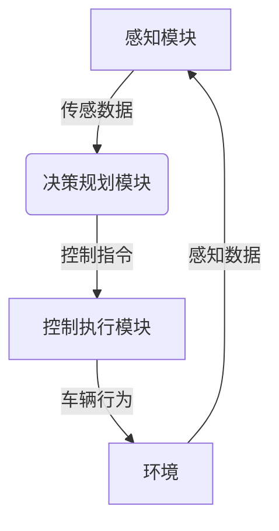

# 自动驾驶(Autonomous Driving)原理与代码实战案例讲解

## 1.背景介绍

### 1.1 自动驾驶的定义和重要性

自动驾驶技术是指使用各种传感器、算法和控制系统来实现车辆在无需人工干预的情况下自主驾驶的一种系统。它被视为未来交通运输领域的一项革命性技术,有望极大提高交通效率、减少事故发生率、节省能源并为行动不便人群提供更好的出行选择。

### 1.2 自动驾驶的发展历程

自动驾驶技术的发展可以追溯到20世纪60年代,当时的一些先驱性工作为后来的技术发展奠定了基础。21世纪以来,传感器、计算机视觉、机器学习等技术的飞速进步推动了自动驾驶领域的蓬勃发展。众多科技公司和传统车企纷纷投入巨资研发,寻求在这一前沿领域占据先机。

### 1.3 自动驾驶面临的主要挑战

尽管自动驾驶技术取得了长足进步,但其商业化应用仍面临诸多挑战:

- 环境感知的准确性和鲁棒性
- 决策规划与执行的高度复杂性  
- 功能安全与测试验证的困难
- 法律法规与社会接受度等

## 2.核心概念与联系  

### 2.1 自动驾驶系统架构

自动驾驶系统通常由感知、决策规划、控制执行三个核心模块构成,如下面的Mermaid流程图所示:



#### 2.1.1 感知模块

感知模块负责获取车辆周围环境的信息,主要包括:

- 激光雷达感知三维点云数据
- 摄像头获取图像/视频数据
- 毫米波雷达检测障碍物位置和速度
- GPS/IMU获取车辆位置和姿态

这些异构传感器数据需要进行多传感器融合,以获得精确的环境感知结果。

#### 2.1.2 决策规划模块  

决策规划模块是自动驾驶系统的"大脑",根据感知信息做出合理的决策规划,包括:

- 路径规划:根据导航目标规划全局路径
- 行为决策:根据交通规则和障碍物选择适当的驾驶行为(如直行、变道、停车等)
- 运动规划:结合车辆动力学模型,规划出平稳、舒适的轨迹

#### 2.1.3 控制执行模块

控制执行模块将规划好的轨迹转化为对执行器(如油门、刹车、转向等)的具体控制指令,确保车辆按预期轨迹行驶。它需要实时处理各种扰动并作出反馈控制。

### 2.2 自动驾驶关键技术

实现自动驾驶系统需要多学科技术的融合,主要包括:

- 计算机视觉与深度学习
- 点云处理与三维重建
- 机器学习与决策规划算法
- 控制理论与运动规划
- 高精度地图与定位技术
- 车载计算平台与功能安全

这些技术在自动驾驶系统中相互关联、环环相扣。

## 3.核心算法原理具体操作步骤

### 3.1 三维环境感知

#### 3.1.1 点云处理

激光雷达获取的点云数据是自动驾驶感知的基础。点云处理的主要步骤包括:

1. 点云去畸变和滤波,去除噪声点
2. 点云配准,将多个激光雷达点云拼接
3. 基于深度学习的语义分割,识别点云中的障碍物、道路、车道线等
4. 障碍物聚类,获取障碍物的位置、尺寸、速度等

#### 3.1.2 三维目标检测

基于点云和摄像头数据,可以利用深度学习算法实现三维目标检测,识别车辆、行人、骑行者等障碍物。常用的算法有:

- PointPillars: 利用PointNet编码点云特征,结合图像特征进行3D目标检测
- SECOND: 使用稀疏卷积编码点云特征,加入注意力机制提高性能
- PointRCNN: 利用PointNet++提取点云特征,实现高精度的3D目标检测

这些算法在准确率和实时性之间需要权衡。

### 3.2 决策规划算法 

#### 3.2.1 行为决策

行为决策模块需要根据感知信息、交通规则和车辆状态,选择合适的驾驶行为,如直行、变道、停车等。常用的方法有:

- 基于规则的决策系统
- 马尔可夫决策过程(MDP)
- 层次化混合决策

行为决策还需要处理各种异常情况,确保行为决策的合理性和安全性。

#### 3.2.2 路径规划

路径规划的目标是在给定起点和终点的情况下,规划出一条全局最优路径。常用算法包括:

- 基于采样的规划算法(RRT、RRT*)
- 基于图搜索的算法(A*、D*等)
- 基于数学模型的优化算法

这些算法需要考虑路径长度、平滑性、避障等多个优化目标。

#### 3.2.3 运动规划

运动规划需要生成一条满足车辆动力学约束的平滑轨迹,供控制模块执行。常见算法有:

- 采样based算法:通过采样和优化求解最优轨迹
- 几何based算法:利用车辆运动学模型生成可行轨迹
- 基于模型的优化算法:将轨迹规划建模为优化问题求解

运动规划算法需要实时性好,并能生成舒适、高质量的轨迹。

### 3.3 控制执行算法

控制执行模块的任务是跟踪规划好的轨迹,并根据实际状态做出反馈控制。常用的控制算法包括:

- PID控制:简单有效,适用于纵向速度、横向跟踪控制
- 模型预测控制(MPC):建立精确的车辆动力学模型,预测未来状态并优化控制量
- 鲁棒控制:处理模型不确定性,提高控制系统的鲁棒性

控制算法需要满足实时性要求,并能有效抑制外界扰动,保证跟踪精度。

## 4.数学模型和公式详细讲解举例说明

### 4.1 三维目标检测模型

PointPillars算法将点云数据编码为伪图像特征,并使用常见的2D目标检测网络(如SSD、YOLO等)进行3D目标检测。具体步骤如下:

1. 点云体素化编码:将点云数据划分为一个个三维体素,每个体素内计算点云的统计特征(如最大高度、密度等),编码为伪图像特征。
2. 2D卷积特征提取:使用2D卷积网络提取伪图像的特征,并与图像特征进行融合。
3. 3D目标检测头:基于融合特征进行3D目标检测和建议框回归。

PointPillars的损失函数定义如下:

$$
L = \frac{1}{N_{pos}}\sum_{i=1}^{N}\mathbb{1}_{pos}^{i}[L_{loc}(x_i, l_i, g_i) + \lambda L_{conf}(c_i, p_i)]
$$

其中:
- $N_{pos}$为正样本数量
- $L_{loc}$为建议框的回归损失,通常采用平滑L1损失
- $L_{conf}$为分类损失,通常采用Focal Loss
- $\lambda$为平衡因子

通过上述端到端的网络结构,PointPillars能高效地从点云数据中检测出三维目标。

### 4.2 运动规划优化模型

运动规划可以建模为一个优化问题,目标是在满足车辆动力学约束的前提下,寻找一条最优轨迹。常见的优化目标包括:

- 轨迹平滑性:最小化轨迹的曲率变化
- 安全性:最大化与障碍物的距离
- 舒适性:最小化加速度和侧向加速度

设$\mathbf{s}(t)$为时间$t$时车辆的状态,包括位置、速度、加速度等,$\mathbf{u}(t)$为控制量(如转向角、加速度等)。车辆运动方程可表示为:

$$
\dot{\mathbf{s}}(t) = f(\mathbf{s}(t), \mathbf{u}(t))
$$

则运动规划问题可以形式化为:

$$
\begin{aligned}
\min\limits_{\mathbf{u}(t)} & \int_{t_0}^{t_f} c(\mathbf{s}(t), \mathbf{u}(t))dt\\
\text{s.t. } & \dot{\mathbf{s}}(t) = f(\mathbf{s}(t), \mathbf{u}(t))\\
& \mathbf{s}(t_0) = \mathbf{s}_0, \mathbf{s}(t_f) = \mathbf{s}_f\\
& \mathbf{s}_{min} \leq \mathbf{s}(t) \leq \mathbf{s}_{max}\\
& \mathbf{u}_{min} \leq \mathbf{u}(t) \leq \mathbf{u}_{max}
\end{aligned}
$$

其中$c(\cdot)$为代价函数,表示优化目标;约束条件包括车辆动力学方程、起止状态约束、状态和控制量的边界约束。

这一优化问题可以通过数值优化算法(如序列二次规划等)求解,得到最优控制序列$\mathbf{u}^*(t)$,进而生成最优轨迹。

## 5.项目实践:代码实例和详细解释说明

本节将提供一个基于Python和C++的自动驾驶算法实现示例,涵盖感知、决策规划和控制执行三个模块。

### 5.1 感知模块:基于PointPillars的3D目标检测

```python
import torch
import numpy as np
from pointpillars import PointPillars

# 加载点云数据和图像数据
point_cloud = np.load('lidar.npy')
image = cv2.imread('camera.jpg')

# 创建PointPillars模型
net = PointPillars(...)

# 数据预处理
voxels, coords = net.voxel_encoder(point_cloud)
pillars = net.scatter(voxels, coords)
pillars = net.PFNLayer(pillars)

# 特征提取和检测
x = net.backbone(pillars, image)
preds = net.head(x)

# 后处理和可视化
boxes, scores, labels = net.decode_outputs(preds)
vis_3d_boxes(point_cloud, boxes)
```

上述代码展示了如何使用PointPillars算法从点云和图像数据中检测三维目标。主要步骤包括:

1. 加载点云和图像数据
2. 创建PointPillars模型
3. 对点云数据进行体素化编码,生成伪图像特征
4. 使用2D卷积网络提取特征,结合图像特征
5. 通过3D目标检测头预测边界框、分类和回归
6. 对输出结果进行后处理和可视化

### 5.2 决策规划模块:基于采样的路径规划

```python
from rrt import RRTPlanner

# 定义起点和终点
start = (0, 0)
goal = (50, 30)

# 加载地图和障碍物信息
obstacles = load_obstacles('map.xml')

# 创建RRT规划器
planner = RRTPlanner(start, goal, obstacles)

# 执行RRT路径规划
path = planner.plan()

# 可视化规划结果
plot_path(path, obstacles)
```

上述Python代码实现了基于RRT(Rapidly-exploring Random Tree)算法的路径规划。主要步骤包括:

1. 定义起点和终点
2. 加载地图和障碍物信息
3. 创建RRT规划器实例
4. 执行RRT算法寻找最优路径
5. 可视化规划结果

RRT算法通过在配置空间中随机生成点,并逐步构建树状结构,最终连接起点和终点,得到一条可行路径。

### 5.3 控制执行模块:基于MPC的轨迹跟踪控制

```cpp
#include "mpc.hpp"