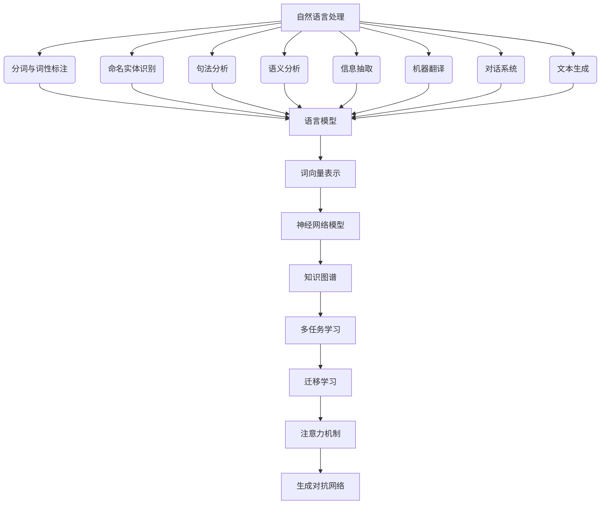
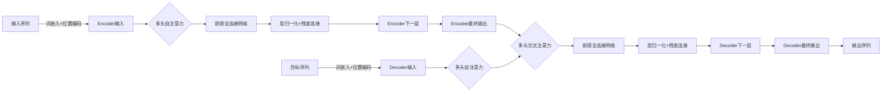

# 自然语言处理原理与代码实战案例讲解

## 1.背景介绍

### 1.1 自然语言处理的重要性

在当今信息时代,人类与计算机之间的交互日益频繁。自然语言处理(Natural Language Processing,NLP)作为人工智能的一个重要分支,旨在使计算机能够理解和生成人类自然语言,从而实现人机自然交互。随着大数据、深度学习等技术的发展,NLP得到了长足的进步,在机器翻译、智能问答、信息检索、情感分析等领域发挥着越来越重要的作用。

### 1.2 自然语言处理的挑战

尽管取得了长足进步,但NLP仍然面临着诸多挑战:

1. **语义理解**:准确理解自然语言的语义是NLP的核心难题,需要解决词义消歧、指代消解、语义角色标注等问题。
2. **语境理解**:语境对于理解自然语言至关重要,需要结合背景知识、对话历史等上下文信息。
3. **多语种支持**:不同语言在语法、语义等方面存在差异,需要针对不同语种设计相应的处理策略。
4. **知识融合**:NLP需要融合语言学、认知科学、逻辑学等多学科知识,形成统一的理论体系。

### 1.3 自然语言处理的发展历程

自然语言处理经历了规则化、统计化和深度学习三个主要阶段:

1. **规则化阶段**:基于专家经验总结出的规则,如语法分析等。优点是可解释性强,缺点是覆盖面窄、难以扩展。
2. **统计化阶段**:基于大规模语料库,利用统计学习方法自动获取语言模型。优点是可扩展性强,缺点是数据驱动、难以融入人类知识。
3. **深度学习阶段**:基于深度神经网络,端到端学习语言表示和任务模型。优点是性能优异,缺点是可解释性差、需要大量数据。

## 2.核心概念与联系

### 2.1 自然语言处理的主要任务

自然语言处理包括以下几个主要任务:

1. **分词与词性标注**:将文本切分为词语序列,并标注每个词语的词性。
2. **命名实体识别**:识别出文本中的人名、地名、组织机构名等命名实体。
3. **句法分析**:确定句子的语法结构树,包括短语结构和依存关系。
4. **语义分析**:理解句子的语义内涵,如词义消歧、语义角色标注等。
5. **信息抽取**:从非结构化文本中抽取所需的结构化信息,如事件、关系等。
6. **机器翻译**:将一种自然语言转换为另一种自然语言。
7. **对话系统**:与用户进行自然语言对话交互,实现问答、任务完成等功能。
8. **文本生成**:根据输入的信息自动生成自然语言文本,如新闻报道、小说等。

这些任务相互关联、环环相扣,共同构成了完整的自然语言处理流程。

### 2.2 自然语言处理的核心技术

自然语言处理涉及以下几种核心技术:

1. **语言模型**:基于大规模语料库,学习语言的统计规律,用于预测下一个词或字符的概率分布。
2. **词向量表示**:将词语映射为连续的向量空间,用于捕捉语义和句法信息。常用的词向量包括Word2Vec、GloVe等。
3. **神经网络模型**:利用深度神经网络对文本进行表示学习和建模,如RNN、CNN、Transformer等。
4. **知识图谱**:结构化表示实体、概念及其关系,为语义理解提供背景知识支持。
5. **多任务学习**:在相关任务之间共享知识,提高数据利用率和泛化能力。
6. **迁移学习**:将在大规模语料上预训练的模型迁移到下游任务,提升性能。
7. **注意力机制**:自动学习输入序列中不同部分对当前任务的重要程度。
8. **生成对抗网络**:通过生成器和判别器的对抗训练,生成高质量的自然语言文本。

这些技术相互融合,推动着自然语言处理的快速发展。

上图展示了自然语言处理的主要任务以及核心技术之间的关系。语言模型是基础,为各项任务提供语言知识支持。词向量表示和神经网络模型是主要的建模方式。知识图谱、多任务学习、迁移学习、注意力机制和生成对抗网络等则是提升模型性能的重要技术手段。

## 3.核心算法原理具体操作步骤

### 3.1 Word2Vec 词向量

Word2Vec是一种高效的词向量表示方法,包括CBOW(连续词袋模型)和Skip-Gram(跳元模型)两种模型。它们的核心思想是通过上下文预测目标词或反之,从而学习出词语的向量表示。

**CBOW模型步骤**:

1) 给定词语$w_t$的上下文$C_t=\{w_{t-n},...,w_{t-1},w_{t+1},...,w_{t+n}\}$,其中$n$为窗口大小。
2) 将上下文词向量$\vec{v}(w_{i})$求和,得到上下文向量$\vec{x}=\sum_{i\in C_t}\vec{v}(w_i)$。
3) 通过softmax函数计算目标词$w_t$的概率:$P(w_t|C_t)=\frac{e^{\vec{u}_t^T\vec{x}}}{\sum_{j}e^{\vec{u}_j^T\vec{x}}}$。
4) 最大化上述概率的对数似然,得到词向量$\vec{v}(w_i)$和$\vec{u}_t$。

**Skip-Gram模型步骤**:

1) 给定目标词$w_t$,预测其上下文词$C_t$中每个词$w_i$的概率:$P(w_i|w_t)=\frac{e^{\vec{v}(w_i)^T\vec{u}_t}}{\sum_{j}e^{\vec{v}(w_j)^T\vec{u}_t}}$。
2) 最大化上下文词概率的对数似然,得到词向量$\vec{v}(w_i)$和$\vec{u}_t$。

两种模型都采用了层次softmax和负采样等技术,以提高计算效率。

### 3.2 注意力机制

注意力机制是序列建模中的关键技术,它赋予模型动态关注输入序列不同部分的能力。以Transformer的多头注意力为例,具体步骤如下:

1) 将输入序列$\boldsymbol{X}=(x_1,x_2,...,x_n)$映射为查询$\boldsymbol{Q}$、键$\boldsymbol{K}$和值$\boldsymbol{V}$矩阵。
2) 计算查询与所有键的点积,得到未缩放的分数矩阵:$S=\boldsymbol{QK}^T$。
3) 对分数矩阵执行缩放:$\widetilde{S}=\frac{S}{\sqrt{d_k}}$,其中$d_k$为键向量维度。
4) 对缩放分数矩阵执行softmax,得到注意力权重矩阵:$A=\text{softmax}(\widetilde{S})$。
5) 将注意力权重与值矩阵相乘,得到注意力输出:$\text{Attention}(\boldsymbol{Q},\boldsymbol{K},\boldsymbol{V})=A\boldsymbol{V}$。

多头注意力机制将上述过程并行执行$h$次,然后将所有注意力输出拼接:

$$\begin{aligned}
\text{MultiHead}(\boldsymbol{Q},\boldsymbol{K},\boldsymbol{V})&=\text{Concat}(\text{head}_1,...,\text{head}_h)\boldsymbol{W}^O\\
\text{where}\  \text{head}_i&=\text{Attention}(\boldsymbol{QW}_i^Q,\boldsymbol{KW}_i^K,\boldsymbol{VW}_i^V)
\end{aligned}$$

其中$\boldsymbol{W}_i^Q\in\mathbb{R}^{d_\text{model}\times d_k}$等为可学习的线性投影矩阵。

通过自注意力,Transformer能够直接建模输入序列中任意两个位置的关系,极大提高了并行计算能力。

### 3.3 Transformer 模型

Transformer是一种全注意力的序列到序列模型,广泛应用于机器翻译、文本生成等任务。它的编码器(Encoder)和解码器(Decoder)都由多个相同的层组成,每层包含多头自注意力(Multi-Head Attention)和前馈全连接网络(Feed-Forward Network)。

**Transformer Encoder**:

1) 对输入序列$\boldsymbol{X}$执行词嵌入和位置编码,得到$\boldsymbol{X}'$。
2) 对$\boldsymbol{X}'$执行多头自注意力,捕捉输入序列中词与词之间的关系:

$$\text{MultiHead}(\boldsymbol{X}',\boldsymbol{X}',\boldsymbol{X}')=\boldsymbol{X}''$$

3) 对$\boldsymbol{X}''$执行前馈全连接网络,进一步提取特征:

$$\text{FFN}(\boldsymbol{X}'')=\max(0,\boldsymbol{X}''\boldsymbol{W}_1+\boldsymbol{b}_1)\boldsymbol{W}_2+\boldsymbol{b}_2$$

4) 对上述两个子层的输出执行残差连接和层归一化,得到该层的输出$\boldsymbol{Z}$。
5) 重复2-4步骤,串联多个编码器层。

**Transformer Decoder**:

1) 对输入序列$\boldsymbol{Y}$执行词嵌入和位置编码,得到$\boldsymbol{Y}'$。
2) 对$\boldsymbol{Y}'$执行多头自注意力,捕捉输出序列中词与词之间的关系。
3) 对$\boldsymbol{Y}'$和编码器最后一层输出$\boldsymbol{Z}$执行多头交叉注意力,捕捉输入和输出序列之间的关系:

$$\text{MultiHead}(\boldsymbol{Y}',\boldsymbol{Z},\boldsymbol{Z})=\boldsymbol{Y}''$$

4) 对$\boldsymbol{Y}''$执行前馈全连接网络。
5) 对上述三个子层的输出执行残差连接和层归一化,得到该层的输出。
6) 重复2-5步骤,串联多个解码器层。

通过自注意力和交叉注意力,Transformer能够高效地建模输入和输出序列之间的长程依赖关系,在机器翻译等任务上取得了卓越的性能。

上图展示了Transformer模型的整体架构。编码器通过多层自注意力对输入序列建模,解码器则在自注意力的基础上,增加了与编码器输出的交叉注