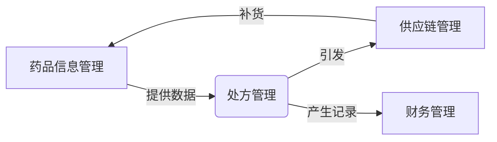
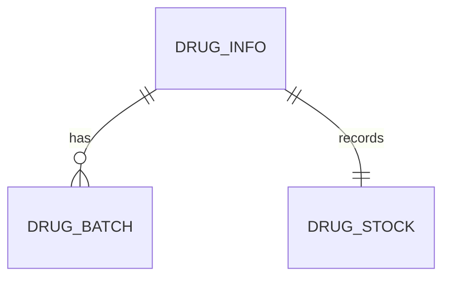
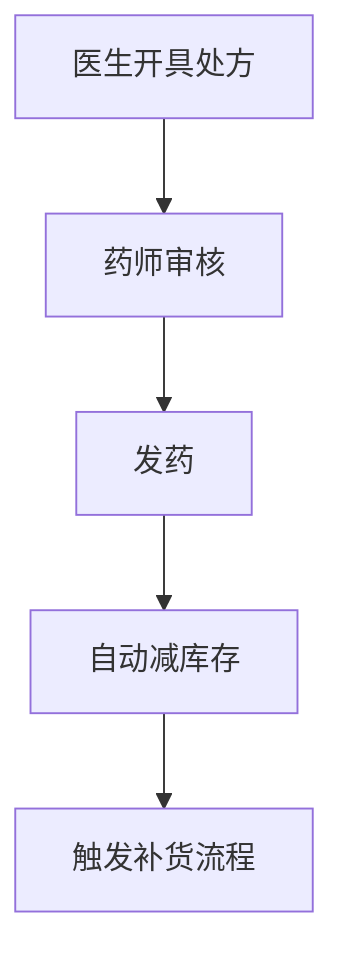
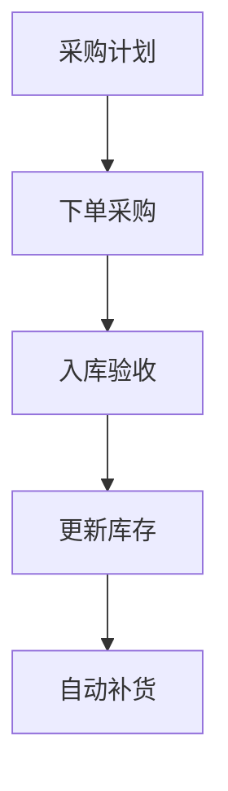
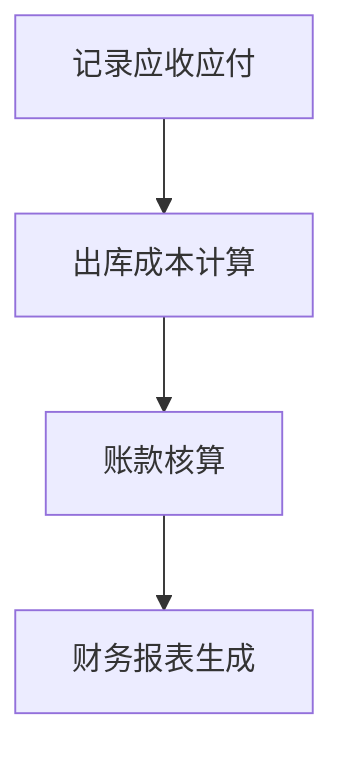

# 药品销售系统详细设计与具体代码实现

## 1.背景介绍

### 1.1 医疗卫生行业概况

在当今社会中,医疗卫生行业扮演着至关重要的角色。随着人口老龄化和慢性病患病率的上升,对高质量医疗服务的需求日益增长。因此,构建高效、安全的药品管理和销售系统对于确保患者用药安全、优化医疗资源分配至关重要。

### 1.2 传统药品销售系统存在的问题

传统的药品销售系统存在诸多弊端,例如:

- 手工操作繁琐,易出错
- 库存管理效率低下
- 缺乏实时监控和预警机制
- 数据存储分散,难以整合分析
- 无法满足多终端查询需求

这些问题不仅影响工作效率,更可能导致严重的用药错误,危及患者生命安全。

### 1.3 新一代药品销售系统的需求

为解决上述问题,医疗机构迫切需要一套集成化、智能化的新一代药品销售系统,具备如下关键特性:

- 信息集中管理,流程自动化
- 实时库存监控,自动补货
- 移动端无缝对接,多终端查询
- 智能决策支持,风险预警
- 数据可视化分析,辅助决策

## 2.核心概念与联系

在深入探讨系统设计之前,有必要阐明几个核心概念及其内在联系。

### 2.1 药品信息管理

药品信息管理是指对药品的基本信息(名称、规格、生产批号等)、库存数量、有效期等数据的集中式管理。它为整个销售流程提供了数据支撑。

### 2.2 处方管理

处方管理包括医生开具处方、药师审核和发药等环节。它是药品销售的核心流程,直接关系到用药安全。

### 2.3 供应链管理

供应链管理负责与上游药品供应商的对接,包括采购计划、订单处理、入库验收等。它确保药房能够及时获取所需药品。

### 2.4 财务管理

财务管理模块记录每笔销售交易,对应收账款、应付账款等进行核算,并生成相关财务报表,为决策提供支持。

### 2.5 核心关系

上述四个模块相互关联、相互支撑:

- 药品信息是处方管理和供应链管理的基础数据源
- 处方管理触发药品出库,导致库存变化,引发供应链补货
- 供应链管理为处方开具提供所需药品
- 处方交易记录是财务核算的主要来源



## 3.核心算法原理具体操作步骤  

### 3.1 药品信息管理算法

#### 3.1.1 数据建模

我们使用关系数据库对药品信息进行建模,主要包括以下几个表:

- 药品基本信息表(drug_info)
- 药品库存表(drug_stock)
- 药品生产批次表(drug_batch)

它们的关系如下所示:



其中:

- drug_info存储药品的静态基本信息,如通用名、商品名、规格等
- drug_batch存储每一批次的生产日期、有效期等动态信息
- drug_stock记录库存数量变化

#### 3.1.2 主要算法

1. **新增药品**

   - 检查drug_info中是否已存在该药品信息
   - 若不存在,插入新记录到drug_info
   - 在drug_stock表中为该药品插入初始库存记录

2. **批次入库**

   - 获取当前最大批次号
   - 为新批次插入drug_batch记录
   - 更新drug_stock中该药品库存数量
   
3. **查询库存**

   - 根据药品ID到drug_stock查询当前库存
   - 若库存不足,触发补货流程

算法的伪代码如下:

```python
# 新增药品
def add_new_drug(drug_info):
    if not exists(drug_info):
        insert_drug_info(drug_info)
        insert_init_stock(drug_info.id, 0)

# 批次入库
def batch_stock_in(drug_id, batch_info, quantity):
    max_batch_no = max(select_all_batches(drug_id))
    new_batch_no = max_batch_no + 1
    insert_batch(drug_id, new_batch_no, batch_info)
    update_stock(drug_id, quantity)
    
# 查询库存
def query_stock(drug_id):
    stock = select_stock(drug_id)
    if stock < minimum:
        trigger_replenish(drug_id)
    return stock
```

通过这些算法,我们可以高效管理庞大的药品信息和动态库存数据。

### 3.2 处方管理流程

处方管理流程包括以下主要步骤:



1. **医生开具处方**

   - 医生根据患者病情在系统中开具电子处方
   - 处方包含患者信息、药品清单等内容
   - 处方数据将存入处方数据库表

2. **药师审核**

   - 药师对处方中每一种药品进行审核
      - 检查用法、用量、是否存在禁忌等
      - 参考患者历史用药记录
   - 审核通过后,处方状态变更为"已审核"

3. **发药**

   - 出库人员根据处方中的药品清单领药
   - 系统自动减少相应药品库存数量
   - 处方状态变更为"已发药"

4. **自动减库存**

   - 发药环节自动触发库存量减少操作
   - 若某药品库存量低于设定阈值,触发补货流程

5. **触发补货流程**

   - 补货流程由供应链管理模块负责
   - 自动向指定供应商下达补货订单
   - 订单履行后,新批次药品入库

该流程的关键是处方数据与药品库存的无缝集成,确保数据实时更新、处理高效。

### 3.3 供应链管理流程

供应链管理流程的主要环节包括:



1. **采购计划**

   - 根据历史销量、安全库存量等,自动生成采购计划
   - 采购计划包括采购药品种类、数量等

2. **下单采购**

   - 根据采购计划,向合格供应商下达采购订单
   - 跟踪订单履行进度

3. **入库验收**

   - 药品到货后,进行验收
      - 检查货品数量、有效期等是否合格
   - 验收通过的药品批次将入库

4. **更新库存**

   - 新批次药品入库后,自动更新库存数据
   - 触发财务应付账款记录生成流程

5. **自动补货**

   - 若库存量低于设定阈值,自动触发补货流程
   - 减少人工干预,提高效率

该流程的关键是自动化程度高,可大幅减少人工干预,提高运营效率。

### 3.4 财务管理流程

财务管理流程的主要环节包括:



1. **记录应收应付**

   - 处方开具时,自动生成应收账款记录
   - 药品入库时,自动生成应付账款记录

2. **出库成本计算**

   - 发药时,根据具体批次,计算出库药品的实际成本
   - 成本核算遵循"先进先出"原则

3. **账款核算**

   - 根据出库成本、收费标准,计算应收应付款项
   - 扣除相应费用后,得到净利润

4. **财务报表生成**

   - 按照会计制度要求,自动生成相关财务报表
      - 利润表、现金流量表等
   - 为决策提供数据支持

该流程的关键是自动化、规范化,确保财务数据准确可靠。

## 4.数学模型和公式详细讲解举例说明

在药品销售系统中,我们需要使用一些数学模型和公式来支持决策。下面将详细介绍其中的几个关键模型。

### 4.1 安全库存量计算

安全库存是指为防止因供货延迟而导致断货,企业必须保有的最低限度库存量。合理的安全库存量对确保供应链顺畅至关重要。

安全库存量计算公式为:

$$
安全库存量 = 安全储备周期 \times 日均销量
$$

其中:

- 安全储备周期 ($T$) 是指在供货延迟的情况下,企业所能容忍的最长等待时间。
- 日均销量 ($D$) 是根据历史数据计算得到的日均销售量。

例如,某药品的安全储备周期为10天,日均销量为50盒,则其安全库存量为:

$$
安全库存量 = 10 \times 50 = 500 (盒)
$$

当实际库存量低于该值时,系统将自动触发补货流程。

### 4.2 经济订货量模型

经济订货量 (EOQ) 模型是在已知需求量、订货成本和库存成本时,确定最佳订货量的数学模型。

EOQ 公式为:

$$
EOQ = \sqrt{\frac{2DC_o}{C_c}}
$$

其中:

- $D$ 为年需求量
- $C_o$ 为每次订货的成本
- $C_c$ 为每单位产品的年库存成本

例如,某药品年需求量为10000盒,每次订货成本为200元,每盒年库存成本为5元,则其最佳订货量为:

$$
EOQ = \sqrt{\frac{2 \times 10000 \times 200}{5}} \approx 632 (盒)
$$

通过 EOQ 模型,企业可以权衡订货成本和库存成本,确定最经济的订货策略。

### 4.3 预测模型

为了更好地制定采购计划,我们需要对未来的药品需求进行预测。常用的预测模型包括移动平均法、指数平滑法等。

以移动平均法为例,其计算公式为:

$$
F_{t+1} = \frac{Y_t + Y_{t-1} + \cdots + Y_{t-n+1}}{n}
$$

其中:

- $F_{t+1}$ 为下一期的预测需求量
- $Y_t, Y_{t-1}, \cdots, Y_{t-n+1}$ 为最近 $n$ 期的实际需求量
- $n$ 为平滑周期

例如,预测某药品的下月需求量,平滑周期取3个月,最近3个月的实际需求量分别为800、750、900,则预测值为:

$$
F_4 = \frac{900 + 750 + 800}{3} = 817 (盒)
$$

通过预测模型,我们可以提前了解未来的需求变化趋势,从而制定更加科学的采购计划。

## 5.项目实践: 代码实例和详细解释说明

为了更好地理解系统的实现细节,下面将给出一些核心模块的代码示例,并进行详细解释。

### 5.1 药品信息管理模块

该模块负责药品基本信息的维护,主要包括以下几个类:

- `DrugInfo` 存储药品基本信息
- `DrugBatch` 存储药品批次信息
- `DrugStock` 存储药品库存信息
- `DrugInfoManager` 提供药品信息管理的各种操作方法

```python
class DrugInfo:
    def __init__(self, id, name, description, unit, ...):
        self.id = id 
        self.name = name
        self.description = description
        self.unit = unit
        
class DrugBatch:
    def __init__(self, drug_id, batch_no, prod_date, exp_date, ...):
        self.drug_id = drug_id
        self.batch_no = batch_no
        self.prod_date = prod_date
        self.exp_date = exp_date
        
class DrugStock:
    def __init__(self, drug_id, quantity, ...