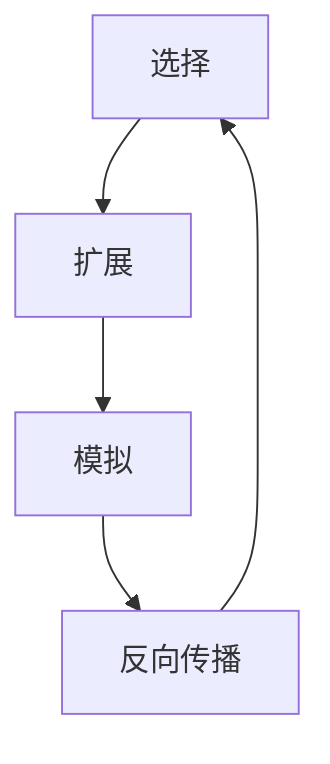

## 1.背景介绍

蒙特卡洛树搜索（Monte Carlo Tree Search，简称MCTS）是一种人工智能算法，用于处理决策问题，特别是那些涉及不确定性或者概率性的问题。这种算法最初在2006年被提出，用于解决围棋等完全信息游戏的问题，但现在已经被广泛应用于各种领域，包括计算机游戏、机器人控制、药物研发等。

## 2.核心概念与联系

MCTS的核心思想是利用随机模拟的方式进行决策。它通过在决策树上进行随机模拟，评估每个可能的行动的期望收益，然后选择收益最大的行动。这种方法的优点在于，它不需要对问题进行明确的建模，只需要能够模拟问题的进程。

MCTS的基本过程包括四个步骤：选择（Selection）、扩展（Expansion）、模拟（Simulation）和反向传播（Backpropagation）。这四个步骤共同构成了MCTS的基本框架。



## 3.核心算法原理具体操作步骤

### 3.1 选择

选择步骤是从根节点开始，按照某种策略，逐步选择子节点，直到达到一个尚未完全扩展的节点。这个策略通常是基于UCB（Upper Confidence Bound）公式，即选择使得 $UCB = X_j + C \sqrt{\frac{2 \ln n}{n_j}}$ 最大的节点，其中 $X_j$ 是节点 $j$ 的平均收益，$n$ 是父节点的访问次数，$n_j$ 是节点 $j$ 的访问次数，$C$ 是一个常数。

### 3.2 扩展

在选择步骤结束后，会得到一个尚未完全扩展的节点。扩展步骤就是为这个节点添加一个或者多个新的子节点，每个子节点对应一个可能的行动。

### 3.3 模拟

模拟步骤是从新扩展的节点开始，按照某种策略（通常是随机策略）进行模拟，直到达到一个终止状态，然后根据这个状态给出一个奖励值。

### 3.4 反向传播

反向传播步骤是将模拟得到的奖励值回传到所有经过的节点，并更新这些节点的访问次数和平均收益。

以上四个步骤反复进行，直到达到某个终止条件（如时间限制或者模拟次数限制），然后从根节点的子节点中选择访问次数最多的节点作为最终的行动。

## 4.数学模型和公式详细讲解举例说明

MCTS的核心是UCB公式，它是一种权衡探索和利用的方法。下面我们详细解释这个公式。

$$UCB = X_j + C \sqrt{\frac{2 \ln n}{n_j}}$$

其中 $X_j$ 是节点 $j$ 的平均收益，$n$ 是父节点的访问次数，$n_j$ 是节点 $j$ 的访问次数，$C$ 是一个常数。

这个公式的第一部分 $X_j$ 代表了节点 $j$ 的平均收益，也就是利用部分；第二部分 $C \sqrt{\frac{2 \ln n}{n_j}}$ 代表了探索部分，其中 $C$ 是一个常数，用于调节探索和利用的权重，$n$ 是父节点的访问次数，$n_j$ 是节点 $j$ 的访问次数。这个公式的含义是，我们应该选择那些既有高平均收益又少被访问的节点。

## 5.项目实践：代码实例和详细解释说明

下面我们给出一个简单的MCTS的Python实现。

```python
class Node:
    def __init__(self, state, parent=None):
        self.state = state
        self.parent = parent
        self.children = []
        self.visits = 0
        self.rewards = 0

    def select(self):
        # Select a child node according to the UCB formula
        s = max(self.children, key=lambda c: c.rewards/c.visits + sqrt(2*log(self.visits)/c.visits))
        return s

    def expand(self, action):
        # Expand the tree by creating a new child node
        child = Node(self.state.do_action(action), parent=self)
        self.children.append(child)
        return child

    def simulate(self):
        # Simulate a random play and return the reward
        current_play = self.state.copy()
        reward = 0
        while not current_play.is_terminal():
            action = current_play.get_random_action()
            reward += current_play.do_action(action)
        return reward

    def backpropagate(self, reward):
        # Update the current node and propagate the result to the parent
        self.visits += 1
        self.rewards += reward
        if self.parent:
            self.parent.backpropagate(reward)
```

这段代码定义了一个节点类，包括选择、扩展、模拟和反向传播四个方法，对应MCTS的四个步骤。在实际使用中，需要根据具体问题定义状态类和行动类，然后在主程序中调用这个节点类进行MCTS。

## 6.实际应用场景

MCTS已经被广泛应用于各种领域。在计算机游戏中，MCTS被用于实现AI对手，如围棋程序AlphaGo。在机器人控制中，MCTS被用于规划路径和策略。在药物研发中，MCTS被用于搜索化合物空间。

## 7.工具和资源推荐

对于想要深入学习和应用MCTS的读者，我推荐以下工具和资源：

- **Python**：Python是一种易于学习且功能强大的编程语言，非常适合实现MCTS。
- **Pygame**：Pygame是一个Python的游戏开发库，可以用来制作各种游戏，包括那些可以应用MCTS的策略游戏。
- **OpenAI Gym**：OpenAI Gym是一个提供各种环境的强化学习库，可以用来测试和比较MCTS等算法。

## 8.总结：未来发展趋势与挑战

MCTS是一种强大的决策算法，但也面临着一些挑战。首先，MCTS的性能依赖于模拟的质量，但在很多问题中，进行高质量的模拟是非常困难的。其次，MCTS需要大量的计算资源，这限制了它在实际问题中的应用。未来，我们需要继续研究如何提高MCTS的效率和效果，以及如何将MCTS与其他方法（如深度学习）结合。

## 9.附录：常见问题与解答

**问**：MCTS适用于所有的决策问题吗？

**答**：不是的，MCTS主要适用于那些可以模拟的、有大量可能行动的、并且没有明显的最优策略的问题。

**问**：MCTS可以和深度学习结合吗？

**答**：可以的，实际上，AlphaGo就是将MCTS和深度学习结合的一个例子。在AlphaGo中，深度学习用于评估状态和选择行动，而MCTS用于进行搜索。

**问**：MCTS的计算复杂度是多少？

**答**：MCTS的计算复杂度取决于模拟的次数和树的大小，通常可以认为是线性的或者接近线性的。但在实际应用中，由于需要进行大量的模拟，所以MCTS通常需要大量的计算资源。

作者：禅与计算机程序设计艺术 / Zen and the Art of Computer Programming