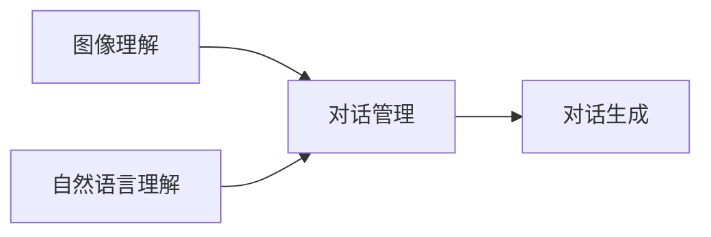

## 1.背景介绍

视觉对话（Visual Dialogue）是一种新兴的人工智能研究领域，它结合了计算机视觉和自然语言处理两大领域，目标是让机器能够理解图像内容，并能够与人进行关于图像的自由对话。视觉对话具有广泛的应用前景，例如智能客服、智能教育、无障碍服务等。

## 2.核心概念与联系

视觉对话的核心概念包括图像理解、自然语言理解、对话管理和生成等。图像理解主要通过深度学习模型如卷积神经网络（CNN）提取图像特征；自然语言理解主要通过循环神经网络（RNN）或者Transformer模型理解语言语义；对话管理则是根据对话历史和当前问题生成合适的回答。



## 3.核心算法原理具体操作步骤

视觉对话的主要步骤如下：

1. **图像特征提取**：使用预训练的CNN模型（如ResNet或VGG）提取图像特征。
2. **问题理解**：使用RNN或Transformer模型理解问题的语义。
3. **对话历史理解**：使用RNN或Transformer模型理解对话历史。
4. **对话管理**：根据图像特征、问题理解和对话历史生成回答。
5. **对话生成**：使用RNN或Transformer模型生成自然语言回答。

## 4.数学模型和公式详细讲解举例说明

视觉对话的数学模型主要包括CNN、RNN和Transformer。这里以CNN为例进行简单介绍。

CNN的基本公式如下：

$$
f_{i,j} = \max(0, \sum_{m}\sum_{n} x_{i+m,j+n}w_{m,n} + b)
$$

其中，$f_{i,j}$是特征图的每一个元素，$x_{i+m,j+n}$是输入图像的每一个元素，$w_{m,n}$是卷积核的每一个元素，$b$是偏置项。

## 5.项目实践：代码实例和详细解释说明

这里以Python和PyTorch为例，简单介绍如何实现视觉对话的基本步骤。

首先，我们需要加载预训练的CNN模型来提取图像特征：

```python
from torchvision import models
model = models.resnet50(pretrained=True)
```

然后，我们使用RNN模型理解问题和对话历史：

```python
import torch.nn as nn
rnn = nn.RNN(input_size=100, hidden_size=200, num_layers=2)
```

接着，我们使用一个全连接层来进行对话管理：

```python
fc = nn.Linear(200, 100)
```

最后，我们使用RNN模型生成自然语言回答：

```python
output, hidden = rnn(input, hidden)
```

## 6.实际应用场景

视觉对话有很多实际应用场景，例如：

- **智能客服**：用户可以通过提问获取产品的视觉信息，例如“这个鞋子的颜色是什么？”。
- **智能教育**：教师可以通过视觉对话系统教授学生理解和描述图像，例如“这幅画描绘的是什么？”。
- **无障碍服务**：视觉障碍的人可以通过视觉对话系统理解周围的环境，例如“我面前有什么？”。

## 7.工具和资源推荐

视觉对话的研究和应用需要大量的工具和资源，这里推荐几个重要的资源：

- **PyTorch**：一个开源的深度学习框架，支持CNN、RNN和Transformer等模型。
- **Visual Dialog Dataset**：一个公开的视觉对话数据集，包含了大量的图像和对话数据。
- **Visual Dialog Challenge**：一个公开的视觉对话比赛，可以获取最新的研究成果和技术动态。

## 8.总结：未来发展趋势与挑战

视觉对话是一个新兴而富有挑战的领域，未来的发展趋势包括更精细的图像理解、更深层次的语义理解、更自然的对话生成等。同时，这个领域也面临着很多挑战，例如如何理解复杂的图像、如何处理复杂的问题、如何生成自然的回答等。

## 9.附录：常见问题与解答

1. **视觉对话和图像识别有什么区别？**

图像识别主要是识别图像中的对象，而视觉对话则需要理解图像内容，并能够与人进行关于图像的自由对话。

2. **视觉对话的难点在哪里？**

视觉对话的难点包括如何理解复杂的图像、如何处理复杂的问题、如何管理对话、如何生成自然的回答等。

3. **如何评价视觉对话的效果？**

视觉对话的效果可以通过多轮对话的准确性、回答的自然性、对话的流畅性等进行评价。

作者：禅与计算机程序设计艺术 / Zen and the Art of Computer Programming