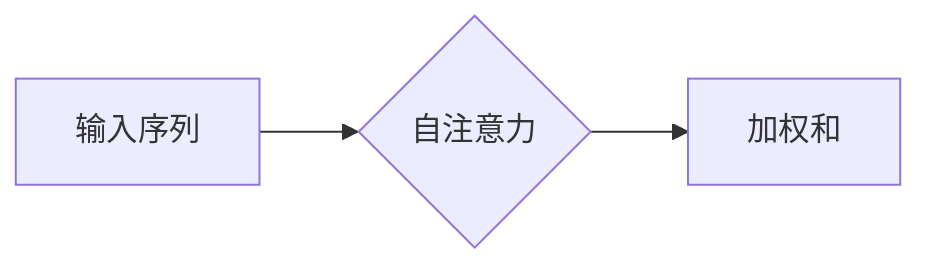
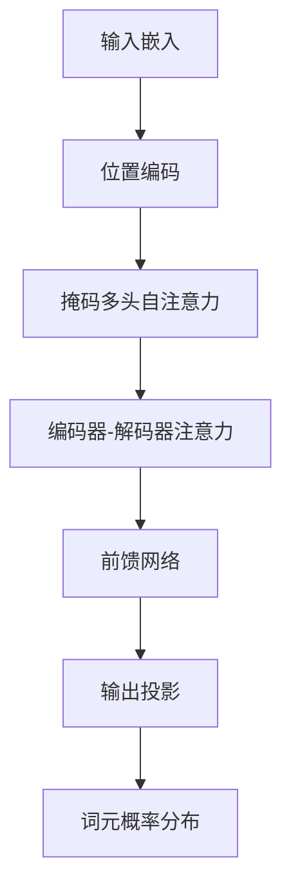

# 解码器的输出和Transformer的输出头

## 1.背景介绍

### 1.1 机器翻译的发展

机器翻译是自然语言处理领域的一个重要任务,旨在自动将一种语言的文本转换为另一种语言。早期的机器翻译系统主要基于规则和统计方法,但由于语言的复杂性和多样性,这些传统方法在处理长句和复杂语法时存在局限性。

### 1.2 神经网络机器翻译的兴起

随着深度学习技术的发展,神经网络机器翻译(NMT)系统逐渐取代了传统方法,展现出卓越的性能。NMT系统能够自动学习语言的特征和规则,并通过大量数据训练来构建端到端的翻译模型。其中,Transformer模型是NMT领域的一个里程碑式的创新,它引入了自注意力机制,大大提高了翻译质量和训练效率。

### 1.3 Transformer模型的重要性

Transformer模型已经成为NMT领域的主流架构,并被广泛应用于其他自然语言处理任务,如文本生成、语言理解等。解码器的输出和Transformer的输出头是Transformer模型中的关键组件,对于理解模型的工作原理和优化性能至关重要。

## 2.核心概念与联系

### 2.1 Transformer模型概述

Transformer是一种基于自注意力机制的序列到序列(Seq2Seq)模型,由编码器(Encoder)和解码器(Decoder)组成。编码器将输入序列(如源语言文本)映射为高维向量表示,解码器则根据编码器的输出和目标序列的前缀(如已翻译的目标语言文本)生成下一个词元。


### 2.2 自注意力机制

自注意力机制是Transformer模型的核心,它允许模型在计算每个词元的表示时,关注整个输入序列的不同位置。这种机制有助于捕获长距离依赖关系,并提高了模型的表现力。



### 2.3 解码器的输出

解码器的输出是Transformer模型生成目标序列的关键。在每个时间步,解码器会根据编码器的输出、前一时间步的输出以及当前时间步的输入(如已翻译的目标语言文本),计算出一个概率分布,表示下一个词元的可能性。

### 2.4 Transformer的输出头

输出头(Output Head)是Transformer模型的最后一层,它将解码器的输出转换为目标任务所需的格式。对于机器翻译任务,输出头通常是一个线性层和softmax层的组合,用于生成每个词元的概率分布。

## 3.核心算法原理具体操作步骤

### 3.1 Transformer解码器的工作流程

1. **输入嵌入**:将当前时间步的输入词元(如已翻译的目标语言文本)映射为向量表示。

2. **位置编码**:由于Transformer没有递归或卷积结构,因此需要添加位置编码来保留序列的位置信息。

3. **掩码多头自注意力**:计算当前时间步输入的自注意力表示,同时遮蔽未来时间步的信息,以保证模型只关注当前和过去的输入。

4. **编码器-解码器注意力**:将当前时间步的输出与编码器的输出进行注意力计算,获取与输入序列相关的上下文信息。

5. **前馈网络**:将注意力输出通过全连接前馈网络进行进一步处理。

6. **输出投影**:将前馈网络的输出通过输出头(线性层和softmax)映射为词元概率分布。



### 3.2 输出头的计算过程

输出头将解码器的最终输出 $\boldsymbol{h}$ 映射为词元概率分布 $\boldsymbol{P}$:

$$\boldsymbol{P} = \text{softmax}(\boldsymbol{W}_o \boldsymbol{h} + \boldsymbol{b}_o)$$

其中 $\boldsymbol{W}_o$ 和 $\boldsymbol{b}_o$ 分别是输出头的权重矩阵和偏置向量,需要在训练过程中学习。softmax函数将线性投影的结果转换为概率分布。

在训练阶段,模型会最大化目标序列的对数似然,即最小化交叉熵损失:

$$\mathcal{L} = -\sum_{t=1}^{T} \log P(y_t | y_{<t}, \boldsymbol{x})$$

其中 $y_t$ 是目标序列在时间步 $t$ 的词元, $y_{<t}$ 表示前 $t-1$ 个词元, $\boldsymbol{x}$ 是输入序列。

在推理阶段,模型会根据概率分布 $\boldsymbol{P}$ 选择最可能的词元作为输出,并将其作为下一时间步的输入,重复这一过程直到生成完整的目标序列。

## 4.数学模型和公式详细讲解举例说明

### 4.1 自注意力机制

自注意力机制是Transformer模型的核心,它允许模型在计算每个词元的表示时,关注整个输入序列的不同位置。给定一个输入序列 $\boldsymbol{X} = (x_1, x_2, \dots, x_n)$,自注意力计算过程如下:

1. 将输入序列 $\boldsymbol{X}$ 映射为查询(Query)、键(Key)和值(Value)向量:

   $$\begin{aligned}
   \boldsymbol{Q} &= \boldsymbol{X} \boldsymbol{W}^Q \\
   \boldsymbol{K} &= \boldsymbol{X} \boldsymbol{W}^K \\
   \boldsymbol{V} &= \boldsymbol{X} \boldsymbol{W}^V
   \end{aligned}$$

   其中 $\boldsymbol{W}^Q$、$\boldsymbol{W}^K$ 和 $\boldsymbol{W}^V$ 是可学习的权重矩阵。

2. 计算查询与键的点积,获得注意力分数矩阵 $\boldsymbol{A}$:

   $$\boldsymbol{A} = \text{softmax}\left(\frac{\boldsymbol{Q}\boldsymbol{K}^\top}{\sqrt{d_k}}\right)$$

   其中 $d_k$ 是键向量的维度,缩放因子 $\sqrt{d_k}$ 用于防止梯度消失或爆炸。

3. 将注意力分数矩阵 $\boldsymbol{A}$ 与值向量 $\boldsymbol{V}$ 相乘,得到自注意力的输出:

   $$\text{Attention}(\boldsymbol{Q}, \boldsymbol{K}, \boldsymbol{V}) = \boldsymbol{A}\boldsymbol{V}$$

自注意力机制允许模型自适应地为每个位置分配不同的注意力权重,捕获长距离依赖关系。

### 4.2 多头自注意力

为了进一步提高模型的表现力,Transformer使用了多头自注意力机制。多头自注意力将输入序列映射为多个子空间,并在每个子空间中进行自注意力计算,最后将所有子空间的结果拼接起来。

给定一个输入序列 $\boldsymbol{X}$,多头自注意力的计算过程如下:

1. 将输入序列 $\boldsymbol{X}$ 映射为查询、键和值向量:

   $$\begin{aligned}
   \boldsymbol{Q}^i &= \boldsymbol{X} \boldsymbol{W}_i^Q \\
   \boldsymbol{K}^i &= \boldsymbol{X} \boldsymbol{W}_i^K \\
   \boldsymbol{V}^i &= \boldsymbol{X} \boldsymbol{W}_i^V
   \end{aligned}$$

   其中 $i = 1, 2, \dots, h$ 表示第 $i$ 个注意力头,共有 $h$ 个注意力头。$\boldsymbol{W}_i^Q$、$\boldsymbol{W}_i^K$ 和 $\boldsymbol{W}_i^V$ 是可学习的权重矩阵。

2. 对每个注意力头,计算自注意力输出:

   $$\text{head}_i = \text{Attention}(\boldsymbol{Q}^i, \boldsymbol{K}^i, \boldsymbol{V}^i)$$

3. 将所有注意力头的输出拼接起来,并进行线性投影:

   $$\text{MultiHead}(\boldsymbol{Q}, \boldsymbol{K}, \boldsymbol{V}) = \text{Concat}(\text{head}_1, \dots, \text{head}_h)\boldsymbol{W}^O$$

   其中 $\boldsymbol{W}^O$ 是可学习的权重矩阵,用于将拼接后的向量投影回模型的维度。

多头自注意力机制允许模型从不同的子空间捕获不同的特征,提高了模型的表现力和泛化能力。

### 4.3 位置编码

由于Transformer没有递归或卷积结构,因此需要添加位置编码来保留序列的位置信息。位置编码是一个矩阵,其中每一行对应一个位置,每一列对应一个维度。位置编码的计算公式如下:

$$\begin{aligned}
\text{PE}_{(pos, 2i)} &= \sin\left(\frac{pos}{10000^{2i/d_\text{model}}}\right) \\
\text{PE}_{(pos, 2i+1)} &= \cos\left(\frac{pos}{10000^{2i/d_\text{model}}}\right)
\end{aligned}$$

其中 $pos$ 是词元的位置索引,从 0 开始; $i$ 是维度的索引,取值范围为 $[0, d_\text{model}/2)$; $d_\text{model}$ 是模型的隐藏层维度。

位置编码与输入嵌入相加,以引入位置信息:

$$\boldsymbol{X}_\text{pos} = \boldsymbol{X}_\text{emb} + \text{PE}$$

其中 $\boldsymbol{X}_\text{emb}$ 是输入序列的嵌入向量,而 $\boldsymbol{X}_\text{pos}$ 是添加了位置编码后的输入。

## 5.项目实践:代码实例和详细解释说明

在这一部分,我们将提供一个基于PyTorch实现的Transformer解码器示例,并详细解释每个组件的作用。

### 5.1 导入所需库

```python
import torch
import torch.nn as nn
import math
```

### 5.2 定义多头自注意力层

```python
class MultiHeadAttention(nn.Module):
    def __init__(self, d_model, num_heads):
        super(MultiHeadAttention, self).__init__()
        self.d_model = d_model
        self.num_heads = num_heads
        self.head_dim = d_model // num_heads

        self.q_linear = nn.Linear(d_model, d_model)
        self.k_linear = nn.Linear(d_model, d_model)
        self.v_linear = nn.Linear(d_model, d_model)
        self.out_linear = nn.Linear(d_model, d_model)

    def forward(self, query, key, value, mask=None):
        batch_size = query.size(0)

        query = self.q_linear(query).view(batch_size, -1, self.num_heads, self.head_dim).transpose(1, 2)
        key = self.k_linear(key).view(batch_size, -1, self.num_heads, self.head_dim).transpose(1, 2)
        value = self.v_linear(value).view(batch_size, -1, self.num_heads, self.head_dim).transpose(1, 2)

        scores = torch.matmul(query, key.transpose(-2, -1)) / math.sqrt(self.head_dim)

        if mask is not None:
            scores = scores.masked_fill(mask == 0, -1e9)

        attention_probs = nn.Softmax(dim=-1)(scores)
        context = torch.matmul(attention_probs, value)
        context = context.transpose(1, 2).contiguous().view(batch_size, -1, self.num_heads * self.head_dim)

        output = self.out_linear(context)

        return output
```

这个代码实现了多头自注意力层。它首先将输入的查询、键和值向量分别通过线性层映射为多个头的表示,然后计算注意力分数矩阵,并根据