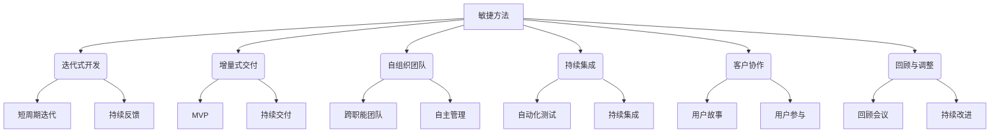
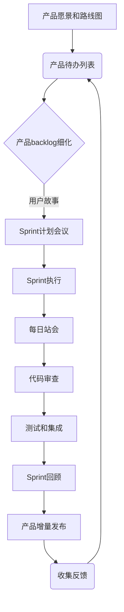
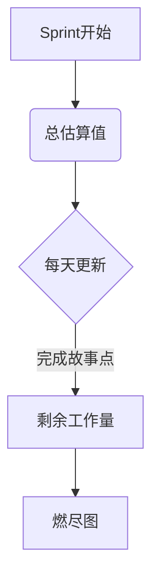
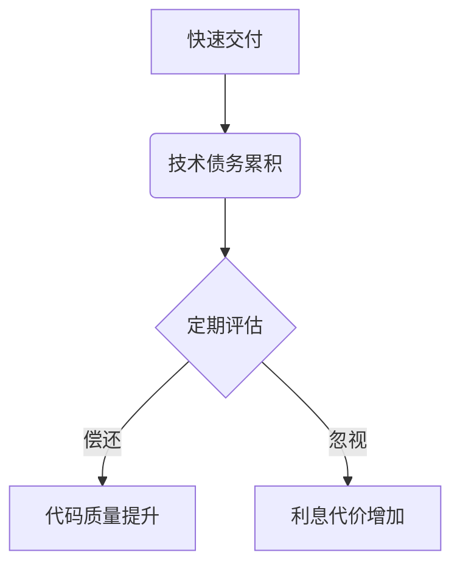

# 解码敏捷方法:提高IT项目交付效率

## 1.背景介绍

### 1.1 软件开发的挑战

在当今快节奏的商业环境中,软件开发已经成为许多组织的核心竞争力。然而,传统的瀑布式软件开发模型往往效率低下、反应迟缓、成本高昂,难以适应不断变化的市场需求和技术发展趋势。这促使软件行业不断探索更加高效、灵活的开发方法,以提高软件交付的质量和速度。

### 1.2 敏捷方法的兴起

敏捷方法(Agile Methodologies)应运而生,它强调迭代式、增量式的软件开发,注重人员的沟通协作,快速响应变化的需求。2001年,敏捷宣言(Agile Manifesto)的发布奠定了敏捷开发的基本理念和实践原则,标志着敏捷方法在软件开发领域的正式确立。

### 1.3 敏捷方法的核心价值观

敏捷方法倡导以下核心价值观:

- 个体和互动高于过程和工具
- 可工作的软件高于详尽的文档
- 客户合作高于合同谈判
- 响应变化高于遵循计划

这些价值观强调以人为本、交付可工作的软件、与客户紧密协作以及对变化的快速响应,旨在提高软件开发的效率和质量。

## 2.核心概念与联系

敏捷方法包含了多种具体实践和框架,如Scrum、XP(Extreme Programming)、Kanban、Lean等。虽然它们在细节上有所不同,但都遵循了敏捷宣言的核心理念,并共享一些关键概念。



### 2.1 迭代式开发

敏捷方法采用迭代式开发模式,将整个项目划分为多个短周期的迭代,每个迭代都交付一部分可工作的软件增量。这种方式有利于获取及时反馈,快速响应变化,并持续交付有价值的软件。

### 2.2 增量式交付

与传统的"一次交付全部"不同,敏捷方法倾向于分阶段、增量式地交付软件。开发团队首先交付一个最小可行产品(MVP),然后根据反馈持续改进和扩展功能,从而降低风险,提高交付效率。

### 2.3 自组织团队

敏捷团队通常是跨职能的,由开发人员、测试人员、产品负责人等角色组成。团队成员自主管理工作,共同承担项目责任,而非层层授权。这种自组织模式有利于提高团队的凝聚力和效率。

### 2.4 持续集成

持续集成(Continuous Integration)是敏捷实践中的一个关键环节。开发人员频繁将代码集成到主干,并通过自动化测试来验证软件的质量,从而及早发现并修复缺陷,降低集成风险。

### 2.5 客户协作

敏捷方法强调与客户的紧密协作。开发团队通过用户故事(User Story)来捕获需求,并让客户参与到整个开发过程中,确保交付的软件符合客户的真实需求。

### 2.6 回顾与调整

每个迭代结束后,敏捷团队都会召开回顾会议,总结经验教训,并对开发实践进行持续改进。这种持续学习和调整的过程有助于团队不断提高效率和质量。

## 3.核心算法原理具体操作步骤

虽然敏捷方法包含多种具体实践,但它们都遵循一些共同的原则和过程。以下是敏捷开发的典型流程:



### 3.1 产品愿景和路线图

敏捷项目始于明确的产品愿景和路线图,它们为后续的开发工作提供了总体方向和目标。

### 3.2 产品待办列表

根据产品愿景,将所有需求项整理到产品待办列表(Product Backlog)中,并按照优先级进行排序。

### 3.3 产品backlog细化

在每个迭代开始前,开发团队会对当前最高优先级的需求进行细化,将其分解为一组可测试的用户故事,并估算完成每个故事所需的工作量。

### 3.4 Sprint计划会议

基于产品backlog中的用户故事,团队召开Sprint计划会议,选择本次迭代要完成的工作项,制定Sprint目标和计划。

### 3.5 Sprint执行

Sprint是敏捷开发的核心环节。在固定的时间框架内(通常为1-4周),开发团队按计划执行编码、测试等工作,并每日召开短暂的站会(Daily Scrum)来同步进展和解决障碍。

### 3.6 代码审查

为了确保代码质量,团队成员会相互审查彼此的代码,提出改进建议。

### 3.7 测试和集成

通过自动化测试和持续集成,验证新开发的功能是否符合预期,并将其集成到主干代码中。

### 3.8 Sprint回顾

每个Sprint结束后,团队会召开Sprint回顾会议,回顾本次迭代的过程、成果和问题,并制定改进措施。

### 3.9 产品增量发布

根据Sprint的交付成果,发布一个可工作的软件增量,供客户或最终用户使用和评估。

### 3.10 收集反馈

收集来自客户、用户和团队内部的反馈,并将其纳入下一个迭代的产品backlog中,持续优化和改进产品。

通过这种循环迭代的过程,敏捷团队可以快速交付有价值的软件增量,并根据反馈持续调整和完善产品。

## 4.数学模型和公式详细讲解举例说明

在敏捷开发中,有一些常用的数学模型和公式,可以帮助团队更好地估算工作量、评估进度和管理风险。

### 4.1 故事点估算

故事点(Story Point)是敏捷开发中常用的相对估算单位,用于衡量完成一个用户故事所需的工作量大小。它通常采用非线性的斐波那契数列(1、2、3、5、8、13、21...)进行估算。

假设团队已经完成了一个基准故事,估算为5故事点。那么,对于一个新的用户故事,团队可以根据与基准故事的相对复杂程度,给出如3或8等故事点的估算值。

$$
估算值 = 5 \times \frac{新故事的复杂度}{基准故事的复杂度}
$$

通过这种相对估算方式,团队可以避免陷入精确估算的困境,更加专注于比较故事之间的相对工作量大小。

### 4.2 燃尽图

燃尽图(Burndown Chart)是敏捷项目中常用的可视化工具,用于跟踪团队的工作进度和剩余工作量。

在Sprint开始时,燃尽图上会显示本次迭代的总故事点估算值。随着时间推移,每天都会更新已完成的故事点数,剩余工作量则呈下降趋势。理想情况下,燃尽线应该是一条直线,表示团队按计划稳步完成工作。

$$
剩余工作量 = 总估算值 - \sum_{i=1}^{n}完成的故事点_i
$$

如果燃尽线出现上升或平缓的趋势,则说明团队的进度落后于计划,需要采取相应的调整措施。



### 4.3 技术债务管理

在软件开发过程中,为了加快交付速度,团队有时会采取一些权宜之计或暂时性妥协,从而积累了技术债务(Technical Debt)。如果不加以控制和偿还,技术债务会逐渐累积,最终导致代码质量下降、维护成本增加。

$$
利息代价 = 技术债务本金 \times 利率 \times 时间
$$

其中,利率取决于代码的复杂程度和团队的技能水平。通过定期评估和偿还技术债务,团队可以控制长期的利息代价,保持代码的可维护性和可扩展性。



### 4.4 控制图

在敏捷过程中,控制图(Control Chart)可以用于监控各种度量指标,如故障密度、代码覆盖率等,从而评估软件质量和流程稳定性。

控制图包含三条线:中心线(CL)、上控制限(UCL)和下控制限(LCL)。如果数据点落在控制限内,则表示流程处于统计控制状态;如果有点落在控制限外,则可能存在异常情况,需要进一步分析和采取行动。

$$
\begin{aligned}
CL &= \overline{X} \\
UCL &= \overline{X} + 3\sigma \\
LCL &= \overline{X} - 3\sigma
\end{aligned}
$$

其中,$\overline{X}$表示样本均值,$\sigma$表示样本标准差。通过控制图,团队可以及时发现流程中的异常变化,并采取适当的措施来控制质量和改进流程。

## 5.项目实践:代码实例和详细解释说明

为了更好地理解敏捷实践,我们来看一个简单的代码示例,展示如何使用Test-Driven Development(TDD)和持续集成(CI)来开发一个计算器程序。

### 5.1 需求分析

首先,我们从用户故事开始,捕获计算器的基本需求:

```
作为一个用户
我希望能够执行基本的算术运算
以便进行简单的数学计算
```

### 5.2 测试先行

在编写实际代码之前,我们先根据需求编写单元测试用例,以驱动后续的开发过程。以下是使用Python的unittest模块编写的测试用例:

```python
import unittest

class CalculatorTests(unittest.TestCase):

    def test_add(self):
        self.assertEqual(4, add(2, 2))

    def test_subtract(self):
        self.assertEqual(2, subtract(4, 2))

    def test_multiply(self):
        self.assertEqual(6, multiply(2, 3))

    def test_divide(self):
        self.assertEqual(2, divide(4, 2))
        self.assertRaises(ValueError, divide, 4, 0)

if __name__ == '__main__':
    unittest.main()
```

在这个阶段,所有测试用例都会失败,因为我们还没有实现相应的功能。

### 5.3 编写实现代码

接下来,我们编写最简单的代码实现,使测试用例通过:

```python
def add(a, b):
    return a + b

def subtract(a, b):
    return a - b

def multiply(a, b):
    return a * b

def divide(a, b):
    if b == 0:
        raise ValueError("Cannot divide by zero")
    return a / b
```

通过反复运行测试、编写代码、重构,我们可以逐步完善计算器的功能,确保代码符合预期行为。

### 5.4 持续集成

为了提高开发效率和质量,我们可以设置持续集成(CI)流水线,自动