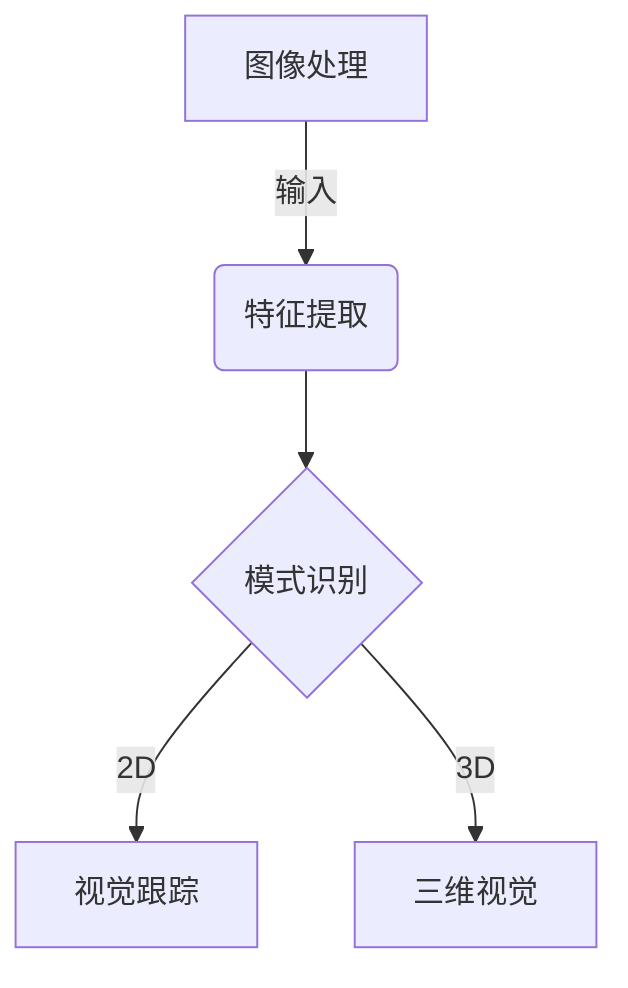
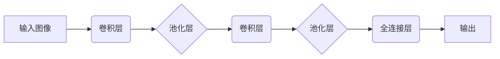

# 计算机视觉 原理与代码实例讲解

## 1. 背景介绍

### 1.1 什么是计算机视觉?

计算机视觉(Computer Vision)是一门研究如何使机器能够获取、处理、分析和理解数字图像或视频数据的科学,旨在使机器能够模仿和超越人类的视觉能力。它是人工智能(AI)的一个重要分支,涉及模式识别、图像处理、计算机图形学等多个领域。

### 1.2 计算机视觉的重要性

在当今的数字时代,图像和视频数据的产生量呈爆炸式增长。计算机视觉技术为自动化处理和理解这些海量视觉数据提供了强大的工具,在众多领域发挥着至关重要的作用:

- **安防监控**: 人脸识别、行为分析、异常检测等
- **自动驾驶**: 物体检测、场景理解、导航定位等
- **医疗影像**: 病灶检测、图像分割、辅助诊断等
- **工业自动化**: 缺陷检测、产品质检、机器人视觉等
- **增强现实/虚拟现实**: 运动捕捉、三维重建等

### 1.3 计算机视觉的挑战

尽管计算机视觉技术取得了长足进步,但仍面临诸多挑战:

- **视觉信息的复杂性**: 图像/视频包含大量信息,需要高效提取有价值的特征
- **数据质量问题**: 噪声、遮挡、光照变化等会影响算法性能
- **计算复杂度**: 视觉任务往往需要大量计算资源
- **领域适应性**: 不同领域的视觉任务存在显著差异,通用性不足
- **模型可解释性**: 神经网络模型往往是黑盒子,缺乏可解释性

## 2. 核心概念与联系

计算机视觉涉及多个核心概念,这些概念相互关联、环环相扣,构成了完整的理论体系和技术框架。

### 2.1 图像处理

图像处理(Image Processing)是计算机视觉的基础,旨在对原始图像数据进行预处理,提高图像质量和可解释性。常见的图像处理操作包括:

- 去噪、锐化、增强对比度等图像增强技术
- 几何变换(平移、旋转、缩放等)
- 图像分割、边缘检测等

### 2.2 特征提取

特征提取(Feature Extraction)是将原始图像数据转换为适合后续任务的特征表示的过程。良好的特征表示对视觉任务的性能至关重要。常见的特征提取方法有:

- 手工设计特征(HOG、SIFT、LBP等)
- 基于卷积神经网络的自动特征学习

### 2.3 模式识别

模式识别(Pattern Recognition)是计算机视觉的核心,旨在对图像/视频中的模式(如物体、人脸等)进行检测和识别。主要技术包括:

- 监督学习(如支持向量机、随机森林等)
- 深度学习(如卷积神经网络、递归神经网络等)
- 聚类分析、主成分分析等无监督学习方法

### 2.4 三维视觉

三维视觉(3D Vision)致力于从二维图像/视频数据中重建三维场景信息,包括:

- 立体视觉(Stereo Vision)
- 结构光(Structured Light)
- 视觉测量(Visual Metrology)

### 2.5 视觉跟踪

视觉跟踪(Visual Tracking)旨在跟踪视频序列中运动目标的位置和运动轨迹,在视频监控、人机交互等领域有广泛应用。

### 2.6 核心概念关系

上述核心概念相互关联、互为基础,构成了完整的计算机视觉技术体系,如下图所示:



## 3. 核心算法原理具体操作步骤

### 3.1 卷积神经网络

卷积神经网络(Convolutional Neural Network, CNN)是计算机视觉领域最重要和最成功的深度学习模型之一,在图像分类、目标检测、语义分割等任务中表现出色。CNN的核心思想是通过卷积操作自动学习图像的特征表示。

CNN的基本结构由卷积层(Convolutional Layer)、池化层(Pooling Layer)和全连接层(Fully Connected Layer)组成,如下图所示:



1. **卷积层**:通过滑动卷积核(Kernel)在输入特征图上进行卷积操作,提取局部特征。
2. **池化层**:对卷积层的输出进行下采样,减少特征图的空间维度,提高模型的鲁棒性和计算效率。
3. **全连接层**:将前面层的特征图展平,并通过全连接层进行分类或回归任务。

CNN的训练过程采用反向传播算法,通过最小化损失函数来优化网络参数(卷积核权重和偏置)。数据增广、正则化、优化器选择等技巧可以提高CNN的泛化能力。

### 3.2 目标检测算法

目标检测(Object Detection)是计算机视觉中一项基础且重要的任务,旨在定位图像中感兴趣的目标并识别它们的类别。常见的目标检测算法包括:

1. **基于候选区域的算法**:
   - selective search、边界框回归等传统方法
   - R-CNN系列算法(R-CNN、Fast R-CNN、Faster R-CNN等)

2. **基于密集采样的算法**:
   - YOLO系列算法(YOLOv1、YOLOv2、YOLOv3等)
   - SSD(Single Shot MultiBox Detector)

3. **基于关键点的算法**:
   - CornerNet
   - CenterNet

这些算法的核心思想是利用卷积神经网络提取图像特征,然后通过不同的方式(候选区域、密集采样、关键点等)生成目标边界框和类别预测。近年来,基于Transformer的目标检测算法(如DETR)也取得了不错的性能。

### 3.3 语义分割算法

语义分割(Semantic Segmentation)是将图像中的每个像素点与对应的对象类别相关联的任务,在自动驾驶、医疗影像分析等领域有重要应用。常见的语义分割算法包括:

1. **基于编码器-解码器结构的CNN**:
   - FCN(Fully Convolutional Networks)
   - SegNet
   - U-Net

2. **基于空间金字塔池化的CNN**:
   - PSPNet(Pyramid Scene Parsing Network)
   - DeepLab系列

3. **基于Transformer的算法**:
   - SETR(Segmentation Transformers)

这些算法通常采用编码器-解码器架构,编码器用于提取图像特征,解码器则将特征映射回原始图像分辨率,生成每个像素的类别预测。注意力机制、空间金字塔池化等技术可以提高模型的性能。

### 3.4 实例分割算法

实例分割(Instance Segmentation)是语义分割的延伸,不仅需要预测每个像素的类别,还需要将属于同一个实例的像素区分开来。常见的实例分割算法包括:

1. **基于候选区域的算法**:
   - Mask R-CNN
   - HTC(Hybrid Task Cascade)

2. **基于密集像素预测的算法**:
   - SOLO(SOLOv1、SOLOv2)
   - CondInst

这些算法通常在目标检测的基础上,增加了一个分支用于预测每个实例的掩码(Mask)。基于候选区域的算法先生成候选框,再预测每个框内的掩码;而基于密集像素预测的算法则直接对整个图像进行端到端的预测。

## 4. 数学模型和公式详细讲解举例说明

### 4.1 卷积操作

卷积操作是CNN中最核心的运算,用于提取输入特征图的局部特征。设输入特征图为 $I$,卷积核为 $K$,卷积操作可以表示为:

$$
O(i,j) = \sum_{m}\sum_{n}I(i+m,j+n)K(m,n)
$$

其中 $O$ 为输出特征图, $(i,j)$ 为输出特征图的坐标, $(m,n)$ 为卷积核的坐标。卷积操作实现了对输入特征图的局部区域进行加权求和,提取出对应的特征。

通过学习卷积核的权重,CNN可以自动获取最优的特征表示,而不需要手工设计特征。

### 4.2 非极大值抑制

非极大值抑制(Non-Maximum Suppression, NMS)是目标检测算法中常用的后处理步骤,用于消除重叠的候选框。NMS的基本思想是:对于每个类别,首先根据置信度(Confidence)排序所有候选框;然后从置信度最高的候选框开始,移除与之重叠程度较高的其他候选框。

设 $B_i$ 和 $B_j$ 为两个候选框,它们的交并比(Intersection over Union, IoU)定义为:

$$
\text{IoU}(B_i, B_j) = \frac{\text{Area}(B_i \cap B_j)}{\text{Area}(B_i \cup B_j)}
$$

如果 $\text{IoU}(B_i, B_j) > \text{threshold}$,则认为 $B_i$ 和 $B_j$ 存在重叠,应当移除置信度较低的那个候选框。

通过NMS,可以有效地去除冗余的候选框,提高目标检测的精度。

### 4.3 损失函数

训练深度学习模型通常需要定义损失函数(Loss Function),用于衡量模型预测与真实标签之间的差异。在计算机视觉任务中,常用的损失函数包括:

1. **交叉熵损失(Cross-Entropy Loss)**:
   $$
   \mathcal{L}_\text{CE} = -\frac{1}{N}\sum_{i=1}^{N}\sum_{c=1}^{C}y_{i,c}\log(p_{i,c})
   $$
   其中 $N$ 为样本数, $C$ 为类别数, $y_{i,c}$ 为样本 $i$ 的真实标签(0或1), $p_{i,c}$ 为模型预测的概率。交叉熵损失常用于分类任务。

2. **焦点损失(Focal Loss)**:
   $$
   \mathcal{L}_\text{FL} = -\frac{1}{N}\sum_{i=1}^{N}\sum_{c=1}^{C}(1-p_{i,c})^\gamma y_{i,c}\log(p_{i,c})
   $$
   焦点损失在交叉熵损失的基础上引入了 $(1-p_{i,c})^\gamma$ 项,用于降低易分样本的权重,提高困难样本的权重,常用于目标检测和实例分割任务。

3. **Dice Loss**:
   $$
   \mathcal{L}_\text{Dice} = 1 - \frac{2\sum_{i=1}^{N}p_iy_i}{\sum_{i=1}^{N}p_i^2 + \sum_{i=1}^{N}y_i^2}
   $$
   Dice Loss常用于语义分割任务,用于衡量预测掩码与真实掩码之间的重合程度。

通过合理选择损失函数,并结合其他正则化技术(如L1/L2正则化、Dropout等),可以有效地提高模型的泛化能力。

## 5. 项目实践:代码实例和详细解释说明

### 5.1 图像分类:使用PyTorch实现LeNet

LeNet是一个经典的卷积神经网络模型,由Yann LeCun等人于1998年提出,用于手写数字识别。下面是使用PyTorch实现LeNet的代码示例:

```python
import torch
import torch.nn as nn

class LeNet(nn.Module):
    def __init__(self):
        super(LeNet, self).__init__()
        self.conv1 = nn.Conv2d(1, 6, kernel_size=5, stride=1, padding=0)
        self.pool1 = nn.MaxPool2d(kernel_size=2, stride=2)
        self.conv2 = nn.Conv2d(6, 16, kernel_size=5, stride=1, padding=0)
        