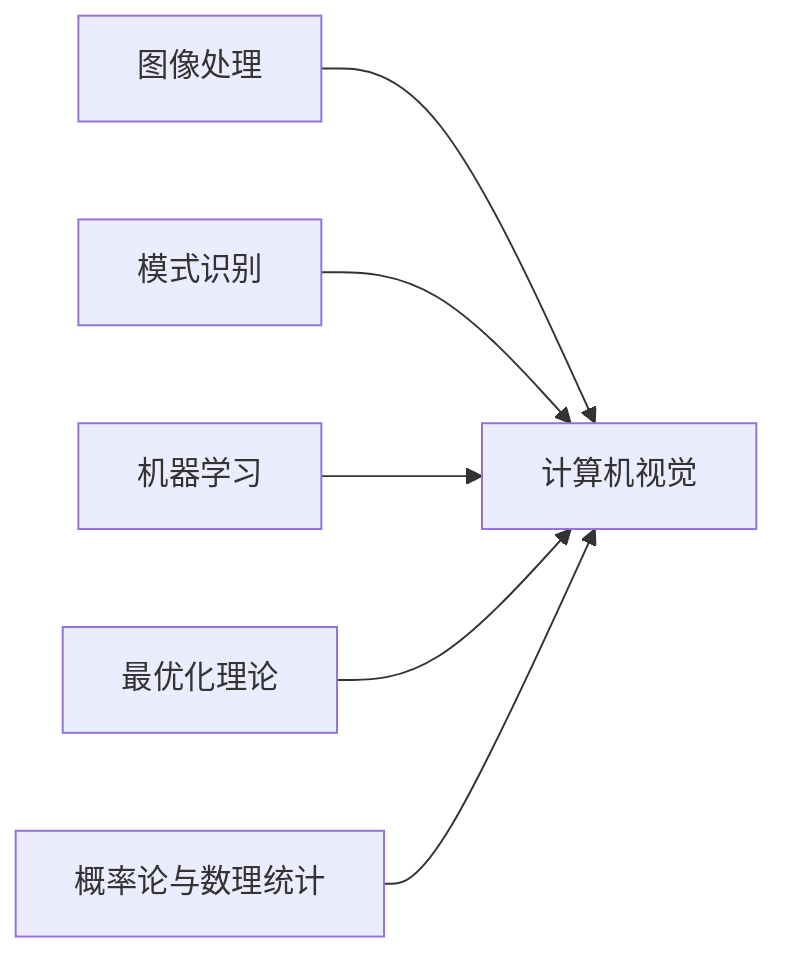

# 计算机视觉(Computer Vision) - 原理与代码实例讲解

## 1.背景介绍

### 1.1 计算机视觉的定义与发展历程

计算机视觉(Computer Vision)是一门研究如何使计算机获得高层次理解的学科,利用数字图像或视频来模拟人类视觉的各个层次,使计算机能够识别和理解图像或视频中的内容。计算机视觉起源于20世纪60年代,经过半个多世纪的发展,已经取得了巨大的进展。

计算机视觉的发展大致经历了以下几个阶段:

1. 形成期(20世纪60年代):这一时期计算机视觉刚刚起步,主要研究图像处理和模式识别。
2. 发展期(20世纪70-80年代):这一时期的研究集中在三维重建、运动分析、图像分割等方面。
3. 应用期(20世纪90年代):随着计算机性能的提升,计算机视觉开始在工业界得到应用,如工业视觉检测等。
4. 深度学习时代(21世纪初至今):深度学习技术的崛起,极大地推动了计算机视觉的发展,使得图像分类、目标检测、语义分割等任务性能大幅提升。

### 1.2 计算机视觉的应用领域

计算机视觉技术已广泛应用于各个领域,主要包括:

1. 智能监控:利用计算机视觉实现人脸识别、行为分析、异常检测等。
2. 无人驾驶:通过视觉感知实现障碍物检测、车道线检测、交通标志识别等。
3. 医学影像:辅助医生进行疾病诊断,如肿瘤检测、眼底图像分析等。
4. 工业视觉:应用于工业生产的各个环节,如缺陷检测、字符识别、机器人视觉等。
5. 虚拟/增强现实:构建沉浸式的虚拟环境,实现人机交互。
6. 其他领域:如人机交互、三维重建、遥感图像分析等。

## 2.核心概念与联系

### 2.1 计算机视觉的主要任务

计算机视觉主要任务可分为低层视觉、中层视觉和高层视觉:

1. 低层视觉:主要处理图像的底层特征,如边缘、角点、纹理等。代表算法有Canny边缘检测、Harris角点检测等。
2. 中层视觉:在低层视觉基础上进行处理,实现图像分割、特征提取与匹配等。代表算法有Hough变换、SIFT特征等。
3. 高层视觉:对图像语义内容进行分析和理解,如图像分类、目标检测、语义分割等。代表算法有卷积神经网络、R-CNN等。

这三个层次相辅相成,共同构成了计算机视觉的核心内容。

### 2.2 计算机视觉的理论基础

计算机视觉涉及多个学科领域,主要理论基础包括:

1. 图像处理:研究图像的编码、增强、复原、压缩等基本处理方法。
2. 模式识别:研究如何对数据进行分类,是图像分类等任务的理论基础。
3. 机器学习:研究如何从数据中学习,是当前计算机视觉算法的核心。尤其是深度学习技术的发展,极大地推动了计算机视觉的进步。
4. 最优化理论:很多计算机视觉问题可以建模为最优化问题,如能量最小化等。
5. 概率论与数理统计:用于描述不确定性,是很多算法的数学基础。



## 3.核心算法原理具体操作步骤

本节介绍几个经典的计算机视觉算法,包括图像分类、目标检测和语义分割。

### 3.1 图像分类

图像分类旨在将图像划分到预定义的类别中。以卷积神经网络(CNN)为代表的深度学习方法是解决图像分类问题的主流方法。CNN的基本结构包括:

1. 卷积层:通过卷积操作提取图像特征。
2. 池化层:降低特征图的空间分辨率,提高特征的鲁棒性。
3. 全连接层:将提取到的特征映射到类别标签空间。

CNN的训练过程通常包括以下步骤:

1. 准备图像数据集,并将其划分为训练集和测试集。
2. 定义CNN模型结构,如AlexNet、VGGNet、ResNet等。
3. 定义损失函数,如交叉熵损失函数。
4. 使用优化算法(如SGD、Adam)对模型进行训练,不断更新模型参数以最小化损失函数。 
5. 在测试集上评估模型性能,计算准确率等指标。

### 3.2 目标检测

目标检测不仅要对图像进行分类,还要确定目标的位置。主流的目标检测算法包括两阶段检测器(如R-CNN系列)和单阶段检测器(如YOLO、SSD)。以YOLO算法为例,其基本步骤如下:

1. 将输入图像划分为SxS个网格。
2. 对每个网格预测B个边界框、C个类别概率和一个objectness score。
3. 根据objectness score过滤边界框,得到候选区域。
4. 对候选区域执行非极大值抑制(NMS),得到最终的检测结果。

YOLO算法通过一次性预测所有边界框,大大提高了检测速度。同时引入了objectness score,有效降低了背景区域产生的误检。

### 3.3 语义分割

语义分割是对图像中的每个像素进行分类,预测其所属的类别。以全卷积网络(FCN)为代表的算法是解决语义分割问题的主流方法。FCN的基本思想是用卷积层替代全连接层,从而实现对任意大小图像的像素级分类。FCN的训练步骤与图像分类类似,主要区别在于:

1. 使用逐像素标注的数据集进行训练,如PASCAL VOC、Cityscapes等。
2. 损失函数使用逐像素的交叉熵损失函数。
3. 评估指标使用像素准确率(pixel accuracy)、平均交并比(mean IoU)等。

FCN的一个问题是空间分辨率的损失。为此,后续工作引入了编码器-解码器结构,用反卷积等操作恢复空间细节,如SegNet、U-Net等。

## 4.数学模型和公式详细讲解举例说明

本节以图像分类任务为例,介绍相关的数学模型和公式。

### 4.1 图像表示

数字图像可以表示为一个三维矩阵$I\in\mathbb{R}^{H\times W\times C}$,其中$H$、$W$、$C$分别表示图像的高度、宽度和通道数。对于RGB图像,$C=3$,对应红、绿、蓝三个通道。

卷积神经网络通常接受张量$\mathbf{X}\in\mathbb{R}^{N\times H\times W\times C}$作为输入,其中$N$为一个batch中图像的数量。

### 4.2 卷积操作

卷积操作是提取图像特征的主要手段。二维卷积操作可以表示为:

$$\mathbf{Y}[i,j]=\sum_m\sum_n\mathbf{X}[i+m,j+n]\mathbf{K}[m,n]$$

其中$\mathbf{X}$为输入特征图,$\mathbf{K}$为卷积核,$\mathbf{Y}$为输出特征图。卷积核通过在输入特征图上滑动,提取局部特征。

### 4.3 池化操作

池化操作用于降低特征图的空间分辨率,提高特征的鲁棒性。常见的池化操作包括最大池化和平均池化,其数学表达式分别为:

$$\mathbf{Y}[i,j]=\max_{m,n}\mathbf{X}[i\cdot s+m,j\cdot s+n]$$
$$\mathbf{Y}[i,j]=\frac{1}{k^2}\sum_{m}\sum_{n}\mathbf{X}[i\cdot s+m,j\cdot s+n]$$

其中$s$为池化的步长,$k$为池化核的大小。

### 4.4 损失函数

图像分类任务通常使用交叉熵损失函数,其数学表达式为:

$$L=-\sum_{i=1}^N\sum_{j=1}^Cy_{ij}\log(p_{ij})$$

其中$y_{ij}$为第$i$个样本属于第$j$类的真实标签($y_{ij}\in\{0,1\}$),$p_{ij}$为模型预测第$i$个样本属于第$j$类的概率。

### 4.5 优化算法

神经网络通常使用梯度下降法进行优化,即通过不断更新模型参数$\theta$以最小化损失函数$L$:

$$\theta^{t+1}=\theta^t-\eta\nabla_\theta L(\theta^t)$$

其中$\eta$为学习率。常用的梯度下降变体有随机梯度下降(SGD)、Adam等。

## 5.项目实践:代码实例和详细解释说明

本节以PyTorch框架为例,介绍如何实现一个简单的卷积神经网络用于图像分类。

### 5.1 定义模型结构

首先定义卷积神经网络的结构,包括卷积层、池化层和全连接层:

```python
import torch.nn as nn

class Net(nn.Module):
    def __init__(self):
        super(Net, self).__init__()
        self.conv1 = nn.Conv2d(3, 16, 3)
        self.pool1 = nn.MaxPool2d(2, 2)
        self.conv2 = nn.Conv2d(16, 32, 3)
        self.pool2 = nn.MaxPool2d(2, 2)
        self.fc1 = nn.Linear(32 * 6 * 6, 120)
        self.fc2 = nn.Linear(120, 84)
        self.fc3 = nn.Linear(84, 10)

    def forward(self, x):
        x = self.pool1(F.relu(self.conv1(x)))
        x = self.pool2(F.relu(self.conv2(x)))
        x = x.view(-1, 32 * 6 * 6)
        x = F.relu(self.fc1(x))
        x = F.relu(self.fc2(x))
        x = self.fc3(x)
        return x
```

这个网络包含两个卷积-池化层和三个全连接层。卷积核大小为3x3,池化核大小为2x2。`forward`函数定义了前向传播过程。

### 5.2 准备数据集

使用`torchvision`提供的CIFAR10数据集,并对图像进行归一化处理:

```python
import torchvision
import torchvision.transforms as transforms

transform = transforms.Compose(
    [transforms.ToTensor(),
     transforms.Normalize((0.5, 0.5, 0.5), (0.5, 0.5, 0.5))])

trainset = torchvision.datasets.CIFAR10(root='./data', train=True,
                                        download=True, transform=transform)
trainloader = torch.utils.data.DataLoader(trainset, batch_size=4,
                                          shuffle=True, num_workers=2)

testset = torchvision.datasets.CIFAR10(root='./data', train=False,
                                       download=True, transform=transform)
testloader = torch.utils.data.DataLoader(testset, batch_size=4,
                                         shuffle=False, num_workers=2)
```

### 5.3 定义损失函数和优化器

使用交叉熵损失函数和SGD优化器:

```python
import torch.optim as optim

criterion = nn.CrossEntropyLoss()
optimizer = optim.SGD(net.parameters(), lr=0.001, momentum=0.9)
```

### 5.4 训练模型

循环遍历数据集,进行模型训练:

```python
for epoch in range(2):  # 多个epoch

    running_loss = 0.0
    for i, data in enumerate(trainloader, 0):
        # 获取输入
        inputs, labels = data

        # 梯度清零
        optimizer.zero_grad()

        # 前向传播+反向传播+优化 
        outputs = net(inputs)
        loss = criterion(outputs, labels)
        loss.backward()
        optimizer.step()

        # 打印统计信息
        running_loss += loss.item()
        if i % 2000 == 1999:    # 每2