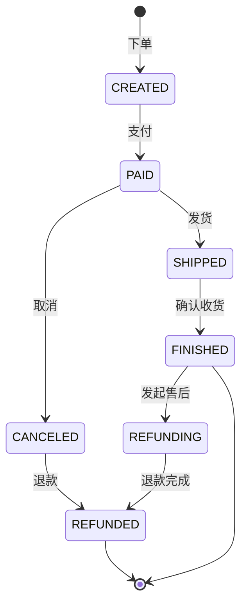

# 订单管理系统详细设计与具体代码实现

## 1.背景介绍

在现代电子商务环境下,订单管理系统是一个至关重要的组成部分。它涉及到从客户下单到最终交付的整个流程,包括订单的创建、支付、履行、配送以及售后服务等各个环节。一个高效、可靠的订单管理系统不仅可以提高企业的运营效率,降低成本,更能够提升客户满意度,为企业赢得良好的口碑和竞争优势。

本文将深入探讨订单管理系统的详细设计与具体代码实现。我们将从核心概念出发,理清订单管理中的关键业务实体及其关系,并基于领域驱动设计(DDD)的思想,对系统进行合理的领域建模和微服务拆分。在此基础上,文章将重点阐述订单状态流转的核心算法原理,并结合数学模型和公式进行详细讲解。同时,我们还将给出项目实践的代码实例,以Java语言和Spring Cloud框架为例,展示订单管理系统的关键功能实现。此外,文章还将讨论订单管理系统在实际业务场景中的应用,推荐一些常用的开发工具和学习资源,并展望订单管理领域的未来发展趋势与面临的挑战。

## 2.核心概念与联系

要设计一个优秀的订单管理系统,首先需要理清其中涉及的核心概念和关键业务实体。

### 2.1 订单(Order)

订单是整个系统的核心领域实体,代表了客户向商家购买商品或服务的请求。一个订单通常包含以下关键信息:

- 订单号(ID):唯一标识一个订单的编号
- 客户信息:下单客户的身份信息,如姓名、联系方式等  
- 商品明细:订单中购买的商品信息,包括商品ID、名称、数量、单价等
- 金额汇总:订单的总金额,各种优惠和运费的计算结果
- 收货信息:配送地址、收货人、联系电话等
- 支付信息:支付方式、支付状态等
- 物流信息:配送方式、物流状态、快递单号等
- 订单状态:表示订单当前所处的状态,如已下单、已付款、已发货、已完成等

### 2.2 商品(Product)

商品是订单明细中的主要内容,代表了商家在平台上销售的产品。每个商品都有一个唯一的ID,同时包含名称、价格、库存、图片等属性信息。

### 2.3 用户(User)

泛指在系统中注册的客户和商家,是下单和接单的主体。用户拥有基本的身份信息,如用户名、密码、手机号等。商家还拥有额外的信息如店铺名称、评分等。

### 2.4 支付(Payment)

支付是订单交易的关键环节,代表了客户将钱款支付给商家的过程。常见的支付方式有余额支付、第三方支付(如微信、支付宝)、银行卡支付等。支付状态是判断订单状态的重要依据。

### 2.5 物流(Logistics)  

物流代表了商品从商家发货到客户签收的整个配送过程。系统需要对接第三方物流服务,获取物流状态,如已发货、运输中、已签收等。

### 2.6 售后(AfterSale)

售后泛指客户在收到商品后发起的退货、换货、维修等请求。每个售后请求也有一个独立的编号,并记录售后类型、原因、处理状态等信息。

### 2.7 促销(Promotion)

促销是指商家为了刺激消费而在特定时间范围内推出的优惠活动,如满减、打折、赠品等。促销信息会影响订单的优惠金额计算。

以上这些核心概念之间存在着错综复杂的关联关系,比如一个订单包含多个商品,一个商品可以属于多个订单;订单与支付、物流、售后之间是一对多的关系;促销规则又会影响到订单的金额计算,等等。理清这些概念和关系,是进行领域建模和系统设计的基础。

## 3.核心算法原理与具体操作步骤

订单状态的流转是订单管理系统的核心,其中的状态变更规则可以总结为一个有限状态机(FSM)。每当发生一个事件,就会触发状态的变更,一个订单在其生命周期内会经历多个状态。下面我们重点介绍订单状态流转的算法原理和实现步骤。

### 3.1 订单状态图

首先,我们需要定义订单可能存在的所有状态,并画出状态迁移图。一个简化的订单状态图如下:



状态说明:
- CREATED:订单已创建,等待支付 
- PAID:订单已支付,等待发货
- SHIPPED:订单已发货,等待确认收货
- FINISHED:订单已完成
- CANCELED:订单已取消 
- REFUNDING:订单发起退款
- REFUNDED:订单退款完成

### 3.2 状态模式与策略模式

要在代码中实现状态机,我们可以采用两种常见的设计模式:状态模式和策略模式。

状态模式将每个状态封装为一个独立的类,并将状态迁移的逻辑放在状态类中。当发生状态变更时,通过切换不同的状态对象来改变订单的行为。

策略模式将每个状态变更的逻辑封装为一个独立的策略类。每个策略类实现相同的接口,订单对象根据当前的状态和事件,选择合适的策略对象来执行相应的操作。

两种模式各有优劣,可以根据系统的复杂度和变更频率来选择。一般来说,状态模式更加面向对象,但是会引入更多的状态类;策略模式更加灵活,但是会增加策略类的数量。

### 3.3 具体实现步骤

下面我们以策略模式为例,展示订单状态流转的具体实现步骤。

1. 定义订单状态枚举

```java
public enum OrderStatus {
    CREATED, PAID, SHIPPED, FINISHED, CANCELED, REFUNDING, REFUNDED;  
}
```

2. 定义订单事件枚举

```java
public enum OrderEvent {
    PAY, SHIP, RECEIVE, CANCEL, REFUND;
}
```

3. 定义状态迁移策略接口

```java
public interface OrderStateTransitionStrategy {
    boolean handle(Order order);
}  
```

4. 实现具体的状态迁移策略类

```java
@Component
public class OrderPayStrategy implements OrderStateTransitionStrategy {
    @Override
    public boolean handle(Order order) {
        if (order.getStatus() == OrderStatus.CREATED) {
            order.setStatus(OrderStatus.PAID);
            return true;
        }
        return false;
    }
}

@Component
public class OrderShipStrategy implements OrderStateTransitionStrategy {
    @Override
    public boolean handle(Order order) {
        if (order.getStatus() == OrderStatus.PAID) {
            order.setStatus(OrderStatus.SHIPPED);
            return true;
        }
        return false;
    }
}

// 其他策略类...
```

5. 在订单服务中注入策略类,并提供状态变更方法

```java
@Service
public class OrderService {
    
    private Map<OrderEvent, OrderStateTransitionStrategy> strategyMap;
    
    public OrderService(List<OrderStateTransitionStrategy> strategyList) {
        strategyMap = strategyList.stream().collect(
            Collectors.toMap(strategy -> strategy.getClass().getAnnotation(OrderStateTransition.class).event(),
                             Function.identity()));
    }
    
    public boolean changeState(Order order, OrderEvent event) {
        OrderStateTransitionStrategy strategy = strategyMap.get(event);
        if (strategy != null) {
            return strategy.handle(order);
        }
        return false;
    }
}
```

这样,当我们需要对一个订单执行状态变更时,只需要调用 `orderService.changeState(order, event)` 即可,系统会自动选择合适的策略对象来处理。

## 4.数学模型与公式详细讲解

在订单管理系统中,经常需要进行一些数学计算,比如订单金额、优惠折扣、运费等。下面我们以订单金额的计算为例,给出详细的数学模型和公式。

### 4.1 订单金额计算

一个订单的总金额(total)由商品金额(itemTotal)、优惠金额(discountTotal)和运费(freight)三部分组成。

$$
total = itemTotal - discountTotal + freight
$$

其中,商品金额等于所有商品的价格乘以数量之和:

$$
itemTotal = \sum_{i=1}^{n} price_i \times quantity_i
$$

优惠金额则需要根据不同的促销规则来计算。常见的促销规则有:

1. 满减促销:当订单金额达到指定的阈值时,可以减免固定的金额。例如"满100减10"。
2. 折扣促销:对订单金额按照一定的比例进行折扣。例如"8折"。
3. 赠品促销:在订单中添加价格为0的赠品,不影响实际支付金额。

多个促销规则可以同时应用,系统需要选出最优惠的组合。假设有 $m$ 个满减促销规则,满减阈值为 $threshold_j$,减免金额为 $discount_j$,折扣促销的折扣率为 $rate$,则优惠金额的计算公式为:

$$
discountTotal = \max(\max_{1 \leq j \leq m}(itemTotal \geq threshold_j \rightarrow discount_j), itemTotal \times (1 - rate))
$$

也就是说,我们首先判断满减阈值,找出能够满足条件的最大减免额,然后将其与折扣促销的优惠额进行比较,取最大值作为最终的优惠金额。

运费的计算相对简单,通常是根据订单金额、重量、配送距离等因素,在后台设置好运费规则即可。

### 4.2 代码实现

下面我们给出订单金额计算的简化代码实现:

```java
public class Order {
    private List<OrderItem> items;
    private List<Promotion> promotions;
    private BigDecimal freight;
    
    public BigDecimal calculateTotal() {
        BigDecimal itemTotal = items.stream()
            .map(item -> item.getPrice().multiply(new BigDecimal(item.getQuantity())))
            .reduce(BigDecimal.ZERO, BigDecimal::add);
        
        BigDecimal discountTotal = promotions.stream()
            .filter(promotion -> promotion.getType() == PromotionType.FULL_REDUCTION)
            .filter(promotion -> itemTotal.compareTo(promotion.getThreshold()) >= 0)
            .map(Promotion::getDiscount)
            .max(BigDecimal::compareTo)
            .orElse(BigDecimal.ZERO);
        
        BigDecimal discountRate = promotions.stream()
            .filter(promotion -> promotion.getType() == PromotionType.DISCOUNT)
            .map(Promotion::getRate)
            .min(BigDecimal::compareTo)
            .orElse(BigDecimal.ONE);
        
        discountTotal = discountTotal.max(itemTotal.multiply(BigDecimal.ONE.subtract(discountRate)));
        
        return itemTotal.subtract(discountTotal).add(freight);
    }   
}
```

这里我们使用了Java 8的Stream API来简化集合的操作。首先计算商品总金额,然后分别筛选出满减和折扣促销规则,计算优惠金额,最后与运费相加得到订单的最终金额。

## 5.项目实践:代码实例与详细解释

前面我们介绍了订单管理系统的一些核心算法和数学模型,下面我们将结合实际项目,给出一些关键功能的代码实例和详细解释。本项目采用微服务架构,使用Spring Cloud框架进行开发。

### 5.1 订单微服务

订单微服务是整个系统的核心,提供订单的创建、查询、修改、取消等基本功能。

#### 5.1.1 领域对象

首先我们定义订单相关的领域对象:

```java
@Data
@Entity
@Table(name = "orders")
public class Order {
    @Id
    @GeneratedValue(strategy = GenerationType.IDENTITY)
    private Long id;
    
    private String orderNo;
    
    private Long userId;
    
    @Enumerated(EnumType.STRING)
    private OrderStatus status;
    
    private BigDecimal totalAmount;
    
    private BigDecimal payAmount;
    
    private BigDecimal freightAmount;
    
    private BigDecimal discountAmount;
    
    private Date createTime;
    
    private Date updateTime;
    
    @OneToMany(mappedBy =