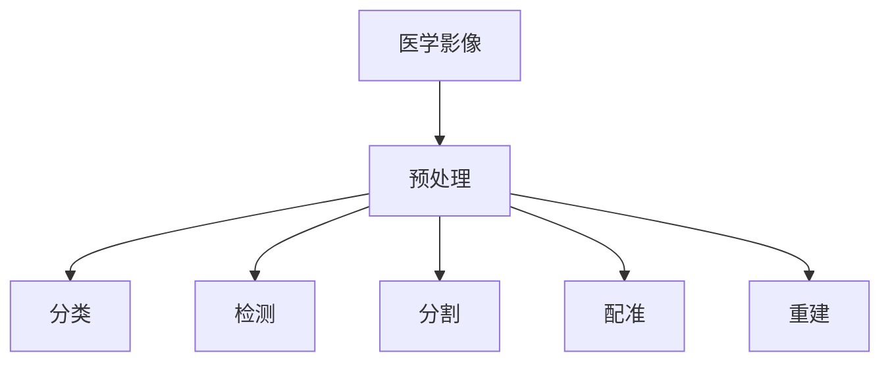

# 详解医学影像分析：AI如何"看"懂医学影像？

## 1.背景介绍

### 1.1 医学影像分析的重要性

医学影像分析在现代医疗诊断和治疗中扮演着至关重要的角色。随着医学影像技术的不断发展，如X射线、CT、MRI、PET等，医生可以获得人体内部结构和功能的详细信息。然而，面对海量的医学影像数据，传统的人工分析方法已经难以满足日益增长的需求。人工智能技术的兴起为医学影像分析带来了新的曙光，有望提高诊断效率和准确性，减轻医生的工作负担。

### 1.2 人工智能在医学影像分析中的应用现状

近年来，人工智能技术在医学影像分析领域取得了长足的进步。深度学习算法，特别是卷积神经网络（CNN）在医学图像分类、分割、检测等任务上表现出色。许多研究表明，基于深度学习的医学影像分析系统在某些疾病的诊断上已经达到甚至超过了人类专家的水平。然而，将AI技术应用于临床实践仍面临着诸多挑战，如数据隐私、模型可解释性、法律法规等。

### 1.3 本文的主要内容和目的

本文将深入探讨人工智能技术在医学影像分析中的应用，揭示AI是如何"看"懂医学影像的。我们将介绍医学影像分析的核心概念和关键技术，详细阐述主流算法的原理和实现步骤，并通过实际项目案例演示AI医学影像分析的整个流程。同时，我们也会讨论医学影像AI面临的挑战和未来发展方向。本文旨在为读者提供一个全面而深入的医学影像AI知识框架，帮助大家理解这一前沿交叉领域的核心要义。

## 2.核心概念与联系

### 2.1 医学影像的种类和特点

医学影像主要包括X射线、CT、MRI、PET、超声等。不同种类的医学影像具有不同的成像原理和特点：

- X射线：利用X射线穿透人体成像，对骨骼、肺部等组织器官有较好的成像效果，但软组织分辨率较低。
- CT：利用X射线围绕人体旋转成像，可以获得人体横截面的连续图像，对骨骼、肺部、血管等有很好的成像效果。
- MRI：利用强磁场和射频脉冲成像，对软组织如大脑、心脏、肌肉等的成像效果优于CT，且无辐射。
- PET：利用放射性示踪剂示踪人体内部生理活动，对肿瘤、脑部疾病等代谢异常有很好的成像效果。
- 超声：利用高频声波成像，对腹部、妇科、心脏等器官检查效果好，无创、实时、便携，但成像深度有限。

### 2.2 医学影像分析的主要任务

医学影像分析主要包括以下任务：

- 分类：判断影像是否异常，或属于哪一类疾病。如肺结节良恶性判别。
- 检测：找出影像中的异常区域。如肺部CT中结节的定位。
- 分割：勾勒出影像中器官或病灶的精确边界。如脑部MRI中肿瘤的分割。
- 配准：将多个影像进行空间对齐。如同一患者的CT和PET图像配准。
- 重建：由投影或采样数据重建出完整的影像。如CT图像重建。

### 2.3 医学影像分析中的AI技术

医学影像分析中主要应用的AI技术包括：

- 传统机器学习：如支持向量机SVM、随机森林等，主要用于影像分类任务。
- 深度学习：如CNN、循环神经网络RNN、生成对抗网络GAN等，可用于分类、检测、分割、配准、重建等各种任务。
- 迁移学习：利用ImageNet等自然图像训练的模型来初始化医学影像网络，可以减少训练数据需求。
- 小样本学习：医学影像标注数据稀缺，需要few-shot、zero-shot等小样本学习技术。

### 2.4 医学影像AI的关键问题 

医学影像AI要真正应用于临床实践，还需要解决以下关键问题：

- 数据问题：医学影像数据量大、维度高、非结构化，标注困难，共享受限。需要数据预处理、增强等技术。
- 模型问题：医学影像分析任务复杂，需要精心设计网络结构。模型通用性、可解释性、鲁棒性有待提高。
- 部署问题：需要将模型集成到医院的临床工作流中，与医生形成人机协同，并满足法律法规要求。

医学影像分析任务之间的关系可以用下图表示：

## 3.核心算法原理和操作步骤

### 3.1 图像分类

医学影像分类旨在判断一幅图像是否异常或属于哪一类疾病。其核心是卷积神经网络CNN。CNN通过逐层卷积、池化操作提取图像的层次化特征，再经过全连接层实现分类。典型的CNN分类网络有AlexNet、VGGNet、GoogLeNet、ResNet等。以ResNet为例，其基本流程如下：

1. 输入图像经过一系列卷积、批归一化、池化层，提取低级到高级的特征。
2. 引入残差连接，使网络可以训练到更深。
3. 最后通过全局平均池化和全连接层得到分类结果。
4. 用交叉熵损失函数和反向传播算法训练网络。

### 3.2 目标检测 

医学影像检测旨在找出图像中的异常区域如结节、肿块等。主流的两阶段检测算法如Faster R-CNN，先用区域生成网络RPN提取候选区域，再用CNN对候选区域进行分类和回归。单阶段检测算法如YOLO、SSD等直接在整图上回归出目标边界框和类别。以Faster R-CNN为例，其步骤如下：

1. 用预训练的CNN提取整幅图像的卷积特征。
2. 在卷积特征图上滑动一个小窗口，每个窗口位置生成k个不同大小和比例的候选区域。
3. 用RPN网络对候选区域进行二分类（是否为目标）和边界框回归。
4. 对RPN输出的候选区域进行非极大值抑制，筛选出质量较高的候选区域。
5. 用ROI池化将候选区域映射为固定尺寸的特征图。
6. 用另一个CNN对ROI特征进行分类和回归，得到最终的检测结果。

### 3.3 语义分割

医学影像语义分割旨在为图像的每个像素分配一个类别标签，常用于器官、肿瘤等区域的勾画。语义分割经典网络有FCN、U-Net等，它们用编码器提取特征，再用解码器恢复空间细节。以U-Net为例，其流程如下：

1. 收缩路径：用卷积和最大池化逐步减小图像尺寸并提取特征。
2. 扩张路径：用反卷积和上采样逐步恢复图像尺寸。
3. 跳跃连接：将收缩路径的特征图与扩张路径对应层级的特征图拼接，融合高低层次信息。
4. 最后用1x1卷积将特征图映射为每个像素的类别概率。
5. 用交叉熵损失和反向传播训练网络。

### 3.4 图像配准

医学图像配准旨在将两幅或多幅图像在空间上对齐，常用于多模态图像融合、病灶追踪等。传统配准方法有基于特征的配准和基于灰度的配准。深度学习配准方法如VoxelMorph，用CNN直接学习变形场。VoxelMorph的基本步骤如下：

1. 用一个CNN（配准网络）来估计两幅图像间的变形场。
2. 用空间变换器将变形场应用于移动图像，得到配准后的图像。
3. 用相似性度量（如互信息、交叉相关等）计算配准图像与固定图像的差异损失。
4. 加上变形场的平滑正则化损失，用梯度下降法训练配准网络。

### 3.5 图像重建

医学图像重建旨在由投影或采样数据恢复出完整的图像，如CT重建。传统重建算法有FBP反投影算法、迭代重建算法等。基于深度学习的重建方法可以学习投影域到图像域的映射，代表性工作如AUTOMAP。AUTOMAP的流程如下：

1. 用多层感知机MLP将投影数据映射为图像数据。
2. 引入域变换层，将MLP的输出重塑为图像尺寸。
3. 用真实图像监督训练MLP。

## 4.数学模型和公式详解

### 4.1 卷积神经网络

卷积神经网络的核心是卷积操作，对于二维图像，其离散卷积公式为：

$$ y[i,j] = \sum_{m}\sum_{n} x[m,n]w[i-m, j-n] $$

其中$x$为输入图像，$w$为卷积核，$y$为输出特征图。卷积的物理意义是：卷积核在图像上滑动，提取局部特征。

池化操作可以看作一种特殊的卷积，常用的有最大池化和平均池化：

$$ y[i,j] = \max_{(m,n) \in R} x[i+m, j+n] \quad \text{最大池化} $$
$$ y[i,j] = \frac{1}{|R|} \sum_{(m,n) \in R} x[i+m, j+n] \quad \text{平均池化} $$

其中$R$为池化窗口。池化可以减小特征图尺寸，扩大感受野，提高平移不变性。

### 4.2 损失函数

分类任务常用交叉熵损失函数。对于二分类，交叉熵损失为：

$$ L = -\frac{1}{N}\sum_{i=1}^N y_i \log p(y_i) + (1-y_i) \log(1-p(y_i)) $$

其中$y_i$为第$i$个样本的真实标签（0或1），$p(y_i)$为预测为正类的概率。

多分类的交叉熵损失为：

$$ L = -\frac{1}{N}\sum_{i=1}^N\sum_{j=1}^C y_{ij} \log p(y_{ij}) $$

其中$y_{ij}$为第$i$个样本属于第$j$类的真实标签（0或1），$p(y_{ij})$为预测为第$j$类的概率。

检测和分割任务的损失函数通常由分类损失和回归损失组成。以Faster R-CNN为例，其损失函数为：

$$ L = L_{cls} + \lambda L_{reg} $$

其中$L_{cls}$为RPN和ROI头部的分类损失（二分类交叉熵），$L_{reg}$为边界框回归损失（平滑L1损失），$\lambda$为平衡系数。

### 4.3 优化算法

神经网络的训练本质上是一个优化问题，即找到最小化损失函数的网络参数。常用的优化算法有：

- 随机梯度下降SGD：

$$ w := w - \eta \frac{\partial L}{\partial w} $$

其中$w$为网络参数，$\eta$为学习率，$\frac{\partial L}{\partial w}$为损失函数对参数的梯度。

- 动量法Momentum：

$$ v := \gamma v + \eta \frac{\partial L}{\partial w} $$
$$ w := w - v $$

其中$v$为速度向量，$\gamma$为动量系数。动量法可以加速收敛，减少震荡。

- Adam：

$$ m := \beta_1 m + (1-\beta_1) \frac{\partial L}{\partial w} $$
$$ v := \beta_2 v + (1-\beta_2) (\frac{\partial L}{\partial w})^2 $$
$$ \hat{m} := \frac{m}{1-\beta_1^t} $$
$$ \hat{v} := \frac{v}{1-\beta_2^t} $$
$$ w := w - \frac{\eta}{\sqrt{\hat{v}} + \epsilon} \hat{m}