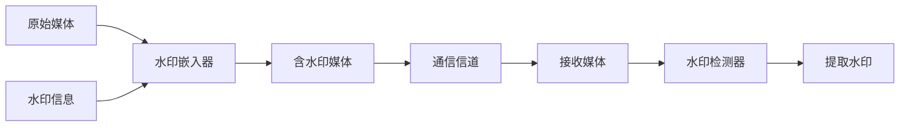

# 详解：数字水印技术的工作原理

## 1. 背景介绍
### 1.1 数字水印技术的起源与发展
数字水印技术起源于20世纪90年代初期,最初是为了保护数字媒体版权而提出的一种信息隐藏技术。随着互联网的快速发展,数字媒体内容的分发和传播变得越来越容易,版权保护问题日益突出。在这样的背景下,数字水印技术应运而生,并逐渐成为数字版权保护领域的研究热点。

经过近30年的发展,数字水印技术已经从最初的概念发展成为一套成熟完善的技术体系,在图像、视频、音频等多种数字媒体领域得到了广泛应用。目前,数字水印技术不仅仅局限于版权保护,还被应用于内容认证、篡改检测、隐秘通信等诸多领域。

### 1.2 数字水印技术的重要性
在当今数字时代,数字水印技术的重要性主要体现在以下几个方面:

1. 版权保护:数字水印可以在不影响数字内容质量的情况下,将版权信息嵌入到数字媒体中,从而有效地保护内容所有者的合法权益。

2. 内容认证:数字水印可以用于验证数字内容的真实性和完整性,防止内容被篡改或伪造。

3. 篡改检测:通过对嵌入水印的数字内容进行分析,可以检测出内容是否遭到篡改,并定位篡改区域。

4. 隐秘通信:数字水印可以作为一种隐蔽的信息传递手段,将秘密信息隐藏在数字媒体中进行传输,不易被察觉。

5. 设备控制:数字水印还可以用于控制数字设备对内容的访问和使用,例如防止未经授权的复制和传播。

总之,数字水印技术在保护数字内容版权、维护内容真实性和完整性等方面发挥着不可替代的作用,对于数字内容安全具有重要意义。

## 2. 核心概念与联系
### 2.1 数字水印的定义
数字水印是一种将隐藏信息嵌入到数字媒体中的技术,嵌入的信息可以是版权标识、所有者信息、认证信息等。嵌入的水印信息不会明显改变宿主数字媒体的感知质量,同时具有一定的鲁棒性,即使宿主媒体经过一些处理(如压缩、裁剪、滤波等),仍然可以从中提取出水印信息。

### 2.2 数字水印系统的组成
一个完整的数字水印系统通常由三个部分组成:水印嵌入器、通信信道和水印检测器。

- 水印嵌入器:负责将水印信息嵌入到原始的宿主数字媒体中。
- 通信信道:指水印嵌入后的数字媒体在传输过程中可能遇到的各种攻击和处理。
- 水印检测器:负责从接收到的数字媒体中检测和提取水印信息。



### 2.3 数字水印的分类
根据不同的标准,数字水印可以分为多种类型:

1. 按照水印嵌入位置分类:
   - 空域水印:直接修改媒体数据的像素值或采样值。
   - 变换域水印:在频域或其他变换域中嵌入水印信息。

2. 按照水印的可感知性分类:  
   - 可见水印:嵌入的水印信息肉眼可见,常用于标识内容归属。
   - 不可见水印:嵌入的水印信息肉眼不可见,但可通过专门的检测算法提取。

3. 按照水印的鲁棒性分类:
   - 脆弱水印:对宿主媒体的修改非常敏感,主要用于完整性认证。 
   - 半脆弱水印:可以抵抗一些无害的修改,但对恶意篡改敏感。
   - 鲁棒水印:能够抵抗大多数常见的处理操作,主要用于版权保护。

4. 按照水印的用途分类:
   - 版权水印:用于标识内容的版权归属。
   - 认证水印:用于验证内容的真实性和完整性。
   - 指纹水印:针对每个用户嵌入不同的水印,用于追踪非法分发。

## 3. 核心算法原理具体操作步骤
数字水印算法的核心是水印嵌入和水印提取。下面以一种经典的空域水印算法LSB(Least Significant Bit)为例,详细介绍其具体操作步骤。

### 3.1 LSB水印嵌入步骤
1. 将原始媒体数据(如图像像素)和水印信息转化为二进制比特流。
2. 将水印信息的比特流逐一嵌入到原始媒体数据比特流的最低有效位(LSB)上。
3. 将嵌入水印后的比特流转化回原始媒体数据格式,得到含水印媒体数据。

具体而言,对于8bit灰度图像,LSB水印嵌入可表示为:
$$I_w(i,j) = I(i,j) - I(i,j) \bmod 2 + W(k)$$
其中,$I(i,j)$表示原始图像在$(i,j)$位置的像素值,$I_w(i,j)$表示嵌入水印后的像素值,$W(k)$表示水印信息的第$k$个比特。

### 3.2 LSB水印提取步骤 
1. 将接收到的含水印媒体数据转化为二进制比特流。
2. 从比特流的最低有效位(LSB)提取出水印信息比特。
3. 将提取出的水印比特流转化为水印信息。

对于8bit灰度图像,LSB水印提取可表示为:
$$W(k) = I_w(i,j) \bmod 2$$
其中,$I_w(i,j)$表示接收到的含水印图像在$(i,j)$位置的像素值,$W(k)$表示提取出的水印信息的第$k$个比特。

## 4. 数学模型和公式详细讲解举例说明
### 4.1 扩频水印嵌入模型
扩频水印是一种经典的鲁棒水印算法,其核心思想是将水印信息调制到伪随机序列上,再将调制后的水印信号叠加到原始媒体数据中。设原始媒体数据为$I$,水印信息为$W$,伪随机序列为$P$,嵌入强度为$\alpha$,则扩频水印嵌入过程可表示为:
$$I_w = I + \alpha \cdot W \cdot P$$

举例说明:假设原始媒体数据为一个4x4的矩阵$I$,水印信息$W=1$,伪随机序列$P$如下所示:
$$I=\begin{bmatrix}
23 & 55 & 132 & 98\\
41 & 167 & 211 & 85\\
78 & 45 & 88 & 174\\ 
144 & 193 & 67 & 109
\end{bmatrix}, \quad
P=\begin{bmatrix}
1 & -1 & 1 & -1\\
-1 & 1 & -1 & 1\\
1 & -1 & 1 & -1\\ 
-1 & 1 & -1 & 1
\end{bmatrix}$$

假设嵌入强度$\alpha=5$,则嵌入水印后的媒体数据为:
$$\begin{aligned}
I_w &= I + \alpha \cdot W \cdot P \\
&= \begin{bmatrix}
23 & 55 & 132 & 98\\
41 & 167 & 211 & 85\\
78 & 45 & 88 & 174\\ 
144 & 193 & 67 & 109
\end{bmatrix} + 5 \cdot 1 \cdot \begin{bmatrix}
1 & -1 & 1 & -1\\
-1 & 1 & -1 & 1\\
1 & -1 & 1 & -1\\ 
-1 & 1 & -1 & 1
\end{bmatrix}\\
&= \begin{bmatrix}
28 & 50 & 137 & 93\\
36 & 172 & 206 & 90\\
83 & 40 & 93 & 169\\ 
139 & 198 & 62 & 114
\end{bmatrix}
\end{aligned}$$

### 4.2 扩频水印提取模型
扩频水印的提取过程是嵌入过程的逆过程。设接收到的含水印媒体数据为$\hat{I}_w$,伪随机序列为$P$(需要与嵌入时使用的序列一致),则水印提取过程可表示为:
$$\hat{W} = \frac{\langle \hat{I}_w, P \rangle}{\langle P, P \rangle} = \frac{\sum_{i,j}\hat{I}_w(i,j)P(i,j)}{\sum_{i,j}P^2(i,j)}$$

其中,$\langle \cdot, \cdot \rangle$表示内积操作。提取出的水印信息$\hat{W}$接近于1时,判断嵌入水印为1;接近于-1时,判断嵌入水印为0。

继续上面的例子,假设接收到的含水印媒体数据$\hat{I}_w$与$I_w$一致,则提取出的水印信息为:
$$\begin{aligned}
\hat{W} &= \frac{\langle \hat{I}_w, P \rangle}{\langle P, P \rangle}\\
&= \frac{28 \times 1 + 50 \times (-1) + \cdots + 114 \times 1}{1^2 + (-1)^2 + \cdots + 1^2}\\
&= \frac{80}{16} = 5
\end{aligned}$$

由于$\hat{W}=5$接近于1,因此判断嵌入的水印信息为1,与实际嵌入的水印信息一致。

## 5. 项目实践：代码实例和详细解释说明
下面给出一个简单的Python代码实例,演示如何实现LSB水印的嵌入和提取。

```python
import numpy as np
import cv2

# LSB水印嵌入函数
def lsb_embed(img, watermark):
    # 将图像和水印转为二进制比特流
    img_bits = np.unpackbits(img)
    watermark_bits = np.unpackbits(watermark)
    # 将水印比特嵌入到图像的LSB
    embedded_bits = np.where(np.arange(len(img_bits)) < len(watermark_bits),
                             (img_bits & ~1) | watermark_bits, 
                             img_bits)
    # 将嵌入水印后的比特流打包为图像数据
    embedded_img = np.packbits(embedded_bits).reshape(img.shape)
    return embedded_img

# LSB水印提取函数  
def lsb_extract(img, watermark_size):
    # 将图像转为二进制比特流
    img_bits = np.unpackbits(img)
    # 从图像的LSB提取水印比特
    watermark_bits = img_bits[:watermark_size] & 1
    # 将提取出的水印比特打包为水印数据
    watermark = np.packbits(watermark_bits)
    return watermark

# 读取原始图像和水印图像
img = cv2.imread('original.png', cv2.IMREAD_GRAYSCALE)
watermark = cv2.imread('watermark.png', cv2.IMREAD_GRAYSCALE)

# 水印嵌入
embedded_img = lsb_embed(img, watermark)
cv2.imwrite('embedded.png', embedded_img)

# 水印提取
extracted_watermark = lsb_extract(embedded_img, watermark.size)
extracted_watermark = extracted_watermark.reshape(watermark.shape)
cv2.imwrite('extracted.png', extracted_watermark)
```

代码解释:

1. `lsb_embed`函数实现LSB水印嵌入。首先将原始图像和水印图像转为二进制比特流,然后使用`np.where`函数将水印比特嵌入到图像的LSB,最后将嵌入水印后的比特流打包为图像数据。

2. `lsb_extract`函数实现LSB水印提取。将含水印图像转为二进制比特流,然后从LSB直接提取出水印比特,最后将提取出的水印比特打包为水印图像数据。

3. 使用OpenCV的`cv2.imread`函数读取原始图像和水印图像,并将其转为灰度图。

4. 调用`lsb_embed`函数将水