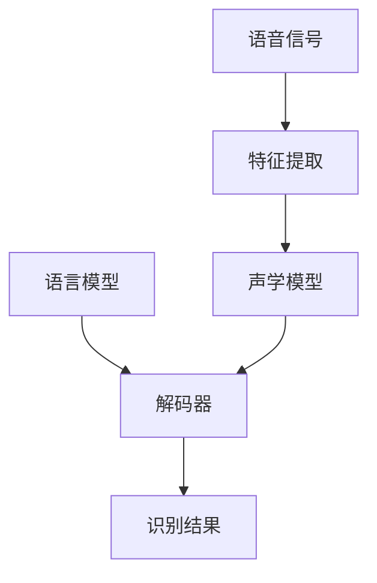

# 语音识别 原理与代码实例讲解

## 1.背景介绍

### 1.1 语音识别的重要性

语音识别技术已经广泛应用于各个领域,极大地改变了人机交互方式。通过语音,人类可以更自然、更高效地与计算机系统进行交互,操控各种智能设备。随着人工智能和深度学习技术的飞速发展,语音识别的准确率不断提高,应用场景也越来越广泛。

### 1.2 语音识别的挑战

尽管语音识别技术取得了长足进步,但仍面临诸多挑战:

- 环境噪音:背景噪音会严重影响识别准确率
- 口音和语速:不同人的口音、语速差异很大
- 词汇量庞大:需要识别的词汇量庞大且不断扩展

### 1.3 语音识别的发展历程

语音识别技术的发展经历了几个阶段:

- 模板匹配时期:通过将语音信号与预先存储的模板进行匹配
- 统计模型时期:使用隐马尔可夫模型(HMM)等统计模型
- 深度学习时期:利用深度神经网络,取得了突破性进展

## 2.核心概念与联系

### 2.1 语音信号处理

语音识别的第一步是将语音信号转换为特征向量序列,主要包括:

1. 预加重:增强高频部分,补偿信号传输过程中的衰减
2. 分帧:将连续语音信号分割成短时间帧
3. 窗口加窗:减小分帧带来的频谱失真
4. 傅里叶变换:将时域信号转换到频域
5. mel滤波器组:模拟人耳对声音的感知特性
6. 离散余弦变换:进一步压缩特征,得到MFCC系数

### 2.2 声学模型

声学模型用于计算观测到的语音特征序列给定某个词序列的概率,是语音识别系统的核心部分。常用的声学模型有:

- 高斯混合模型(GMM-HMM)
- 深度神经网络(DNN-HMM)
- 时间递归神经网络(RNN、LSTM)
- 卷积神经网络(CNN)

### 2.3 语言模型

语言模型估算给定的词序列出现的概率,对提高识别准确率至关重要。常用的语言模型有:

- N-gram模型
- 神经语言模型
- 转移编码器语言模型

### 2.4 解码器

解码器的任务是根据声学模型和语言模型的输出,搜索出最可能的词序列作为识别结果。常用的解码算法有:

- 维特比算法
- 束搜索算法
- 前向-后向分支束搜索

### 2.5 核心流程图

语音识别系统的核心流程如下:



## 3.核心算法原理具体操作步骤  

### 3.1 隐马尔可夫模型(HMM)

隐马尔可夫模型是传统的声学模型,其核心思想是将语音信号看作是由一个隐含的马尔可夫链随机生成的观测序列。

1. 训练阶段:利用已标注的语音数据,使用EM算法或者Viterbi算法估计HMM的参数。
2. 识别阶段:对于给定的观测序列,使用前向、后向或Viterbi算法计算在该模型下观测序列的概率,并输出最可能的状态序列。

### 3.2 深度神经网络声学模型

深度神经网络在语音识别领域的应用主要有:

1. **DNN-HMM**: 使用前馈神经网络替代GMM,作为HMM的概率计算模块。
2. **时间递归神经网络**:
    - **RNN**: 适合对序列数据建模,但存在梯度消失/爆炸问题。
    - **LSTM/GRU**: 通过门控机制解决长期依赖问题,是目前最流行的序列建模模型。
3. **卷积神经网络**:
    - 能够自动学习局部特征模式,在小数据集上表现优异。
    - 常与RNN/LSTM结合,构建复杂的声学模型。

4. **注意力机制**:
    - 自动学习输入序列中不同位置对应的权重分布。
    - 常与Seq2Seq模型结合,显著提高了性能。

5. **端到端模型**:
    - 直接从语音特征到文本的端到端建模,无需人工设计特征。
    - 常见架构有Listen, Attend and Spell、RNN-Transducer等。

### 3.3 Kaldi工具包

Kaldi是语音识别领域使用最广泛的开源工具包,提供了标准的构建语音识别系统的流程,支持GMM-HMM、DNN-HMM、LSTM等多种声学模型。其核心步骤包括:

1. 数据准备:收集、标注语音数据
2. 特征提取:计算MFCC等语音特征
3. 单音素训练:训练单音训练HMM
4. 三音素系统构建:构建决策树,聚类得到tied-states
5. 语言模型训练:使用SRILM等工具训练N-gram语言模型
6. 声学模型训练:GMM、DNN、LSTM等模型训练
7. 解码:使用不同解码器生成识别结果
8. 系统组合:构建多系统融合的最终系统

## 4.数学模型和公式详细讲解举例说明

### 4.1 声学模型

声学模型的目标是计算观测到的语音特征序列$O=\{o_1,o_2,...,o_T\}$在给定的词序列$W=\{w_1,w_2,...,w_N\}$条件下的概率$P(O|W)$。

#### 4.1.1 高斯混合模型(GMM-HMM)

在GMM-HMM模型中,发射概率$P(o_t|q_t=s_j)$使用高斯混合模型(GMM)计算:

$$P(o_t|q_t=s_j) = \sum_{m=1}^M c_{jm}\mathcal{N}(o_t|\mu_{jm},\Sigma_{jm})$$

其中$c_{jm}$是第$j$个状态第$m$个高斯混合成分的系数,$\mu_{jm}$和$\Sigma_{jm}$分别是均值向量和协方差矩阵。

#### 4.1.2 深度神经网络声学模型

在DNN-HMM模型中,发射概率由前馈神经网络计算:

$$P(o_t|q_t=s_j) = y_j(o_t,\theta)$$

其中$y_j$是神经网络对应第$j$个输出节点的值,是输入特征$o_t$和网络参数$\theta$的函数。

对于序列数据,通常使用递归神经网络(RNN)或长短期记忆网络(LSTM)进行建模:

$$h_t = f_\text{RNN}(o_t, h_{t-1})$$
$$P(o_t|q_t=s_j) = \text{softmax}(Wh_t + b)_j$$

其中$h_t$是时刻$t$的隐藏状态向量,通过前一时刻状态$h_{t-1}$和当前输入$o_t$递归计算得到。

### 4.2 语言模型 

语言模型的目标是估算给定的词序列$W=\{w_1,w_2,...,w_N\}$出现的概率$P(W)$。

#### 4.2.1 N-gram模型

N-gram模型是目前最广泛使用的统计语言模型,基于马尔可夫假设,用有限长度的历史来预测当前词:

$$P(w_n|w_1^{n-1}) \approx P(w_n|w_{n-N+1}^{n-1})$$

其中$w_i^j$表示词序列$\{w_i,w_{i+1},...,w_j\}$。通过计数法从大规模语料中估计N-gram概率。

#### 4.2.2 神经语言模型

神经网络语言模型直接从数据中学习词序列的概率分布,通常使用RNN或LSTM网络:

$$h_t = f_\text{RNN}(e(w_t), h_{t-1})$$
$$P(w_t|w_1^{t-1}) = \text{softmax}(Wh_t + b)$$

其中$e(w_t)$是词$w_t$的词向量表示,$h_t$是时刻$t$的隐藏状态。

### 4.3 解码算法

解码器的目标是在所有可能的词序列$W$中,找到最大化$P(W|O)=P(O|W)P(W)$的序列作为识别结果:

$$\hat{W} = \arg\max_W P(W|O) = \arg\max_W P(O|W)P(W)$$

#### 4.3.1 维特比算法

维特比算法是HMM模型中常用的动态规划解码算法,在每个时刻$t$,计算到达每个状态$s_j$的最大概率:

$$\delta_t(j) = \max_q \delta_{t-1}(i)a_{ij}b_j(o_t)$$

其中$\delta_t(j)$表示时刻$t$到达状态$s_j$的最大概率,$a_{ij}$是状态转移概率,$b_j(o_t)$是发射概率。

#### 4.3.2 束搜索算法

束搜索算法是一种启发式搜索方法,通过设置束宽(beam width)来控制搜索空间的大小,提高解码效率。在每个时刻,只保留概率最大的若干个部分路径,剪枝掉其他路径。

束搜索算法的关键是设计合理的打分函数,通常将声学模型分数和语言模型分数进行线性组合:

$$\text{score}(W,O) = \log P(O|W) + \lambda \log P(W)$$

其中$\lambda$是语言模型权重,用于平衡两个模型的影响。

## 5.项目实践:代码实例和详细解释说明

为了帮助读者更好地理解语音识别的原理和实现,我们将使用Python和PyTorch构建一个基于DNN-HMM的简单语音识别系统。完整代码可在GitHub上获取: https://github.com/zenmsan/SpeechRecognition

### 5.1 数据准备

我们将使用TIMIT语音语料库进行实验,它包含了630个说话人读出的8个主要语音类别的语音数据。我们首先需要下载并解压该数据集:

```python
import os
import tarfile

dataset_path = "data"
os.makedirs(dataset_path, exist_ok=True)

timit_tar = tarfile.open("timit.tar.gz", "r:gz")
timit_tar.extractall(dataset_path)
timit_tar.close()
```

### 5.2 特征提取

接下来,我们从原始语音文件中提取MFCC特征,作为神经网络的输入:

```python
import librosa
import numpy as np

def extract_features(wav_file):
    y, sr = librosa.load(wav_file)
    mfcc = librosa.feature.mfcc(y, sr, n_mfcc=13)
    mfcc_delta = librosa.feature.delta(mfcc)
    mfcc_delta2 = librosa.feature.delta(mfcc, order=2)
    features = np.concatenate([mfcc, mfcc_delta, mfcc_delta2], axis=0)
    return features.T
```

### 5.3 构建DNN声学模型

我们使用PyTorch构建一个简单的前馈神经网络作为声学模型:

```python
import torch
import torch.nn as nn

class AcousticModel(nn.Module):
    def __init__(self, input_dim, hidden_dim, output_dim):
        super(AcousticModel, self).__init__()
        self.fc1 = nn.Linear(input_dim, hidden_dim)
        self.fc2 = nn.Linear(hidden_dim, hidden_dim)
        self.fc3 = nn.Linear(hidden_dim, output_dim)
        self.relu = nn.ReLU()

    def forward(self, x):
        out = self.relu(self.fc1(x))
        out = self.relu(self.fc2(out))
        out = self.fc3(out)
        return out
```

### 5.4 训练和评估

我们将语料库划分为训练集和测试集,并使用交叉熵损失函数训练神经网络:

```python
# 划分数据集
train_data, test_data = ...

# 定义模型、损失函数和优化器
model = AcousticModel(input_dim, hidden_dim, output_dim)
criterion = nn.CrossEntropyLoss()
optimizer = torch.optim.Adam(