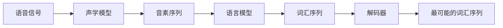

## 1.背景介绍

语音识别，是人工智能领域的一个重要分支，它的目标是让计算机能够理解和解析人类的语音。语音识别技术在我们的日常生活中有着广泛的应用，例如智能助手、自动客服、语音输入等。

## 2.核心概念与联系

语音识别的主要任务是将语音信号转化为文本。这个过程涉及到了许多核心概念，包括声学模型、语言模型、解码器等。声学模型负责将语音信号转化为音素，语言模型则负责将音素序列转化为词汇，解码器则负责找到最可能的词汇序列。



## 3.核心算法原理具体操作步骤

语音识别的核心算法包括声学模型和语言模型的训练，以及解码器的设计。

声学模型的训练通常使用深度学习方法，例如RNN、CNN和Transformer等。训练过程中，输入是语音信号的特征，如梅尔频率倒谱系数（MFCC），输出是音素序列。

语言模型的训练则使用N-gram模型或神经网络模型。训练过程中，输入是音素序列，输出是词汇序列。

解码器的设计则是一个搜索问题，目标是在所有可能的词汇序列中，找到最可能的一个。这通常使用贝叶斯决策理论，并结合声学模型和语言模型的结果。

## 4.数学模型和公式详细讲解举例说明

声学模型的训练可以使用交叉熵损失函数，其公式为：

$$
L = -\sum_{i=1}^{N} y_i \log(\hat{y}_i)
$$

其中，$y_i$是真实的音素标签，$\hat{y}_i$是预测的音素标签。

语言模型的训练可以使用困惑度（Perplexity）作为评估指标，其公式为：

$$
P = \exp\left(-\frac{1}{N}\sum_{i=1}^{N}\log(p(w_i|w_{i-1},...,w_{i-n+1}))\right)
$$

其中，$w_i$是第$i$个词，$p(w_i|w_{i-1},...,w_{i-n+1})$是在给定前$n-1$个词的条件下，第$i$个词的概率。

解码器的设计可以使用贝叶斯决策理论，其公式为：

$$
\hat{w} = \arg\max_{w} P(w|O) = \arg\max_{w} P(O|w)P(w)
$$

其中，$O$是观测到的音素序列，$w$是词汇序列，$P(w|O)$是后验概率，$P(O|w)$是声学模型的输出概率，$P(w)$是语言模型的输出概率。

## 5.项目实践：代码实例和详细解释说明

在Python中，我们可以使用librosa库来提取语音信号的特征，例如MFCC。然后，我们可以使用TensorFlow或PyTorch等深度学习框架来训练声学模型和语言模型。最后，我们可以使用贪婪搜索或束搜索等方法来设计解码器。

以下是一段简单的代码示例，展示了如何使用librosa来提取MFCC特征：

```python
import librosa

# 加载语音信号
y, sr = librosa.load('speech.wav')

# 提取MFCC特征
mfcc = librosa.feature.mfcc(y, sr, n_mfcc=13)

# 打印MFCC特征
print(mfcc)
```

## 6.实际应用场景

语音识别技术在许多场景中都有应用，例如：

- 智能助手：例如Siri、Alexa等，可以通过语音识别技术理解用户的指令，然后执行相应的操作。
- 自动客服：可以通过语音识别技术理解客户的问题，然后提供相应的解答。
- 语音输入：例如Google的语音输入法，可以通过语音识别技术将用户的语音转化为文本。

## 7.工具和资源推荐

以下是一些推荐的工具和资源，可以帮助你更好地学习和使用语音识别技术：

- librosa：一个Python库，可以用来提取语音信号的特征。
- TensorFlow和PyTorch：两个深度学习框架，可以用来训练声学模型和语言模型。
- Kaldi：一个开源的语音识别工具包，包含了许多预训练的声学模型和语言模型。

## 8.总结：未来发展趋势与挑战

语音识别技术在过去的几十年中已经取得了巨大的进步，但是仍然面临许多挑战，例如噪声环境下的识别、方言和口音的识别、连续语音的识别等。未来，我们期待看到更多的研究和技术来解决这些问题。

同时，随着深度学习的发展，我们也期待看到更多的模型和算法被应用到语音识别中，例如Transformer、BERT等。

## 9.附录：常见问题与解答

Q: 什么是声学模型？

A: 声学模型是语音识别中的一个重要概念，它的任务是将语音信号转化为音素。通常使用深度学习方法来训练声学模型。

Q: 什么是语言模型？

A: 语言模型是语音识别中的另一个重要概念，它的任务是将音素序列转化为词汇。通常使用N-gram模型或神经网络模型来训练语言模型。

Q: 什么是解码器？

A: 解码器是语音识别中的另一个重要概念，它的任务是在所有可能的词汇序列中，找到最可能的一个。这通常使用贝叶斯决策理论，并结合声学模型和语言模型的结果。

作者：禅与计算机程序设计艺术 / Zen and the Art of Computer Programming