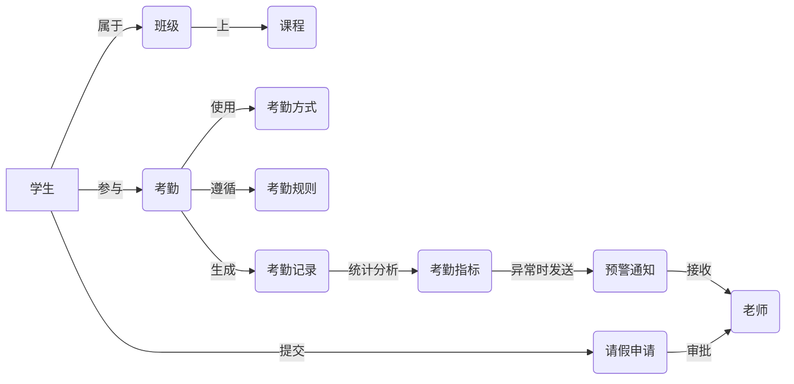

# 课堂考勤管理系统详细设计与具体代码实现

## 1.背景介绍

随着教育信息化的不断推进,传统的人工考勤方式已经无法满足现代化教学管理的需求。开发一套高效、准确、易用的课堂考勤管理系统成为当前教育管理信息化建设的重要内容。本文将从需求分析、概要设计、详细设计、数据库设计和具体代码实现等方面,对课堂考勤管理系统进行全面阐述,为类似系统的开发提供参考。

### 1.1 课堂考勤管理的重要性
课堂考勤是教学管理的重要组成部分,通过考勤可以掌握学生的出勤情况,了解教学效果,为教学管理决策提供数据支撑。传统的人工考勤方式存在效率低、准确性差、数据难以管理等问题,已经不能适应信息化时代的要求。

### 1.2 课堂考勤管理系统的目标
课堂考勤管理系统旨在通过信息化手段,实现考勤数据的自动采集、智能分析和高效管理,从而提高教学管理效率,为教学管理决策提供数据支持。系统应具备以下目标:

- 准确记录学生考勤信息,实现数据的自动采集
- 支持多种考勤方式,如人脸识别、指纹识别、二维码签到等
- 考勤数据可视化展示,支持多维度统计分析
- 异常考勤及时预警,方便老师快速了解学情
- 方便学生自助查询个人考勤记录
- 数据标准化,支持与其他系统对接,实现数据共享

### 1.3 系统应用场景
课堂考勤管理系统主要应用于各级各类教育机构,如中小学、大学、培训机构等。通过部署考勤终端和管理后台,可以实现课堂考勤的自动化、智能化管理,减轻教师的考勤负担,提高考勤数据管理效率。

## 2.核心概念与联系

在课堂考勤管理系统中,涉及到一些核心概念,本节将对这些概念进行介绍,并分析它们之间的联系。

### 2.1 考勤方式
系统支持多种考勤方式,主要包括:

- 人脸识别考勤:通过摄像头采集学生面部图像,与预先录入的人脸信息进行比对,判断学生是否出勤。
- 指纹识别考勤:学生通过指纹识别终端录入指纹,系统根据指纹信息判断学生身份和考勤状态。
- 二维码签到:学生通过手机扫描二维码进行签到,系统记录签到信息。
- 位置签到:学生在指定位置通过手机签到,系统判断位置是否在考勤范围内。

### 2.2 考勤规则 
为保证考勤的准确性和公平性,系统需要设置考勤规则,主要包括:

- 签到时间段:规定学生签到的有效时间范围。
- 签退时间段:规定学生签退的有效时间范围。
- 考勤次数:规定每门课程考勤的次数,如每节课考勤一次或两次等。
- 请假规则:规定请假的类型、流程和审批方式。
- 考勤异常:规定哪些情况属于考勤异常,如迟到、早退、缺勤等。

### 2.3 班级与课程
班级和课程是考勤的基本单位。每个班级包含多名学生,每门课程对应特定的上课时间和地点。通过建立班级、课程与考勤记录的关联,可以统计出每个班级和课程的出勤率等指标。

### 2.4 请假与审批
请假是考勤异常的一种特殊情况。学生提交请假申请后,系统自动将请假信息推送给相关老师。老师在系统中审批请假申请,审批结果自动更新到考勤记录中。

### 2.5 统计与分析
通过对考勤数据的统计与分析,可以掌握学生考勤的整体情况,为教学管理提供决策支持。常见的统计分析指标包括:

- 出勤率:某个班级或课程的实到人数占应到人数的比例。
- 缺勤率:某个班级或课程的缺勤人数占应到人数的比例。
- 迟到率:某个班级或课程的迟到人数占应到人数的比例。
- 早退率:某个班级或课程的早退人数占应到人数的比例。
- 请假率:某个班级或课程的请假人数占应到人数的比例。

### 2.6 预警与通知
为及时发现考勤异常情况,系统支持预警和通知功能。当出现连续多次缺勤、迟到早退次数过多等异常情况时,系统自动向相关老师发送预警信息,便于老师及时了解学情,采取针对性的教学管理措施。

### 核心概念联系

下图展示了课堂考勤管理系统的核心概念之间的联系:

学生属于特定的班级,班级上特定的课程。学生参与考勤,考勤时使用不同的考勤方式,并遵循一定的考勤规则。学生还可以提交请假申请,由老师审批。考勤数据会生成考勤记录,考勤记录经过统计分析后形成各类考勤指标。当考勤指标出现异常时,系统发送预警通知给相关老师。

## 3.核心算法原理具体操作步骤

课堂考勤管理系统涉及到多个核心算法,本节将重点介绍人脸识别考勤算法的原理和实现步骤。

### 3.1 人脸识别考勤算法原理

人脸识别考勤的基本原理是:将摄像头采集到的人脸图像,与预先录入的学生人脸信息进行比对,判断是否为同一个人,从而确定考勤结果。其中涉及到以下关键技术:

- 人脸检测:从图像中检测出人脸区域。常用的算法有Haar特征级联分类器、HOG特征+SVM分类器等。
- 人脸关键点定位:在人脸区域中定位眼睛、鼻子、嘴巴等关键点。常用的算法有ASM、AAM等。
- 人脸特征提取:提取人脸的特征表示,用于后续的人脸比对。常用的算法有PCA、LDA、LBP等。
- 人脸比对:比较两张人脸的相似度,判断是否属于同一个人。常用的算法有欧氏距离、余弦相似度等。

### 3.2 人脸识别考勤算法实现步骤

基于上述原理,人脸识别考勤算法的具体实现步骤如下:

#### Step1:人脸图像采集与预处理
通过摄像头采集学生的人脸图像,并进行预处理,如灰度化、直方图均衡化、归一化等,以提高后续识别的准确率。

#### Step2:人脸检测
使用人脸检测算法在图像中定位人脸区域。以Haar特征级联分类器为例,其基本步骤如下:

1. 在人脸图像上划分出多个子窗口
2. 在每个子窗口中提取Haar特征
3. 使用级联分类器判断每个子窗口是否为人脸
4. 合并重叠的人脸区域,输出最终的检测结果

#### Step3:人脸关键点定位
在检测到的人脸区域中,进一步定位眼睛、鼻子、嘴巴等关键点。以ASM算法为例,其基本步骤如下:

1. 在训练集中标注人脸关键点,建立形状模型
2. 在测试图像的人脸区域中,使用形状模型拟合人脸轮廓
3. 沿着人脸轮廓搜索关键点位置,得到最优匹配结果

#### Step4:人脸特征提取
在人脸关键点的基础上,提取人脸的特征表示。以LBP特征为例,其基本步骤如下:

1. 将人脸图像划分为多个局部区域
2. 对每个局部区域提取LBP特征
3. 将所有区域的LBP特征级联,得到人脸的特征向量

#### Step5:人脸比对
将提取到的人脸特征与预先录入的学生人脸特征进行比对。以欧氏距离为例,其计算公式为:

$$
d(x,y) = \sqrt{\sum_{i=1}^{n} (x_i - y_i)^2}
$$

其中,$x$和$y$分别为两个人脸特征向量,$n$为特征向量的维度。当欧氏距离小于设定的阈值时,判定为同一个人。

#### Step6:考勤结果判定
根据人脸比对的结果,结合考勤规则,判定学生的考勤状态,如出勤、缺勤、迟到、早退等,并将考勤结果记入数据库。

以上就是人脸识别考勤算法的原理和实现步骤。在实际应用中,还需要考虑算法的效率、鲁棒性等因素,选择合适的算法和参数,并进行充分的测试和优化。

## 4.数学模型和公式详细讲解举例说明

在课堂考勤管理系统中,考勤数据的统计与分析是一项重要功能。本节将介绍几个常用的考勤指标,给出它们的数学模型和计算公式,并通过具体的例子加以说明。

### 4.1 出勤率
出勤率反映了学生参与课堂学习的情况,是评价学生学习状态和教学效果的重要指标。其数学模型为:

$$
AttendanceRate = \frac{ActualAttendance}{RequiredAttendance} \times 100\%
$$

其中,$ActualAttendance$为实际出勤人数,$RequiredAttendance$为应出勤人数。

举例说明:某班级有50名学生,某次课程实到45人,则该次课程的出勤率为:

$$
AttendanceRate = \frac{45}{50} \times 100\% = 90\%
$$

### 4.2 缺勤率
缺勤率反映了学生缺课的情况,是评价学生学习态度和教学管理效果的重要指标。其数学模型为:

$$
AbsenceRate = \frac{Absence}{RequiredAttendance} \times 100\%
$$

其中,$Absence$为缺勤人数,$RequiredAttendance$为应出勤人数。

举例说明:某班级有50名学生,某次课程缺勤5人,则该次课程的缺勤率为:

$$
AbsenceRate = \frac{5}{50} \times 100\% = 10\%
$$

### 4.3 迟到率
迟到率反映了学生上课不守时的情况,是评价学生学习自觉性和课堂纪律的重要指标。其数学模型为:

$$
LateRate = \frac{Late}{ActualAttendance} \times 100\%
$$

其中,$Late$为迟到人数,$ActualAttendance$为实际出勤人数。

举例说明:某班级某次课程实到45人,其中迟到3人,则该次课程的迟到率为:

$$
LateRate = \frac{3}{45} \times 100\% = 6.67\%
$$

### 4.4 早退率 
早退率反映了学生上课不遵守纪律的情况,是评价学生学习态度和课堂管理的重要指标。其数学模型为:

$$
LeaveEarlyRate = \frac{LeaveEarly}{ActualAttendance} \times 100\%
$$

其中,$LeaveEarly$为早退人数,$ActualAttendance$为实际出勤人数。

举例说明:某班级某次课程实到45人,其中早退2人,则该次课程的早退率为:

$$
LeaveEarlyRate = \frac{2}{45} \times 100\% = 4.44\%
$$

### 4.5 请假率
请假率反映了学生因故不能上课的情况,是评价学生学习态度和沟通能力的重要指标