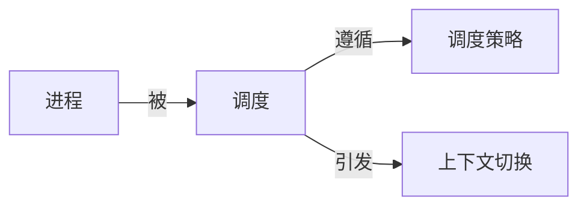

## 1.背景介绍

调度器是操作系统的核心组成部分，它负责管理和分配CPU时间，以便在多任务环境中公平、有效地执行各个进程。调度器的设计和实现对系统的性能、响应时间和用户体验有着重要影响。

## 2.核心概念与联系

在深入讨论调度器的原理和代码实例之前，我们需要先了解一些核心的概念：

- **进程**：进程是操作系统进行资源分配和调度的基本单位，它包含了执行中的程序需要的所有信息。

- **调度**：调度是操作系统的一种活动，其目的是为了选择合适的进程并把CPU的控制权交给它。

- **调度策略**：调度策略是决定进程调度顺序的规则，常见的调度策略有先来先服务、短作业优先、优先级调度等。

- **上下文切换**：上下文切换是指CPU从一个进程切换到另一个进程的过程，这个过程需要保存当前进程的状态并加载新进程的状态。

这些概念之间的联系可以用下面的Mermaid流程图来表示：



## 3.核心算法原理具体操作步骤

调度器的工作主要涉及到两个核心算法：进程选择和进程切换。以下是这两个算法的具体操作步骤。

### 3.1 进程选择

1. 根据调度策略，从就绪队列中选择一个进程。
2. 如果选择的进程可以立即执行，那么就把它分配给CPU。
3. 如果选择的进程不能立即执行，那么就把它放回就绪队列，然后回到步骤1。

### 3.2 进程切换

1. 保存当前进程的状态，包括程序计数器、寄存器、内存管理信息等。
2. 把当前进程放回就绪队列。
3. 从就绪队列中选择一个新的进程，加载它的状态。
4. 把CPU的控制权交给新的进程。

## 4.数学模型和公式详细讲解举例说明

调度器的性能可以用一些数学模型和公式来描述。例如，我们可以用平均周转时间（Average Turnaround Time）和平均等待时间（Average Waiting Time）来评估调度策略的性能。

平均周转时间是指所有进程从提交到完成的时间的平均值，可以用下面的公式来计算：

$$
ATT = \frac{1}{n}\sum_{i=1}^{n}(完成时间_i - 提交时间_i)
$$

平均等待时间是指所有进程在就绪队列中等待的时间的平均值，可以用下面的公式来计算：

$$
AWT = \frac{1}{n}\sum_{i=1}^{n}(开始执行时间_i - 提交时间_i)
$$

其中，$n$是进程的数量，$完成时间_i$是第$i$个进程的完成时间，$提交时间_i$是第$i$个进程的提交时间，$开始执行时间_i$是第$i$个进程的开始执行时间。

## 5.项目实践：代码实例和详细解释说明

下面是一个简单的调度器的Python代码实例，它使用了先来先服务（FCFS）的调度策略。

```python
class Process:
    def __init__(self, pid, arrival_time, burst_time):
        self.pid = pid
        self.arrival_time = arrival_time
        self.burst_time = burst_time

class Scheduler:
    def __init__(self):
        self.ready_queue = []

    def add_process(self, process):
        self.ready_queue.append(process)

    def schedule(self):
        while self.ready_queue:
            process = self.ready_queue.pop(0)
            print(f"Process {process.pid} is running.")
```

在这个代码实例中，`Process`类表示进程，它有一个唯一的进程ID（`pid`），一个到达时间（`arrival_time`）和一个服务时间（`burst_time`）。`Scheduler`类表示调度器，它有一个就绪队列（`ready_queue`），可以添加进程（`add_process`）和进行调度（`schedule`）。在`schedule`方法中，调度器会按照进程的到达顺序（即FCFS策略）来执行进程。

## 6.实际应用场景

调度器在许多实际应用场景中都有重要的作用。例如，在操作系统中，调度器负责管理和分配CPU时间，以实现多任务并行执行。在云计算中，调度器负责分配和调度计算资源，以满足大规模并行计算的需求。在实时系统中，调度器负责确保关键任务能在截止时间之前完成。

## 7.工具和资源推荐

以下是一些有关调度器的工具和资源推荐：

- **操作系统教科书**：如《现代操作系统》、《操作系统概念》等，这些教科书详细介绍了调度器的原理和实现。

- **操作系统课程**：如MIT的《操作系统工程》、斯坦福的《操作系统原理》等，这些课程有很多实践项目，可以帮助你更好地理解和实现调度器。

- **模拟工具**：如Process Scheduler Simulator、CPU Scheduler Simulator等，这些工具可以模拟不同的调度策略，帮助你理解它们的性能差异。

## 8.总结：未来发展趋势与挑战

随着计算需求的增长和硬件技术的发展，调度器面临着新的发展趋势和挑战。例如，多核和多处理器系统的普及，使得调度器需要考虑并行和并发的问题。云计算和边缘计算的兴起，使得调度器需要处理大规模和分布式的资源管理问题。实时和嵌入式系统的应用，使得调度器需要满足严格的时间和资源约束。

## 9.附录：常见问题与解答

- **Q: 什么是调度器？**
  
  A: 调度器是操作系统的核心组成部分，它负责管理和分配CPU时间，以便在多任务环境中公平、有效地执行各个进程。

- **Q: 调度器的工作原理是什么？**
  
  A: 调度器的工作主要涉及到两个核心算法：进程选择和进程切换。进程选择是根据调度策略从就绪队列中选择一个进程，进程切换是保存当前进程的状态并加载新进程的状态。

- **Q: 调度器的性能如何评估？**
  
  A: 调度器的性能可以用一些数学模型和公式来描述，例如平均周转时间和平均等待时间。

- **Q: 调度器在实际应用中有哪些应用场景？**
  
  A: 调度器在许多实际应用场景中都有重要的作用，例如操作系统、云计算、实时系统等。

作者：禅与计算机程序设计艺术 / Zen and the Art of Computer Programming